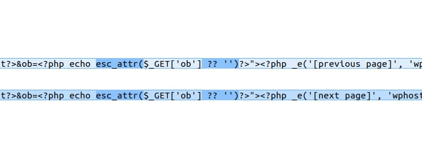
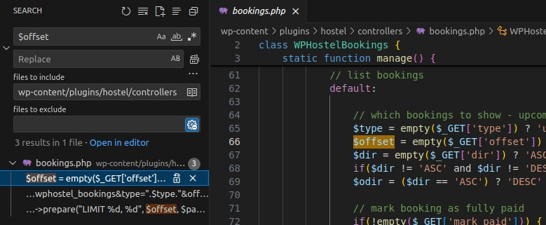
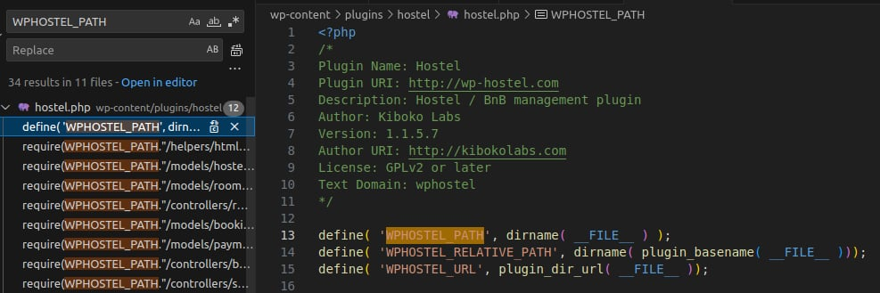
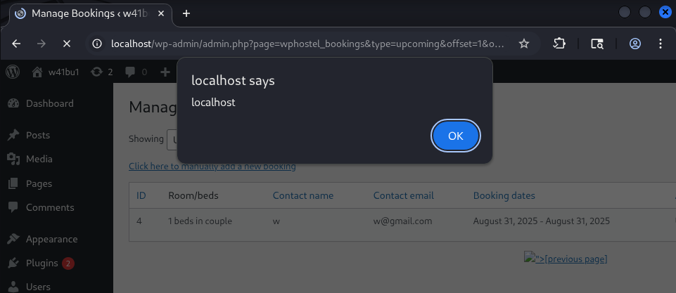

---

Lỗ hổng xảy ra trên plugin **Hostel** của WordPress trước phiên bản **1.1.5.8**. Kẻ tấn công có thể lợi dụng lỗ hổng này để tấn công người dùng có quyền cao như **admin**.

* **CVE ID**: [CVE-2025-6234](https://www.cve.org/CVERecord?id=CVE-2025-6234)
* **Product**: [WordPress Hostel Plugin](https://wordpress.org/plugins/hostel/)
* **Vulnerability Type**: Cross Site Scripting
* **Affected Versions**: < 1.1.5.8
* **CVSS severity**: Medium (7.1)
* **Required Privilege**: Unauthenticated

---

## Requirements

* [**Local WordPress and Debugging**](https://w41bu1.github.io/blog/2025-08-21-wordpress-local-and-debugging/)
* **Hostel Plugin**:  v1.1.5.7(vul) và v1.1.5.8(fix)
* **diff tool**: meld hoặc bất cứ tool nào có thể compare để tháy được sự khác biệt giữa 2 version

---

## Analysis

Nguyên nhân gốc rễ do không thực hiện **sanitize** (làm sạch dữ liệu) và **escape** (mã hóa dữ liệu đầu ra) đối với một tham số trước khi phản hồi lại trên trang, dẫn đến lỗ hổng **Reflected Cross-Site Scripting (XSS)**

### Patch Diff

Dùng diff tool bất kì để so sánh sự khác biệt giữa bản lỗi và bản vá.
Có sự khác biệt rõ ở 2 file **views/bookings.html.php** và **controllers/bookings.php**

**File views/bookings.html.php**

```php
<p align="center">
    <?php if($offset > 0):?>
        <a href="admin.php?page=wphostel_bookings&type=<?php echo $type?>&offset=<?php echo $offset - $page_limit?>&ob=<?php echo @$_GET['ob']?>"><?php _e('[previous page]', 'wphostel')?></a>
    <?php endif;?> 
    <?php if($count > ($page_limit + $offset)):?>
        <a href="admin.php?page=wphostel_bookings&type=<?php echo $type?>&offset=<?php echo $offset + $page_limit?>&ob=<?php echo @$_GET['ob']?>"><?php _e('[next page]', 'wphostel')?></a>
    <?php endif;?>	
</p>
```

Tham số `ob` được lấy trực tiếp từ `$_GET['ob']` và echo ra HTML attribute mà **không có bất kì xử lý escape** nào. Điều này dẫn đến nguy cơ **Reflected XSS (Cross-Site Scripting)**, vì attacker có thể chèn payload vào query string,

```php
<p align="center">
    <?php if($offset > 0):?>
        <a href="admin.php?page=wphostel_bookings&type=<?php echo $type?>&offset=<?php echo $offset - $page_limit?>&ob=<?php echo esc_attr($_GET['ob'] ?? '')?>"><?php _e('[previous page]', 'wphostel')?></a>
    <?php endif;?> 
    <?php if($count > ($page_limit + $offset)):?>
        <a href="admin.php?page=wphostel_bookings&type=<?php echo $type?>&offset=<?php echo $offset + $page_limit?>&ob=<?php echo esc_attr($_GET['ob'] ?? '')?>"><?php _e('[next page]', 'wphostel')?></a>
    <?php endif;?>	
</p>
```

Bản vá đã sử dụng hàm `esc_attr()` để encode `$_GET['ob']` thành dạng an toàn trước khi echo ra HTML attribute.



* Source: `$_GET['ob']` là dữ liệu nhập từ **client (URL query string)**, attacker có thể kiểm soát hoàn toàn.
* Sink: echo trong **HTML attribute** `ob=<?php echo @$_GET['ob']?>`

👉 Vì source không đi qua **logic của controllers** nên ta không cần quan tâm diff của `controllers/bookings.php`

### How it work?

Để `$_GET['ob']` được echo ra HTML attribute của thẻ `<a>` thì điều kiện trong khối `if` chứa thẻ `<a>` phải `true`

```php
<?php if($offset > 0):?>
// ob=<?php echo @$_GET['ob']?>
<?php endif;?> 
<?php if($count > ($page_limit + $offset)):?>
// ob=<?php echo @$_GET['ob']?>
<?php endif;?>	
```

👉 Điều kiện quan trọng cần chú ý là `if($offset > 0)`, vì chỉ cần điều kiện này đúng thì XSS đã có thể xảy ra. Không cần quan tâm `if($count > ($page_limit + $offset))`.

File **views/bookings.html.php** không thể truy cập trực tiếp, mà phải được **controllers** gọi thông qua hàm `include()`

Biến `$offset` được **controller** khởi tạo trước rồi truyền sang **view** (**views/bookings.html.php**) để dùng trong mệnh đề `if`.

Để xác định **controller** nào gọi file view này, ta tìm kiếm biến `$offset` trong thư mục controllers của plugin.



Kết quả cho thấy `$offset` được tạo trong nhánh `default` (**listing bookings**) của hàm tĩnh `manage()` trong class `WPHostelBookings`, nằm ở file **controllers/bookings.php**.

**Controller Code**

```php
class WPHostelBookings {
    static function manage() {
        global $wpdb;
        $_booking = new WPHostelBooking();

        switch(@$_GET['do']) {
            // other logic
            
            // list bookings
            default:
                // which bookings to show - upcoming or past?
                $type = empty($_GET['type']) ? 'upcoming' : sanitize_text_field($_GET['type']);
                $offset = empty($_GET['offset']) ? 0 : intval($_GET['offset']);
                $dir = empty($_GET['dir']) ? 'ASC' : $_GET['dir'];
                if($dir != 'ASC' and $dir != 'DESC') $dir = 'ASC';
                $odir = ($dir == 'ASC') ? 'DESC' : 'ASC';
                
                // other logic
                
                // define limit (as it's paginated)				
                $page_limit = 20;
                $limit_sql = empty($_GET['export']) ? $wpdb->prepare("LIMIT %d, %d", $offset, $page_limit) : ''; 
                
                // other logic	
                
                $bookings = $wpdb->get_results("SELECT SQL_CALC_FOUND_ROWS tB.*, tR.title as room 
                    FROM ".WPHOSTEL_BOOKINGS." tB JOIN ".WPHOSTEL_ROOMS." tR ON tR.id = tB.room_id
                    WHERE is_static=0 $where_sql $orderby $limit_sql");
                $count = $wpdb->get_var("SELECT FOUND_ROWS()");	
                
                // other logic

                if(@file_exists(get_stylesheet_directory().'/wphostel/bookings.html.php')) include get_stylesheet_directory().'/wphostel/bookings.html.php';
                else include(WPHOSTEL_PATH."/views/bookings.html.php");				  
            break;
        }
    }
}
```

**Phân tích biến `$offset`**

Biến `$offset` được khởi tạo từ tham số `offset` trong **URL** (`$_GET['offset']`):

* Nếu không có tham số => mặc định `0`.
* Nếu có => ép kiểu số nguyên bằng `intval()`.

```php
$offset = empty($_GET['offset']) ? 0 : intval($_GET['offset']);
```

**Phân tích biến `$page_limit`**

`$page_limit` được đặt cố định là `20`, dùng kết hợp với `$offset` để phân trang:

```php
// define limit (as it's paginated)				
$page_limit = 20;

// LIMIT offset, 20
$limit_sql = empty($_GET['export']) ? $wpdb->prepare("LIMIT %d, %d", $offset, $page_limit) : ''; 
```

Khi đó SQL trả về tối đa **20 bản ghi**, bắt đầu từ vị trí `$offset`.

**Áp dụng vào mệnh đề if**:

Trong view, đoạn code XSS payload chỉ hiển thị khi:

* `if($offset > 0)` => tức là phải có offset từ **1 trở lên**.
* Muốn `offset > 0` có ý nghĩa, cơ sở dữ liệu phải có ít nhất **2 booking**. Nếu chỉ có 1 booking thì sau khi bỏ qua 1 dòng (offset=1), không còn dữ liệu nào để hiển thị, nên payload cũng không render ra.

👉 Do đó, để khai thác thành công, cần có tối thiểu **2 booking** trong database.

---

Cuối cùng các kết quả được chứa trong các biến sẽ được hiển thị ra views thông qua hàm `include()`

```php
if(@file_exists(get_stylesheet_directory().'/wphostel/bookings.html.php')) include get_stylesheet_directory().'/wphostel/bookings.html.php';
else include(WPHOSTEL_PATH."/views/bookings.html.php");	
```

`WPHOSTEL_PATH` có thể là hằng global được sử dụng sau khi file **PHP** chứa nó được load, Để biết được chính xác, ta tìm kiếm với từ khóa `WPHOSTEL_PATH`.



---

## Exploit

**Request với XSS payload**

```http
GET /wp-admin/admin.php?page=wphostel_bookings&type=upcoming&offset=1&ob="> HTTP/1.1
```

**Payload thực tế**:

```html
">
```

* Đóng thẻ `<a>` bằng ký tự `">`.
* Chèn thêm thẻ `` có thuộc tính `onerror` để **kích hoạt JavaScript**.
* Dùng `alert(document.domain)` thay cho `alert(1)` như một thói quen, nhằm chứng minh rõ ràng khả năng đọc thông tin từ DOM. Điều này cũng giúp tránh trường hợp [Sandbox Domain](https://bughunters.google.com/learn/invalid-reports/web-platform/xss/6619189462433792/xss-in-sandbox-domains) khiến cho tác động của `payload` bị xem nhẹ hoặc không có.

**Kết quả**:



---

## Conclusion

Lỗ hổng **CVE-2025-6234** trong plugin **WordPress Hostel** bắt nguồn từ việc không xử lý đúng dữ liệu đầu vào `($_GET['ob'])` trước khi phản hồi lại trên giao diện. Điều này mở ra khả năng cho attacker chèn mã độc **Reflected XSS**.

Bản vá đã khắc phục bằng cách sử dụng hàm `esc_attr()` để escape dữ liệu trước khi in ra HTML, đảm bảo rằng các giá trị không tin cậy không thể chèn script độc hại.

**Key takeaways**:

* Luôn **sanitize** dữ liệu đầu vào và **escape** dữ liệu đầu ra theo ngữ cảnh (context).
* Với WordPress, tận dụng các hàm built-in như `sanitize_text_field()`, `esc_attr()`, `esc_html()`, `wp_kses()`... để giảm thiểu rủi ro bảo mật.

---

## References

[XSSCross-site scripting (XSS) cheat sheet - PortSwigger](https://portswigger.net/web-security/cross-site-scripting/cheat-sheet)

[WordPress Hostel Plugin < 1.1.5.8 is vulnerable to Cross Site Scripting (XSS) - patchstack](https://patchstack.com/database/wordpress/plugin/hostel/vulnerability/wordpress-hostel-plugin-1-1-5-8-reflected-xss-vulnerability)

---
