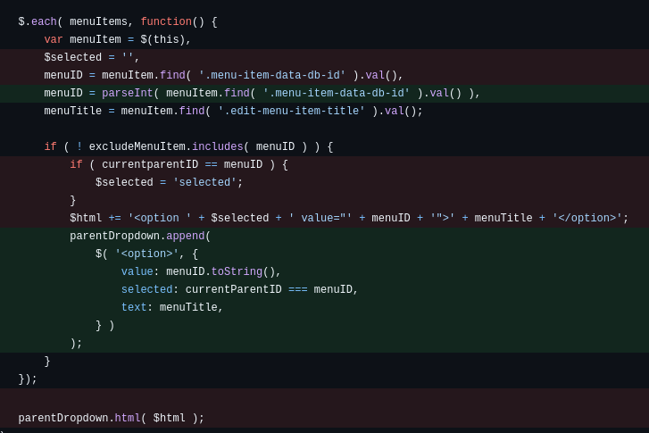
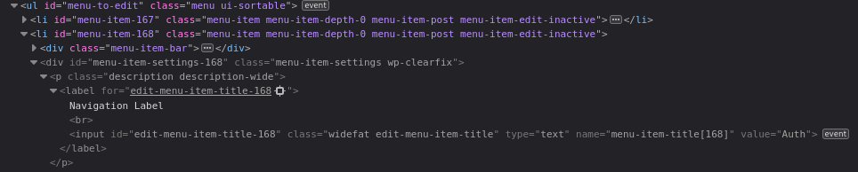
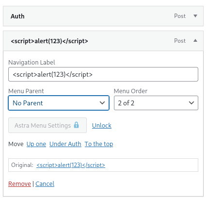

---

Lỗ hổng **Stored Cross Site Scripting(XSS)** xảy ra trên WordPress Core trước phiên bản `6.8.3`. Nguyên nhân do sai xử lý đầu vào khi sinh trang web động, tác động đến chức năng tạo menu (`nav menus`)

* **CVE ID**: [CVE-2025-58674](https://www.cve.org/CVERecord?id=CVE-2025-58674)
* **Vulnerability Type**: Cross Site Scripting (XSS)
* **Affected Versions**: <= 6.8.2
* **Patched Versions**: 6.8.3
* **CVSS severity**: Low (5.9)
* **Required Privilege**: Author
* **Product**: [WordPressCore](https://wordpress.org/)

---

## Requirements

* **Local WordPress & Debugging**: [Local WordPress and Debugging](https://w41bu1.github.io/posts/wordpress-local-and-debugging/).
* **Wordpress Core Versions**: **v6.8.2** (vulnerable) và **v6.8.3** (patched).
* **Diff Tool** - [**Meld**](https://meldmerge.org/) hoặc bất kỳ công cụ so sánh (diff) nào để kiểm tra và so sánh khác biệt giữa hai phiên bản.
* **Theme** - [**Astra**](https://wordpress.org/themes/astra/): Theme rất phổ biến với người dùng WordPress, hỗ trợ tạo **nav memu** nhanh chóng.

---

## Analysis

WordPress là phần mềm mã nguồn mở, có kho lưu trữ nằm ở github nên ta có thể tìm đến [commit](https://github.com/WordPress/WordPress/commit/e5caef19d3e842cc9c8c94621b223a9a696fb5b3) liên quan đến sự kiện vá lỗ hổng XSS để quan sát sự thay đổi, hiểu được lỗ hổng xảy ra ở đâu.

### Patch diff

**Bản lỗi**:

```php
updateParentDropdown : function() {
    return this.each(function(){
        var menuItems = $( '#menu-to-edit li' ),
            parentDropdowns = $( '.edit-menu-item-parent' );

        $.each( parentDropdowns, function() {
            var parentDropdown = $( this ),
                $html = '',
                $selected = '',
                currentItemID = parentDropdown.closest( 'li.menu-item' ).find( '.menu-item-data-db-id' ).val(),
                currentparentID = parentDropdown.closest( 'li.menu-item' ).find( '.menu-item-data-parent-id' ).val(),
                currentItem = parentDropdown.closest( 'li.menu-item' ),
                currentMenuItemChild = currentItem.childMenuItems(),
                excludeMenuItem = [ currentItemID ];

            if ( currentMenuItemChild.length > 0 ) {
                $.each( currentMenuItemChild, function(){
                    var childItem = $(this),
                        childID = childItem.find( '.menu-item-data-db-id' ).val();

                    excludeMenuItem.push( childID );
                });
            }

            if ( currentparentID == 0 ) {
                $selected = 'selected';
            }

            $html += '<option ' + $selected + ' value="0">' + wp.i18n._x( 'No Parent', 'menu item without a parent in navigation menu' ) + '</option>';

            $.each( menuItems, function() {
                var menuItem = $(this),
                $selected = '',
                menuID = menuItem.find( '.menu-item-data-db-id' ).val(),
                menuTitle = menuItem.find( '.edit-menu-item-title' ).val();

                if ( ! excludeMenuItem.includes( menuID ) ) {
                    if ( currentparentID == menuID ) {
                        $selected = 'selected';
                    }
                    $html += '<option ' + $selected + ' value="' + menuID + '">' + menuTitle + '</option>';
                }
            });

            parentDropdown.html( $html );
        });
        
    });
},
```

Trong phiên bản lỗi, giá trị `menuTitle` được chèn vào thẻ `<option>` và được hiển thị ra HTML bằng phương thức [html()](https://api.jquery.com/html/) của **jQuery** mà không có bất kỳ cơ chế ngăn chặn XSS nào. Hàm [html()](https://api.jquery.com/html/) dùng để thay thế nội dung HTML bên trong phần tử hiện tại, nên nếu `menuTitle` chứa mã độc thì mã đó sẽ được thực thi trên trình duyệt.

**Bản vá**:

```php
updateParentDropdown : function() {
    return this.each(function(){
        var menuItems = $( '#menu-to-edit li' ),
            parentDropdowns = $( '.edit-menu-item-parent' );

        $.each( parentDropdowns, function() {
            var parentDropdown = $( this ),
                currentItemID = parseInt( parentDropdown.closest( 'li.menu-item' ).find( '.menu-item-data-db-id' ).val() ),
                currentParentID = parseInt( parentDropdown.closest( 'li.menu-item' ).find( '.menu-item-data-parent-id' ).val() ),
                currentItem = parentDropdown.closest( 'li.menu-item' ),
                currentMenuItemChild = currentItem.childMenuItems(),
                excludeMenuItem =  /** @type {number[]} */ [ currentItemID ];

            parentDropdown.empty();

            if ( currentMenuItemChild.length > 0 ) {
                $.each( currentMenuItemChild, function(){
                    var childItem = $(this),
                        childID = parseInt( childItem.find( '.menu-item-data-db-id' ).val() );

                    excludeMenuItem.push( childID );
                });
            }

            parentDropdown.append(
                $( '<option>', {
                    value: '0',
                    selected: currentParentID === 0,
                    text: wp.i18n._x( 'No Parent', 'menu item without a parent in navigation menu' ),
                } )
            );

            $.each( menuItems, function() {
                var menuItem = $(this),
                menuID = parseInt( menuItem.find( '.menu-item-data-db-id' ).val() ),
                menuTitle = menuItem.find( '.edit-menu-item-title' ).val();

                if ( ! excludeMenuItem.includes( menuID ) ) {
                    parentDropdown.append(
                        $( '<option>', {
                            value: menuID.toString(),
                            selected: currentParentID === menuID,
                            text: menuTitle,
                        } )
                    );
                }
            });
        });
        
    });
},
```

Bản vá đã khắc phục lỗ hổng bằng cách chỉ định rõ `menuTitle` được gán vào thuộc tính `text` thay vì nội dung HTML.
Điều này đảm bảo giá trị của `menuTitle` được xử lý như văn bản thuần túy, không thể chứa hoặc thực thi mã JavaScript độc hại.
Nhờ đó, dữ liệu được thêm vào thẻ `<option>` hoàn toàn an toàn và loại bỏ khả năng tấn công XSS thông qua giá trị `menuTitle`.



---

### Vulnerable code 
Inpsect code trên trình duyệt ta thấy `menuItems = #menu-to-edit li` là mảng các thẻ `<li>` thuộc thẻ `<ul>` có `id=menu-to-edit`



`updateParentDropdown` sẽ duyệt các thẻ `<li>` lấy value của `<input>` có class `edit-menu-item-title`, gán giá trị đó cho `menuTitle` trong thẻ `<option>` và hiển thị ra HTML.

```html
<select class="edit-menu-item-parent widefat" id="edit-menu-item-parent-167" name="menu-item-parent[167]">
    <option value="0">No Parent</option>
    <option selected="" value="168">Auth</option>
</select>
```

**Trên UI**:



các tùy chọn trong Menu Parent 

### Sources & Sinks

* **Source**: 
* **Sink**: 

### Flow

---

## Exploit
### Proof of Concept (PoC)

---

## Conclusion

**Key takeaways**:

---

## References

[Cross-site scripting (XSS) cheat sheet — PortSwigger](https://portswigger.net/web-security/cross-site-scripting/cheat-sheet)

[WordPress plugin_name_here <= effected_version_here — CVE-2025-58674](https://patchstack.com/patchstack_database_here)

---
