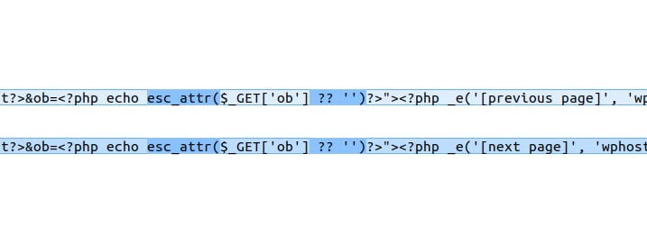
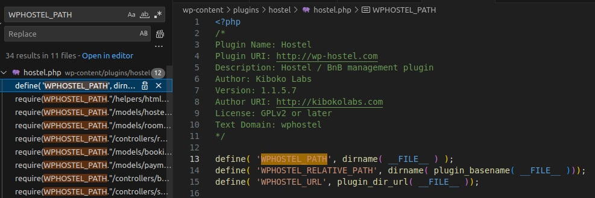
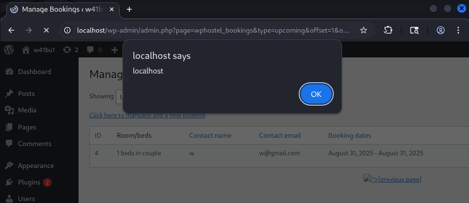

<!--more-->

The vulnerability exists in the **Hostel** plugin for WordPress prior to version **1.1.5.8**. An attacker could exploit it to target high-privilege users like **admins**.

* **CVE ID**: [CVE-2025-6234](https://www.cve.org/CVERecord?id=CVE-2025-6234)
* **Product**: [WordPress Hostel Plugin](https://wordpress.org/plugins/hostel/)
* **Vulnerability Type**: Cross Site Scripting
* **Affected Versions**: < 1.1.5.8
* **CVSS severity**: Medium (7.1)
* **Required Privilege**: Unauthenticated

## Requirements

* **Local WordPress & Debugging**: [Local WordPress and Debugging](https://w41bu1.github.io/2025-08-21-wordpress-local-and-debugging/).
* **Hostel Plugin**: v1.1.5.7 (vulnerable) and v1.1.5.8 (patched)
* **Diff tool**: meld or any tool that can compare two versions

## Analysis

The root cause is the lack of **sanitization** and **escaping** for a parameter before rendering it on the page, leading to a **Reflected Cross-Site Scripting (XSS)** vulnerability.

### Patch Diff

Use any diff tool to compare the vulnerable version and the patch.
The differences are clearly in two files: **views/bookings.html.php** and **controllers/bookings.php**

**File views/bookings.html.php**

```php
<p align="center">
    <?php if($offset > 0):?>
        <a href="admin.php?page=wphostel_bookings&type=<?php echo $type?>&offset=<?php echo $offset - $page_limit?>&ob=<?php echo @$_GET['ob']?>"><?php _e('[previous page]', 'wphostel')?></a>
    <?php endif;?> 
    <?php if($count > ($page_limit + $offset)):?>
        <a href="admin.php?page=wphostel_bookings&type=<?php echo $type?>&offset=<?php echo $offset + $page_limit?>&ob=<?php echo @$_GET['ob']?>"><?php _e('[next page]', 'wphostel')?></a>
    <?php endif;?>	
</p>
```

The parameter `ob` is directly taken from `$_GET['ob']` and echoed into an HTML attribute **without escaping**, making it vulnerable to **Reflected XSS**, since an attacker can inject payloads into the query string.

**Patched Code**

```php
<p align="center">
    <?php if($offset > 0):?>
        <a href="admin.php?page=wphostel_bookings&type=<?php echo $type?>&offset=<?php echo $offset - $page_limit?>&ob=<?php echo esc_attr($_GET['ob'] ?? '')?>"><?php _e('[previous page]', 'wphostel')?></a>
    <?php endif;?> 
    <?php if($count > ($page_limit + $offset)):?>
        <a href="admin.php?page=wphostel_bookings&type=<?php echo $type?>&offset=<?php echo $offset + $page_limit?>&ob=<?php echo esc_attr($_GET['ob'] ?? '')?>"><?php _e('[next page]', 'wphostel')?></a>
    <?php endif;?>	
</p>
```

The patch uses `esc_attr()` to safely encode `$_GET['ob']` before echoing into the HTML attribute.



* Source: `$_GET['ob']` is **client-controlled input** from the URL query string.
* Sink: echoed in an **HTML attribute** `ob=<?php echo @$_GET['ob']?>`.

👉 Because the source does not go through controller logic, the diff of **controllers/bookings.php** is less relevant.

### How it works

For `$_GET['ob']` to be echoed in the HTML attribute of `<a>`, the `if` condition enclosing `<a>` must be true:

```php
<?php if($offset > 0):?>
// ob=<?php echo @$_GET['ob']?>
<?php endif;?> 
<?php if($count > ($page_limit + $offset)):?>
// ob=<?php echo @$_GET['ob']?>
<?php endif;?>	
```

👉 The key condition is `if($offset > 0)`. If true, the XSS can occur regardless of the second condition.

The **views/bookings.html.php** file cannot be accessed directly; it must be included by the **controller** using `include()`.

The `$offset` variable is initialized in the controller and passed to the view.

Searching the plugin controllers shows that `$offset` is set in the `default` branch (**listing bookings**) of the static `manage()` method in class `WPHostelBookings` in **controllers/bookings.php**.

**Controller Code**

```php
class WPHostelBookings {
    static function manage() {
        global $wpdb;
        $_booking = new WPHostelBooking();

        switch(@$_GET['do']) {
            // other logic
            
            // list bookings
            default:
                $type = empty($_GET['type']) ? 'upcoming' : sanitize_text_field($_GET['type']);
                $offset = empty($_GET['offset']) ? 0 : intval($_GET['offset']);
                $dir = empty($_GET['dir']) ? 'ASC' : $_GET['dir'];
                if($dir != 'ASC' and $dir != 'DESC') $dir = 'ASC';
                $odir = ($dir == 'ASC') ? 'DESC' : 'ASC';
                
                $page_limit = 20;
                $limit_sql = empty($_GET['export']) ? $wpdb->prepare("LIMIT %d, %d", $offset, $page_limit) : ''; 
                
                $bookings = $wpdb->get_results("SELECT SQL_CALC_FOUND_ROWS tB.*, tR.title as room 
                    FROM ".WPHOSTEL_BOOKINGS." tB JOIN ".WPHOSTEL_ROOMS." tR ON tR.id = tB.room_id
                    WHERE is_static=0 $where_sql $orderby $limit_sql");
                $count = $wpdb->get_var("SELECT FOUND_ROWS()");	
                
                if(@file_exists(get_stylesheet_directory().'/wphostel/bookings.html.php')) include get_stylesheet_directory().'/wphostel/bookings.html.php';
                else include(WPHOSTEL_PATH."/views/bookings.html.php");				  
            break;
        }
    }
}
```

**Analysis of `$offset`**

* `$offset` comes from the URL parameter `$_GET['offset']`:

  * Absent → defaults to 0
  * Present → cast to integer via `intval()`

```php
$offset = empty($_GET['offset']) ? 0 : intval($_GET['offset']);
```

**Analysis of `$page_limit`**

* `$page_limit` is fixed at `20` for pagination

```php
$page_limit = 20;
$limit_sql = empty($_GET['export']) ? $wpdb->prepare("LIMIT %d, %d", $offset, $page_limit) : ''; 
```

This ensures SQL returns up to **20 records** starting from `$offset`.

**XSS condition in view**:

* The payload displays only if `if($offset > 0)` → requires at least **1 offset**
* Exploit requires at least **2 bookings** in the database to render payload

The controller passes results to the view using:

```php
if(@file_exists(get_stylesheet_directory().'/wphostel/bookings.html.php')) include get_stylesheet_directory().'/wphostel/bookings.html.php';
else include(WPHOSTEL_PATH."/views/bookings.html.php");	
```

`WPHOSTEL_PATH` is the absolute path to the plugin directory.



## Exploit

**Request with XSS payload**

```http
GET /wp-admin/admin.php?page=wphostel_bookings&type=upcoming&offset=1&ob="> HTTP/1.1
```

**Payload**

```html
">
```

* Closes `<a>` tag with `">`
* Adds `` tag with `onerror` to trigger JavaScript
* Uses `alert(document.domain)` to clearly demonstrate DOM access

**Result**



## Conclusion

The **CVE-2025-6234** vulnerability in the **WordPress Hostel** plugin stems from improper handling of input `($_GET['ob'])` before rendering. This allows an attacker to inject **Reflected XSS**.

The patch fixes it by using `esc_attr()` to escape the input, ensuring untrusted values cannot inject malicious scripts.

**Key takeaways**:

* Always **sanitize** input and **escape** output according to context.
* In WordPress, leverage built-in functions like `sanitize_text_field()`, `esc_attr()`, `esc_html()`, `wp_kses()` to mitigate security risks.

## References

[XSS Cross-site scripting (XSS) cheat sheet - PortSwigger](https://portswigger.net/web-security/cross-site-scripting/cheat-sheet)

[WordPress Hostel Plugin < 1.1.5.8 is vulnerable to Cross Site Scripting (XSS) - patchstack](https://patchstack.com/database/wordpress/plugin/hostel/vulnerability/wordpress-hostel-plugin-1-1-5-8-reflected-xss-vulnerability)
