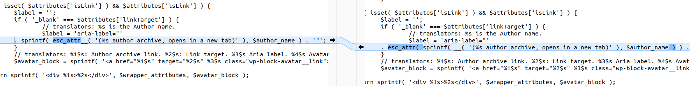
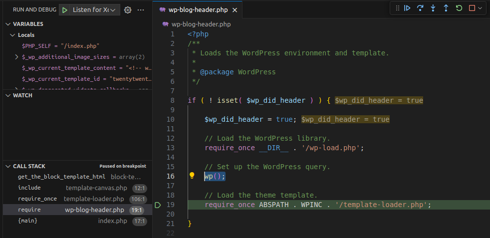
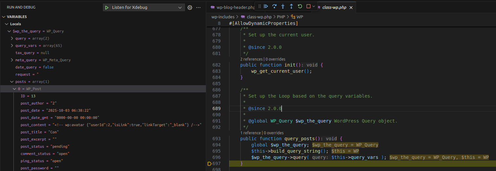
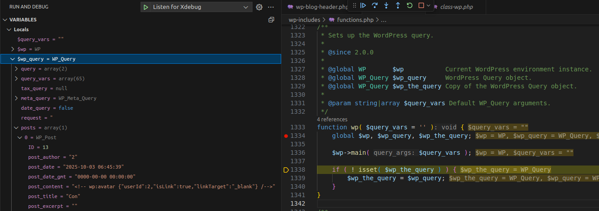
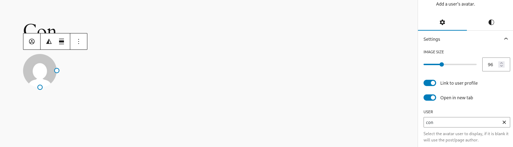
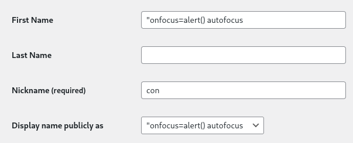
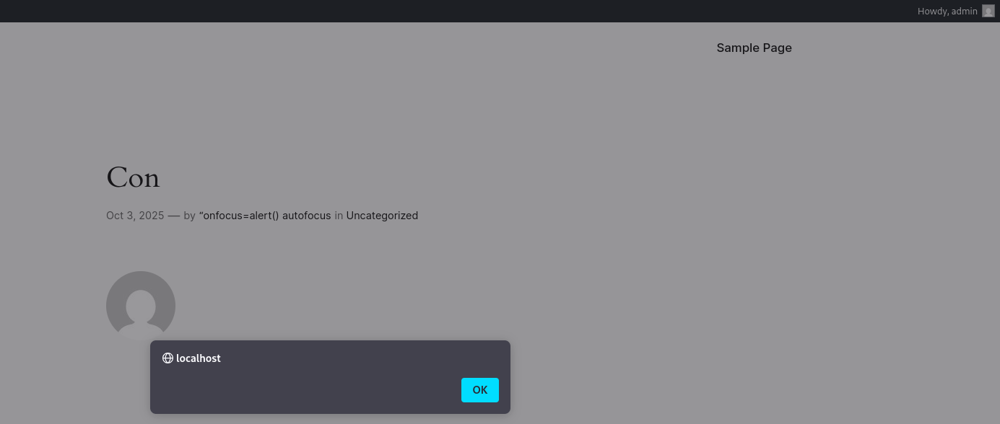

<!--more-->

## CVE & Basic Info

**WordPress Core** is **vulnerable to Stored Cross-Site Scripting** via the user's display name in the **Avatar block** in multiple versions **up to 6.5.2** due to **insufficient output escaping** of the **display name**. This allows **authenticated attackers** with **contributor-level access** or higher to **inject arbitrary web scripts** into pages — those scripts will **execute** whenever a user visits the page containing the injection. Additionally, it allows **unauthenticated attackers** to **inject arbitrary web scripts** into pages that contain a **comment block** showing the **comment author's avatar**.

* **CVE ID**: [CVE-2024-4439](https://www.cve.org/CVERecord?id=CVE-2024-4439)
* **Vulnerability Type**: Cross Site Scripting (XSS)
* **Affected Versions**:

  * 6.0 - 6.0.7
  * 6.1 - 6.1.5
  * 6.2 - 6.2.4
  * 6.3 - 6.3.3
  * 6.4 - 6.4.3
  * 6.5 - 6.5.1
* **Patched Versions**:

  * 6.0.8
  * 6.1.6
  * 6.2.5
  * 6.3.4
  * 6.4.4
  * 6.5.2
* **CVSS severity**: 7.2 (High)
* **Required Privilege**: Contributor+
* **Product**: [WordPress](https://wordpress.org/)

## Requirements

* **Local WordPress & Debugging**: [Local WordPress and Debugging](https://w41bu1.github.io/2025-08-21-wordpress-local-and-debugging/).
* **Core versions**: **6.4.3** (vulnerable) and **6.4.4** (patched).
* **Diff tool** - [**Meld**](https://meldmerge.org/) or any diff/comparison tool to inspect and compare differences between the two versions.

## Analysis

### Patch diff

In the **vulnerable** version, WP Core used [`esc_attr__()`](https://developer.wordpress.org/reference/functions/esc_attr__/) to translate the string and escape an HTML attribute before outputting to the browser, but it was implemented incorrectly.

```php
$label = 'aria-label="' . sprintf( esc_attr__( '(%s author archive, opens in a new tab)' ), $author_name ) . '"';
```

Here `esc_attr__()` translates and escapes the HTML before being passed to `sprintf()` to inject `$author_name` — therefore `$author_name` is not escaped.

In the **patched** version, `$author_name` is passed into `sprintf()` first and then the full string is escaped with `esc_attr()`, which is safe against XSS.

```php
$label = 'aria-label="' . esc_attr( sprintf( __( '(%s author archive, opens in a new tab)' ), $author_name ) ) . '"';
```


*Comparison between the vulnerable and patched versions*

### Vulnerable code

```php
function render_block_core_avatar( $attributes, $content, $block ) {
  // other logic
  if ( ! isset( $block->context['commentId'] ) ) {
    $author_id   = isset( $attributes['userId'] ) ? $attributes['userId'] : get_post_field( 'post_author', $block->context['postId'] );
    $author_name = get_the_author_meta( 'display_name', $author_id );
    // other logic
    if ( isset( $attributes['isLink'] ) && $attributes['isLink'] ) {
      $label = '';
      if ( '_blank' === $attributes['linkTarget'] ) {
        // translators: %s is the Author name.
        $label = 'aria-label="' . sprintf( esc_attr__( '(%s author archive, opens in a new tab)' ), $author_name ) . '"';
      }
    }
  }
  // other logic
}
```

The **Avatar block** is a Block Editor block used to render post or comment content in WordPress.

`$author_name` is the `display_name` of the author with `$author_id` belonging to the current post.

If this is a post and the link option is enabled, the `$author_name` containing a payload will be added to the `aria-label` attribute and output to the browser.

When visiting any post, `wp()` is called to load that post’s data.



```php
function wp( $query_vars = '' ) {
	global $wp, $wp_query, $wp_the_query;

	$wp->main( $query_vars );

	if ( ! isset( $wp_the_query ) ) {
		$wp_the_query = $wp_query;
	}
}
```

Here `$wp_query` is created and will contain the `wp_post` values after the query.

```php
public function main( $query_args = '' ) {
  $this->init();

  $parsed = $this->parse_request( $query_args );

  if ( $parsed ) {
    $this->query_posts();
    $this->handle_404();
    $this->register_globals();
  }

  $this->send_headers();

  do_action_ref_array( 'wp', array( &$this ) );
}
```

`main()` will `parse_request` and perform the query to fetch the current post information using `query_posts()`.



`$wp_the_query` is the **main WP_Query** object in WordPress, while `$wp_query` is simply a **reference** pointing to `$wp_the_query`. Therefore, when `$wp_the_query` is initialized and has data, `$wp_query` will have the same data.



We obtain the `post_content` value:

```php
<!-- wp:avatar {"userId":2,"isLink":true,"linkTarget":"_blank"} /-->
```

`wp:avatar` is the `core/avatar` block type.

The `render()` function will call `call_user_func()` with the callback `render_block_core_avatar()` to get the Avatar block HTML and return it to the user.

### Sources & Sinks

* **Source**: author name of a contributor+
* **Sink**: `$author_name` injected into the `aria-label` attribute

## Exploit

### Proof of Concept (PoC)

* Create a post account with role `contributor+` containing an avatar block, enable the **Link to user profile** option and select the contributor user.



* Change the first name to contain an XSS payload and set the display name to the first name.



* Admin previews the post => XSS occurs



## Conclusion

The **CVE-2024-4439** vulnerability in **WordPress Core <= 6.5.1** stems from incorrect use of the `esc_attr__()` function when handling `display_name` in the **Avatar block**, resulting in a **Stored XSS**. An attacker can exploit this by inserting a payload in the `display_name`, causing malicious scripts to execute when users (including admins) visit a page containing the block. The patch in **6.0.8, 6.1.6, 6.2.5, 6.3.4, 6.4.4, 6.5.2** changes the handling — escaping after formatting with `sprintf()` — ensuring the data is safe before rendering to the browser.

**Key takeaways**:

* **Escape order matters**: data should be **formatted first**, then **escaped** to avoid introducing XSS.
* Even **core functions** like `esc_attr__()` can lead to serious vulnerabilities if used incorrectly.
* **Stored XSS** is particularly dangerous because it persists in the database and can trigger whenever a user views the affected content.
* Not only plugins/themes, but **WordPress Core** must be **updated regularly** to reduce security risk.
* Analyzing **patch diffs** is an effective way to learn secure coding practices and understand the root cause of bugs.

## References

[Cross-site scripting (XSS) cheat sheet — PortSwigger](https://portswigger.net/web-security/cross-site-scripting/cheat-sheet)