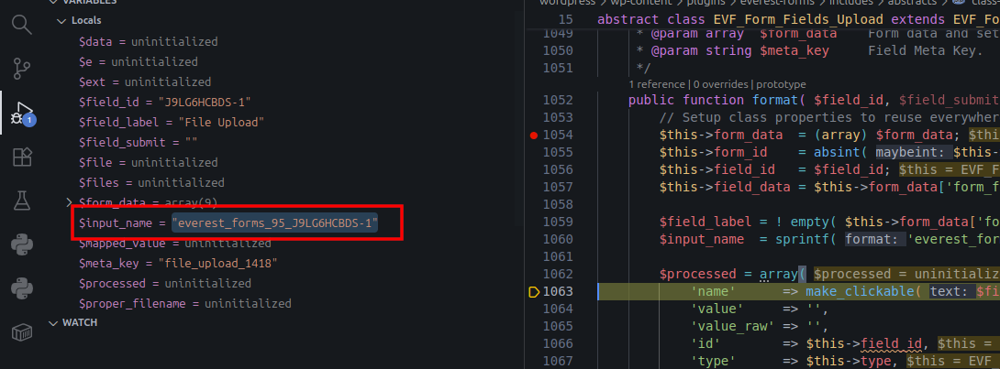
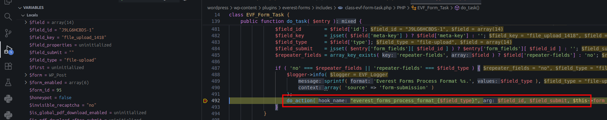
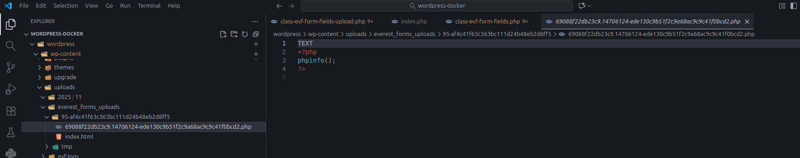

<!--more-->

## CVE & Basic Info

The **Everest Forms – Contact Forms, Quiz, Survey, Newsletter & Payment Form Builder** plugin for **WordPress** is vulnerable to **arbitrary file upload, read, and deletion** due to missing **file type** and **path validation** in the `format` method of the `EVF_Form_Fields_Upload` class in all versions up to and including **3.0.9.4**. This allows **unauthenticated attackers** to **upload, read, and delete arbitrary files** on the affected site’s server, potentially leading to **remote code execution**, **sensitive information disclosure**, or **site takeover**.

* **CVE ID**: [CVE-2025-1128](https://www.cve.org/CVERecord?id=CVE-2025-1128)
* **Vulnerability Type**: Arbitrary File Upload
* **Affected Versions**: <= 3.0.9.4
* **Patched Versions**: 3.0.9.5
* **CVSS severity**: High (9.8)
* **Required Privilege**: Unauthenticated
* **Product**: [WordPress Everest Forms Plugin](https://wordpress.org/plugins/everest-forms/)

## Requirements

* **Local WordPress & Debugging**

  * [Virtual Machine](https://w41bu1.github.io/posts/2025-08-21-wordpress-local-and-debugging/)
  * [Docker](https://w41bu1.github.io/posts/2025-10-22-wordpress-local-and-debugging-docker/)
* **Plugin Version** - **Everest Forms**:

  * `3.0.9.4` – **vulnerable**
  * `3.0.9.5` – **patched**
* **Diff Tool (diff)** → [**Meld**](https://meldmerge.org/) or any diff tool of your choice.

## Cause

This vulnerability is caused by insufficient validation of file types and file paths in the `format` method of the `EVF_Form_Fields_Upload` class. Even when a file is of an invalid type, the upload flow can continue; by modifying parts of the submitted data/communication, server-side validation can be bypassed.

```php {title="class-evf-form-fields-upload.php - v3.0.9.4" hl_lines=[3,7,8,9,10] data-open=true}
public function format( $field_id, $field_submit, $form_data, $meta_key ) {
    ...
    $wp_filetype = wp_check_filetype_and_ext( $file['tmp_path'], $file['name'] );
    $ext             = empty( $wp_filetype['ext'] ) ? '' : $wp_filetype['ext'];
    $type            = empty( $wp_filetype['type'] ) ? '' : $wp_filetype['type'];
    $proper_filename = empty( $wp_filetype['proper_filename'] ) ? '' : $wp_filetype['proper_filename'];
    if ( $proper_filename || ! $ext || ! $type ) {
        evf()->task->errors[ $form_data['id'] ][ $field_id ] = esc_html__( 'File type is not allowed.', 'everest-forms' );
        update_option( 'evf_validation_error', 'yes' );
    }
    ...
    // upload file handler
}
```

The `wp_check_filetype_and_ext()` function will return empty values for `$ext` and `$type` if the uploaded file is invalid (not in WordPress’s whitelist of allowed types: [https://developer.wordpress.org/reference/functions/wp_get_mime_types/](https://developer.wordpress.org/reference/functions/wp_get_mime_types/)).

After lines 8-9 run, there is no mechanism to stop execution, so the upload logic continues.

The patch fixes this by calling [wp_die()](https://developer.wordpress.org/reference/functions/wp_die/):

```php {title="class-evf-form-fields-upload.php - v3.0.9.5" hl_lines=[10] data-open=true}
public function format( $field_id, $field_submit, $form_data, $meta_key ) {
    ...
    $wp_filetype = wp_check_filetype_and_ext( $file['tmp_path'], $file['name'] );
    $ext             = empty( $wp_filetype['ext'] ) ? '' : $wp_filetype['ext'];
    $type            = empty( $wp_filetype['type'] ) ? '' : $wp_filetype['type'];
    $proper_filename = empty( $wp_filetype['proper_filename'] ) ? '' : $wp_filetype['proper_filename'];
    if ( $proper_filename || ! $ext || ! $type ) {
        evf()->task->errors[ $form_data['id'] ][ $field_id ] = esc_html__( 'File type is not allowed.', 'everest-forms' );
        update_option( 'evf_validation_error', 'yes' );
        wp_die( 'File type is not allowed' );
    }
    ...
    // upload file handler
}
```

## Code Analysis

```php {title="class-evf-form-fields-upload.php - v3.0.9.4" hl_lines=[6] data-open=true}
public function format( $field_id, $field_submit, $form_data, $meta_key ) {
    // Setup class properties to reuse everywhere.
    $this->form_data  = (array) $form_data;
    $this->form_id    = absint( $this->form_data['id'] );
    $this->field_id   = $field_id;
    $this->field_data = $this->form_data['form_fields'][ $this->field_id ];

    $field_label = ! empty( $this->form_data['form_fields'][ $this->field_id ]['label'] ) ? $this->form_data['form_fields'][ $this->field_id ]['label'] : '';
    $input_name  = sprintf( 'everest_forms_%d_%s', $this->form_id, $this->field_id );
    // Make sure json_decode() doesn't fail on newer PHP.
    try {
        $raw_files = json_decode( wp_unslash( $_POST[ $input_name ] ), true ); // phpcs:ignore WordPress.Security
    } catch ( Exception $e ) {
        evf()->task->form_fields[ $this->field_id ] = $processed;
        return;
    }

    // Make sure we process only submitted files with the expected structure and keys.
    $files = array_filter(
        $raw_files,
        static function ( $file ) {
            return ( is_array( $file ) || is_object( $file ) && count( $file ) === 2 ) && ! empty( $file['file'] ) && ! empty( $file['name'] );
        }
    );

    if ( empty( $files ) ) {
        evf()->task->form_fields[ $this->field_id ] = $processed;
        return;
    }

    $data = array();

    foreach ( $files as $file ) {
        $file = $this->generate_file_info( $file );

        $wp_filetype = wp_check_filetype_and_ext( $file['tmp_path'], $file['name'] );

        $ext             = empty( $wp_filetype['ext'] ) ? '' : $wp_filetype['ext'];
        $type            = empty( $wp_filetype['type'] ) ? '' : $wp_filetype['type'];
        $proper_filename = empty( $wp_filetype['proper_filename'] ) ? '' : $wp_filetype['proper_filename'];

        if ( $proper_filename || ! $ext || ! $type ) {
            evf()->task->errors[ $form_data['id'] ][ $field_id ] = esc_html__( 'File type is not allowed.', 'everest-forms' );
            update_option( 'evf_validation_error', 'yes' );
        }

        // Allow third-party integrations.
        if ( has_filter( 'everest_forms_integration_uploads' ) ) {
            $file = apply_filters( 'everest_forms_integration_uploads', $file, $this->form_data );
        }

        if ( $this->is_media_integrated() ) {
            $file['path'] = $file['tmp_path'];

            $file = $this->generate_file_attachment( $file );
        } elseif (
                ! isset( $file['external'] )
                && file_exists( $file['tmp_path'] )
            ) {

                $this->create_dir( dirname( $file['path'] ) );
                @rename( $file['tmp_path'] , $file['path'] ); // phpcs:ignore WordPress.PHP.NoSilencedErrors.Discouraged
                $this->set_file_fs_permissions( $file['path'] );
        }

        $data[] = $this->generate_file_data( $file );
    }
    ...
}
```

This plugin is intended to create form templates and use them in posts/pages. Because the vulnerability concerns **file upload**, we create a form with a **File Upload** field and embed it into a post.


Upload any file and intercept it with BurpSuite (uploads are allowed for anonymous users when accessing the post/page that contains the form).


Set a breakpoint at the `format()` method and observe.



From debugging, `$input_name` maps to the array containing JSON data fields `file` and `name`.

The data is JSON-decoded and assigned to `$raw_files`:

```php
try {
    $raw_files = json_decode( wp_unslash( $_POST[ $input_name ] ), true ); // phpcs:ignore WordPress.Security
} catch ( Exception $e ) {
    evf()->task->form_fields[ $this->field_id ] = $processed;
    return;
}
```


```php
$files = array_filter(
    $raw_files,
    static function ( $file ) {
        return ( is_array( $file ) || is_object( $file ) && count( $file ) === 2 ) && ! empty( $file['file'] ) && ! empty( $file['name'] );
    }
);
```

This filter returns the data assigned to `$files`, ensuring only submitted files with the expected structure and keys are processed; otherwise it returns empty.


Iterating the `$files` array, the plugin calls `generate_file_info()` to create temporary information for each file, then checks the file type using `wp_check_filetype_and_ext()`.

```php
foreach ( $files as $file ) {
    $file = $this->generate_file_info( $file );
    $wp_filetype = wp_check_filetype_and_ext( $file['tmp_path'], $file['name'] );
    ...
}
```

```php {title="class-evf-form-fields-upload.php - v3.0.9.4" hl_lines=[13] data-open=true}
protected function generate_file_info( $file ) {
    $dir = $this->get_form_files_dir();
    $file['tmp_path'] = trailingslashit( $this->get_tmp_dir() ) . sanitize_file_name($file['file']);
    $file['type']     = 'application/octet-stream';
    if ( is_file( $file['tmp_path'] ) ) {
        $filetype     = wp_check_filetype( $file['tmp_path'] );
        $file['type'] = $filetype['type'];
    }

    // Data for no media case.
    $file_ext              = pathinfo( $file['name'], PATHINFO_EXTENSION );
    $file_base             = wp_basename( $file['name'], ".$file_ext" );
    $file['file_name_new'] = sprintf( '%s-%s.%s', $file_base, wp_hash( $dir['path'] . $this->form_data['id'] . $this->field_id ), strtolower( $file_ext ) );
    $file['file_name_new'] = wp_unique_filename( trailingslashit( $dir['path'] ), sanitize_file_name( $file['file_name_new'] ) );
    $file['file_url']      = trailingslashit( $dir['url'] ) . $file['file_name_new'];
    $file['path']          = trailingslashit( $dir['path'] ) . $file['file_name_new'];
    $file['attachment_id'] = 0;

    return $file;
}
```

Note that the function uses `wp_hash()` to generate `$file['file_name_new']` and then concatenates it into `$dir['path']` to set `$file['path']`; this value is created using a salt configured in `wp-config.php` — so we only know that a salt exists.

> [!INFO]
> `$file_ext` is concatenated at the end of `file['path']`, and we can control it through the `name` field supplied in the request.
>
> ```diff
> - _690888869ea291.55135482.txt
> + _690888869ea291.55135482.php
> ```


Here we only need to pay attention to three fields: `tmp_path`, `name`, `path`.

* `tmp_path` and `name` are passed as arguments to `wp_check_filetype_and_ext()`.
* `tmp_path` and `path` are used as arguments to `rename()`.

As analyzed earlier, the logic continues running even when the uploaded file is not allowed. `rename($file['tmp_path'], $file['path'])` is called to move the file from the temporary path to the final path.

---

The `format()` method is registered as a callback for an action hook:

```php {title="class-evf-form-fields.php - v3.0.9.4"}
add_action( 'everest_forms_process_format_' . $this->type, array( $this, 'format' ), 10, 4 );
```

When the type is `file-upload`.


Searching for the keyword `everest_forms_process_format_`:



This hook is called in `do_task()` via `do_action()` with the dynamic `$field_type` argument:

```php {title="class-evf-form-task.php - v3.0.9.4"}
public function listen_task() {
    ...
    if ( ! empty( $_POST['everest_forms']['id'] ) ) { // phpcs:ignore WordPress.Security.NonceVerification
        $this->do_task( evf_sanitize_entry( wp_unslash( $_POST['everest_forms'] ) ) ); // phpcs:ignore WordPress.Security.NonceVerification, WordPress.Security.ValidatedSanitizedInput.InputNotSanitized
    }
    ...
}
```

`do_task()` is called from `listen_task()` when an Everest Forms `id` is provided in the POST request.

`listen_task()` is registered as a callback for the `wp` action hook:

```php
add_action( 'wp', array( $this, 'listen_task' ) );
```

This hook runs on every request.

## Flow


graph TD
A["User submits form (file)"] --> B["Browser sends POST to page with form"]
B --> C["WP hook triggered - listen_task()"]
C --> D["do_task() calls do_action() with field type"]
D --> E["everest_forms_process_format_file-upload calls format()"]
E --> F["generate_file_info() creates tmp_path, name, path"]
E --> G["wp_check_filetype_and_ext(tmp_path, name)"]
G --> H{"File type check result"}
H -->|Valid| I["rename(tmp_path → path) moves file to uploads"]
H -->|Invalid| J["Set error but continue execution"]
J --> I
I --> K["File accessible in uploads → potential executable upload"]


## Proof of Concept (PoC)

1. Create a `.txt` file that contains PHP code:

```txt
TEXT
<?php phpinfo();?>
```

2. Enable Burp Intercept and capture the file upload request.
3. Modify the `name` field in the intercepted request to use the `.php` extension and forward the request.



4. Access the uploaded file.

 from uploaded file")

## Conclusion

The vulnerability in `EVF_Form_Fields_Upload::format()` allows arbitrary file upload, read, and deletion due to improper file type and path validation. Although the plugin logs an error when encountering an invalid file, the execution flow does not halt and still calls `rename()` to move the file into a public directory — enabling the placement of executable code on the server (RCE), disclosure of sensitive data, or site takeover. The patch (>= 3.0.9.5) fixes this by stopping execution when an invalid file is detected; unpatched sites remain at high risk.

## Key Takeaway

* Insufficient validation of file types/extensions can lead to executable file uploads.
* Detecting an invalid file but not stopping the execution flow allows attackers to bypass checks.
* Validation is meaningless unless accompanied by a blocking action (stop/exit/wp_die) prior to filesystem operations.
* Validate file content (MIME/content) in addition to name/extension provided by the client.
* Prevent PHP execution in the `uploads` directory and use safe upload APIs (e.g., `wp_handle_upload()`).

## References

[Arbitrary File Upload](https://book.hacktricks.wiki/en/pentesting-web/file-upload/index.html)

[WordPress Everest Forms Plugin <= 3.0.9.4 is vulnerable to Arbitrary File Upload](https://patchstack.com/database/wordpress/plugin/everest-forms/vulnerability/wordpress-everest-forms-plugin-3-0-9-4-unauthenticated-arbitrary-file-upload-read-and-deletion-vulnerability)
