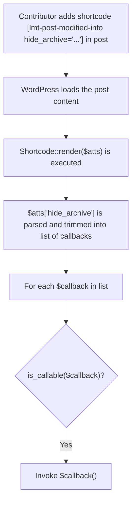

<!--more-->

## CVE & Basic Info

The **Improper Control of Generation of Code ('Code Injection')** vulnerability in Sayan Datta’s **WP Last Modified Info (wp-last-modified-info)** plugin allows **Remote Code Inclusion**. This issue affects **WP Last Modified Info** from **n/a** through **<= 1.9.2**.

* **CVE ID**: [CVE-2025-52756](https://www.cve.org/CVERecord?id=CVE-2025-52756)
* **Vulnerability Type**: Remote Code Execution
* **Affected Versions**: <= 1.9.4
* **Patched Versions**: 1.9.5
* **CVSS severity**: Medium (7.2)
* **Required Privilege**: Contributor
* **Product**: [WordPress WP Last Modified Info Plugin](https://wordpress.org/plugins/wp-last-modified-info/)

## Requirements

* **Local WordPress & Debugging**

  * [Virtual Machine](https://w41bu1.github.io/posts/2025-08-21-wordpress-local-and-debugging/)
  * [Docker](https://w41bu1.github.io/posts/2025-10-22-wordpress-local-and-debugging-docker/)
* **Plugin Version – WP Last Modified Info**

  * `1.9.4` – **vulnerable**
  * `1.9.5` – **patched**
* **Diff Tool** → **Meld** or any diff tool.

## Cause

**In the vulnerable version (v1.9.4):**

```php {title="Shortcode.php v1.9.4" data-open=true hl_lines=[24,36]}
public function render( $atts ) {
    $post = get_post();
    if ( ! $post instanceof \WP_Post ) {
        return '';
    }

    if ( ! $this->is_enabled( 'enable_last_modified_cb' ) ) {
        return '';
    }

    $author_id = $this->get_meta( $post->ID, '_edit_last' );
    if ( $this->is_equal( 'show_author_cb', 'custom', 'default' ) ) {
        $author_id = $this->get_data( 'lmt_show_author_list' );
    }
    
    $default_format = get_option( 'date_format' );
    $atts = shortcode_atts( [
        'id'           => $post->ID,
        'template'     => $this->get_data( 'lmt_last_modified_info_template' ),
        'date_format'  => $this->get_data( 'lmt_date_time_format', $default_format ),
        'date_type'    => $this->get_data( 'lmt_last_modified_format_post', 'default' ),
        'schema'       => $this->get_data( 'lmt_enable_jsonld_markup_cb', 'disable' ),
        'author_id'    => (int) $author_id,
        'hide_archive' => '',
        'filter_ids'   => '',
        'gap'          => (int) $this->get_data( 'lmt_gap_on_post', 0 ),
    ], $atts, 'lmt-post-modified-info' );

    $_post = get_post( absint( $atts['id'] ) );
    if ( ! $_post ) {
        return '';
    }

    if ( $atts['hide_archive'] !== '' ) {
        foreach ( array_map( 'trim', explode( ',', $atts['hide_archive'] ) ) as $callback ) {
            if ( is_callable( $callback ) && $callback() ) {
                return '';
            }
        }
    }
    ...
}
```

The `render()` function of the shortcode accepts the `$atts['hide_archive']` attribute from the user. This value is a string containing a **list of function names**, separated by commas (`,`).

Example:

```php
$atts['hide_archive'] = "a,b,c";
```

Then:

```php
explode(',', $atts['hide_archive']) 
→ ['a', 'b', 'c']
```

After splitting the string using `explode()`, the code uses:

```php
array_map('trim', ...)
```

to **remove extra whitespace** at the beginning and end of each element, ensuring the function names are “clean” before processing. The result is still an array of strings, but normalized:

```
[" a ", " b ", " c "] → ["a", "b", "c"]
```

Next, the `foreach` loop iterates over each item and assigns it to the `$callback` variable. Here, `$callback` is a **function name in string form**.

```php
foreach ( ... as $callback ) 
```

For each `$callback`, the code checks:

```php
is_callable( $callback )
```

This means:
👉 Whether the function name **exists and can be called**.

If it is callable, the code then directly invokes the function:

```php
$callback()
```

No parameters are passed. If the called function returns `true`, the plugin will:

```php
return '';
```

and **display nothing for the shortcode**.

**Patch (v1.9.5):**

The patch introduces a whitelist of allowed functions to prevent arbitrary function execution.

```php {title="Shortcode.php v1.9.5" data-open=true hl_lines=[]}
class Shortcode extends PostView {
    ...
    if ( in_array( $archive, $this->functions, true ) && is_callable( $archive ) && $archive() ) {
        return $content;
    }
    ...
}
```

```php {title="PostView.php v1.9.5" data-open=true hl_lines=[]}
class PostView {
    protected $functions = [
        'is_archive',
        'is_tax',
        'is_home',
        'is_front_page',
        'is_search',
        'is_404',
        'is_author',
        'is_category',
        'is_tag',
    ];
    ...
}
```

Since the `Shortcode` class extends `PostView`, it can use the `$functions` property from the parent class.

## Analysis

The plugin registers a shortcode with the following line:

```php
add_shortcode( 'lmt-post-modified-info', [ $this, 'render' ] );
```

This means that when WordPress encounters the **`lmt-post-modified-info`** shortcode in a post’s content (or when the post is rendered containing this shortcode), WordPress will **call the `render()` method of the current class** to generate the output.

To have the `render()` logic executed, the following condition must be satisfied:

```php
if ( ! $this->is_enabled( 'enable_last_modified_cb' ) ) {
    return '';
}
```

This means the option must be enabled:

**Show Info on Frontend**

## Flow



## Proof of Concept (PoC)

1. Use an **Administrator** account to enable the `Show Info on Frontend` option
2. Log in as a **Contributor**
3. Create a post containing the shortcode:

```
[lmt-post-modified-info hide_archive=phpinfo]
```

4. Submit and preview the post.


## Conclusion

The vulnerability in **WP Last Modified Info <= 1.9.4** allows a **Contributor** to inject a shortcode containing an arbitrary PHP function name in `hide_archive`. These functions are checked with `is_callable()` and then directly executed, leading to **Remote Code Execution (RCE)**. Version **1.9.5** mitigates this by restricting calls to a predefined whitelist of safe functions.

## Key Takeaways

* Never call functions directly from user input, even when using `is_callable()`.
* If dynamic callbacks are required, always use a **whitelist**.
* Shortcodes are a potential attack surface and must be carefully validated and permission-controlled.

## References

[Remote Code Execution (RCE)](https://patchstack.com/academy/wordpress/vulnerabilities/remote-code-execution/)

[WordPress WP Last Modified Info Plugin <= 1.9.4 is vulnerable to PHP Object Injection](https://patchstack.com/database/wordpress/plugin/wp-last-modified-info/vulnerability/wordpress-wp-last-modified-info-plugin-1-9-2-remote-code-execution-rce-vulnerability)
